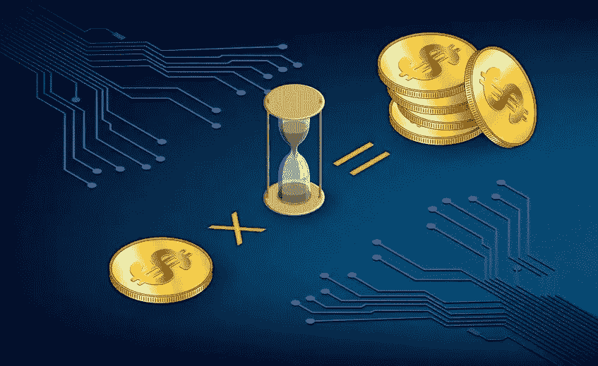
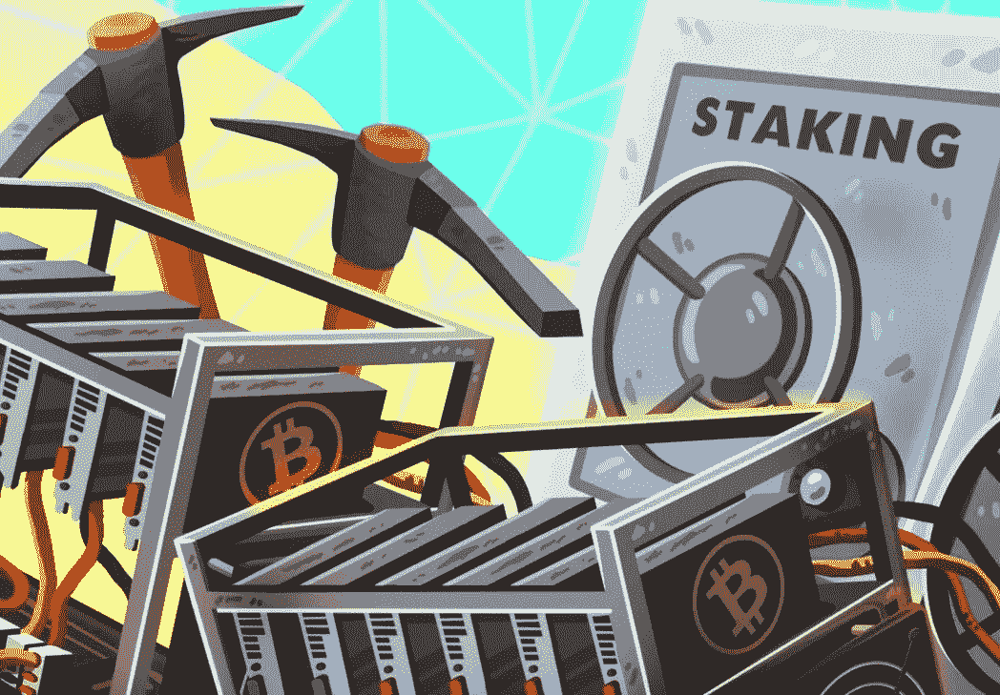
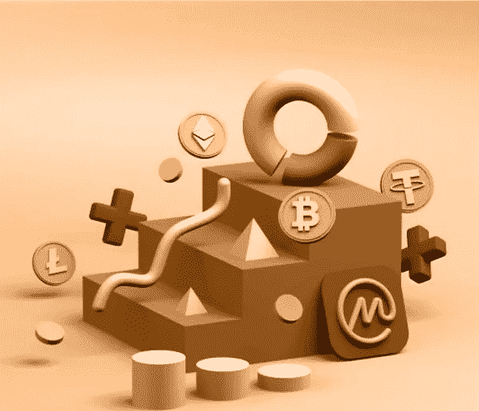

# 什么是赌注？

> 原文：<https://medium.com/coinmonks/what-is-staking-7ca67fa9d4da?source=collection_archive---------66----------------------->

任何关注[区块链](/coinmonks/what-is-blockchain-a7082404caa2)和加密货币领域的人都一定对赌注这个术语很熟悉。但是它到底是什么意思，又是如何工作的呢？关于这个话题的速成班可以回答这些问题。

**由来和定义**

随着[比特币](/coinmonks/what-is-bitcoin-e98b2b77c81b)以及后来[以太坊](http://What is Ethereum? Part 3: Applications https://medium.com/@DC.600/what-is-ethereum-part-3-applications-12097472b9f9)的成功，分散化的区块链技术继续引入了大量的加密货币。最初，加密货币是作为解决复杂密码难题的奖励的数字硬币。[工作证明](/coinmonks/understanding-the-role-of-consensus-in-blockchain-db724fa63a53) (PoW)流程是加密货币构建和后续挖掘的基础。这种工作模式的挑战有三方面——巨大的资本支出、过多的功耗，甚至解决一个[阻塞](https://coinsbench.com/understanding-the-architecture-of-a-blockchain-f50ad412bdc4)都要花费太多的时间。随着资源枯竭侵蚀了盈利能力，作为采矿可行替代方案的打桩概念开始流行。

[**Staking as an alternative to mining**](https://crypto.news/mining-staking-which-choose/)

简单来说，赌注就是任何人都可以通过贡献一些特定的加密货币令牌来验证区块链上的交易，从而产生被动收入的系统。这是利益证明(PoS) [共识](/@DC.600/understanding-the-role-of-consensus-in-blockchain-db724fa63a53)协议的核心，它回答了早期 PoW 机制提出的问题。

**锁定工作方式**

在依赖 PoS 协议的给定区块链中，参与者必须通过提供令牌作为抵押品来投资网络。加密货币因此被锁定一段预定的时间，在此期间令牌持有者不能访问它。锁定的硬币然后被用作对交易验证的贡献。PoS 算法进行随机选择，以确定哪些参与者将成为验证者。作为赌注的奖励，验证者以特定区块链本地的加密货币的形式接收大宗交易费用。

还有另一种方法来进行 staking，而不用承担区块链验证器的责任。在这种安排中，参与者使用他们的令牌来支持其他人进行构建和维护区块链所需的实际验证工作。PoS 模型的这种变体被称为委托利益证明(DPoS)协议。因此，这涉及到在两条战线上的赌注——授权者押在验证者身上，反过来，验证者押在区块链网络的运营上。

最受欢迎的加密货币包括以太坊 2.0、卡尔达诺、索拉纳、BNB、波尔卡多特、MATIC、Cosmos、卡瓦和 Avalanche。有趣的是，以太坊在加密货币中享有独特的地位，因为它目前允许采矿和赌注。原因是，在从 [PoW 最终过渡到 PoS](/@DC.600/understanding-the-role-of-consensus-in-blockchain-db724fa63a53) 车型之前，它仍在测试其区块链。

**赌注奖励**

对于赌注奖励的计算，[区块链](/coinmonks/what-is-blockchain-a7082404caa2)网络通常采用以下两种方法之一。

● *动态* —奖励随着每个新方块的创建而调整。调整取决于关键因素的组合，如押下的代币数量、锁定期、验证器的押下历史和通货膨胀率。

● *固定* —为了最大限度地降低波动性和抑制通货膨胀，固定百分比的回报是更可取的。这阻碍了长期持有，鼓励了消费，从而促进了给定加密货币代币的使用，并且还消除了投资回报中的任何惊喜因素。

**单人赌注 vs 赌注池**

[**Staking solo & staking pools**](https://www.cryptonewsz.com/crypto-staking-revolutionary-solution-to-earn-lucrative-yields/)

如前所述，并不是每个参与的人都能最终获得验证者的特权和奖励。因此，为了最大化一个人的机会，代币持有者需要投入大量资产。例如，最少需要 32 个 ETH 才能获得作为完整节点验证程序的批准，然后必须单独运行执行客户端、共识客户端和验证程序软件应用程序。即使这样，也不能保证 PoS 算法会按照所有这些标准分配一个用户来创建一个块并获得奖励。为了抵消这种情况，许多加密货币投资者更喜欢联营，而不是单独下注。

赌注池中的所有贡献者以这种方式组合他们的令牌资源。因此，赌注池成员有很高的机会赢得验证者选择的彩票并获得奖励。然而，赌注池也有一些缺点。与单人赌注相比，投资回报较低，因为赌注池组织者会从允许成员加入团体的利润中扣除一部分。大赌注池也意味着低赌注的个人贡献者可能最终受益最少。

**打桩平台**

赌注平台是用户登记赌注和赚取奖励的地方。有两种方法可以参与标桩过程。

[**Staking platform**](https://www.mirrorreview.com/best-crypto-staking-platforms-in-india/)

● **直接**–许多遵循 PoS 协议的区块链鼓励用户直接用他们的加密货币下注。根据他们的赌注能力，他们可以通过个人赌注或赌注池获得良好的投资回报。Yoroi 是 Cardano 的[钱包](/@DC.600/learning-about-crypto-wallets-897a30f8f79a)用来押 ADA 代币；对于 DOT tokens，是 Polkadot-js 钱包；对于 MATIC 令牌，是[多边形](https://coinsbench.com/what-is-sidechain-4d4dc912ec50) Web 钱包；对于 BNB 硬币来说，信托钱包是理想的选择。直接 staking 的一个新变体是[节点](https://coinsbench.com/understanding-the-architecture-of-a-blockchain-f50ad412bdc4) staking，其中参与者直接参与验证事务。Ankr 是一个节点服务提供商的例子，它奖励那些在其平台上下注的贡献者。

● **间接**——间接形式的赌注产生较低的回报，但非常受渴望最小参与回报的加密投资者的欢迎。主要的加密货币交易所和平台提供这种类型的赌注和收入服务。币安支持超过 100 个硬币锁定或灵活的赌注；Crypto.com 鼓励参与者在赌注池中使用其本土 CRO 代币获得更高的回报；北海巨妖的 USP 是其“拆分”服务，允许用户在没有锁定期义务的情况下交易或撤回他们的加密资产。其他提供间接赌注的领先平台包括比特币基地、Gemini、BitStamp 和 eToro。

**结论**

批评者往往更关注赌注的风险，而不是回报，这是一个错误。鉴于[区块链](/coinmonks/what-is-blockchain-a7082404caa2)科技正逐步强调 PoS 和 dpo 作为首选[共识](/@DC.600/understanding-the-role-of-consensus-in-blockchain-db724fa63a53)模式，明智的投资将成为制胜战略，这在赌注登记领域有着明确的未来。

**也读作:**

[T21 什么是区块链？](/coinmonks/what-is-blockchain-a7082404caa2) *|* [*了解共识在区块链中的作用*](/@DC.600/understanding-the-role-of-consensus-in-blockchain-db724fa63a53)

跟随我:

[**LinkedIn**](https://www.linkedin.com/in/a600dc/)|[**Twitter**](https://twitter.com/dc_111)

联系人:**arnab.dc111@gmail.com**

> *加入 Coinmonks* [*电报频道*](https://t.me/coincodecap) *和* [*Youtube 频道*](https://www.youtube.com/c/coinmonks/videos) *了解加密交易和投资*

# 另外，阅读

*   [Bookmap 评论](https://coincodecap.com/bookmap-review-2021-best-trading-software) | [美国 5 大最佳加密交易所](https://coincodecap.com/crypto-exchange-usa)
*   最佳加密[硬件钱包](/coinmonks/hardware-wallets-dfa1211730c6) | [Bitbns 评论](/coinmonks/bitbns-review-38256a07e161)
*   [新加坡十大最佳加密交易所](https://coincodecap.com/crypto-exchange-in-singapore) | [购买 AXS](https://coincodecap.com/buy-axs-token)
*   [红狗赌场评论](https://coincodecap.com/red-dog-casino-review) | [Swyftx 评论](https://coincodecap.com/swyftx-review) | [CoinGate 评论](https://coincodecap.com/coingate-review)
*   [投资印度的最佳密码](https://coincodecap.com/best-crypto-to-invest-in-india-in-2021)|[WazirX P2P](https://coincodecap.com/wazirx-p2p)|[Hi Dollar Review](https://coincodecap.com/hi-dollar-review)