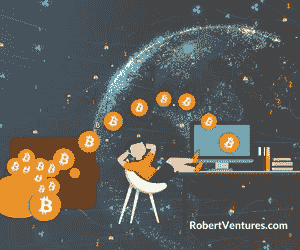

# 什么是赌注，为什么你应该在你的投资组合中这样做？

> 原文：<https://medium.com/coinmonks/what-is-staking-and-why-should-you-do-it-in-your-portfolio-9fddd6b30a25?source=collection_archive---------48----------------------->

如果你有一个加密投资组合，而你目前没有下注你的代币，你就在赔钱。这种机制类似于储蓄账户:当你下注代币时，你会收到新的代币作为奖励，根据市场风险，每种货币都有特定的回报率。

**证据和加密中的赌注概念**

利益证明(PoS)是一种用于验证加密货币交易的共识机制。它不同于工作证明(如在 BTC)，通过采矿，新的交易区块被添加到区块链。在 PoS 中，加密货币的所有者可以对他们的硬币下注:下注的行为意味着他们有权检查新的交易块，并将它们添加到区块链中。

这意味着你把你的加密货币作为赌注，区块链让它们发挥作用，通过共识机制，所有交易都得到验证和保护，没有中介。赌注可以专门针对具有 PoS 共识机制的代币进行，例如以太坊、卡尔达诺、币安硬币、波尔卡多特、多边形、索拉纳、特拉、USDC 以及许多其他代币。

**如何下注你的代币？**

您有三个主要选项来下注您的代币:

1.  交易所:美国主要的加密交易所，如比特币基地和币安，为以太坊 2.0 (ETH2)、Tezos (XTZ)、宇宙(ATOM)和许多其他货币提供赌注奖励。
2.  钱包:或者，如果你喜欢把你的资产放在钱包里，你可以选择在 Exodus 和 Ledger 里这样做。
3.  赌注平台:还有一些赌注平台，比如 Celsius 和 Nexo，它们甚至可以提高你的收益率。

在决定打桩之前，请记住以下几点:

*   你下注的硬币越多，你的财务回报就越高
*   低市值硬币比高市值硬币有更高的回报，因此风险更大
*   供应量少的硬币比供应量多的硬币有更高的回报，因此风险更大

**打桩的优势**

跑马圈地的主要好处是你有机会获得被动收入。如果您下注您的加密货币，您将获得与您帮助验证的区块数量成比例的奖励。

通过赌注，你支持你所投资的区块链，因为项目依赖持有人的赌注进行交易验证。在一些特定的项目中，它赋予那些利益相关者投票权。

**打桩的风险**

另一方面，押上你的密码也有风险。如果你押的密码下跌的价值超过你赚的 APY，你就亏了。如果赌注带有锁定期，在结算日期之前，您不能取消您的代币。如果你想卖，你也卖不出去。

**小心高收益赌注**

在几十个加密赌注选项中，一些代币提供高 APY (50%到+100%的回报)，乍一看似乎很有吸引力。这通常是新兴公司激励代币持有并为项目带来更多意识的策略，但高回报也伴随着高风险。这些加密货币更不稳定，可能会经历突然的价格下跌。

**投资组合中的赌注策略**

如果你有一个明确的加密策略，并打算 HODL 你的位置，不断下注你的资产是一个重要的行动，以最大限度地提高你的利润。然而，如果你的投资组合中有短期头寸，押注可能会有风险，而且可能得不偿失。

*在 Robert Ventures，我们的投资理念是着眼于长期，尽可能从客户的投资组合中获取更多价值。*

[*乔罗伯特*](https://joerobert.com/) *现任罗伯特风险投资公司首席执行官，拥有超过 20 年的资产管理经验。自从乔创业以来，他已经为投资者创造了可预见的两位数回报。Joe 已经投资了股权和代币的种子轮，以及比特币、以太坊和其他顶级加密货币的投资组合。*

*如果您是合格投资者，并想了解更多关于我们产品的信息，请联系我们。*

> 加入 Coinmonks [电报频道](https://t.me/coincodecap)和 [Youtube 频道](https://www.youtube.com/c/coinmonks/videos)了解加密交易和投资

# 另外，阅读

*   [顶级付费加密货币和区块链课程](https://coincodecap.com/blockchain-courses)
*   [MXC 交易所评论](/coinmonks/mxc-exchange-review-3af0ec1cba8c) | [Pionex vs 币安](https://coincodecap.com/pionex-vs-binance) | [Pionex 套利机器人](https://coincodecap.com/pionex-arbitrage-bot)
*   [如何在印度购买比特币？](/coinmonks/buy-bitcoin-in-india-feb50ddfef94) | [瓦济克斯评论](/coinmonks/wazirx-review-5c811b074f5b)
*   [联合国硬币评论](https://coincodecap.com/unocoin-review) | [最佳加密赌注硬币](https://coincodecap.com/best-crypto-staking-coins)
*   如何使用 MetaMask Wallet 获得 KCC 地址？