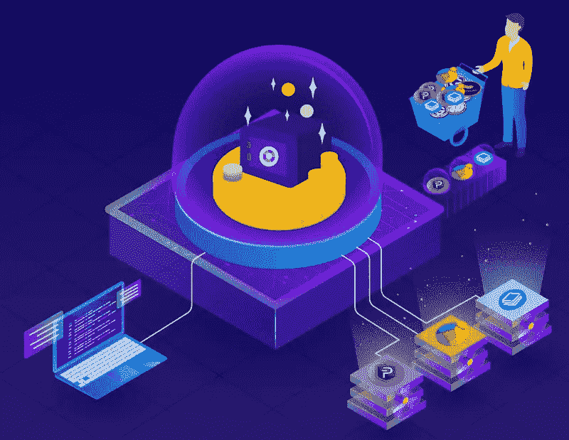

# 什么是赌注？

> 原文：<https://medium.com/coinmonks/what-is-staking-f2962826ff3e?source=collection_archive---------76----------------------->

(下面是ภาษาไทยด้านล่าง/Thai 语)

如果你想从加密货币中获利。但有限的硬币和预算将无法投资购买机器，以挖掘更多的硬币，但交易硬币不会有足够的利润等待时间。另一个投资的好方法是做赌注，这将帮助你有更多的数字硬币，而不必投资很多。今天，我们想邀请您来了解一下赌注。

什么是赌注？
赌注就是我们把作为抵押品的数字硬币放在哪里，让它们保持不动。根据平台规定的条件和周期(每个平台可能会因为一些不同的原因被说服下注加密货币)。如果进行任何交易，系统将需要大量的资源和时间。那你会得到回报的。数字用户最常看到的是利害关系的证明。

**打桩是如何工作的？**

赌注过程从在网络中购买一定数量的代币开始。值得注意的是，只有在购买完成后，才能在支持“PoS”协议的网络上进行下注。用户必须通过遵循每个网络的开发者概述的步骤来锁定他们的硬币持有量。在大多数情况下，按照活动钱包的指示，下注交易可以在几分钟内完成。

另一方面，加密货币交易平台 Cryptocurrency Exchange 通过提供诸如上述赌注池的功能来促进赌注过程。这里指的是一群集资源于一身的钱币持有者。增加你成为博客验证者和获得奖励的机会。这些平台旨在通过在指定时间内增加硬币数量来增加赌注所获得的补偿。赌注硬币越多，节点必须监控的交易数量就越多，节点根据其持有的令牌数量进行排名。因此，具有最大数量代币的节点倾向于获得更高的支出。这就是为什么股权池如今如此受欢迎。

此外，用户可以在某个时间或某个时间段下注代币。也称为“固定桩”，一些提供商创建了更灵活的布局。其中用户可以在任何时间提取他们的代币，也称为“灵活赌注”

然而，固定赌注的不灵活性质导致较高的利率，而灵活赌注往往产生较低的回报。

**在做出下注决定之前您应该考虑的事情**

1.你是长期投资还是短期投资？

你应该考虑的第一件事是长期持有，等待数字货币的价格上涨，然后卖出，或者集中精力快速交易。如果这是一条快速对快速的交易线，它可能不适合下注，因为在下注时你可能会遇到无法取钱的情况

2.需要多少数字货币，需要多长时间？

拥有一定数量加密货币的人可能会将一定数量的加密货币和另一部分加密货币用于交易。所以可能看出来，至于需要多少赌注，存多久，值不值？

3.硬币波动性和趋势

另一件不应该错过的事情是看硬币的波动性和增长趋势。如果有稳定性，即使它经常上下波动，也值得存放赌注，但如果它波动如此惊人，可能不适合长期存放。

4.其他因素

最后，赌注投资可能并不适合每个人和每种加密货币。因此，如果有人感兴趣，不要忘了在做出任何投资决定之前，考虑一下我们上面给你的清单。

不久，EDCoin 将推出从加密货币中赚取利润的赌注。您可以通过以下方式关注新闻:

网址:[https://EDC . ed corp . finance](https://edc.edcorp.finance/?fbclid=IwAR0gElR13rWFrkk5sTv5jCmeiFczkHw18we8wF8h2hCFhvY5Ct5qGryg8Xc)

推特:【https://twitter.com/edcorp_finance 

https://www.facebook.com/edcorp.finance[脸书](https://www.facebook.com/edcorp.finance/?__cft__[0]=AZVBmlZxXD9ugrrKbzarnxEpD-1d4L33v5iKdvYjlBgqoAwAkgRKtoTURsyiz605xngyCvxSiccQ-Eb4X45UbtEzoO-x2v_NJMhiW52SPzY4wv_xHfikuTmqFwLB48XgSPM293DFg3NmCr4eHNSQMMaDQyTE9IvT1cZ1uf2lMUFOlw&__tn__=kK-R)

电报:[https://t.me/edcoinofficials](https://t.me/edcoinofficials?fbclid=IwAR0STQHO46T442dY5u5VCRTPdAl2tN9nwvFkdG13Qb0pC1ZlIdIni7y9xlc)

insta gram:[https://www.instagram.com/edcoin.finance](https://www.instagram.com/edcoin.finance?fbclid=IwAR10cFxl9ZMvEVew0W1b7c0DUyPEdhSf5dEdCNCmAXRJNQwvcxJ_MBnBn34)

还有我们的新方式 block dit:[https://bit.ly/Blockdit_EDCoin](https://bit.ly/Blockdit_EDCoin?fbclid=IwAR0STQHO46T442dY5u5VCRTPdAl2tN9nwvFkdG13Qb0pC1ZlIdIni7y9xlc)

หากคุณเป็นคนที่ต้องการทำกำไรจากสกุลเงินดิจิทัลแต่ด้วยงบประมาณที่จำกัดจะไม่สามารถลงทุนซื้อเครื่องขุดเพื่อขุดเหรียญได้และการแลกเปลี่ยนเหรียญไม่สามารถทำกำไรได้เพียงพอสำหรับเวลาที่รออีกวิธีที่ดีในการลงทุนที่จะช่วยให้คุณมีเหรียญดิจิทัลมากขึ้นโดยไม่ต้องลงทุนมากคือการทำ在วันนี้เราขอเชิญคุณมาทำความรู้จักกับ立下赌注

什麽是斯塔克?
斯塔克是我们根据平台设定的条件和期限放置我们持有的数字硬币作为抵押品的地方(每个平台可能出于不同的原因说服斯塔克加密货币)。如果进行任何交易,系统将消耗大量的资源和时间。回报是,你会得到回报。用户最常看到的是斯塔克的证明。

斯塔克是如何工作的?
该过程从购买一定数量的令牌开始,需要注意的一点是,只能在支持‘PoS’协议的网络上进行权衡。购买完成后,用户必须按照每个网络开发人员指定的步骤来锁定权衡,在大多数情况下,按照活跃钱包的指示,权衡交易可以在几分钟内完成。

另一方面,加密货币交换平台通过引入诸如上面提到的 Staking Pools 之类的功能来促进 Staking 流程,这些功能是指将其硬币组合在一起,以增加他们成为博客审查员和奖励的机会。这些平台旨在通过在给定时间内增加硬币数量来增加 Stake 获得的奖励。Stake Coins 越多,Node 必须跟踪的交易数量就越多,Node 将根据所持有的令牌数量进行排名,因此拥有最多令牌的 Node 往往会获得更高的替代回报。这就是为什么 Stake 组今天如此受欢迎的原因。

此外,用户可以在特定的时间段内存放令牌。它也被称为“固定令牌”,一些提供商已经创建了更灵活的令牌提取,用户可以随时撤销其令牌,也称为“灵活令牌提取”。

然而,股票的固定倾销仍将导致利率上升,而灵活的股票倾向于提供较低的回报。

**在做出决定之前你应该考虑什么事?坚持**

1.  你是长期投资还是短期投资?
    你应该想到的第一件事是,喜欢持有很长时间,等待数字货币的价格上涨,然后抛售,或者专注于快速交易。如果是快速交易,那么它可能不适合斯塔克,因为它可能会遇到斯塔克之间没有提款的条件。
2.  数字货币需要多少钱,需要多长时间?
    持有一定数量的加密货币的人可能会用一笔钱,而用另一笔钱进行交易,因此可以看出股票部分将需要多少钱,存入多长时间,是否值得?
3.  那枚硬币的波动和走势
    另外一件不容错过的事情是,看看那枚硬币的波动和走势。如果它稳定下来,即使经常上涨,也应该把斯塔克放在一边。但如果它波动到可怕的地步,那么它可能不适合长期持有。
4.  ปัจจัยอื่นๆ

最后,斯塔克投资可能并不适合每个人和每一种数字货币,因此,如果有人感兴趣,在做出投资决定之前,请记住考虑我们在上面提出的内容。

很快,EDCoin 将推出 Staking,以便从 cryptocurrencies 中获利。可以跟踪消息的方式:

网站:[https://edc . edcorp . finance](https://edc.edcorp.finance/?fbclid=IwAR0gElR13rWFrkk5sTv5jCmeiFczkHw18we8wF8h2hCFhvY5Ct5qGryg8Xc)

推特:[https://twitter.com/edcorp_finance](https://twitter.com/edcorp_finance?fbclid=IwAR36loa0mB1MF6x_QZIrbthPBJ-onM4-Amm1RPbOJhA12iD76MQbd6jb2HE)

https://www.facebook.com/edcorp.finance[脸书](https://www.facebook.com/edcorp.finance/?__cft__[0]=AZVBmlZxXD9ugrrKbzarnxEpD-1d4L33v5iKdvYjlBgqoAwAkgRKtoTURsyiz605xngyCvxSiccQ-Eb4X45UbtEzoO-x2v_NJMhiW52SPzY4wv_xHfikuTmqFwLB48XgSPM293DFg3NmCr4eHNSQMMaDQyTE9IvT1cZ1uf2lMUFOlw&__tn__=kK-R)

电报:【https://t.me/edcoinofficials 

insta gram:[https://www.instagram.com/edcoin.finance](https://www.instagram.com/edcoin.finance?fbclid=IwAR10cFxl9ZMvEVew0W1b7c0DUyPEdhSf5dEdCNCmAXRJNQwvcxJ_MBnBn34)

还有我们的新方式 block dit:[https://bit.ly/Blockdit_EDCoin](https://bit.ly/Blockdit_EDCoin?fbclid=IwAR0STQHO46T442dY5u5VCRTPdAl2tN9nwvFkdG13Qb0pC1ZlIdIni7y9xlc)

[https://miro.medium.com/max/800/0*EiIaN4Cpm8OxGnEu](https://miro.medium.com/max/800/0*EiIaN4Cpm8OxGnEu)

*本文仅为教育目的而写。这不是以任何方式邀请投资。*

> 加入 Coinmonks [电报频道](https://t.me/coincodecap)和 [Youtube 频道](https://www.youtube.com/c/coinmonks/videos)了解加密交易和投资

# 另外，阅读

*   [如何购买 Monero](https://coincodecap.com/buy-monero) | [IDEX 评论](https://coincodecap.com/idex-review) | [BitKan 交易机器人](https://coincodecap.com/bitkan-trading-bot)
*   [CoinDCX 评论](/coinmonks/coindcx-review-8444db3621a2) | [加密保证金交易交易所](https://coincodecap.com/crypto-margin-trading-exchanges)
*   [红狗赌场评论](https://coincodecap.com/red-dog-casino-review) | [Swyftx 评论](https://coincodecap.com/swyftx-review) | [CoinGate 评论](https://coincodecap.com/coingate-review)
*   [Bookmap 点评](https://coincodecap.com/bookmap-review-2021-best-trading-software) | [美国 5 大最佳加密交易所](https://coincodecap.com/crypto-exchange-usa)
*   [如何在 FTX 交易所交易期货](https://coincodecap.com/ftx-futures-trading) | [OKEx vs 币安](https://coincodecap.com/okex-vs-binance)