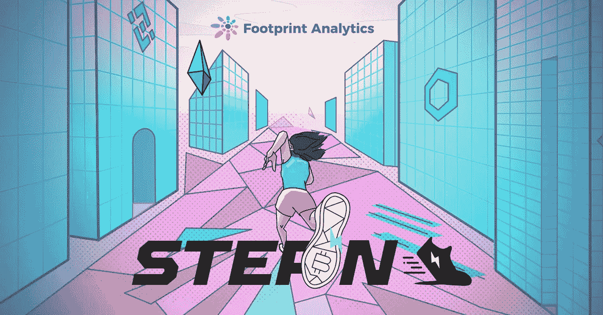
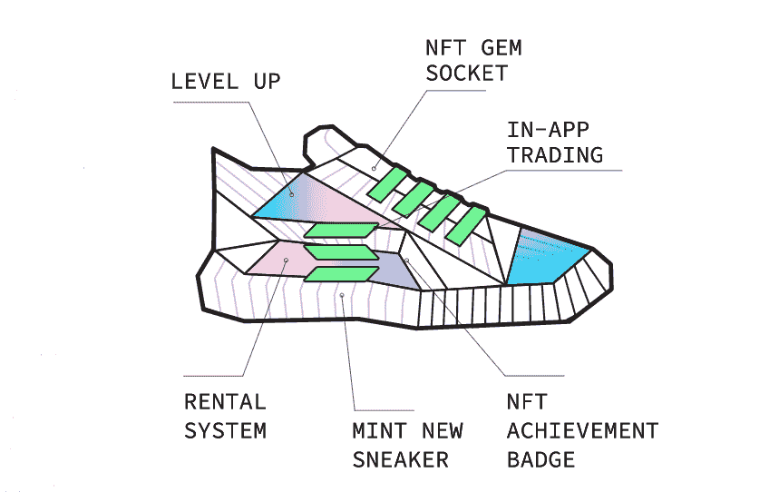
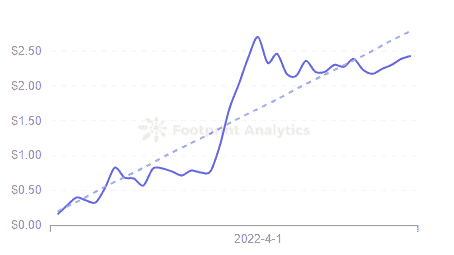
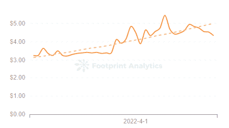

# 什么是 STEPN？

> 原文：<https://medium.com/coinmonks/what-is-stepn-aa972e7ce4d3?source=collection_archive---------25----------------------->

关于现在最成功的“X-To-Earn”游戏，你应该知道什么

2022 年 4 月

数据来源:[足迹分析](https://www.footprint.network/dashboards?channel=EN-240)

许多人尝试过，也有许多人失败了，但看起来“玩赚”健身项目 STEPN 可能是第一个成功付钱给人们保持身材的应用程序。

如果成功，它可能成为第一个真正打破加密生态系统并获得广泛采用的区块链游戏之一。

STEPN 于 2021 年 11 月由一个澳大利亚团队推出，已从包括 Folius Ventures、Sequoia Capital India 和 Solana Ventures 在内的风险投资公司获得超过 500 万美元的和[资金](https://www.footprint.network/guest/chart/SETPN-Furndraising-Stats-fp-0f139657-7f82-4fbf-8e76-4aae0f7d7ad2?channel=EN-240#secret=6CC8B085AE0045C6FB618D47BBE85113)。它现在价值 10 亿美元。

# 是什么让 app 与众不同？

之前的竞争者如 Sweatcoin 和 Healthywage 都遭遇了缺乏想象力的 UX 和令人烦恼的低支出。首先，需要大量的跑步才能产生少量的收入。其次，这些应用缺乏游戏化元素。那是在 move-to-earn 进入区块链市场之前。

STEPN 结合了 RPG 升级元素和 [GameFi。它的特点使赚取收入既有趣又有益。事实上，从 4 月初开始，你可以穿着入门级的鞋子跑步 10 分钟，轻松赚到 30-40 美元。](https://www.footprint.network/guest/dashboard/Address-Analysis-of-GameFi-Project-fp-77828d1e-35bc-4b6c-90e9-7777e7c6902d?gamefi_name=decentral-games&channel=EN-240)

在这篇文章中，我们将解释你如何在 STEPN 上获得收入，以及这个游戏的长期可行性。

# 什么是 STEPN

STEPN 是一款区块链游戏，用户拥有运动鞋，通过走路、慢跑或跑步产生 GST 或 GMT，这是游戏的两个标志。

您每分钟赢得多少代币取决于您的 [NFT](https://www.footprint.network/guest/dashboard/NFT-Dashboard-fp-b374b358-6e2f-4587-a52b-a69ebbb91bfa?channel=EN-240) 鞋的质量以及您是否决定以步行、慢跑或跑步模式玩游戏。由于该应用程序依赖于您的 GPS 在应用程序的阈值之上检测恒定的移动速度，因此弱连接会减少您的收入。

散步挣的代币最少，然后是慢跑，跑步挣的最多。因此，在系鞋带之前，你需要买一双支持你想要的速度的鞋。有了步行鞋，你只靠走路挣钱，有了慢跑者，只靠慢跑，等等。然而，一种特殊的运动鞋——运动鞋——可以让你在任何速度下都赚到钱，这使它成为生态系统中最贵的 NFT 鞋。

[*Source: STEPN*](https://stepn.com/litePaper)

用户只要有能量点就可以跑步(运动消耗的能量点以每 6 小时 25%的速度恢复)。少于 3 双球鞋，用户默认 2.0 分，也就是跑 2 分钟。购买或铸造更多的运动鞋，或拥有特殊类别的运动鞋，给用户更多的能量点，让他们锻炼更长时间。

想知道你能挣多少钱，请使用这个 STEPN 收入计算器。

# STEPN NFTs 是如何工作的？

截至 4 月 15 日，STEPN 鞋的起价为 1 至 2 索尔，涨到 12.6 索尔。这些非功能性测试根据属性、质量和级别进行分类。

*   运动鞋属性是:效率、运气、舒适和弹性。他们决定他们赚多少 GST，他们多久获得一次随机奖励，当这个功能发布时他们将赚多少 GMT，以及他们多久需要修复一次。
*   运动鞋质量决定了 NFTs 的基本属性水平。举起一双传奇运动鞋也会增加可用的能量点。
*   当你赚取商品及服务税时，你可以升级运动鞋，增加其属性。

运动鞋也有固定数量的薄荷糖。有了 2 双带薄荷糖的运动鞋，你可以生成第 3 双运动鞋。当然要烧你的 GST 和 GMT。

# STEPN 代币:GMT 与 GST

STEPN 用户可以同时获得 GST 和 GMT。虽然前者可以通过任何类型的运动鞋立即获得，但用户只能通过 30 级以上的运动鞋获得 GMT(该功能即将推出)。

GMT 代表绿色元宇宙令牌，是项目的价值令牌，持有它可以参与 STEPN 的项目管理。从上线到 3 月 9 日截止到 4 月 15 日已经暴涨 [1325%](https://www.footprint.network/guest/chart/Price-of-GMT-fp-82c5d2ec-e729-4b15-aff4-b554dd17691a?channel=EN-240#secret=E15F28C39F23BB90CBE3798E33E9B96E) 。

*Footprint Analytics — Price of GMT*

GST，或绿色 Satoshi Token，是游戏的实用硬币，用于升级、铸造和修理运动鞋。截至 4 月 15 日，其价值为 4.74 美元。

*Footprint Analytics — Price of GST*

***此片由*** [***足迹分析***](https://www.footprint.network/?channel=ENG-209) ***社区供稿。***

在 Footprint 社区中，全世界的数据和加密爱好者可以互相帮助，了解并获得关于 Web3、元宇宙、DeFi、GameFi 或区块链新兴世界任何其他领域的见解。在这里，你会发现活跃的、不同的声音相互支持，推动着社区向前发展。