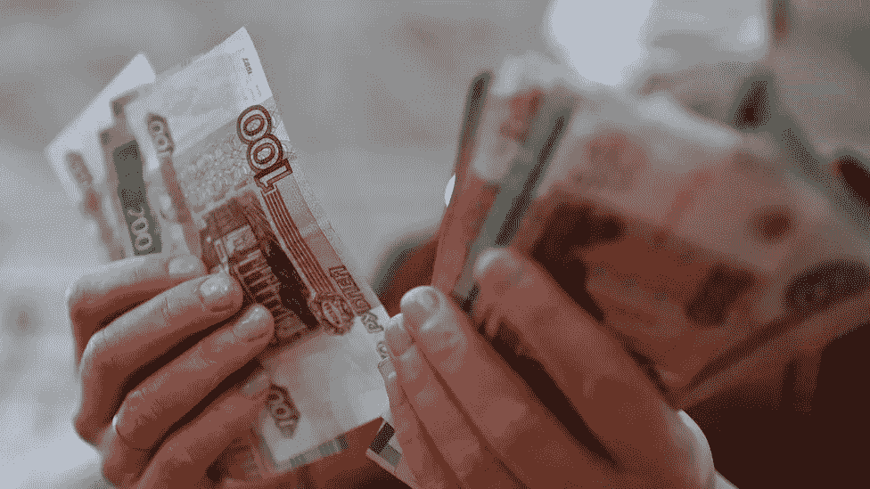

# 什么是 SWIFT？为什么这个银行系统可以惩罚俄罗斯入侵乌克兰？

> 原文：<https://medium.com/coinmonks/what-is-swift-why-can-this-banking-system-punish-russia-for-invading-ukraine-28d2a5764349?source=collection_archive---------11----------------------->

乌克兰外交部长德梅特罗·库利巴(Demetro Kuliba)警告西方领导人，如果他们不能禁止俄罗斯加入全球“Swift”支付系统，他们将“双手沾满鲜血”。Swift 是全球灵活货币交易的关键系统。

“在这一点上，我不会是一个外交官；库利巴在一条推文中说:“每个怀疑俄罗斯应该被禁止加入斯威夫特政权的人都应该明白，无辜的乌克兰男人、女人和儿童的血也会弄脏他们的手。”

英国、爱沙尼亚、立陶宛和拉脱维亚的外交部长加入了库利巴的呼吁，要求停止俄罗斯通过全球金融系统“SWIFT”的操作。然而，其他欧洲国家不愿意采取同样的措施。

那么这些制裁将如何影响俄罗斯，为什么西方国家对实施制裁存在分歧？

# 什么是 SWIFT 系统？

SWIFT 系统是一条全球金融大动脉，允许平稳、快速的跨境资金流动。SWIFT 是全球银行间金融通信协会的首字母缩写，成立于 1973 年，总部位于比利时。SWIFT 连接了 200 多个国家的 11，000 家银行和机构。

但 Swift 不是你在任何街道上见到的典型银行，它是一个即时通讯系统，告诉用户何时发送和接收付款。

该系统每天发送超过 4000 万条消息，因为数万亿美元在公司和政府之间交易。

据信，俄罗斯支付占通过 SWIFT 系统交易的 1%。

为什么有人呼吁让俄罗斯脱离这个体系？禁止俄罗斯通过数千家银行使用的 SWIFT 系统进行交易，将影响俄罗斯的银行网络和俄罗斯获得资金的渠道。

但是许多政府担心这项处罚会影响他们的经济和公司。例如，从俄罗斯购买天然气和石油将受到影响。

英国带头呼吁停止 Swift 系统在俄罗斯的工作，但英国国防部长本·华莱士(Ben Wallace)表示:“不幸的是，我们无法独自控制 Swift 系统。这样的决定不是单独做出的。”

据说德国反对俄罗斯禁止使用 SWIFT 系统。

同样，法国财政部长勒梅尔和荷兰首相马克·吕特星期五说，禁止俄罗斯的选择将在绝对必要的情况下使用。

周四，美国总统乔·拜登表示，禁令不在讨论范围内，因为“目前这不是欧洲其他国家愿意采取的立场”，尽管他补充说，禁令仍在讨论范围内。

# 谁拥有和控制 Swift 系统？

SWIFT 系统是由美国和欧洲的银行创建的，他们希望没有一家机构控制金融系统并实行垄断。

现在有 2000 多家银行和金融机构共同拥有这个网络。

它由比利时国家银行与包括美国美联储和英国银行在内的全球主要央行合作监管。

SWIFT 系统有助于其成员实现安全的国际贸易，而且它不应该在争端中偏袒任何一方。

然而，作为对其核计划制裁的一部分，伊朗在 2012 年被禁止使用 Swift。

结果，德黑兰失去了将近一半的石油出口收入和 30%的对外贸易。

斯威夫特说，她对制裁没有影响力，任何实施制裁的决定都取决于各国政府。

# 这项禁令对俄罗斯有什么影响？

俄罗斯公司将无法获得 SWIFT 系统提供的顺畅、即时的交易。对俄罗斯能源和农业部门基本产品的付款将受到负面影响。

银行可能将不得不直接相互处理，增加延误和额外成本，并最终切断俄罗斯政府的收入。

在 2014 年吞并克里米亚之前，俄罗斯曾面临迅速退出的威胁。俄罗斯表示，此举相当于宣战。

西方盟国没有前进，但威胁促使俄罗斯发展自己的——非常现代化的——跨境运输系统。

然而，目前只有少数几个国家在使用它。

俄罗斯政府创建了一个名为“MIR”的国家支付卡系统，以处理卡支付，为这种惩罚做准备。

# 为什么西方对斯威夫特有分歧？

将俄罗斯排除在这一体系之外将损害那些从俄罗斯供应和购买商品的公司，尤其是德国。

俄罗斯是欧盟主要的石油和天然气供应国，寻找替代供应并不容易。

随着能源价格的飙升，更多的混乱是许多政府想要避免的。

向俄罗斯贷款的公司将不得不寻找其他方式来筹集资金。

一些人说国际银行业混乱的风险太大了。

俄罗斯前财政部长阿列克谢·库德林(Alexei Kudrin)曾表示，脱离 Swift 系统可能会使俄罗斯经济萎缩 5%。

但有人怀疑这对俄罗斯经济的持久影响。俄罗斯银行通过没有实施制裁的国家进行直接支付，比如中国，它有自己的支付系统。

美国立法者对禁令施加了一些压力，但拜登总统表示，他倾向于其他制裁，这在很大程度上是因为其他经济体和国家受到了伤害。

阻止俄罗斯访问 SWIFT 系统的决定仍需要欧洲各国政府的支持，其中许多国家因其经济可能受损而犹豫不决。

> *加入 Coinmonks* [*电报频道*](https://t.me/coincodecap) *和* [*Youtube 频道*](https://www.youtube.com/c/coinmonks/videos) *了解加密交易和投资*

# 另外，阅读

*   [3 商业评论](/coinmonks/3commas-review-an-excellent-crypto-trading-bot-2020-1313a58bec92) | [Pionex 评论](https://coincodecap.com/pionex-review-exchange-with-crypto-trading-bot) | [Coinrule 评论](/coinmonks/coinrule-review-2021-a-beginner-friendly-crypto-trading-bot-daf0504848ba)
*   [莱杰 vs n 格拉夫](/coinmonks/ledger-vs-ngrave-zero-7e40f0c1d694) | [莱杰纳诺 s vs x](/coinmonks/ledger-nano-s-vs-x-battery-hardware-price-storage-59a6663fe3b0) | [币安评论](/coinmonks/binance-review-ee10d3bf3b6e)
*   [Bybit Exchange 审查](/coinmonks/bybit-exchange-review-dbd570019b71) | [Bityard 审查](https://coincodecap.com/bityard-reivew) | [Jet-Bot 审查](https://coincodecap.com/jet-bot-review)
*   [3 commas vs crypto hopper](/coinmonks/3commas-vs-pionex-vs-cryptohopper-best-crypto-bot-6a98d2baa203)|[赚取加密利息](/coinmonks/earn-crypto-interest-b10b810fdda3)
*   最好的比特币[硬件钱包](/coinmonks/hardware-wallets-dfa1211730c6) | [BitBox02 回顾](/coinmonks/bitbox02-review-your-swiss-bitcoin-hardware-wallet-c36c88fff29)
*   [BlockFi vs Celsius](/coinmonks/blockfi-vs-celsius-vs-hodlnaut-8a1cc8c26630)|[Hodlnaut 点评](/coinmonks/hodlnaut-review-best-way-to-hodl-is-to-earn-interest-on-your-bitcoin-6658a8c19edf) | [KuCoin 点评](https://coincodecap.com/kucoin-review)