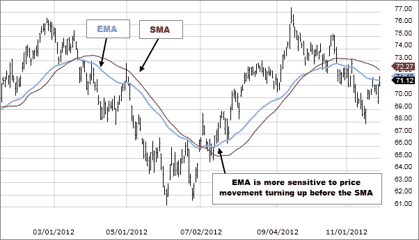

# 什么是技术分析？

> 原文：<https://medium.com/coinmonks/what-is-technical-analysis-53f5888d0c56?source=collection_archive---------61----------------------->

在我们的 YouTube 上观看视频的同时，享受这个流的资源！

YouTube:[https://youtu.be/mALAx_n1D3Q](https://youtu.be/mALAx_n1D3Q)

不和:【https://discord.gg/J73qhkj7kr】T2

推特:【https://twitter.com/CryptoverseDAO】

linktree:[https://linktr.ee/cryptoversedao](https://linktr.ee/cryptoversedao)

-

技术分析工具:

在找股票的时候，以下是应该遇到的关键技术分析工具，不一定都是 bot most。

趋势和趋势线

趋势可以分为三种方式:上升，下降或区间。在上升趋势中，一只股票的反弹通常伴随着中期的盘整或逆势运动。在下跌趋势中，股票下跌通常伴随着中间的盘整期或逆势运动。在区间内，股价图上没有明显的价格运动方向，价格变化率很小或没有。

这些趋势可以用趋势线来衡量。我们想要的只是处于上升趋势的股票。

支持和抵抗

这基本上告诉我们什么样的价格水平可能会给买方或卖方带来看跌期权。这里我们想看看当前价格是刚刚通过阻力，还是离下一个阻力水平还很远。

移动平均线

它们有助于确定趋势是否正在转向，也显示了现有趋势是否正在有序发展。这里我们看到价格高于选择的平均价格，但不会高于它们太多。

相对性能

这将股票价格除以相对市场指数或行业组。这里的理论是要找出，如果比率上升，股票表现优于市场，因此是进一步收益的有力候选人，反之亦然。在这里，我们寻找的是相对表现在增长的股票。

卷

交易的股票数量和时间(当价格上涨或下跌时)。我们主要分析购买行为是否蔓延到其他投资者，以及当价格开始上涨时，所有人是否都迫切需要购买。

动力

我们想知道股票上涨的天数是否多于下跌的天数。如果损失的天数越来越多，那么我们可以说趋势正在减弱。

感情

这是为了找出是否每个人都在想同样的事情？是时候走另一条路了吗？这里我们想知道大家对同一件事的看法。

为什么要用技术分析？

下一个想到的逻辑问题是技术分析是做什么的？这个问题的答案是，它能够识别股票何时达到支撑位或阻力位，或者何时发生了看法的转变，这可以帮助投资者做出投资决策，即使用:

低买高卖方法或
高买高卖方法，或
是否购买股票

应用图表的这些方面的能力将向投资者揭示市场何时买入股票是安全的或不安全的。技术分析是唯一的投资决策学科，它会告诉你什么时候你错了，以尽量减少损失。

技术分析的目标:

查看股票当前的交易位置，并找出它是如何到达那里的

这可以通过使用图表工具来完成，如

股票趋势
支撑位
阻力位

我们也试图找出一种模式或趋势来帮助。

决定趋势的力量

这可以通过看成交量、动量等重要的技术概念来确定。

将股票与市场、同行公司和自身进行比较

为此，我们着眼于相对表现和移动平均线(一段时间内的平均价格，通常为 50-200 天)

两种主要的技术分析是图表模式和技术(统计)指标。

图表模式是技术分析的一种主观形式，技术人员试图通过观察特定的模式来确定图表上的支撑和阻力区域。这些模式由心理因素支撑，旨在预测价格在特定价格点和时间突破或崩溃后的走向。例如，一个上升的三角形图表模式是一个看涨的图表模式，它显示了一个关键的阻力区域。突破这一阻力可能会导致大幅、大规模的上涨。

技术指标是技术分析的一种统计形式，技术人员将各种数学公式应用于价格和交易量。最常见的技术指标是移动平均线，它平滑价格数据，有助于更容易发现趋势。更复杂的技术指标包括移动平均线收敛背离(MACD)，它着眼于几条移动平均线之间的相互作用。许多交易系统是基于技术指标，因为它们可以定量计算。

结论:

技术分析试图预测未来的价格变动，为交易者提供盈利所需的信息。
交易者将技术分析工具应用于图表，以确定潜在交易的进场点和出场点。
技术分析的一个基本假设是，市场已经处理了所有可用的信息，并反映在价格图表中。

> 加入 Coinmonks [电报频道](https://t.me/coincodecap)和 [Youtube 频道](https://www.youtube.com/c/coinmonks/videos)了解加密交易和投资

# 另外，阅读

*   [分散交易所](https://coincodecap.com/what-are-decentralized-exchanges) | [比特恩斯 FIP](https://coincodecap.com/bitbns-fip) | [宾邦评论](https://coincodecap.com/bingbon-review)
*   [用信用卡购买密码的 10 个最佳地点](https://coincodecap.com/buy-crypto-with-credit-card)
*   [加拿大最佳加密交易机器人](https://coincodecap.com/5-best-crypto-trading-bots-in-canada) | [Bybit vs 币安](https://coincodecap.com/bybit-binance-moonxbt)
*   [阿联酋 5 大最佳加密交易所](https://coincodecap.com/best-crypto-exchanges-in-uae) | [SimpleSwap 评论](https://coincodecap.com/simpleswap-review)
*   购买 Dogecoin 的 7 种最佳方式 | [ZebPay 评论](https://coincodecap.com/zebpay-review)
*   [最佳期货交易信号](https://coincodecap.com/futures-trading-signals) | [流动性交易所评论](https://coincodecap.com/liquid-exchange-review)