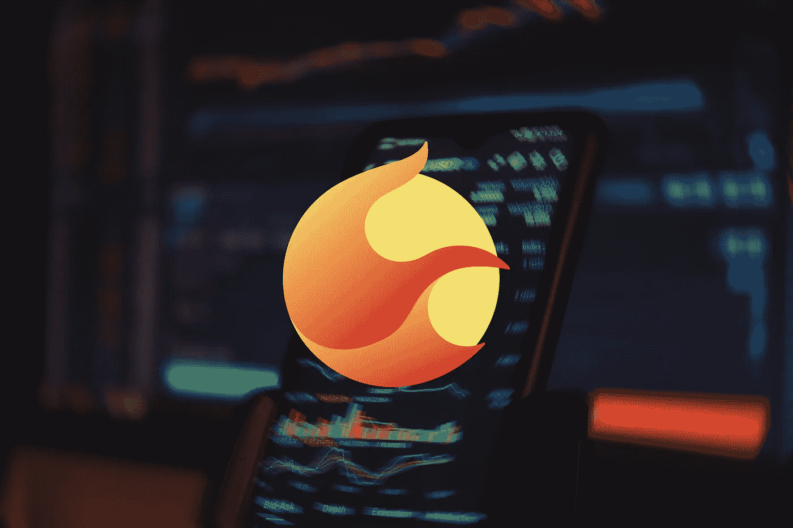

# 什么是 Terra 2.0 (LUNA)？

> 原文：<https://medium.com/coinmonks/what-is-terra-2-0-luna-59f8c598a385?source=collection_archive---------34----------------------->

Source photo [luna 2.0 — Bing images](https://www.bing.com/images/search?view=detailV2&ccid=86%2fr5iSR&id=BA6FECF4B34362AB5A3BFAEF7B41F22C0BE06D1C&thid=OIF.l2uD%2bbb8o%2fz25DHK0bQCKQ&mediaurl=https%3a%2f%2fnodersknow.com%2fwp-content%2fuploads%2f2022%2f05%2fterra-luna-price-pump.jpg&cdnurl=https%3a%2f%2fth.bing.com%2fth%2fid%2fR.f3afebe62491b6ab8f003921fb458409%3frik%3d%26pid%3dImgRaw%26r%3d0&exph=1280&expw=1920&q=luna+2.0&simid=7026761959020&FORM=IRPRST&ck=976B83F9B6FCA3FCF6E431CAD1B40229&selectedIndex=6&ajaxhist=0&ajaxserp=0)

TerraForm Labs 的首席执行官 Do Kwon 建议用硬叉子来恢复生态系统，他认为这是必要的。在这个场景中，区块链大地将被分成两个独立的区块链。只要这两条链存在，它们就会以不同的方式发挥作用。

已经有一份官方提案提交给社区成员，让他们投票决定 Terraform Labs 首席执行官 Do Kwon 是否应该放弃 UST…