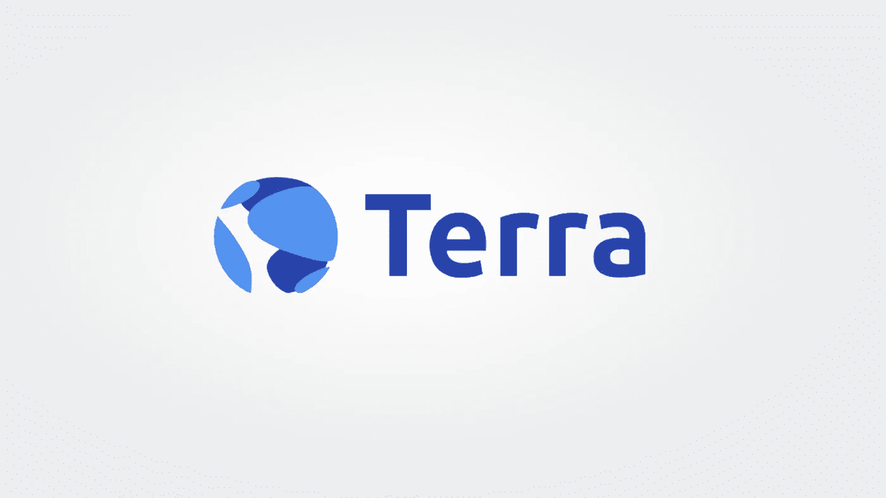

# 什么是 Terra，它是如何运作的

> 原文：<https://medium.com/coinmonks/what-is-terra-and-how-does-it-work-5b9ed214f36c?source=collection_archive---------26----------------------->

## 地球生态系统解释

Terra 是一个去中心化的开源区块链，旨在创建算法稳定的副本。它由**Terraform Labs**(Do Kwon e Daniel Shin)于 2018 年创立。

与或戴等其他现实不同，这种类型的硬币没有任何资产来弥补其价值:有一种算法来照顾它。