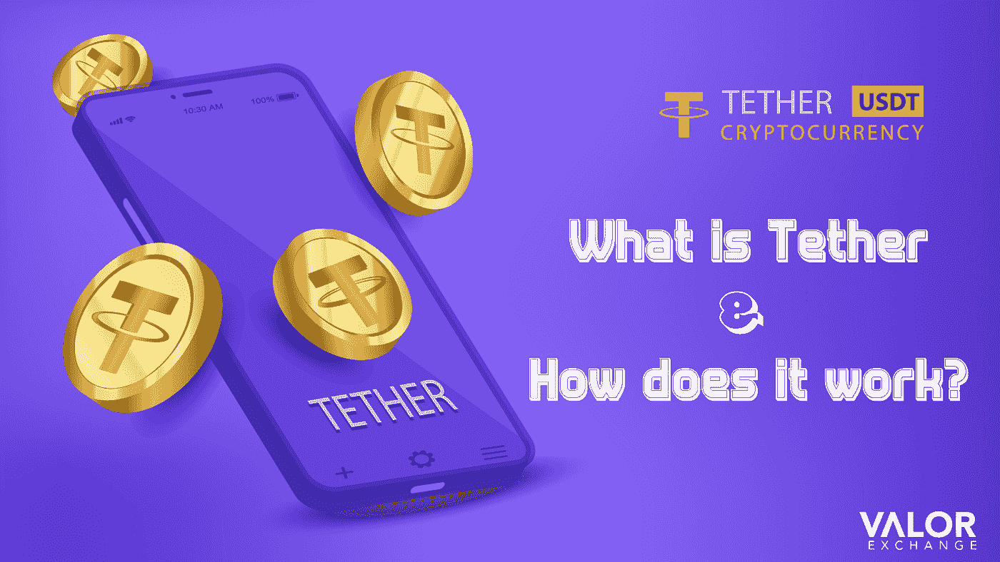
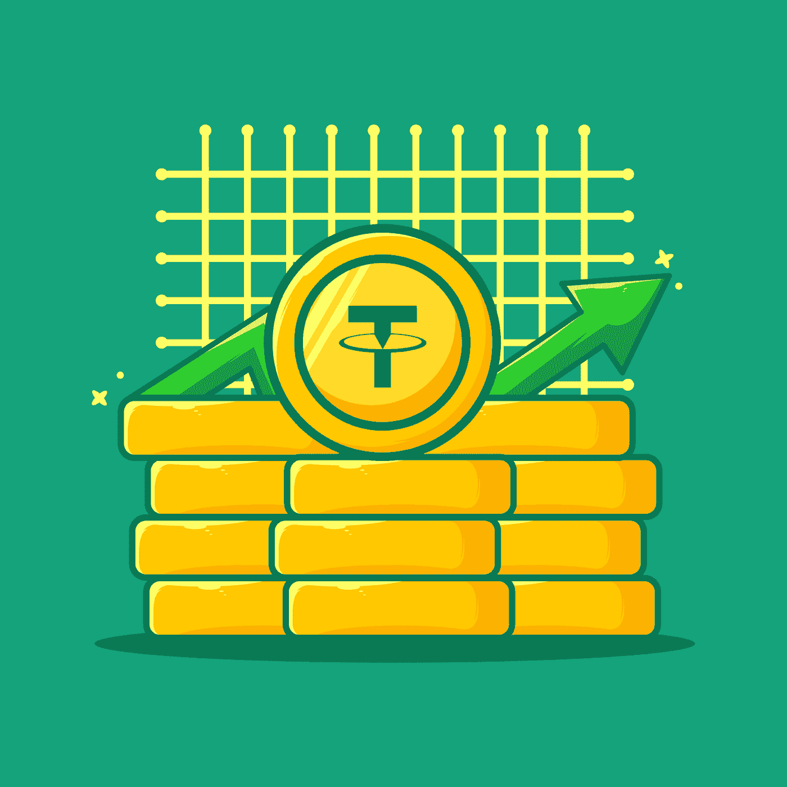

# 什么是系绳，它是如何工作的？

> 原文：<https://medium.com/coinmonks/what-is-tether-and-how-does-it-work-7d0f22c28073?source=collection_archive---------30----------------------->

Tether 是一种稳定的硬币，也是一种在以太坊网络上运行的替代硬币。每一枚[系绳硬币](https://valorexchange.com/)都代表现实世界中的一枚实体美元。因此，你在流通中看到的每一枚系绳硬币，都有相应的一美元被保存在保险箱或类似的地方。这就是为什么它的价格通常是稳定的。稳定的硬币遵循传统的法定货币，如美元、欧元或日元。

系绳币，也被称为 [USDT，](https://account.valorexchange.com/signup)是由加密交易所 BitFinex 开发的。2021 年，USDT 被报道为市值第五大加密货币。

**USDT 简史**

Tether 于 2014 年由联合创始人布洛克·皮尔斯、里夫·科林斯和克雷格·塞拉斯创立，名为“真币”。这是有史以来最早的稳定硬币。

Tether 的目的是解决加密货币的两个主要问题，如高波动性或价格不稳定，以及将纸币转换为加密货币的困难。为了解决这个问题，Tether 被设计成一种由美元支持的加密货币。换句话说，1 USDT 相当于 1 美元，即 1:1。

Photo credit: Vecteesy.com

**为什么要买系绳？**

如果你是一个厌恶风险的交易者，或者你只想使用一种波动性更小、稳定性更高的加密货币，那么稳定的硬币就适合你。Tether 是迄今为止流动性最强、交易最广泛的稳定硬币之一。你可以很容易地将一枚系绳硬币兑换成奈拉，反之亦然。

**如何在尼日利亚获得系绳硬币**

如果你想把你的法定货币兑换成泰斯(USDT)，你可以在 [ValorExchange 上创建一个账户。](https://valorexchange.com/)一旦您的账户建立，您就可以随时随地轻松地将您的法定货币兑换成加密货币。

**最终想法**

如果你喜欢这篇文章，我们很高兴地说，我们有更多的与你分享。我们在 Telegram 上创建了一个[社区，致力于为您提供最好的资源、工具和更多帮助，让您顺利起步。](https://t.me/valorexchangecommunity)

当你是 Valor 部落的一员时，你永远不会孤单，我们迫不及待地想让你踏上让你的加密货币获得更多价值的旅程。