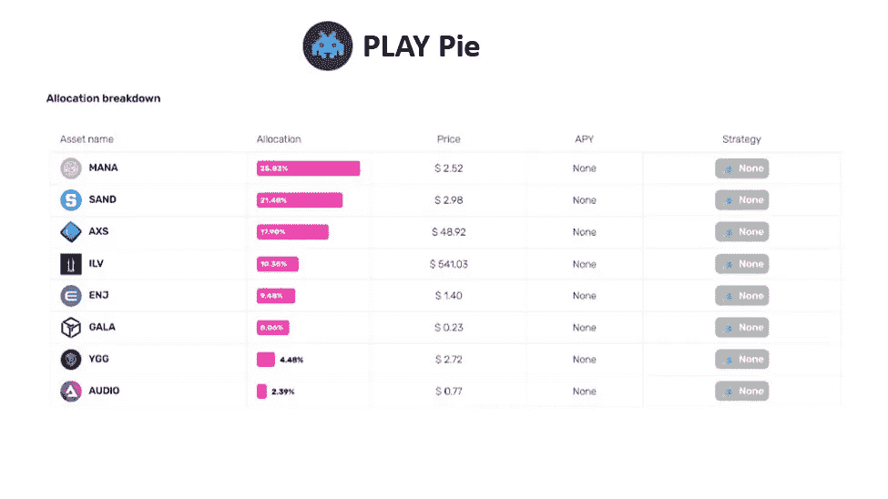
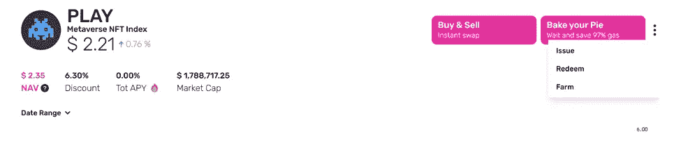

# Web3 游戏的最佳赌注是什么？

> 原文：<https://medium.com/coinmonks/what-is-the-best-bet-for-web3-gaming-febd31f8abb4?source=collection_archive---------29----------------------->

我真的不知道。尽管我试图跟上并关注 web3 的游戏方面，但我真的落后了，被抛在了圈外。家庭、工作和挑战让我忙得不可开交，以至于我无法跟上网络 3 中这一激动人心的部分。所以，我可以错过吗？

不会吧。

虽然我可能有希望在这个领域更深入地探索，但我不确定那个时刻何时/是否会到来。但是，在我等待更多时间和更少需求这一永远难以捉摸的幻想时，我发现了一种更简单的方法来获得游戏的好处，而不必不断投入时间、精力和昂贵的$ETH 交易…

**$播放时间**

我的简单解决方案来自[皮岛](https://www.piedao.org/#/)的[$戏派](https://www.piedao.org/#/pie/0x33e18a092a93ff21ad04746c7da12e35d34dc7c4)。一个索引令牌，包含了 Web3 游戏中一些最大的名字的广泛曝光。

$PLAY 目前包括$MANA、$SAND、$AXS、$ILV、$ENJ、$GALA、$YGG 和$AUDIO。随着 PieDAO 观察市场，他们将分析并调整该指数，使其与 web3 游戏的最佳价差相一致。这可能是分配的变化，甚至是构成索引的令牌的变化。就个人而言，我很有兴趣看看[不可变 X](https://market.immutable.com/) 是否能成功。

**玩家要玩$游戏**

哦，顺便说一下，作为皮岛与这个领域联系的证明，[沙盒游戏最近选择加入他们的资金管理试点项目。他们一定对皮岛和他们的策略印象深刻。](https://twitter.com/piedao_defi/status/1503818446676676617?s=21)

**有你的馅饼，也把它吃掉**

索引令牌很棒，但是能够提取它们“包含”的实际资产并不总是可能的。不过，使用 PieDAO，您可以用$PLAY 和任何其他馅饼来兑换下面的代币。因此，即使你决定索引令牌本身不是你想要的，你可以赎回它，并获得它包含的 8 个令牌，这仍然会为您节省无数的交易和相关费用。

Go ahead Anon, redeem it ;)

更有趣的是比较$PLAY 的市场价格与$PLAY 中包含的代币的资产净值。在撰写本文时，PLAY 的市价约为 2.35 美元，而 NAV 为 2.61 美元。游戏代币有 11%的折扣…

当你在曲线上做了一笔 500 美元的交易，突然发现自己在交易中赚了 20 美元，你知道这种感觉吗？？？是啊，有点像😉

很明显，这种波动强调了$PLAY 和 PieDAO 有很多机会。你可以追求一个简单的被动策略或者采取一个更主动的方法。不管怎样，面包店都开门了。🙂

如果你想阅读皮岛更广泛的评论，请点击这里查看我的上一篇文章。

> 加入 Coinmonks [电报频道](https://t.me/coincodecap)和 [Youtube 频道](https://www.youtube.com/c/coinmonks/videos)了解加密交易和投资

# 另外，阅读

*   [XT.COM 评论](https://coincodecap.com/profittradingapp-for-binance) | [币安评论](https://coincodecap.com/xt-com-review)
*   [SmithBot 评论](https://coincodecap.com/smithbot-review) | [4 款最佳免费开源交易机器人](https://coincodecap.com/free-open-source-trading-bots)
*   [比特币基地僵尸工具](/coinmonks/coinbase-bots-ac6359e897f3) | [AscendEX 审查](/coinmonks/ascendex-review-53e829cf75fa) | [OKEx 交易僵尸工具](/coinmonks/okex-trading-bots-234920f61e60)
*   [如何在印度购买比特币？](/coinmonks/buy-bitcoin-in-india-feb50ddfef94) | [瓦济克斯评论](/coinmonks/wazirx-review-5c811b074f5b)
*   [隐翅虫替代品](/coinmonks/cryptohopper-alternatives-d67287b16d27) | [HitBTC 审查](/coinmonks/hitbtc-review-c5143c5d53c2)
*   [CBET 评论](https://coincodecap.com/cbet-casino-review) | [库科恩 vs 比特币基地](https://coincodecap.com/kucoin-vs-coinbase)