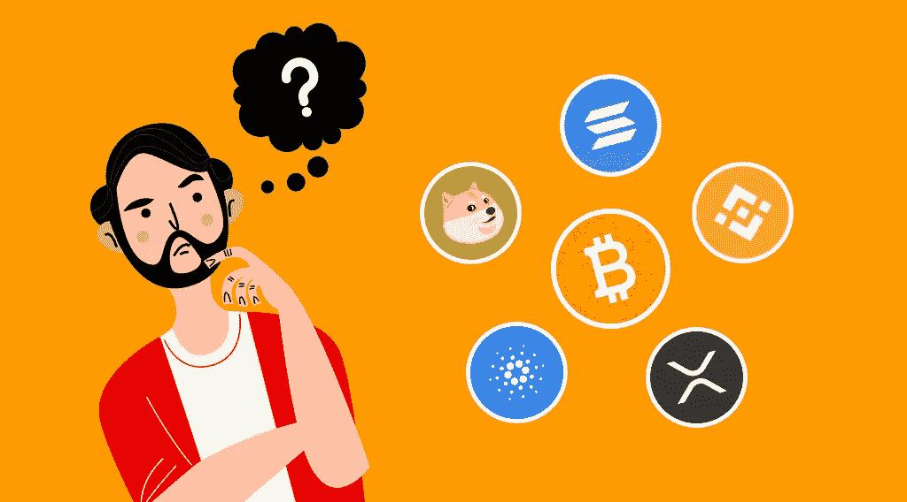

# 投资什么密码最好？

> 原文：<https://medium.com/coinmonks/what-is-the-best-crypto-to-invest-in-eb84dffcb603?source=collection_archive---------36----------------------->

加密货币是一种投资工具，可以帮你赚钱。但是，您需要知道选择哪种数字资产进行投资。一些硬币是没有价值的，而另一些允许你长期获利。投资什么密码最好？

在新的 [StealthEX](https://stealthex.io/) 文章中了解更多关于预计将在 2022 年增长的加密货币的信息。

# 如何开始投资加密货币？

在了解预期代币之前，先了解加密货币投资的基础知识。该过程包括以下阶段:

1.  确定策略。了解你是否准备长期持有代币或想要定期交易代币。
2.  创建一个加密货币钱包并创建一个兑换账户。
3.  选择有前景的加密货币。
4.  按照与策略相对应的金额购买资产。

第三阶段是最重要的，在选择资产时，请考虑以下因素:

*   一般数据(发布日期、开发人员、资产背后的技术、基础设施)。
*   总供应量。
*   持有人的评论和新闻背景。
*   令牌实用程序。

# 现在投资的最佳密码

# 比特币(BTC)

[比特币](https://stealthex.io/coin/btc)是 2009 年出现的第一种加密货币。在它的创作中使用的区块链技术成为市场的中流砥柱，现在它被用于其他领域。今天，有成千上万的硬币，但比特币仍然是世界上最著名的数字资产，占据了加密市场的一半。由于这种主导地位，其他加密货币的价格与 BTC 密切相关。

# 以太坊

[以太坊](https://stealthex.io/coin/eth)是第二大大写的加密货币。ETH 是第一个使用智能合约概念的公司，智能合约是一种算法，允许双方创建和执行协议。虽然比特币只是一个流行的支付系统，但以太坊是该行业的支柱之一。

只要行业增长，ETH 在那里会发挥很大作用，对其价格会有积极影响。今天，ETH 遇到了扩展问题，但是完全过渡到 2.0 版应该可以解决大部分问题。

# 币安硬币(BNB)

[币安币](https://stealthex.io/coin/bnb)是币安最大的加密货币交易所的内部加密货币。它用于支持公司的生态系统，从收取交易费用到向合作伙伴支付服务费用。加密货币持有者可以节省佣金，从赌注中获得被动收入，并参与公司的各种项目。

# 茄属植物

Solana 正在研究区块链可扩展性问题的解决方案。SOL 使用无挖掘的 PoS 算法。为了提高网络速度，使用了 PoH 算法，在该算法中，时间戳在事务期间被编码，这解决了区块链的主要问题之一——分布式节点的同步。

# 卡尔达诺

[Cardano](https://stealthex.io/coin/ada) 是最受欢迎的加密货币之一，采用赌注证明算法。有了它，ADA 持有者可以加入网络，并根据他们钱包中的金额获得奖励。这种方法比采矿耗能更少，因此被认为更环保。加密货币的最新协议更新增加了对 NFT、智能合约和 DeFi 应用的支持，使 Cardano 成为以太坊的直接竞争对手。

# XRP (XRP)

[XRP](https://stealthex.io/coin/xrp) 运行在 RippleNet 上，基于分散的 XRP·莱杰·区块链技术。RippleNet 的原型创建于 2005 年，旨在与 SWIFT 等其他国际银行转账系统竞争。2012 年，该项目被转移到一个名为 OpenCoin 的区块链，但很快这个旧名又回来了。XRP 的转账是业内最快、最便宜的，只需几秒钟。它对金融领域的关注使加密货币能够融入传统经济。

# 地球(月球)

Terra 是一家区块链公司，使用稳定的货币来改善全球支付系统。该项目的主要目标是大规模使用加密货币，将法定货币与区块链一起用于去中心化、数据保护和降低费用。LUNA 是用于内部结算和维持稳定价格的本地令牌。

# 波尔卡多(点)

Polkadot 的目标是将不同的区块链连接成一个分散的 Web 3.0 网络。它支持在区块链之间传输任何数据和资产，能够创建新区块链或连接现有的。Polkadot 充当各种分散服务和应用程序交互的基础。DOT 用于保持网络运行，同时创建在 Polkadot 平台上并行运行的区块链。

# 雪崩

[Avalanche](https://stealthex.io/coin/avax) (AVAX)是一个用于智能合约和 dApps 的平台，具有高速交易处理能力。该项目解决了规模化和高收费的问题。这个平台的主要特点之一是顶级安全性。

# 链环(链环)

Chainlink 是区块链的一个先知网络，它可以与任何参与者签订智能合同，而不仅仅是在区块链。Oracles 是从传统来源收集数据并将其安全嵌入区块链的特殊实体。Chainlink 有助于在区块链和外部数据源之间同步数据。该项目解决了加密货币与传统金融行业的兼容性问题。

# 多边形(MATIC)

[Polygon](https://stealthex.io/coin/matic) 是一个扩展以太坊和开发其基础设施的平台。它可以被视为以太坊的女儿区块链，允许 dApps 运行更快，费用更低。Polygon 启动成功，吸引了很多与以太坊合作的项目。

# 创(创)

[TRON](https://stealthex.io/coin/tron) 是一个区块链平台，用户可以在这里直接交换内容。这个项目是推出 dApps 最受欢迎的平台之一，重点是娱乐业。除了 TRON 本身，平台上还有一个 SUN token，这是 DeFi 生态系统开发所需要的。

# 如何选择合适的加密货币进行投资？

毕竟，由于加密货币是按需提供的，新项目会定期出现，而且其中很多都是值得信赖的。要选择顶级加密投资，了解它，阅读其他投资者对它的看法，以及如何使用这个令牌。

最后，如果你决定加入加密社区，你可以开始在[即时加密交易所 StealthEX](https://stealthex.io/) 购买自己的硬币。这项服务免注册，不将用户的资金存放在平台上。

# [如何用信用卡购买 Crypto？](https://stealthex.io/blog/2022/03/15/can-i-buy-bitcoin-with-credit-card-easily-and-quickly/)

直接去[偷 X](https://stealthex.io/?from=btc&to=eth&amount=0.1) 。打开[购买密码](https://stealthex.io/?amount=100&from=usd&to=btc)窗口，而不是自动加载的交易所。

1.  然后选择法定货币，并选择您想要购买的加密货币。例如，美元兑换 [BTC](https://stealthex.io/coin/btc) 。
2.  输入您的加密钱包地址。
3.  同意 StealthEX 的服务条款。首次购买 crypto 时，您需要确认您的身份并输入 Mercuryo 系统要求的数据。一旦所有提供的信息将被确认，您将能够购买加密，而无需通过这一程序了。
4.  发送菲亚特，等待您的购买通过！

在 [Medium](https://stealthex-io.medium.com/) 、 [Twitter](https://twitter.com/Stealthex_io) 、 [Telegram](https://t.me/StealthEX) 、 [YouTube](https://www.youtube.com/channel/UCeES_XBesX76ge7xf1meuSw) 和 [Reddit](https://www.reddit.com/user/Stealthex_io) 上关注我们，获取 [StealthEX.io](https://stealthex.io/) 更新和关于密码世界的最新消息。对于所有请求，请通过 support@stealthex.io 给我们发消息。

*此处表达的观点和意见仅代表作者个人。每一次投资和交易都有风险。做决定时，你应该进行自己的研究。*

**非常欢迎您来参观**[**StealthEX exchange**](https://stealthex.io/)**看看**有多快多方便。

> *加入 Coinmonks* [*电报频道*](https://t.me/coincodecap) *和* [*Youtube 频道*](https://www.youtube.com/c/coinmonks/videos) *了解加密交易和投资*

# 另外，阅读

*   [折叠 App 审核](https://coincodecap.com/fold-app-review) | [Kucoin 交易机器人](/coinmonks/kucoin-trading-bot-automate-your-trades-8cf0ca2138e0) | [Probit 审核](https://coincodecap.com/probit-review)
*   [如何匿名购买比特币](https://coincodecap.com/buy-bitcoin-anonymously) | [比特币现金钱包](https://coincodecap.com/bitcoin-cash-wallets)
*   [币安 vs FTX](https://coincodecap.com/binance-vs-ftx) | [最佳(SOL)索拉纳钱包](https://coincodecap.com/solana-wallets)
*   [比诺莫评论](https://coincodecap.com/binomo-review) | [斯多葛派 vs 3Commas vs TradeSanta](https://coincodecap.com/stoic-vs-3commas-vs-tradesanta)
*   【Capital.com】|[港加密借贷平台](https://coincodecap.com/crypto-lending-hong-kong)
*   [如何在 Uniswap 上交换加密？](https://coincodecap.com/swap-crypto-on-uniswap) | [A-Ads 评论](https://coincodecap.com/a-ads-review)