# 最好的加密货币交易所是哪家？

> 原文：<https://medium.com/coinmonks/what-is-the-best-cryptocurrency-exchange-b980a7eee4f2?source=collection_archive---------46----------------------->

## 最佳加密货币交易平台

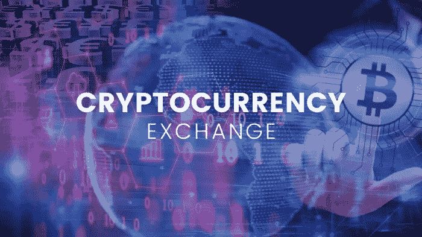

随着市场的不断增长，拥有最好的加密货币交换平台非常重要。有各种各样的交易所(服务遍布世界各地)，它们允许交易(出售、购买和交换)这些数字资产。每个平台都建立了特定的服务条件，因此，有必要选择一个适合您需求的平台。

# 16 个最佳加密货币交易平台

接下来，描述最好的加密货币交易所，了解有关其运营的重要信息。

# 1.比特币基地

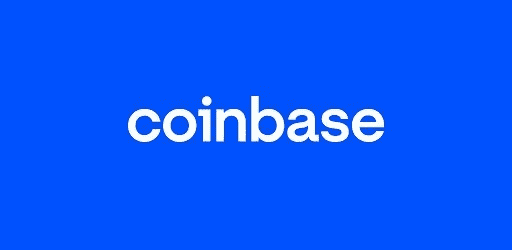

它是全球最受认可的平台之一，在 102 个国家开展业务，拥有数百万活跃用户。自成立以来(2012 年，总部位于美国)，比特币基地允许您安全地购买、出售和兑换加密货币。他们还为个人和公司提供了几种额外的服务，从开展商业运营到允许他们获得奖励的培训计划(用户可以在学习加密货币的工作原理时对其进行测试)。

**比特币基地:**

**加密货币**

超过 16 种密码，包括:比特币、比特币现金、以太坊、莱特币和 XRP。

**佣金和费用**

买卖的标准利率是 1.49%，如果用信用卡(借贷)进行交易，则为 3.99%。它们可能因位置而异。

**钱包**

免费服务可用，从移动应用程序允许您管理用户拥有的加密货币。

**付款方式**

信用卡和借记卡、银行转账(可能因地点不同而有所不同)。

**安全**

该平台为其客户的数字资本投保。此外，只有不到 2%的资金存储在网上。

**手机 app**

是的，它允许买卖和交换密码。它还提供可用加密货币的价格信息。

# 2.币安

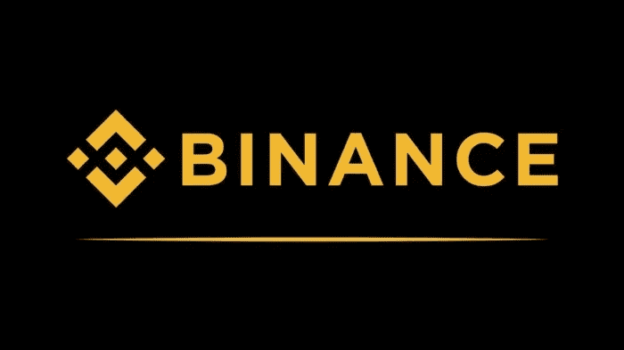

它是最可靠的交易所之一，提供多种选择来交易世界上交易量最大的 150 种加密货币。该公司于 2017 年开始在中国运营，总部位于马耳他，在不到 4 年的时间里，由于其提供的服务和选项的多样性，该公司已经获得了良好的声誉。此外，它还有一个强大的在线平台(有移动和桌面版本)，以及一个允许它集成到不同商业应用程序中的 API。

**币安:**

**加密货币**

150 多种可供交换，也是买卖报价最多的(包括 BNB —币安币)。

**佣金和费用**

币安对买卖密码收取 0.1%的固定费用，但如果使用 BNB 进行交易，费用可能低至 25%。而存款和取款是免费的。

**钱包**

它有一个快速安全的移动应用程序(信任钱包)，一个允许你存储和管理密码的钱包。

**付款方式**

信用卡和借记卡，银行转账。如果交易是通过 P2P(个人对个人)商务完成的，那么有多达 60 种支付方式和法定货币可供选择。

**安全**

该平台使用最好的计算机安全标准来保护客户的资金。

# 3.火币

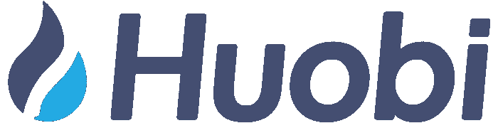

火币是全球领先的加密货币交易平台。它提供了过多的交易选择——从现货、保证金和衍生品交易到赌注、加密贷款和拍卖。支持 310 多种加密资产。Huobi 允许您交易、交换和存储您的数字资产。它由火币集团首席执行官李昂(Leon Li)于 2017 年在新加坡创立。目前，火币分为火币全球、火币韩国和火币日本。

**火币:**

**加密货币**

在该平台上，有 300 多种货币可供选择。

**佣金和费用**

用户购买 Maker 和 Taker 费用分别为 0.2%和 0.2%的火币 Token (HT)可享受交易费用五折优惠。提现取决于要提现的加密货币和网络的拥挤程度。

**钱包**

Huobi Wallet 是一款移动加密钱包，允许您安全地发送、接收和存储比特币、以太、DOT、KSM、DOGE、TRX、XRP、EOS、LTC、XTZ、BCH、DASH 和其他数字资产。

**付款方式**

除 ABA、SWIFT、SEN、SEPA 和 ADVCash 支付系统外，Huobi 还提供银行转账、借记卡/信用卡。

**安全**

用户可以防范更大的罪恶可能造成的经济损失。Huobi 购买代币，并将其发送到一个投资者保护基金，以补偿那些受影响的人。

# 4.OKEx

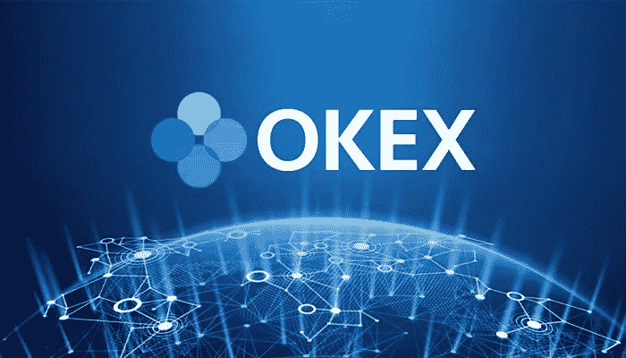

OKEx 是一个先进的加密货币交易所，你可以在这里购买、出售和交易各种加密货币。2017 年总部位于塞舌尔，现归 Ok 集团所有。OKEx 提供现货、保证金和衍生品交易，提供大量服务，包括灵活的贷款和各种通过押注赚钱的方式。OKEx 提供简单和复杂的交易工具，工作证明挖掘和 DeFi 流动性挖掘。基础版对新手来说是一个很好的起点，而有经验的交易者可以享受高级版更复杂和完整的控制面板。

**好的:**

**加密货币**

OKEx 提供 200 多种加密货币的交易，以及比特币、以太币、莱特币、XRP 等的期货。

**佣金和费用**

根据交易量的不同，做市商的利率从 0.06%到 0.1%不等，接受者的利率从 0.09%到 0.15%不等。对于存款和取款，它们因加密货币而异。

**钱包**

OKEx 钱包与 8 个区块链网络和侧链兼容，提供 2 种不同的应用。第一个是 Web 3.0 浏览器扩展，第二个是 OKEx 移动应用程序。

**付款方式**

OKEx 支持借记卡/信用卡、银行转账和 Yandex 支付。Money、Advcash 钱包、Apple Pay 和 Google Pay。

**安全**

OKEx 立即得到支持，为通过网络和手机进行加密交易提供了一个安全稳定的环境。

# 5.比特梅克斯

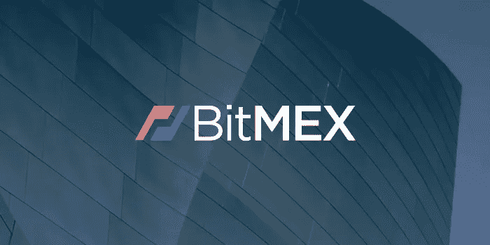

它是一个知名的加密货币 P2P 交易平台，业务遍及全球，由英国企业家于 2014 年创立，提供各种加密货币的投资服务。Bitmex 被认为是经验丰富的交易者的平台，它提供了一个友好的图形界面，并允许从电脑上访问网络(移动版本不可用)。他们还采用了严格的访问安全标准，包括对所有账户的自动审计系统(每秒多达 100 次审计)。

**Bitmex:**

**加密货币**

它允许与市场上主要的加密货币(比特币、比特币现金、Dash、以太坊、以太坊经典、莱特币、Monero、Ripple、Tezos、Zcash)进行交易。

**佣金**

为大多数加密资产的初始保证金和维护设置固定费用。存取款不收手续费。

**最大杠杆**

1:100(可用比特币交易，视交易的加密货币而定)。

**付款方式**

它只接受最低金额为 0.001 BTC 的比特币(提款没有限制)。

**安全**

平台有多重安全要素，保障系统运行、营销和客户沟通。

# 6.Bitfinex

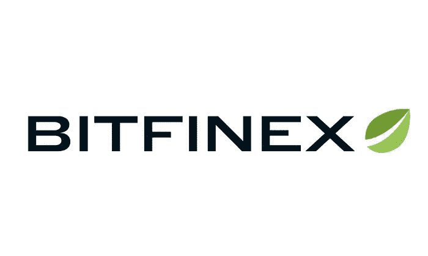

它是公认的最佳交易和投资平台之一，在加密货币市场拥有超过 8 年的经验，这使他们能够开发多种服务。Bitfinex 每天都进行大量交易，由于比特币提供的交易条件，比特币交易尤为突出。该平台为加密交易提供了 2 种选择:通过 OTC(柜台交易)，最低订单为 50 美元，以及现货交易(现货交易)，适用于那些希望进行传统操作的人。

用户还可以有一个演示版本或“纸上交易”，这使他们能够进行模拟操作，以了解功能或探索新的策略。在这个版本中，如果操作是负的，则没有损失，使用没有实际价值的测试令牌(仅用于训练目的)。

**Bitfinex:**

**加密货币**

他们提供大量的加密货币和衍生品进行交易。

**委员会**

加密货币免存款手续费，银行转账最低 60 美元/欧元，手续费 0.100%。提现申请手续费在某些加密中，比特币有 0.0004BTC 的手续费。

**钱包**

它提供三种不同功能的加密钱包:交易、投资多头和空头头寸(带杠杆)以及融资。

**付款方式**

接受加密货币存款和国际银行转账(需要申请程序)。

**安全**

超过 99%的资金受到线下保护，所有交易都需要 4 到 7 级安全。此外，手机应用程序上不支持取款。

# 7.本地比特币

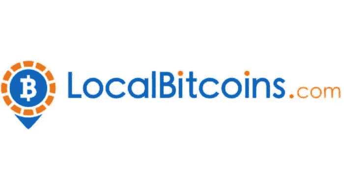

这是一个致力于 P2P 市场(人与人之间的商业)的平台，8 年多来，Localbitcoins 促进了人与人之间(全球)的比特币买卖。注册用户有可能:出售，购买，以及使用电子钱包发送和接收比特币。交易是通过个性化的出版物(用户、支付方式和汇率)完成的，然后平台为交易提供担保(为卖方和买方)直到过程完成。

**本地比特币:**

**加密货币**

比特币

**佣金**

购买、销售和注册操作是免费的，但是，ads 有 1%的固定费用(在交易结束时收取)。使用外部比特币钱包进行发送和接收操作的佣金根据区块链使用率的不同而不同。

**钱包**

用户有一个免费使用的比特币钱包。

**付款方式**

他们提供多种支付方式，从国际银行转账到电子支付方式(根据所选择的方式，报价可能会有所不同)。

**安全**

它符合计算机安全和金融服务标准。

# 8.波洛涅克斯

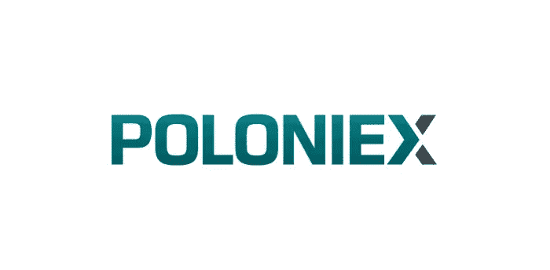

自开始运营(6 年多前)以来，它就将自己定位为一个促进加密货币交换和交易的平台。在 Poloniex 注册的交易者可以交易 100 多个密码对(现货交易可用)和 25 个保证金对(期货交易可用杠杆，最高可达 1:100)。投资平台提供 2 个版本:WebTrader 和移动应用程序(针对 iOS 和 Android 操作系统，尽管并非所有功能都可用)，图形界面允许使用工具和指标以获得更好的体验。

Poloniex 还通过社交网络和界面访问提供技术支持，这是一个并非所有交易所都提供的绝佳选择。此外，他们还加强了安全性，以提供更可靠的环境。

**波洛涅克斯:**

**加密货币**

100 种交易量最大的加密货币和资产对可供交易。

**佣金**

加密存款是免佣金的，而取款则有很低的附加费用。而交易的佣金则根据 1 个月的交易量而有所不同(交易量越高，佣金越低)。用于买卖。

**钱包**

是的，它有一个钱包来存放和提取加密货币。

**付款方式**

只有加密货币可以存入电子钱包。

**安全**

该平台符合金融服务的国际安全标准(只有 2%的资金是在线的)。此外，用户可以使用两级保护来访问他们的帐户。

# 9.库币

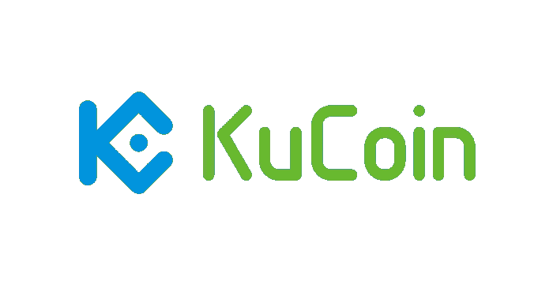

运营仅 3 年，Kucoin 就在加密货币交易平台中获得了巨大的接受度和知名度。它允许以具有竞争力的利率交易 200 多种加密货币，还提供了各种各样的新选择:用主要信托货币(菲亚特)购买加密货币，用期货交易，Pool-X(允许加密赌注流动性的自由市场交易所)和人与人之间的贷款(该平台是一个中介，允许接受贷款的人用保证金经营，同时为贷款人产生利息)。

该平台提供 WebTrader 版本和移动应用程序(都具有直观的功能)，还提供 24/7 客户服务以及用户社区来分享经验。

**库币:**

**加密货币**

它提供市场上主要的加密货币和 450 多种相关货币对。

**佣金**

交易的佣金最高为 0.1%，如果交易量在 30 天内增加，佣金将减少(期货最高为 0.02%)。存款是免费的，而根据加密货币(比特币是 0.0004 BTC)的不同，取款的成本也很低。钱包它不提供加密货币钱包。

**付款方式**

它只接受加密货币，尽管它允许通过 P2P 与外部平台进行购买。

**安全**

符合金融服务和数据加密的安全标准。此外，客户资金有保单支持。该接口还要求 2 级访问安全。

# 10.Coinmama

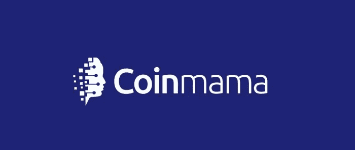

它提供 exchange 服务已有 7 年多的时间，在超过 185 个国家开展业务，拥有超过 200 万用户。Coinmama 总部位于斯洛伐克，开发了一个强大的交易平台，有超过 7 种加密货币可供交易。此外，它接受最常用的国际支付方式，并提供快速的管理流程(例如，购买比特币不到 10 分钟)。

访问该平台是在线的(它目前没有移动应用程序)，然而，加密货币的购买和销售只需 5 个简单的步骤。此外，他们对两笔交易都采用竞争性(固定)汇率。

**Coinmama:**

**加密货币**

它允许购买和销售 8 种加密货币(比特币、以太坊、Ripple、莱特币、Tezos、比特币现金、EOS、Qtum、以太坊经典和 Cardano)。

**佣金**

购买 cryptos 的手续费最高可达 3.9%，而出售则可达 0.9%。他们也可以根据支付方式申请佣金(信用卡有 5%的佣金)。

**钱包**

他没有钱包。付款方式信用卡和借记卡，国际银行转账。

**安全**

它们需要 3 级账户验证，也使用加密数据，并且不存储支付相关信息。

# 11.Paxful

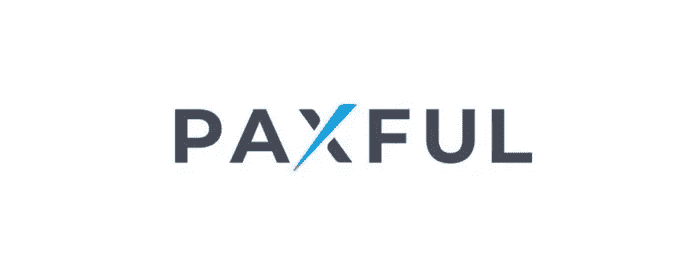

它是一个通过 P2P 商务促进比特币交易的平台，在 100 多个国家开展业务，并提供各种各样的公认支付方式。目前，它拥有近 500 万用户，并开发了一个针对比特币提供商的程序。Paxful 帕克思富在竞争激烈的市场中具有显著优势，买卖双方都能公平交易。

他们还提供了一个移动应用程序，这是一个具有友好图形界面的虚拟钱包，它允许你交换、接收和发送比特币。

**Paxful:**

**加密货币**

比特币

**佣金**

购买比特币没有额外的佣金(是免费的)，而出售在几乎所有的支付方式中都有 1%的固定费率(银行转账有 5%)。发送到外部钱包根据金额收取佣金(在 0.0001 BTC 和 0.0005 BTC 之间)。

**钱包**

是的，用户可以免费下载虚拟钱包。支付方式它提供了 300 多种支付方式，它们可能会根据每个国家的选择而有所不同。

**安全**

他们管理买卖交易的保证金，他们还遵守各种金融安全标准。

# 12.比特玛特

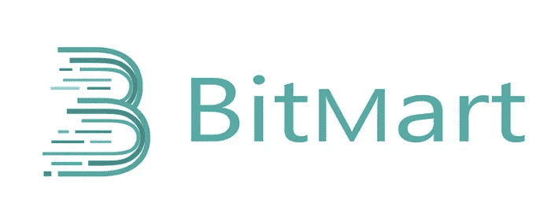

BitMart 是一个高容量的集中交易所，分布在 180 多个国家，在全球拥有 900 多万用户。BitMart 于 2018 年在开曼群岛推出，提供现货和期货交易，以及贷款和赌注服务。此外，它还有一个“Shooting Star”令牌加速平台，用于促进最佳数字资产的盈利性投资。它还为高级交易者提供平台，并为各种规模的机构提供可定制的资产管理解决方案。

**BitMart:**

**加密货币**

BitMart 有超过 218 种加密货币。

**佣金和费用**

BitMart 的固定交易佣金率为 0.25%。如果您使用 BMX 支付佣金，25%的折扣生效。BTC 提款的手续费是 0.0005 BTC。

**钱包**

BitMart 采用“冷/热钱包”技术，将不到 0.5%的用户资产放在热钱包中，99%放在离线冷钱包中，以更好地抵御恶意攻击。

**付款方式**

在 BitMart，您可以通过 Visa/MasterCard 进行存款，并购买几乎任何当前货币的流行代币，如美元、欧元、CNY 等。

**安全**

BitMart 使用先进的多层、多集群架构系统来实现安全性、稳定性和可伸缩性。密钥和地址不断得到优化，以保护用户资产。

# 13.PrimeXBT

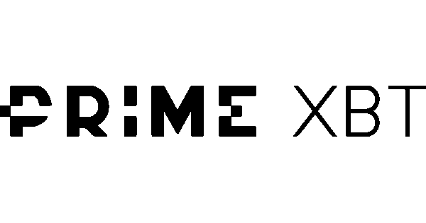

PrimeXBT 是一个全球加密交易所，也是一个独特的交易平台，您可以在这里交易加密货币、股票指数、商品和外币。在 PrimeXBT，您可以选择高达初始投资 100 倍的保证金交易。它还具有一个名为“covesting”的新选项，允许您复制平台上主要投资者和交易者的行为。此外，“涡轮”交易选项允许您进行短期价格预测，如果您的预测正确，您将获得双倍利润。

**XBT 总理:**

**加密货币**

提供比特币，以太坊，涟漪，EOS，莱特币，美元币，系绳。

**佣金和费用**

根据操作类型的不同，隔夜佣金在 0.00277%至 0.1389%之间。交易佣金取决于资产。Prime XBT 对存款不收取任何费用，而取款则因加密货币而异。

**钱包**

PrimeXBT 支持 5 种与特定加密货币绑定的交易所钱包:BTC、瑞士联邦理工学院、USDT、USDC 和 COV。

**付款方式**

目前不支持银行转账或信用卡/借记卡购买。Prime XBT 仅接受来自 BTC、瑞士联邦理工学院、USDT、USDC 和 COV 的其他交易所或数字钱包的加密转账和存款。

**安全**

PrimeXBT 声称拥有先进的多层安全级别，托管在亚马逊网络服务(AWS)上，保证严格的空间。

# 14.北海巨妖

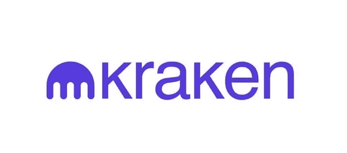

该加密货币交易所位于美国，于 2011 年开始运营，并在提供加密货币交易、交易和投资服务方面取得了出色的业绩记录(全球范围内)。它有一个安全的平台(保持客户 95%以上的资金离线，但 100%可以提取)，而在线资金则保持安全，具有高度的安全性。此外，它还提供了直观的图形界面，便于操作和客户支持，全天候提供服务。

克拉肯:

**加密货币**

全球交易量最大的 20 种加密货币，也接受法定货币进行交易。

**佣金和费用**

取款和存款费用因加密货币而异，然而，大多数加密货币允许免费存款。每笔交易也有一个最低金额(因加密类型而异)。

**钱包**

不提供加密钱包。

**付款方式**

通过银行转账。

**安全**

他们遵守存取资金的计算机安全标准。

# 15.比特雷克斯

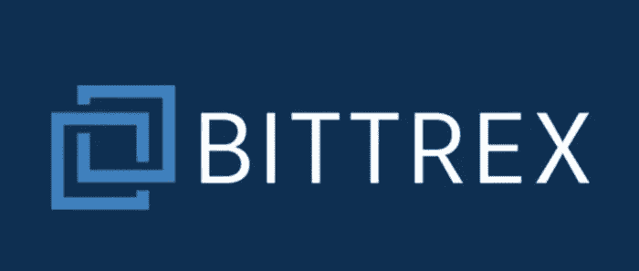

它起源于北美，成立于 2014 年，提供了一个具有更新界面的安全平台。它目前的总部设在列支敦士登，通过移动应用程序(包括桌面网络版)提供在线服务，允许买卖和交换最商业化的加密货币。用户可以在主要的加密活跃市场(超过 250 个)进行投资。它还通过社交网络和电子邮件提供客户支持系统。

**Bittrex:**

**加密货币**

超过 190 个密码和 500 对交易。

**佣金**

存款和取款都是免手续费的(只接受最低 25 欧元)，而取款可以从 10 欧元起。在某些国家，不提供定期存款和取款服务。

**钱包**

它没有管理加密货币的电子钱包。

**付款方式**

国际银行转账(需要 Bittrex 批准)、信用卡和借记卡。

**安全**

它使用各种安全元素来保护资金(只有 10–20%的资金在线)。此外，截至 2018 年，它们包括了一个由 IP 进行的验证阶段。

# 16.比特熊猫

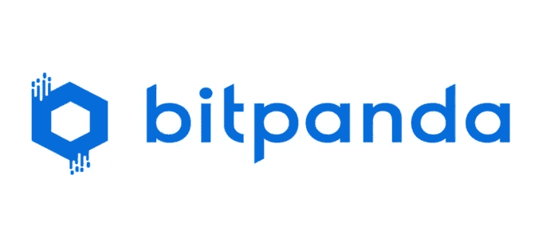

Bitpanda 成立于 2014 年，总部位于奥地利，是一家金融科技公司，提供交易和交易各种加密货币的平台。除了提供可靠性和易操作性之外，它目前被认为是服务最多样化的加密交换之一。用户可以有多达 9 种不同的服务:买卖，交换，储蓄计划，金属交易，等等。

Bitpanda 在超过 54 个国家提供多种支付选项(尽管可能会收取一些加密货币存款费用)。此外，它还通过主要的社交网络、电子邮件和电话服务提供客户支持。

**比特熊猫:**

**加密货币**

它允许使用报价最高的加密货币以及大量衍生货币对进行交易。

**佣金**

他们根据加密货币的不同，对购买和销售收取不同的佣金。存款需要付费(根据加密货币的不同，存款可以免于最低限额)，取款也需要付费(费用根据支付方式的不同而不同)。

**钱包**

是的，该平台有一个加密货币钱包，它允许你向其他用户发送或接收资产(没有佣金)。除了便于管理(在开始时，用户对于每种加密货币有一个钱包)。

**付款方式**

接受多种支付方式:信用卡、银行转账、电子钱包等(可能因国家而异)。

**安全**

它符合金融服务的国际标准，如 AML5，他们还使用安全证书、数据加密和资金保护。

# 17.hitbtc

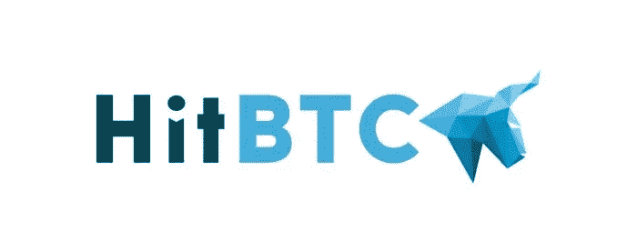

该公司位于香港，于 2013 年开始运营，目前提供最先进的交易平台(通过 API 整合交易机器人)。此外，它允许与 500 多种数字资产和全球报价最高的加密货币进行交易。培训过程中的交易者将能够从演示版本中受益，该版本不需要押金，并允许他们探索最出色的功能(对于最高级的交易者也非常有用，但他们需要熟悉界面)。

该平台还提供企业账户以及各种安全系统，让您完全放心。

**hitbtc:**

**加密货币**

它允许与市场上的主要密码和 800 多种兼容密码对一起工作。

**佣金**

取款费用根据市场调整，加密货币存款不收取额外费用。而交易的佣金根据 30 天的交易量而变化。

**钱包**

它不提供加密钱包。

**付款方式**

它只支持加密货币。

**安全**

访问需要两步验证，还使用安全证书和离线存储。

# 选择交换平台之前需要考虑的方面

在回顾了市场上的最佳交易所之后，也许有必要强调一些重要的方面以供选择。毫无疑问，平台之间的竞争很激烈，服务每天都在改进。在这个意义上，分析以下特征:

**1。手续费和佣金** —审核存款、取款和交易的所有佣金。

**2。可用加密货币:**检查平台是否支持您有兴趣交易的加密货币。

**3。付款方式:**一个很重要的方面，会让你操作。比如你只有一张信用卡，你必须验证平台是否接受它来存放资金(有些交易所可能会对支付类型收取佣金)。

> 加入 Coinmonks [电报频道](https://t.me/coincodecap)和 [Youtube 频道](https://www.youtube.com/c/coinmonks/videos)了解加密交易和投资

# 另外，阅读

*   [Bookmap 评论](https://coincodecap.com/bookmap-review-2021-best-trading-software) | [美国 5 大最佳加密交易所](https://coincodecap.com/crypto-exchange-usa)
*   最佳加密[硬件钱包](/coinmonks/hardware-wallets-dfa1211730c6) | [Bitbns 评论](/coinmonks/bitbns-review-38256a07e161)
*   [新加坡十大最佳加密交易所](https://coincodecap.com/crypto-exchange-in-singapore) | [购买 AXS](https://coincodecap.com/buy-axs-token)
*   [红狗赌场评论](https://coincodecap.com/red-dog-casino-review) | [Swyftx 评论](https://coincodecap.com/swyftx-review) | [CoinGate 评论](https://coincodecap.com/coingate-review)
*   [投资印度的最佳密码](https://coincodecap.com/best-crypto-to-invest-in-india-in-2021)|[WazirX P2P](https://coincodecap.com/wazirx-p2p)|[Hi Dollar Review](https://coincodecap.com/hi-dollar-review)
*   [加拿大最好的加密交易机器人](https://coincodecap.com/5-best-crypto-trading-bots-in-canada) | [库币评论](https://coincodecap.com/kucoin-review)