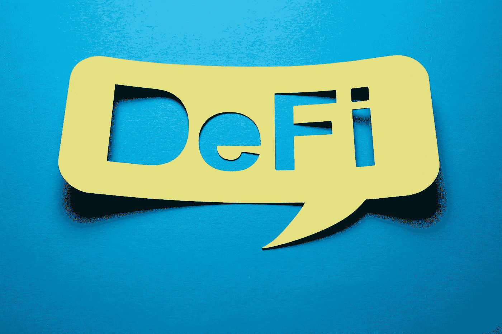
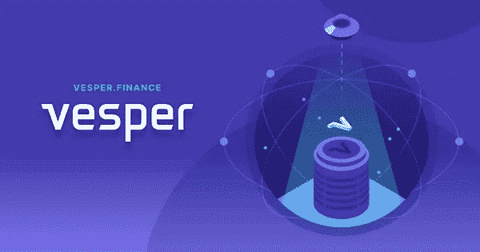
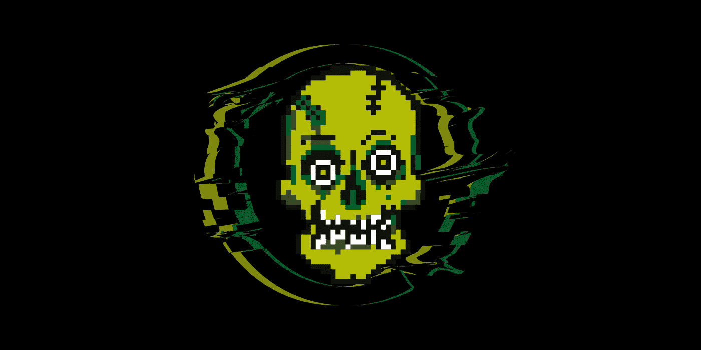

# 投资什么是最好的代币！

> 原文：<https://medium.com/coinmonks/what-is-the-best-defi-token-to-invest-d97d14c00c16?source=collection_archive---------22----------------------->

加密市场可能会处于熊市，直到下一次减半(比特币减少了硬币的产量)。halvening 不会发生，直到 2024 年，所以如果加密市场确实重演，我们可能需要等待至少 2 年的大收益。我个人认为你应该制定一个两年甚至三年的持有计划，给你一个获得巨大收益的机会。

Photo Source on Google

# **重叠原则**

*被动收入*。我们需要一种方法来赚钱，而加密市场走横甚至下降。我想要一个 DeFi 项目，让我赚取利息。

我建议的 DeFi 策略不是稳定竞争策略。这有几个原因:

1.  原因之一是，当牛市开始时，他们无法注入价值。当牛市肆虐时，我喜欢持有 10 倍或更多的硬币。
2.  第二个原因是因为政府将试图严格监管稳定的收入。许多像 USDC 这样稳定的城市本质上是高度集权的，很可能会经历消极和愚蠢的监管。
3.  第三个原因是，它们与一种可能恶性通货膨胀的货币挂钩。我喜欢 crypto 的一个原因是，我不信任中央银行和与它们相关的各种政府机构。从历史上看，所有法定货币都会失灵，当它发生时，我不想让自己背黑锅。我个人认为，在接下来的十年里，大部分法定货币将会崩溃。当音乐椅游戏结束时，我不想拿着一袋菲亚特。
4.  当我选择不与美元挂钩的加密技术时，我也欣赏牛市中的巨大收益。

我推荐的两个 DeFi 平台和策略对 *me* 有效，但如果你想要一个稳定的策略，它们并不完美。我还想指出，稳定币策略有其合法用途，我并不反对稳定币。

# **晚祷策略**

市值:1500 万英镑

*TVL*:9400 万

Vesper Finance 就像 DeFi 的机器人顾问。他们提供各种各样的顶级代币，您可以从中赚取利息。他们把你的代币放入不同的池中，赚取收益。当你获得收益时，他们会收取一定的费用，然后将这些收益存入他们的 Vesper ($VSP)代币。那些投资 100 美元 VSP 的人将获得收益.

使用 Vesper，您可以下注:

*   包装比特币
*   醚
*   奶妈
*   链环
*   USDC
*   Uniswap

还有更多。这个项目需要考虑的一点是，它大部分运行在以太坊和多边形上。Vesper 提供了几种不同的方法来赚取和增加财富。我最喜欢的赚钱方法之一是下注赌马，从收费中赚取收益。当然，你可以在各种顶级以太坊代币上赚取收益。

# **RugZombie**

市值:50 万美元

TVL:45 万美元

RugZombie 和 Vesper 是完全不同的策略。使用 Vesper，您可以在以太坊网络上下注已建立的代币，或者从 Vesper 费用中赚取收益。

Rugzombie 有不同的目的和完全不同的机会，并且在 BSC 网络上而不是以太坊上。

RugZombie 用例

1.  把坚固的代币变成 NFT 和僵尸代币($ZMBE)。如果你最终得到一个失败的代币，你可以把它放入坟墓(智能合同)并用$ZMBE 作为赌注。失败的令牌将被烧毁，你将获得更多的$ZMBE，但最重要的是，在下注一段时间后，你将获得一个 NFT。NFT 以僵尸为主题，并基于失败的令牌的标志。
2.  RugZombie 与各种小型、新兴的 BSC 项目合作。该项目将提供他们的令牌空投，一个独特的 NFT 也是为了庆祝该项目。您下注$ZMBE 并获得合作令牌作为回报。45 天后，你还将获得该项目的 NFT。这使得它如此之高，即将到来的项目可以向僵尸社区宣传自己，并锁定僵尸令牌。
3.  为 PancakeSwap 或 ApeSwap 提供流动性。获得流动性代币，将它们押在坟墓上(智能合同)并获得更多的$ZMBE 和特殊僵尸 NFT。
4.  RugZombie 创建了遗忘市场，这里有几个不同的 NFT 项目列表，你可以买卖僵尸 NFT。
5.  还有即将到来的僵尸主题的 NFT 游戏。将会有一系列游戏利用这些独特的 NFT。

我认为 RugZombie 很有潜力。通过使用僵尸 DeFi，你可以从合作项目中获得$ZMBE，NFTs 和潜在的月球袋。

Vesper 和 RugZombie 都提供了独特的用例以及 DeFi 机会。但它们是完全不同的策略和风险水平。自己做研究，自己决定。

> 加入 Coinmonks [电报频道](https://t.me/coincodecap)和 [Youtube 频道](https://www.youtube.com/c/coinmonks/videos)了解加密交易和投资

# 另外，阅读

*   [OKEx vs KuCoin](https://coincodecap.com/okex-kucoin) | [摄氏替代品](https://coincodecap.com/celsius-alternatives) | [如何购买 VeChain](https://coincodecap.com/buy-vechain)
*   [币安期货交易](https://coincodecap.com/binance-futures-trading)|[3 comas vs Mudrex vs eToro](https://coincodecap.com/mudrex-3commas-etoro)
*   [如何购买 Monero](https://coincodecap.com/buy-monero) | [IDEX 评论](https://coincodecap.com/idex-review) | [BitKan 交易机器人](https://coincodecap.com/bitkan-trading-bot)
*   [CoinDCX 评论](/coinmonks/coindcx-review-8444db3621a2) | [加密保证金交易交易所](https://coincodecap.com/crypto-margin-trading-exchanges)
*   [红狗赌场评论](https://coincodecap.com/red-dog-casino-review) | [Swyftx 评论](https://coincodecap.com/swyftx-review) | [CoinGate 评论](https://coincodecap.com/coingate-review)