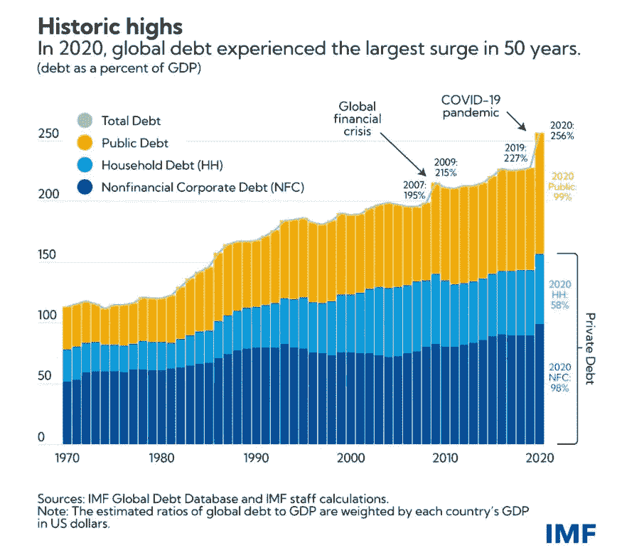

# 投资什么产品最好？

> 原文：<https://medium.com/coinmonks/what-is-the-best-product-to-invest-2a4cd623d81c?source=collection_archive---------74----------------------->

还是那句话，我来咨询一下我的水晶球:)

CB:“这是为什么、何时、如何和什么中最难回答的问题，但是如果你已经阅读了所有推荐的书籍，现在你应该对你面临的情况有所了解，当你投资时，基本上你会用你的法币交换你认为与在银行持有法币相比更有价值的东西”所以在这种情况下，你必须找到能够 1)战胜通货膨胀和 2)保护你免受世界储备货币灭亡(法币崩溃)的产品

因为 1)自从 51 年前尼克松总统结束美元金本位以来，美元购买力下降了 80%以上，这是事实。美元走到哪里，其余的货币就跟到哪里，尽管有些更强，有些更弱，但趋势是相似的。所以这是事实而不是假设。在银行长期持有现金肯定会赔钱！

因为 2)世界储备货币的消亡在过去 500 年里已经发生了 5 次。谁也不知道美元会持续多久，但历史往往会重演。当政府由于战争和管理不善而过度支出时，膨胀的债务使其无法维持利率。这个体系迟早会崩溃，下一个上涨的可能不再是另一种法定货币。因为如果强大的美元能够消亡，还有什么比美元更好的法定货币呢？

黄金迷认为，有一天，世界储备货币将与黄金挂钩，因此金本位将再次统治地球。要做到这一点，以美元计价的黄金价格必须上涨数倍，才能达到全球信贷总量的平衡。

[2021 年，IMF 发表文章称全球债务达到 226T。](https://blogs.imf.org/2021/12/15/global-debt-reaches-a-record-226-trillion/)

黄金目前的市值为 12T，要达到 2020 年的债务水平，它必须增长约 20 倍。为了经济增长，债务/信贷必须保持增长，否则当信贷收缩时，世界将进入衰退。

我:“黄金真的会成为下一个世界储备货币吗？”

伯恩斯坦:“我不这么认为，但可能是其中的一部分，或者某种混合法定货币-黄金-商品-石油-比特币，完美的解决方案很难得到，现在你看到法定货币的问题/风险，但解决方案远非完美，美元自 1920 年以来成为世界储备货币，已经有大约 102 年了，如果历史重演，那么下一次风暴就不远了。

我:“那么回到问题，投资什么产品最好？”

CB:“过去当通胀率低于 2%时，低成本指数基金是投资的好地方，比如 SPY，它就是标准普尔 500 的指数基金。但是今天美国的通货膨胀率是 8.5%，如果你在接下来的 12 个月内定期部署，也许从长期来看仍然可以战胜通货膨胀，这取决于你的风险承受能力，你可以在接下来的 6 个月内部署，或者你可以在 12-24 个月内分散部署。从 2020 年 3 月的 covid 崩盘到 2021 年 12 月的峰值，在美联储结束 QE 后，上涨了 120%，“因此市场将期待美联储在下一次危机中的救援，因此反弹也将是快速而激烈的”

我:“好吧，那么投资的产品之一是低成本指数基金，以战胜长期通货膨胀，如何保护世界储备货币的消亡？”

CB:“如果你读过 Saifedean Ammous 的比特币标准，你应该已经知道答案，S2F 模型越高的资产作为价值储存手段表现越好。目前，与其他贵金属相比，黄金的 S2F 最高，约为 60-62。而比特币 S2F 约为 55–57。但在下一个减半期，即 2024 年年中，比特币 S2F 将达到 120 左右。这将使比特币 S2F 的价格是黄金 S2F 的两倍，因此与任何其他资产相比，比特币具有最高的上涨潜力。如果它能挺过即将到来的风暴，并能与黄金并列为世界储备货币，比特币 7000 亿美元的市值目前有 15-20 倍的上升潜力，仅相当于黄金 12 吨的当前市值。

***Stock-to-flow 是一种投资模型，根据生产率或一年中开采的总量来衡量资产的当前存量。库存流量比用于比较特定资源的相对丰富或稀缺程度。***

*从理论上讲，如果一种资源更加稀缺——例如，金、银或铂等贵金属——那么它可能是更好的价值储存手段，这意味着它应该长期保持其价值和购买力*

如果投资黄金和/或比特币，就当交保险费。防止法定货币崩溃的保险。没有人会用他们所有的资本去买保险，所以不要把你的农场押在黄金和/或比特币上。

我:“还有其他产品推荐吗？”

CB:“美国政府债券，这听起来可能有违直觉。我们为什么要投资美国国债？你可能会问"

我:“是的，在高通胀时期，或者如果我们预计菲亚特在较长时期内将失去购买力，我们为什么要成为债权人？”

CB:“因为，美国国债是流动性最强的资产，在所有其他资产中市值最高。[未偿债券市场规模为 23T](https://www.sifma.org/resources/research/us-treasury-securities-statistics/) ，价格下跌 10%意味着抹去 2.3T 美元，下跌 20%意味着抹去 4.6T 美元。这大约是疫情时期美联储 QE 的规模。

不能让它破裂/崩溃。它还与美国抵押贷款利率间接挂钩。价格越低，收益率和抵押贷款利率越高。自美联储结束 QE 并于 2021 年底开始加息以来，美国国债价格已经降至 2018 年 12 月的水平。在上一个周期，当美联储决定停止 QT 时，几乎触底。美国抵押贷款利率最近达到 5.27%，这是自 2009 年以来的最高水平！在导致住房市场违约之前，它能涨到多高？所有这一切都发生在美联储启动 QT 之前，QT 的计划是 2022 年 6 月。

我:所以美国国债的下跌空间在某种程度上是有限的，因为它不能被允许下跌太多太久。随着价格下跌，收益率将上升，新债发行将更加昂贵。而且会影响政府支出预算。与此同时，为消费者和企业债务提供服务的成本也将增加。

CB:“是的。”

我:“所以综上，1)美国国债，SPY 之类的低成本指数基金 3)黄金和/或比特币，白银怎么样？

CB:“白银不是一个好的选择，因为与黄金和比特币相比，白银的 S2F 较低，约为 22。除了比特币，还有其他加密资产具有更好的上升潜力，但风险也更高。就目前而言，我们还是坚持比特币。

我:好吧。

**免责声明:**

***请自行研究，整个故事不是财务建议。把握市场时机和确定最佳投资产品纯粹是投机。任何投资都伴随着风险。***

> 交易新手？尝试[加密交易机器人](/coinmonks/crypto-trading-bot-c2ffce8acb2a)或[复制交易](/coinmonks/top-10-crypto-copy-trading-platforms-for-beginners-d0c37c7d698c)