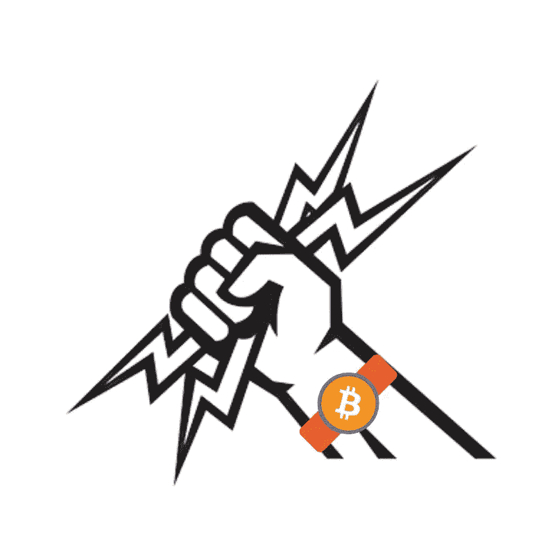

# 什么是比特币闪电网？

> 原文：<https://medium.com/coinmonks/what-is-the-bitcoin-lightning-network-79e98d9e2d5?source=collection_archive---------16----------------------->

大多数关注比特币生态系统的人都很清楚 [CashApp](https://bitcoinmagazine.com/business/cash-app-integrates-bitcoins-lightning-network) 整合了比特币的闪电网络。杰克·多西的这一举措使 Cash 应用程序用户可以在全球范围内免费发送即时的闪电式比特币支付。比特币的反对者往往会成群结队地围绕其局限性的缺点而来，比如对交易速度和价格的担忧，尤其是在交易繁忙时期，费用往往会增加。人们…