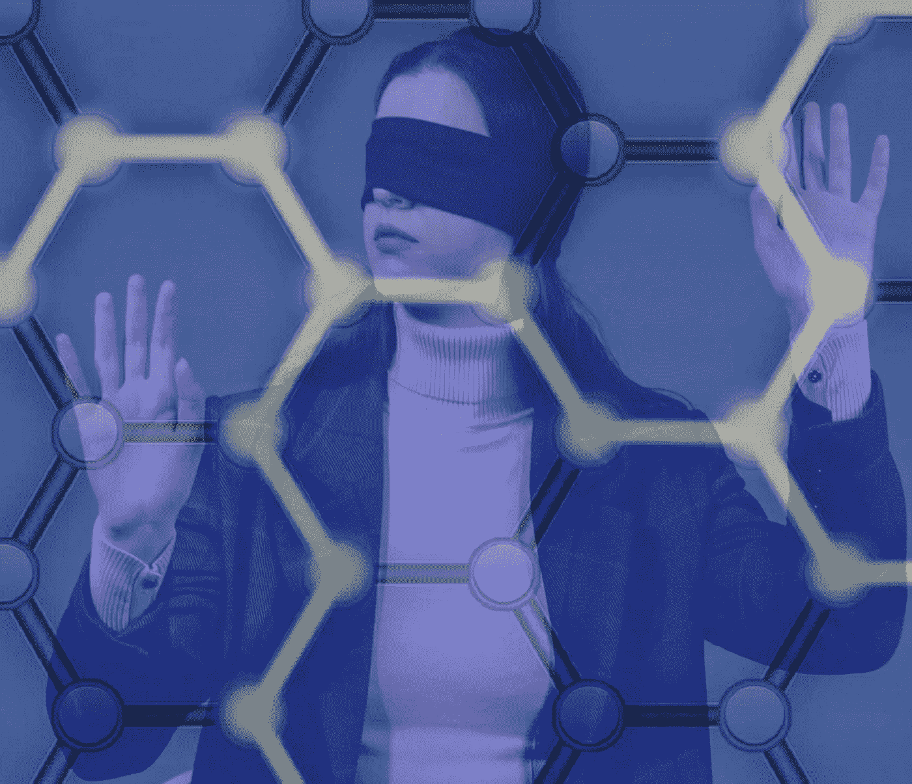

# 区块链到底是什么？

> 原文：<https://medium.com/coinmonks/what-is-the-blockchain-all-about-f66ce2a21deb?source=collection_archive---------11----------------------->

## 理解了区块链的概念后，我顿悟了

Source: [Tima Miroshnichenko](https://www.pexels.com/@tima-miroshnichenko?utm_content=attributionCopyText&utm_medium=referral&utm_source=pexels) & [The digital artist](https://pixabay.com/users/thedigitalartist-202249/) | Edit: Cryptic Liberation

它让人们获得了前所未有的金融机会，并在金融界创造了透明度。另外，集中化的银行机构终于有了竞争，迫使他们进行创新。如果他们不这样做，他们就会被淘汰。

# 区块链 vs…