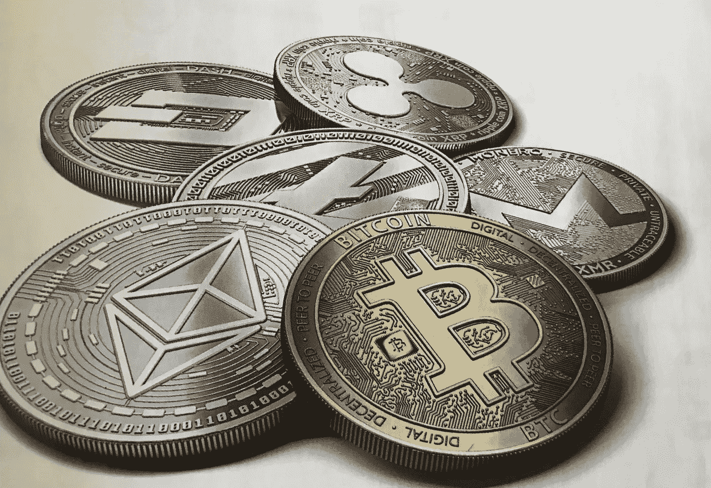

# 区块链技术是什么？

> 原文：<https://medium.com/coinmonks/what-is-the-blockchain-technology-8c7a2f0a4133?source=collection_archive---------11----------------------->

区块链允许数字数据被分发而不是复制，形成了一种全新类型的互联网的主干。虽然最初是为数字货币比特币设计的，但技术社区正在为这项技术寻找新的潜在用途。

就像在互联网或汽车上一样，你不需要知道如何使用区块链。但是你用得越多，就越清楚为什么它是一项革命性的技术。

**分布式数据库**

它可以被认为是一个电子表格，通过计算机网络被复制和分发成千上万次，但被设计成定期更新。区块链上的信息以共享且不断更新的数据库形式存在。以这种方式使用网络有明显的好处。因为区块链数据库不是存储在一个单一的位置，记录是公开的，很容易核实。黑客无法访问和破坏这些信息的集中版本。因为它同时托管在数百万台计算机上，所以互联网上的任何人都可以访问数据库中的数据。

**区块链的健壮性和可靠性**

区块链和互联网一样，有一种内在的鲁棒性。因为相同的信息块存储在整个网络中，所以区块链:

1-它不能由单一机构或组织控制。

2-它没有单一的断裂点。

比特币于 2008 年被发明，自那以后，比特币区块链一直在正常运行，没有出现重大问题。在比特币迄今为止经历的所有问题下，要么是黑客的努力，要么是管理失误。换句话说，这些问题是由于恶意或人为错误；并不是因为底层概念有错误。

互联网已经存在了 35 年。这对仍在开发中的区块链科技来说是个好消息。

**透明而坚不可摧**

区块链技术是每 10 分钟自动自我更新一次的共识。作为一个自我监控的数字价值生态系统，该网络每隔 10 分钟更新一次交易。这些事务中的每一个都被称为“块”，因此会产生两个重要的结果。首先，透明数据被嵌入并对整个网络公开。另一个是，要改变区块链上的任何技术，需要比整个网络更大的处理能力，这样它才不会被破坏。

在这种情况下，虽然理论上是可能的，但实际上似乎仍然不可能。例如，如果你控制了系统来收集比特币，你也重置了比特币的价值。

**节点网络**

区块链由进行计算的“节点”组成。节点是运行连接到区块链的客户端的计算机，负责批准和转移交易。节点一旦加入区块链网络，就会自动下载区块链的更新副本。

合并后的节点形成了一个强大的二级网络，与当前的互联网功能完全不同。每个节点都是区块链上的“管理员”，并自愿加入网络。在这方面，可以说网络不是中心化的。然而，每个加入网络的节点都有机会赢得比特币的奖励。

虽然节点正在做的事情被称为“挖掘”，但这是一个误称。事实上，每个节点都在竞争解决计算难题。比特币起初是区块链的中心点。现在人们认为这只是这项技术众多应用领域中的一个。甚至比特币现在也有了很多替代品，更快、更实惠的气费网络(比如以太坊、Solana、Polkadot、Avax、Near)。如今，类似比特币的加密货币数量超过 10000 种。此外，对原始区块链概念的潜在修改目前正在进行或正在开发中。

区块链本质上是一种去中心化的技术。区块链上发生的一切都会影响整个网络。这也有一些重要的后果。作为一种验证交易的新方式，区块链还覆盖了传统交易的某些方面:例如，区块链上的交易所交易几乎立即发生，或者土地注册等记录可以完全公开。

记录比特币交易的数据库由使用区块链技术的全球计算机网络共同管理。所以，比特币的管理者不是单个机构，而是网络本身。它的分散化意味着网络可以在用户对用户(P2P)的基础上运行。我们才刚刚发现这种大规模合作的潜力。

**谁会用区块链？**

与 web 基础设施一样，不需要了解内部情况就能从区块链中获益。目前，区块链技术最大的使用案例是在金融领域。世界银行表示，2015 年的资金转移超过了 4300 亿美元，目前对区块链开发商的需求仍然很大。

区块链可以消除这种交易中的中间人。正如图形用户界面(GUI)由于桌面概念而使每个人都可以使用计算机一样，被称为“钱包”的图形用户界面也被用来使用区块链。人们使用这些应用程序用比特币购物或用其他加密货币购物。当然，有不同类型的钱包。冷热钱包是现在大多数用户都可以使用的钱包类型。

在线交易与认证过程密切相关。我们可以肯定，在未来，钱包应用程序将为其他类型的认证铺平道路。

**区块链是否意味着新的 Web 3.0？**

区块链赋予互联网用户创造价值的能力，并验证数字信息。企业将如何从中受益？被称为“智能合同”的分布式分类账，使得编写仅在满足特定条件时才运行的简单合同成为可能。以太坊是一个开源的区块链项目，就是为了这个目的而构建的。虽然以太坊仍在开发中，但它有潜力将区块链的实用性扩展到改变世界的规模。随着以太坊 2.0 的更新和更多的重大更新，我们将看到更大的发展变化。

在目前的技术水平下，可以编写智能合同来执行简单的功能。例如，使用区块链技术和比特币，当某种金融工具达到一定水平时，您可以进行支付。例如，那些目前想共享交通工具的人需要一个像优步这样的代理。然而，由于点对点支付，区块链可以导致各方的直接互动和真正去中心化的共享经济。

**知识产权保护**

众所周知，由于有了互联网，人们可以无休止地复制数字信息，并将其传播到任何地方。这为网络用户提供了免费内容的金矿。然而，版权持有者就没那么幸运了。他们都失去了知识产权，因此遭受了物质损失。智能合同可以保护版权，并自动在线销售创意作品，消除文件复制和分发的风险。这就是为什么 NFT 的作品，特别是在 2021 年底非常受欢迎，所以被欣赏和使用。

区块链支持部分加密货币支付(即小额支付)的事实表明，区块链在这种情况下有很大的成功机会。

**身份管理**

毫无疑问，我们需要更好的网络身份管理。认证是互联网上所有金融交易的弱点。然而，解决网络商务带来的安全风险的方法并不好。分布式分类账提供了证明你是谁的改进方法，并提供了数字化个人文件的机会。在共享经济中，拥有安全的身份对于在线互动也很重要。毕竟拥有良好的信誉是网购最基本的要求。

在过去的 5 年里，区块链技术在我们的生活中所占的比重越来越大，各个领域的项目都得到了发展，尤其是在过去的 1.5 年里；分散交流(DeFi)，然后是元宇宙 NFT 的数字艺术，许多大公司在那里工作，然后是 Web 3.0 技术，那里将发生大的互联网革命。都是 2008 年写的一个技术带来的伟大创新。我们将怀着激动的心情拭目以待，看看他下一步会去哪里。

> *加入 Coinmonks* [*电报频道*](https://t.me/coincodecap) *和* [*Youtube 频道*](https://www.youtube.com/c/coinmonks/videos) *了解加密交易和投资*

# 另外，阅读

*   [3 商业评论](/coinmonks/3commas-review-an-excellent-crypto-trading-bot-2020-1313a58bec92) | [Pionex 评论](https://coincodecap.com/pionex-review-exchange-with-crypto-trading-bot) | [Coinrule 评论](/coinmonks/coinrule-review-2021-a-beginner-friendly-crypto-trading-bot-daf0504848ba)
*   [莱杰 vs n 格拉夫](/coinmonks/ledger-vs-ngrave-zero-7e40f0c1d694) | [莱杰纳诺 s vs x](/coinmonks/ledger-nano-s-vs-x-battery-hardware-price-storage-59a6663fe3b0) | [币安评论](/coinmonks/binance-review-ee10d3bf3b6e)
*   [Bybit Exchange 审查](/coinmonks/bybit-exchange-review-dbd570019b71) | [Bityard 审查](https://coincodecap.com/bityard-reivew) | [Jet-Bot 审查](https://coincodecap.com/jet-bot-review)
*   [3 commas vs crypto hopper](/coinmonks/3commas-vs-pionex-vs-cryptohopper-best-crypto-bot-6a98d2baa203)|[赚取加密利息](/coinmonks/earn-crypto-interest-b10b810fdda3)
*   最好的比特币[硬件钱包](/coinmonks/hardware-wallets-dfa1211730c6) | [BitBox02 回顾](/coinmonks/bitbox02-review-your-swiss-bitcoin-hardware-wallet-c36c88fff29)
*   [BlockFi vs Celsius](/coinmonks/blockfi-vs-celsius-vs-hodlnaut-8a1cc8c26630)|[Hodlnaut 点评](/coinmonks/hodlnaut-review-best-way-to-hodl-is-to-earn-interest-on-your-bitcoin-6658a8c19edf) | [KuCoin 点评](https://coincodecap.com/kucoin-review)
*   [Bitsgap 评审](/coinmonks/bitsgap-review-a-crypto-trading-bot-that-makes-easy-money-a5d88a336df2) | [Quadency 评审](/coinmonks/quadency-review-a-crypto-trading-automation-platform-3068eaa374e1) | [Bitbns 评审](/coinmonks/bitbns-review-38256a07e161)