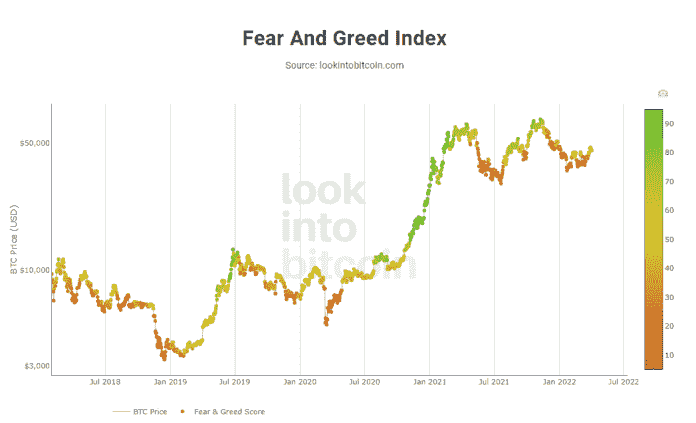

# 什么是隐藏的恐惧和贪婪指数

> 原文：<https://medium.com/coinmonks/what-is-the-crypto-fear-and-greed-index-metric-22e2a909adf8?source=collection_archive---------16----------------------->

预测加密货币市场的走势可能接近一项不可能的任务，但是有一些特定的指标，如恐惧和贪婪指数，已经证明自己在这样做时相对可靠。

术语加密恐惧和贪婪指数被加密分析师、交易员和专家广泛使用。如果你关注加密货币已经有一段时间了，你可能在某个时候听说过它。

# 什么是隐藏的恐惧和贪婪指数？

隐秘的恐惧和贪婪指数是一个指标，旨在衡量任何特定时间点的隐秘市场情绪。该测量基于 1 到 100 之间的数值，其中 1 表示加密货币市场处于极度恐惧之中，人们正在出售或可能出售。如果恐惧和贪婪指数显示为 100，这意味着加密市场处于极度贪婪的状态，人们正在购买加密资产。

典型的加密恐惧和贪婪指数是投资者和交易者在恐惧水平很高或接近 1 时用来购买加密的。原因在于，在密码市场极度恐惧的情况下，价格可能处于或接近低点，因为投资者和交易者不购买数字资产，并且价格会更低，这代表了潜在的好的进入价格。

如果加密的恐惧和贪婪指数达到或接近 100，这表明加密市场极度贪婪。这一迹象可能被投资者和交易者用作卖出机会，因为价格可能已经见顶，并可能很快下跌。一种认为这是一个炎热的房地产市场，每个人都在相互竞争进入，因此推动价格上涨。歇斯底里(或贪婪)不会永远持续，当它消退时，价格可能会下跌。

加密恐惧和贪婪指数已经在加密交易者和投资者中流行，以帮助他们决定何时购买和何时出售他们的加密资产。简而言之，当加密恐惧和贪婪指数很高时，你可能会考虑出售部分或全部加密资产，当指数较低时，你可能会考虑购买或积累更多的加密资产。

# 加密的恐惧和贪婪指数由哪些数据组成？

有几个指标创造了加密恐惧和贪婪指数的读数。

*   动量和成交量:这是对比特币动量和成交量的衡量，较低的动量和成交量水平被视为积极的，较高的动量和成交量被视为消极的或增加恐惧。该指标占整体指数测量的 25%。
*   波动性:该指数着眼于波动性和最大提款或相对于波动性和提款的 30 和 90 天平均值的估值下降。更高水平的波动被认为代表恐惧，会增加指数的恐惧水平。该指标占整体指数测量的 25%。
*   调查:加密恐惧和贪婪指数实际上每周都对加密市场进行调查。通常，该调查由大约 2，500 名参与者组成。如果调查结果显示出对比特币和加密技术价格的热情，那将增加对贪婪的衡量，而负面情绪将增加对恐惧的衡量。该指标占整体指数测量的 15%。
*   社交媒体:这一指标跟踪标签和社交媒体对比特币的提及，然后将数量与之前的平均值进行比较。更高的标签或提及次数将代表对密码行业更高的兴趣水平，并增加贪婪度。该指标占整体指数测量的 15%。
*   趋势:这一指标着眼于谷歌搜索趋势与以前的平均水平相比较。搜索量越高，市场中被认为越贪婪，这将把指数推向贪婪的一边。该指标占整体指数测量的 10%。
*   主导地位:这一指标比较了比特币与替代加密货币或替代硬币相比的市值主导地位。当比特币的主导地位较低时，这意味着更多的人对加密充满信心，并将钱投入替代硬币，当他们对整体市场不自信时，他们可能会觉得风险太大。比特币的统治地位越低，市场就越被认为是贪婪的一方。该指标占整体指数测量的 10%。

# 隐藏的恐惧和贪婪指数能作为市场方向的指示器吗？

这是一个很难回答的问题，因为没有一个指标可以用来做投资和交易决策。然而，从历史上看，比特币的价格在短期内密切跟随加密恐惧和贪婪指数值。其中较低的比特币价格似乎与较低的恐惧和贪婪指数相关，而较高的比特币价格往往与较高的恐惧和贪婪指数相关。

应该注意的是，加密的恐惧和贪婪指数是一种技术分析工具，而不是基本面分析工具。它没有衡量加密市场的整体前景，正面或负面的新闻或事件，也没有衡量上述 6 个指标之外的任何其他指标。

来源:BumbleBeeCrypto.com

*   此处表达的观点和意见仅代表作者个人，不一定反映 BumbleBeeCrypto.com 的观点或意见，也不应被视为财务建议。每一个投资和交易行为都会带来风险，我们建议您在做出任何交易、投资或财务决策时进行自己的研究。

> 加入 Coinmonks [电报频道](https://t.me/coincodecap)和 [Youtube 频道](https://www.youtube.com/c/coinmonks/videos)了解加密交易和投资

# 另外，阅读

*   [如何在 Uniswap 上交换加密？](https://coincodecap.com/swap-crypto-on-uniswap) | [A-Ads 审核](https://coincodecap.com/a-ads-review)
*   [WazirX vs coin dcx vs bit bns](/coinmonks/wazirx-vs-coindcx-vs-bitbns-149f4f19a2f1)|[block fi vs coin loan vs Nexo](/coinmonks/blockfi-vs-coinloan-vs-nexo-cb624635230d)
*   [本地比特币审核](/coinmonks/localbitcoins-review-6cc001c6ed56) | [加密货币储蓄账户](https://coincodecap.com/cryptocurrency-savings-accounts)
*   [什么是保证金交易](https://coincodecap.com/margin-trading) | [美元成本平均法](https://coincodecap.com/dca)
*   [支持卡审核](https://coincodecap.com/uphold-card-review) | [信任钱包 vs MetaMask](https://coincodecap.com/trust-wallet-vs-metamask)