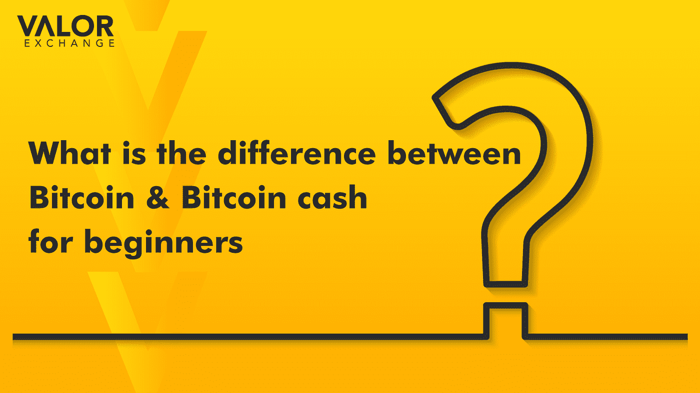

# 对于新手来说，比特币和比特币现金有什么区别？

> 原文：<https://medium.com/coinmonks/what-is-the-difference-between-bitcoin-and-bitcoin-cash-for-beginners-6439b4479765?source=collection_archive---------42----------------------->

比特币和比特币现金是非常容易混淆的术语。这两种硬币都在密码市场建立了声誉。虽然它们有一个共同的名字，但比特币和比特币现金是两种独立的加密货币。比特币现金永远无法发送到比特币地址或钱包，反之亦然。

因此，在这篇文章中，我们将讨论它们是什么以及它们为什么存在。

**比特币是什么？**

比特币是由一个名叫中本聪的人或团体在 2009 年创造的。直到今天，创造者的身份仍然不明。

比特币的运作基于[利益共识证明](https://valorexchange.com/blog/post?slug=proof-of-stake-and-proof-of-work-a-beginner-s-guide)，矿工通过验证交易来获得赚取新比特币的机会。

点击[这里，你可以阅读比特币的历史，以及它是如何成为迄今为止最著名的加密货币的。](https://valorexchange.com/blog/post?slug=what-is-bitcoin-a-brief-introduction)

*Photo credits: Freepix.com*

**什么是比特币现金？**

这是一种加密货币，也是一种支付系统。它是在比特币硬分叉后于 2017 年开发的，旨在增加区块链上可以处理的交易数量。

当一个区块链分裂成两个并排运行的独立区块链时，就会发生硬分叉。

出于对比特币规模化能力的担忧，比特币矿工和开发者创造了比特币现金。矿工和开发商之间在信仰或哲学上也有分歧。一些人认为，比特币应该更多地像黄金一样作为价值储存手段存在。人们不一定用黄金来买卖商品，而是更多地长期持有，或者直到需要出售的时候。

一些矿工和开发者认为，比特币区块链应该像以太坊的区块链一样多样化，比特币应该更像奈拉、美元等交易货币。

2017 年，一些矿工和开发者发起了一个分叉，产生了一种新的加密货币。货币是比特币现金。这种加密货币是用自己的区块链和协议创建的。

**迄今为止比特币分叉区块链的演变**

比特币生态系统中还有许多其他实验。有些变得毫无用处，从来没有工作过。这些集合中有几个仍然有一定的相关性，即比特币黄金(BTG)。

2018 年末，比特币现金区块链经历了第一次分叉，比特币聪视由此诞生。它是区块链的更高级版本，可以适应更快的交易。

尽管比特币现金在过去几年中呈指数级增长，但它距离比特币还有几十年的时间。

**总之**

比特币已经成为密码界家喻户晓的名字。像任何技术一样，都有改进的空间，但像比特币现金和其他技术离完美还差得很远。比特币的未来依然光明。国家、企业和个人都使用比特币进行交易、交换、支付等等。

不要错过学习加密的机会，使用加密进行支付，或者从加密货币中获得更多价值。加入我们的 Telegram，在这里我们共享免费的工具、资源、新闻、信息等。，这将帮助您充分利用您的加密货币。