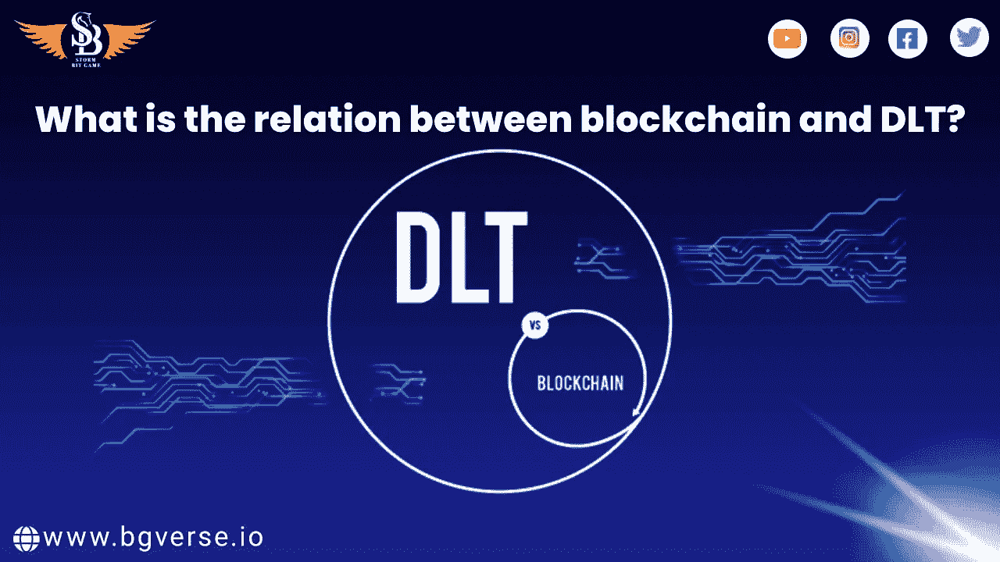

# 区块链和 DLT 有什么区别？

> 原文：<https://medium.com/coinmonks/what-is-the-difference-between-blockchain-dlt-ae9502f8ee47?source=collection_archive---------32----------------------->

DLT 和区块链有一个合理的开端:它们是数字化和分散化的记录日志。这些术语经常被混淆，然而，它们被显式元素的非共享排列所分隔。

它没有看起来那么复杂。一个区块链，一串正方形，是一种 DLT。也就是说，这是一个典型的名字确认特性制造混乱的例子:当特定的帮助、项目或应用程序的结果超出了它所拥有的“保护伞”时，它就会吃掉它的名字。同样，不是所有俗气的笔记都是便利贴，不是所有的 DLT 都是区块链。

[从更专业的角度来看，DLT 只是一个分散的数据集，由不同的成员监管。没有聚焦力作为调停者或屏蔽。作为一个被挪用的记录日志，有更突出的直白性——让勒索和控制变得更麻烦——黑掉框架](http://sbgame.club)也更糊涂。

所有这些都很容易被认出来，因为事实上，在像这篇关于区块链亮点的文章中，这些都得到了阐述。区块链只不过是一个有着特殊排列亮点的 DLT。同样，它也是一个常见的数据集—记录的日志—但是对于这种情况，它是通过块共享的，顾名思义，这些块构成了一个链。方块由一种叫做“散列”的密码标记封闭；接下来的方块开始于相同的“哈希”，一种蜡封。这就是确认加扰数据未被控制且不能被控制的方式。区块链的恶名，除了其他事情之外，还归功于它是众所周知的比特币加密货币背后的创新。

> 加入 Coinmonks [电报频道](https://t.me/coincodecap)和 [Youtube 频道](https://www.youtube.com/c/coinmonks/videos)了解加密交易和投资

# 另外，阅读

*   [CBET 评论](https://coincodecap.com/cbet-casino-review) | [库科恩 vs 比特币基地](https://coincodecap.com/kucoin-vs-coinbase)
*   [Fold App 审核](https://coincodecap.com/fold-app-review) | [Kucoin 交易机器人](/coinmonks/kucoin-trading-bot-automate-your-trades-8cf0ca2138e0) | [Probit 审核](https://coincodecap.com/probit-review)
*   [如何匿名购买比特币](https://coincodecap.com/buy-bitcoin-anonymously) | [比特币现金钱包](https://coincodecap.com/bitcoin-cash-wallets)
*   [币安 vs FTX](https://coincodecap.com/binance-vs-ftx) | [最佳(SOL)索拉纳钱包](https://coincodecap.com/solana-wallets)
*   [比诺莫评论](https://coincodecap.com/binomo-review) | [斯多葛派 vs 3Commas vs TradeSanta](https://coincodecap.com/stoic-vs-3commas-vs-tradesanta)