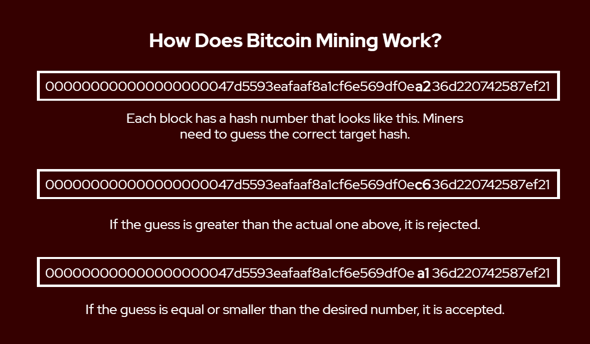
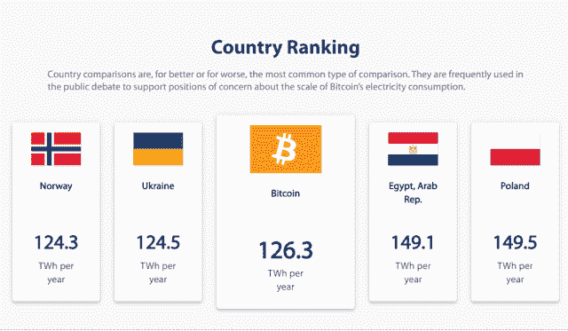

# 利害关系证明和工作证明有什么区别？

> 原文：<https://medium.com/coinmonks/what-is-the-difference-between-proof-of-stake-and-proof-of-work-4126f6358abb?source=collection_archive---------60----------------------->

*股权证明？工作证明？我们解释了使区块链成功的两种常见共识机制之间的区别。*

如果你对你最喜欢的加密货币做过研究，那么你很有可能遇到过“赌注证明”和“工作证明”这两个术语。它们到底是什么？

# 什么是共识机制？

简而言之，所有加密货币使用共识机制有三个目的。它们用于验证区块链上所有交易的准确性，确保系统的安全性，并确保各方同意并存储相同的信息。不知道区块链是怎么工作的？点击[这里](https://coinpasar.sg/what-is-blockchain/)了解更多。

为什么区块链需要一个共识机制？让我们用一个简单的儿童游戏来说明这个问题——传递信息。一条信息被给了第一个人，但是当它到达最后一个人的时候，这条信息很少像最初的短语。虽然它在游戏环境中会引起一两个笑声，但当数百个节点需要同时准确地存储相同的信息时，它会带来很大的麻烦。

有了共识机制，它可以确保网络中的所有参与方都可以在不可信的环境中就数据达成一致。这种机制以工作证明和利益证明的形式出现。

# 什么是工作证明(PoW)？

在工作证明共识中，参与者通过显示他们已经完成某种工作的证明来保护系统和验证交易。以比特币为主要例子，这是通过使用像 CPU 和 GPU 这样的计算机硬件组件制成的比特币挖掘钻机来参与挖掘过程来完成的。

参与者不再像传统的矿工那样用镐去挖掘，而是加入到一个激烈的“猜数字”游戏中。矿工们竞相成为第一个通过猜测目标数字或哈希来验证交易块的人，这是一个由 64 个字符长的数字和单词组成的字符串，称为 **64 位十六进制数**。

通过生成大量随机数(数字只使用一次的简称)，矿工最终会猜出正确的目标哈希，并因他们的努力获得一定数量的加密货币。一个人拥有的采矿设备越多，就意味着越多的计算机产生这样的数字，从而更有可能首先获得回报。

为什么矿工会购买所有这些钻机，并走这么远只是为了挖掘一些互联网钱？那是因为报酬相当诱人。以比特币为例——当它刚开始时，矿工每块可以赚 50 个比特币。即使奖励每四年减半，矿工仍然可以每 10 分钟每块赚 6.25 比特币。根据撰写本文时的比特币价格，这可能意味着每块高达 25 万美元！

# 什么是利害关系证明？

在利益相关证明机制中，用户需要拥有大量的网络令牌来证明他们在区块链中有利益相关。这使得用户有资格成为网络的块验证者。

与工作证明机制不同，计算机或采矿设备之间不存在竞争，看谁先获得区块奖励。相反，随机选择计算机来验证交易块并获得奖励，持有量较大的用户有更高的机会被选中。

使用利益相关证明机制也有利于令牌数量较少的用户。通过将他们的代币存入这些块验证器所拥有的赌注池，他们可以赚取一部分奖励，而不必拥有一大包代币。这也有利于块验证器，因为如果更多的用户在它们下面存放令牌，它们会被更频繁地选择。

# PoS 和 PoW 各有什么利弊？

**工作证明网络**被认为是安全的，因为它需要花费大量精力和精力来验证交易，并阻止任何恶意用户仅凭一己之力入侵网络。此外，来自采矿钻机的竞争，以获得激励，确保总是有验证者保护网络。另一方面，这会导致交易验证时间变慢，因为验证者需要时间来猜测目标散列，并且还会导致更高的交易费用。

**由于随机验证流程和低竞争，Proof-of-Stake networks** 可以更快地处理交易。这反过来又降低了网络费用，提高了系统的能效。此外，代币持有者可以选择将其代币委托给用户，并在获得一部分奖励的同时参与保护区块链。另一方面，这可能导致安全问题，因为这可能导致少量验证器保护网络，并且如果足够的令牌被存放到单个验证器中，甚至可能导致 51%的攻击。

# 关于能源使用的抱怨是怎么回事？

加密货币开采的能源使用通常是一个症结，这是有充分理由的。虽然不同的共识机制确实需要电力来运行支持块验证的计算机硬件，但工作证明机制因为是最耗能的而受到抨击。

但是，当开采比特币这样的工作证明加密货币时，采矿钻机需要消耗多少功率？根据剑桥[大学](https://ccaf.io/cbeci/index/comparisons)的数据，比特币目前在全球每年消耗约 126 太瓦时(TWh)。虽然耗电量低于马来西亚、泰国和越南等国家，但却高于挪威、瑞典和菲律宾等国家。这几乎是新加坡 50.7 TWh 能源消耗的 2.5 倍。

相比之下，圣淘沙等新加坡南部岛屿是众所周知的最大电力消费者之一。然而，用这样的能量，你仍然可以为圣淘沙的 10，000 处地产供电 2866 年。

比特币挖矿为什么要用这么多能量？答案就在机制本身。当较少的参与者参与时，挖掘过程更容易，但是随着更多的人加入挖掘过程，能够更快处理计算的更好的设备对于首先获得奖励是必不可少的。更好的设备通常会消耗更多的电力(想想运行处理具有更好图形或渲染动画的游戏的计算机所需的能源)，随着更多用户加入进来并购买自己的电力密集型机器，这种影响变得更加严重。

再加上较慢的交易验证和较高的费用，很明显为什么后来的区块链像 Polkadot 和 Cosmos 选择了股权证明。虽然在安全性方面有所取舍，但较低的能耗和便利性超过了它的取舍。

目前，利害关系证明和工作证明共识是区块链的规范。但是随着区块链技术的不断发展，我们可以在未来看到更多替代的共识机制，如权威证明和烧录证明。

> *加入 Coinmonks* [*电报频道*](https://t.me/coincodecap) *和* [*Youtube 频道*](https://www.youtube.com/c/coinmonks/videos) *了解加密交易和投资*

# 另外，阅读

*   [Bookmap 评论](https://coincodecap.com/bookmap-review-2021-best-trading-software) | [美国 5 大最佳加密交易所](https://coincodecap.com/crypto-exchange-usa)
*   最佳加密[硬件钱包](/coinmonks/hardware-wallets-dfa1211730c6) | [Bitbns 评论](/coinmonks/bitbns-review-38256a07e161)
*   [新加坡十大最佳加密交易所](https://coincodecap.com/crypto-exchange-in-singapore) | [购买 AXS](https://coincodecap.com/buy-axs-token)
*   [红狗赌场评论](https://coincodecap.com/red-dog-casino-review) | [Swyftx 评论](https://coincodecap.com/swyftx-review) | [造币厂评论](https://coincodecap.com/coingate-review)