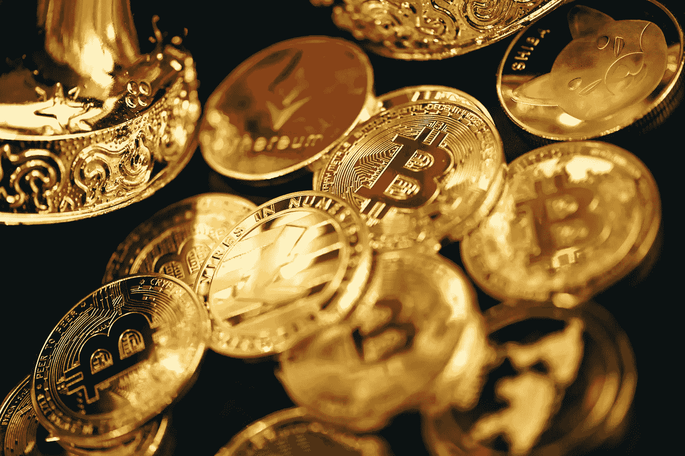

# 新投资者最容易使用的加密货币是什么？

> 原文：<https://medium.com/coinmonks/what-is-the-easiest-cryptocurrency-to-use-for-new-investor-1cfd9bd193ef?source=collection_archive---------33----------------------->

老实说，2022 年没有单一的、最好的加密货币可以使用。目前，大多数领先的加密货币都为新投资者和高级投资者带来了巨大的投资机会。如果你是那些希望进入下一个著名加密货币的人之一，那么请继续阅读。在这里，我将谈论 2022 年投资的加密货币。

你应该记住，有很多有吸引力的加密货币可供选择。虽然投资加密货币有风险，但有人会说只投资一种货币风险更大。

Photo by [quantitatives](https://unsplash.com/@quantitatives) on [unsplash.com](https://unsplash.com/@quantitatives)

事实是，大多数加密货币都有大量的使用案例，并希望给几个行业带来变化。他们的承诺是衡量风险和增加参与下一个最佳加密货币机会的绝佳方式。

**推荐密码**

# **比特币(BTC)**

比特币是第一种加密技术，至今仍是世界上使用最广泛的加密技术。它是领先的加密货币，旨在成为一种全球性的点对点数字货币。

现在，让我们转到比特币背后的团队。比特币仍然是匿名创始人的加密货币。据说中本聪创造了这种加密货币。虽然关于 Satoshi 的真实身份还有很多猜测，但是没有人知道他/她/他们是谁。然而，领先的密码学家，如 Adam Back，会定期更新比特币的开源代码库。

就流动性而言，比特币是最重要的加密货币。比特币的市值超过 1000 亿美元，占加密货币市场总估值的 60%以上。投资者买卖比特币没有问题，因为不乏感兴趣的人。对于那些不知道的人，当我们谈论流动性时，这描述了一种资产可以在市场上以反映其内在价值的价格快速出售或购买的程度。这里的重点是把它转换成现金的容易程度。

在价格波动方面，虽然比特币价格波动较大，但它是最稳定的加密货币之一。这意味着任何人都需要大量资金来操纵 BTC 价格。

就这种加密货币的经济性而言，比特币使用工作证明(PoW)系统。在这个系统中，矿工在开采和批准交易时会获得比特币奖励。每开采 210，000 个区块，采矿奖励减半，这一过程每四年发生一次。随着时间的推移，这有助于降低通货膨胀。BTC 的硬币总供应量为 2100 万枚，之后就不会再开采新的 BTC 了。在交易方面，随着需求激增，价格也会上涨。

总体而言，比特币仍然是当今投资的最佳加密货币。我建议任何进入加密领域的人从投资比特币开始。

# **以太坊**

以太坊多年来一直是比特币的第二名。这是第一个推出智能合约的重大项目，被视为区块链网络。多亏了以太坊，开发者能够在区块链上创建移动和桌面分散应用(dApps)。区块链以太坊收藏了数以千计的代币，它催生了最初的硬币发行(ICO)过程。

就这枚数字硬币背后的团队而言，Vitalik Buterin 是以太坊的创始人。他是一个年轻但经验丰富的密码专家。除了 Joseph Lubin，Buterin 还在纽约创立了致力于 dApp 开发的工作室 ConsenSys。

就流动性而言，以太坊是市值排名第二或第三的加密货币，仅次于 BTC。任何时候买卖以太币都很容易。与其他领先的密码类似，以太坊的价格波动较小。这是忠诚的团队和社区的结果。它也有可能在未来几个月和几年保持稳定并走高。

以太坊的秘密经济学很有趣。以太坊拥有比比特币和莱特币更多的硬币，然而，这是因为以太币在推动 dApp 生态系统方面至关重要。也就是说，有数百万开发者和公司使用硬币来执行智能合同和推出 dApps。

以太坊是领先的智能合约平台，在 2022 年仍然是一种很好的加密货币。它给世界带来了许多创新，其应用在世界范围内被采用的潜力令人印象深刻。

# **莱特币**

被视为比特币的姐妹，莱特币是首批比特币替代品之一。它仍然是 2022 年购买的最佳加密货币之一。它是用比特币的源代码创建的，作为 BTC 的一个分支，处理时间更快，非常适合零售支付。与比特币类似，莱特币寻求成为一种全球性的点对点货币。

在这个加密货币背后的团队方面，莱特币是由经验丰富的计算机科学家和加密爱好者查理·李创建的。他的哥哥世尘小雪创建了 BTC China，这是最大的加密货币交易所之一。查理·李在加密界很受尊重，他人脉很广，在比特币基地担任工程总监。

就流动性而言，莱特币目前是市值排名第六的加密货币，具有很高的流动性。此外，就价格波动性而言，与市值较小的加密货币相比，莱特币的波动性较小。

与比特币类似，莱特币使用 PoW 系统。当这个密码被引入时，矿工最初获得 50 LTC 块奖励，但是采矿奖励定期减半。莱特币的总币量是 8400 万。请记住，比特币只有 2100 万枚硬币的供应量。

尽管有大量的加密货币可用，莱特币仍然是初学者在 2022 年投资的最佳加密项目之一。

> 加入 Coinmonks [电报频道](https://t.me/coincodecap)和 [Youtube 频道](https://www.youtube.com/c/coinmonks/videos)了解加密交易和投资

# 另外，阅读

*   [币安期货交易](https://coincodecap.com/binance-futures-trading)|[3 commas vs Mudrex vs eToro](https://coincodecap.com/mudrex-3commas-etoro)
*   [如何购买 Monero](https://coincodecap.com/buy-monero) | [IDEX 评论](https://coincodecap.com/idex-review) | [BitKan 交易机器人](https://coincodecap.com/bitkan-trading-bot)
*   [CoinDCX 评论](/coinmonks/coindcx-review-8444db3621a2) | [加密保证金交易交易所](https://coincodecap.com/crypto-margin-trading-exchanges)
*   [红狗赌场评论](https://coincodecap.com/red-dog-casino-review) | [Swyftx 评论](https://coincodecap.com/swyftx-review) | [CoinGate 评论](https://coincodecap.com/coingate-review)
*   [Bookmap 评论](https://coincodecap.com/bookmap-review-2021-best-trading-software) | [美国 5 大最佳加密交易所](https://coincodecap.com/crypto-exchange-usa)
*   [如何在 FTX 交易所交易期货](https://coincodecap.com/ftx-futures-trading) | [OKEx vs 币安](https://coincodecap.com/okex-vs-binance)
*   [CoinLoan 审核](https://coincodecap.com/coinloan-review) | [YouHodler 审核](/coinmonks/youhodler-4-easy-ways-to-make-money-98969b9689f2) | [BlockFi 审核](https://coincodecap.com/blockfi-review)