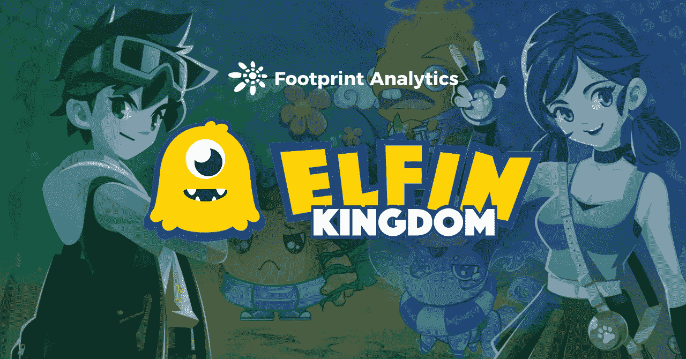
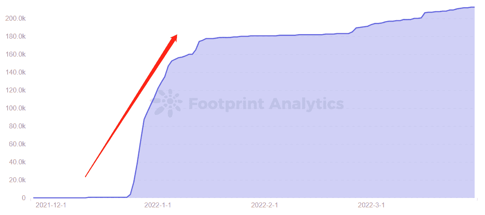
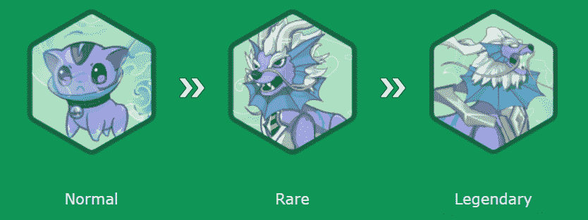
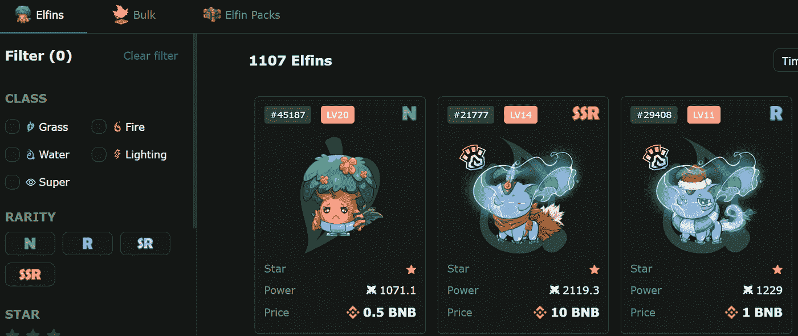
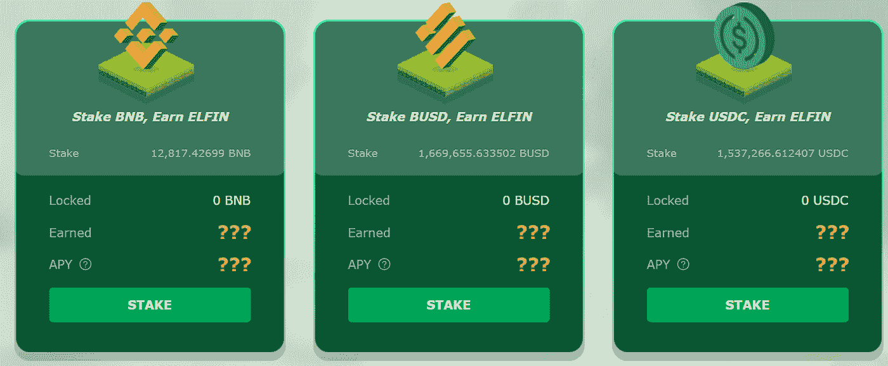
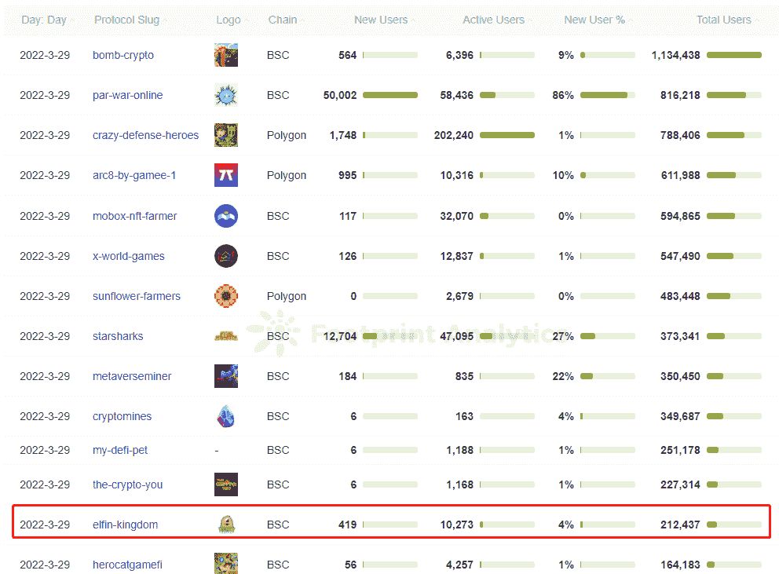
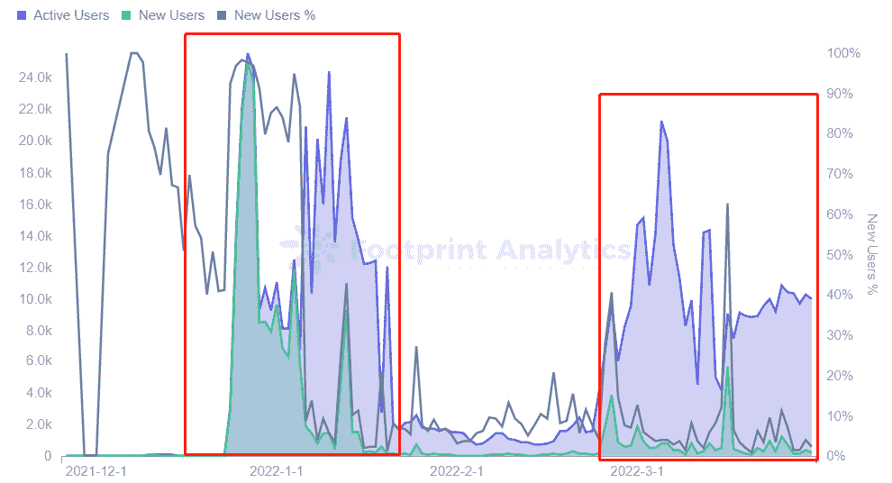

# 什么是精灵王国，仍然在测试中的蓬勃发展的游戏？

> 原文：<https://medium.com/coinmonks/what-is-the-elfin-kingdom-the-booming-game-still-in-beta-8a61f11e0bf2?source=collection_archive---------76----------------------->

小精灵王国有 7 种玩法，感觉是 Axie Infinity 的加长版。

2022 年 4 月

数据来源:足迹分析— [精灵王国仪表盘](https://www.footprint.network/guest/dashboard/address-analysis-of-game-fi-project-fp-77828d1e-35bc-4b6c-90e9-7777e7c6902d?gamefi_name=elfin-kingdom&channel=EN-231#secret=CF03EDD3014558910D2F51CB479E271B)

[小精灵王国](https://www.footprint.network/guest/dashboard/address-analysis-of-game-fi-project-fp-77828d1e-35bc-4b6c-90e9-7777e7c6902d?gamefi_name=elfin-kingdom&channel=EN-231#secret=CF03EDD3014558910D2F51CB479E271B)，由币安实验室投资的 [GameFi](https://cryptoslate.com/3-metrics-to-analyze-gamefi-projects/) 项目，是一款运行在 BSC 上的 MMORPG 游戏，玩家在游戏中收集、挖掘并与精灵生物战斗。

根据 Footprint Analytics 的数据，用户从 2021 年 12 月 23 日开始涌向 Elfin Kingdom，仅半个月时间，用户就从 594 人增长到 174，000 人。作为一个新的 GameFi 协议，它进入了截至 3 月 29 日的 13 强排名。

是什么原因导致了这款仍处于公测模式的游戏的爆发式崛起？

# 关于精灵王国

《精灵王国》于 2021 年 11 月推出，融合了分散式农场和 [NFT](https://www.footprint.network/guest/dashboard/nft-dashboard-fp-b374b358-6e2f-4587-a52b-a69ebbb91bfa?channel=EN-231#secret=DA601985B1CD8DCF912829C1188A05AA) s，将游戏化元素合成为一款游戏。

在 12 月 16 日由币安实验室和阿拉米达研究公司牵头的 525 万美元私人融资的支持下，Elfin Kingdom 推出了许多有趣的游戏选项，在此期间吸引了许多玩家。

*Footprint Analytics — Elfin Kingdom Total Gamers Over Time*

## 玩精灵王国的 7 种方法

精灵王国的小镇目前有 7 个游戏元素:庄园、餐饮、名人堂、竞技场、医院、精灵市场和银行。

*   领地

玩家可以在庄园中扮演不同的角色，成为农民或地主来赚取$ELFIN token 和食物。

农民可以从土地所有者那里租地种植，当作物成熟时，土地所有者将获得 20%的收益。此外，地主需要在 24 小时内维护自己的农田，否则依附于它的农民将分享地主收益的 5%。

*   吃饭

工厂的目的是提高小精灵的稀有度。玩家可以将小精灵封印成宝石，召唤更高级别的小精灵。

比如把一只普通小精灵变成宝石需要 0.1 $小精灵令牌，200 颗普通宝石可以随机兑换一只稀有小精灵。如果封印一只稀有小精灵需要 0.2 $小精灵令牌，那么 100 颗稀有宝石可以兑换一只随机的传奇小精灵。

*Screenshot Source — Elfin Kingdom Elfin*

*   美国名人纪念堂

名人堂是 PVE 战役的主战场。拥有三只或更多小精灵的玩家可以参与徽章收集。并且收集特定徽章可以参加季度排名锦标赛，赢得更多奖励。

*   竞技场

玩家可以在与竞技场中其他玩家的 PVP 战斗中升级他们的小精灵。与[星鲨](https://www.footprint.network/guest/dashboard/star-sharks-dashboard-fp-e59eeb60-26b0-4ca3-a2bc-89609fcc5204?channel=EN-231#secret=AA8261E1C83B0B4113B12F2A22673931)和 [Axie Infinity](https://www.footprint.network/guest/dashboard/axie-infinity-dashboard-fp-db8d941f-2a74-4120-abd4-ff20fc032a5e?channel=EN-231#secret=2B68DFA94685A34911FD11EE6F894910) 相同，有 3 只小精灵参战，其中你可以使用自己捕获的小精灵，也可以在 NFT 市场购买。

不过市面上购买的小精灵属性会比自由捕捉的高。事实上，这种模式不仅提供了免费试用，还鼓励玩家付费购买和游戏。

*   医院和精灵市场

医院是治疗战斗中受伤的小精灵的地方，需要 24 小时才能完全康复。如果想恢复的快一点，可以用药水。玩家可以通过小精灵市场购买药剂，那里也有小精灵、小精灵捕手和食物。

*Screenshot Source — Elfin Kingdom Marketplace*

*   银行

玩家可以在这里存钱，赚取利息来增加自己辛苦赚来的财富。

## 精灵王国的标记组学

Elfin Kingdom 采用双币模式，$ELFIN 作为治理令牌，$KING 作为游戏令牌。然而，代币$ELFIN 和$KING 的价格尚未公布。

*   $小精灵

$ELFIN 作为治理令牌，允许持有者通过王国的道参与社区治理，并通过联盟获得奖励。

玩家可以使用代币交易土地，交易精灵，加工工厂和木桩。

此外，用户还可以通过在 BNB、BUSD 和 BUDC 等地下注获得$ELFIN。由于代币价格尚未公布，所以在下注后会记录用户的钱包地址，待价格公布后再向用户发放代币。

*   $国王

无限量供应$KING 代币。它可以用来购买游戏中的物品，如小精灵捕手，技能卡，药水和其他食物。

一旦$KING 被花费，它就被烧掉，所以这种排放控制了代币的供应。

# Elfin Kingdom 在 Beta 测试中是如何吸引这么多用户的？

根据 Footprint Analytics 的数据，截至 3 月 29 日，Elfin Kingdom 共有 21 万用户。它在许多区块链 GameFi 项目中排名第 13，在 BSC 链中排名第 10。

*Footprint Analytics — Ranking of Daily Gamers*

小精灵王国的用户激增分为两个阶段，从日活用户数来看。

*   第一阶段，从 12 月 23 日到 1 月 18 日，在币安实验室和阿拉米达研究公司的私人资助下，出现了一波增长。币安的团队资金雄厚，其 BSC 链上的游戏项目在众多公链游戏项目中拥有最多的用户。这增强了用户的信心和期望。
*   第二阶段从 2 月 23 日到现在。用户可以在 beta 测试环境中免费玩，NFT 市场的底层价格较低，最低价格为 0.0294 BNB。用户进入游戏参与对战的门槛低。不过最近用户数量的趋势也在放缓，主要是因为免费捕捉的小精灵属性低于购买的小精灵，而市面上卖的低价小精灵基本都是免费捕捉的，没有太大价值。

*Footprint Analytics — Daily Active Users and New Users*

# 摘要

小精灵王国有多种玩法，有点类似 Axie Infinity。然而，该项目处于早期和高度不稳定的阶段，许多功能仍在开发中或尚未发布。

尽管如此，它通过币安实验室资金的支持和低门槛的优势吸引了许多用户。用户总数连续 3 个月保持在 BSC 链协议前 10 名项目。

这篇文章由[足迹分析](https://www.footprint.network/)社区提供。

Footprint 社区是一个世界各地的数据和加密爱好者相互帮助了解和获得关于 Web3、元宇宙、DeFi、GameFi 或区块链新兴世界任何其他领域的见解的地方。在这里，你会发现活跃的、不同的声音相互支持，推动着社区向前发展。