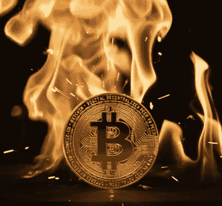

# 比特币的能耗是多少？

> 原文：<https://medium.com/coinmonks/what-is-the-energy-consumption-of-bitcoin-5b1a6941892c?source=collection_archive---------8----------------------->

## 围绕比特币的几个常见误解

Bitcoin Coin Flame

几年来，比特币的能耗一直是人们关注的话题。2017 年 12 月，比特币能源消耗指数(BECI)估计，比特币网络的年耗电量为 29.05 TWh。这相当于全球用电量的 0.14%。