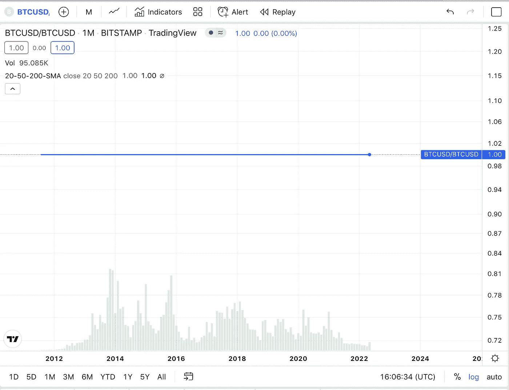
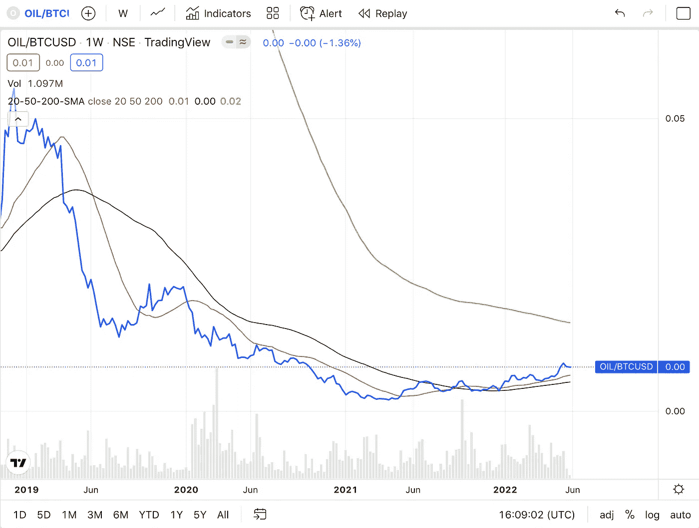
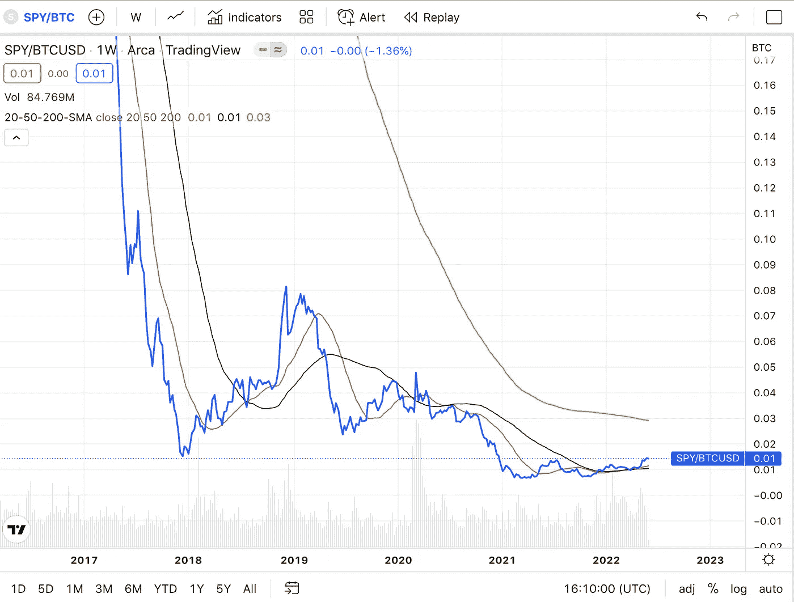
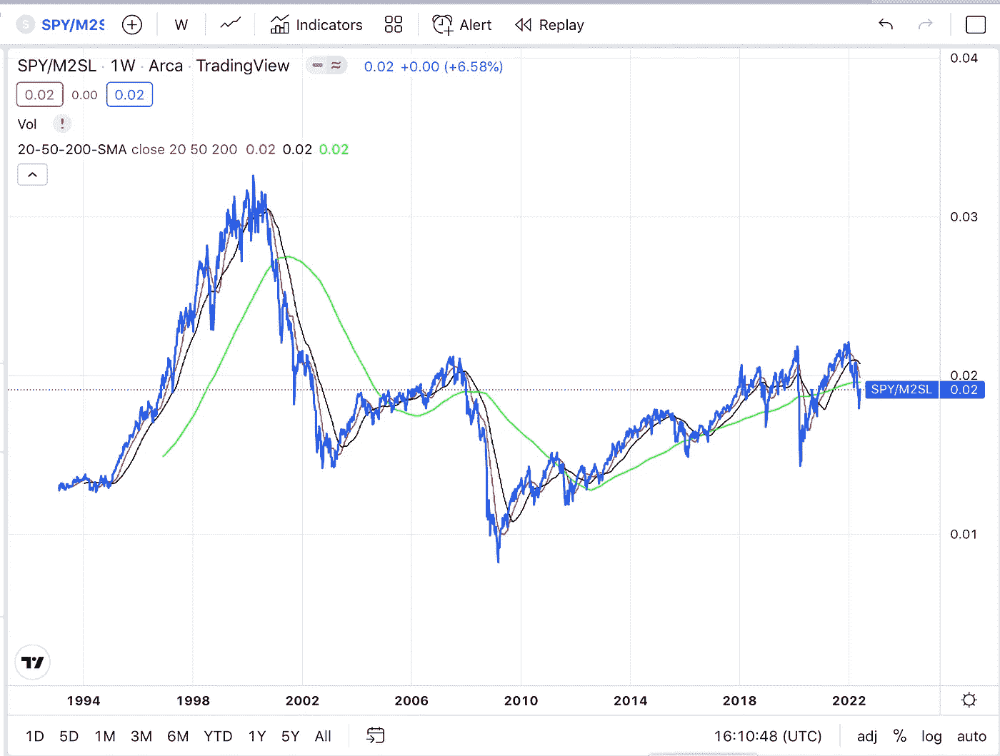
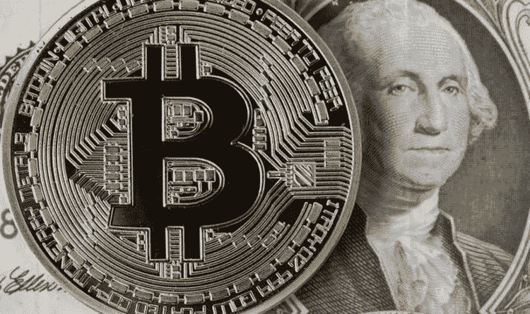

# 比特币的最终价格是多少？

> 原文：<https://medium.com/coinmonks/what-is-the-final-price-of-bitcoin-f9eb81e165c?source=collection_archive---------23----------------------->

当我们作为一个社会来固定我们的时间偏好时，我们对价格预测也这样做是很重要的。

价格是给予经济参与者的最重要的信号。货币是一种类似于尺子的工具，我们用固定的测量工具来测量不同事物的价值。价格的变化可以表明供给和需求的变化，并帮助经济行为者有效地做出对他们自己最有利并符合市场实际行动的决策。

我们需要钱来建立一个高效的经济和专业化的世界。通常情况下，两个市场参与者没有可以通过易货贸易形式满足的共同需求。如果我做鞋子，而我的邻居做裤子，我们只有在他想要我的鞋子的同时我也想要他的裤子时才能交易。有了货币，我们引入了一个交换媒介，它是价值的表现，而不是实际的有价值的商品本身。只要我们周围的社会认同我们对金钱的共识，我们就可以进行一场交易。现在我的邻居可以买我的鞋子，但我不需要用裤子来交换。取而代之的是，我得到了我鞋子的价值，我可以在将来用它从别人那里换取不同的商品或服务。

从这个角度来看，我们当前货币形式的问题就显而易见了。货币是“软的”,可以很容易地被创造或毁灭，它提供了一种很弱的衡量形式。如果我不知道我的尺子上有多少个单位，我怎么能在市场上准确有效地给东西定价呢？如果未来我的货币的供给和价值会发生重大变化，我如何储存我生产的商品或服务的价值？这种疲软的货币形式产生了大量低效的价格信号，并让那些最容易获得货币的人扭曲了经济信息。我可以获得货币，但这需要我付出很多劳动。我不能轻易操纵资产或商品的价格，因为我很难获得这样做的资金。然而，美联储可以不费吹灰之力就创造出无限量的金钱。然后他们可以把这些钱卖给政府，政府可以选择扭曲哪些价格信号来为自己谋利。

比特币是这种软货币体系的对立面。它有一个完美的固定供应，公平的分配系统，并允许有效的商品和服务的定价以及价值的存储。

将比特币主要针对当前的货币记账单位进行定价是很幽默的，尽管我可以理解这样做的原因。比特币仍未达到社会共识的水平，无法要求商品和服务以它为基准定价，因此，如果比特币要被用作交换媒介，它必须依赖于旧货币形式的定价。但是，鉴于我们注定要创造更多的美元来偿还我们的债务和运行我们的政府系统，过去出现的趋势可能会继续下去。让我们来看看从长远来看，事物将如何定价。

Bitcoin long run price

从长远来看，比特币将成为主要的价值储存手段、交易媒介和记账单位。社会偏爱最硬的货币，在我们漫长的历史中，从来没有一种更硬的货币形式。随着越来越多的定价信号不佳和资源配置不当的影响在平面经济中扩散，比特币将成为衡量实际经济价值的越来越好的工具。在某一点上，当以美元计价时，一个比特币永远不会有真正的意义。相反，石油、股票、黄金、住房和所有其他有价值的商品将使用它作为一个标尺来定价。一个比特币将简单地等于一个比特币，同样地，我们不会将一百万美元讨论为 40 个比特币或 2.2 栋房子或类似的愚蠢事情。

Oil long run price action

随着时间的推移，技术进步和人类效率带来的价格自然下降将再次显现。商品价格的上涨将是稀缺或需求增加的真实经济信号，并将能够再次被市场参与者以有效的方式解读。随着时间的推移，石油相对于比特币呈下跌趋势，只有在真正需求增加或真正稀缺的情况下，价格才会上涨，这将发出信号，要么改变行为，要么生产更多，从而创造一个更美好的未来世界。

SPY versus Bitcoin

目前，当用比特币定价时，股票市场已经变得便宜得多。他们将继续这样做，直到他们被有效地定价。一旦它们变得有效定价，我会认为它们会采取与现在反对 M2 货币供应类似的行动。当对股票的需求增加，人们希望拥有公司的部分股权时，股票价格就会上涨。这将是强劲经济和美好时光的信号。当困难来了，经济失败了，他们的价格就会下降，就会发出节约和保守的信号。作为全球财富的一部分，对股票的投资将会大大减少，因为只有当人们对一家公司的目标感兴趣，或者认为它能为社会提供积极的实际价值时，他们才会拥有这家公司，这一门槛比我们现在高得多。

SPY versus M2 over the past 3 decades

价格是我们作为一个社会不可或缺的工具。我们必须修正我们的价格信号，创造货币，随着时间的推移，货币是一种有效的价值储存手段，并实践低时间偏好行为，为明天创造一个更美好的世界。比特币对美元的价格将继续波动上行，并伴随着巨大的贬值。但比特币的最终价格将不是根据美元来衡量，而是根据你想用它买什么来衡量。

