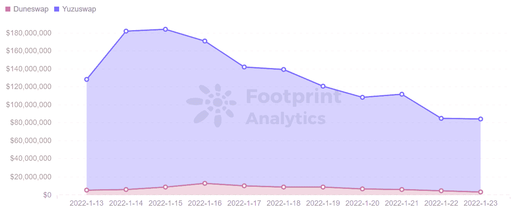

# 隐私区块链绿洲的未来如何？|足迹分析

> 原文：<https://medium.com/coinmonks/what-is-the-future-of-privacy-blockchain-oasis-footprint-analytics-d6d89fa58fa4?source=collection_archive---------21----------------------->

Oasis 的第一只 DEX 在推出一天内就获得了超过 1 亿美元的 TVL。

2022 年 1 月杨永晴@footprint.network

数据来源:足迹分析— [绿洲仪表盘](https://www.footprint.network/guest/dashboard/oasis-dashboard-fp-5f2f6f3c-262d-4920-8db9-0b5c9e5f1143?channel=u-QytebM#secret=E2010AE8A3E79B5215B56443CDF99CC9)

[Oasis](https://www.footprint.network/guest/dashboard/oasis-dashboard-fp-5f2f6f3c-262d-4920-8db9-0b5c9e5f1143?channel=u-QytebM) ，一个**T5 旨在保护用户隐私信息的协议，在过去的一个月里经历了价格波动，仅四天就上涨和下跌了 183%。**

该项目于 2020 年 11 月启动，旨在成为第一个兼具隐私保护和可扩展性的分散式网络，已经与币安合作，建立了一个 1 亿美元的 TVL DEX。

尽管前景看起来很有希望，但这些项目的所有波动性是什么，罗斯，绿洲将何去何从？

# 绿洲得到了多只基金的支持

通过将智能合同划分为一个客户消费层和一个并行层，Oasis 允许许多计算环境并行存在，Oasis 网络上的并行环境可以使用安全飞地等保密计算技术来保护数据的机密性。Oasis 还具有很高的可伸缩性和吞吐量，这使它成为 DApps 的一个不错的生态系统。

ROSE 价格的首次上涨(至 0.40 美元)是由 Oasis 与其合作伙伴在 11 月 17 日推出的 1.6 亿美元生态系统基金引起的。该基金旨在帮助创始人和现有项目建立在绿洲和 DeFi，NFT，元宇宙和隐私应用程序。

由于 Oasis 从币安实验室获得了 4000 万美元的支持，并且在 mainnet 上推出了第一个 DEX，YuzuSwap，ROSE 的价格再次超过了 0.60 美元。

*Footprint Analytics — ROSE Token Price*

由于[盗窃或加密货币攻击](https://www.footprint.network/guest/dashboard/rekt-overview-in-2021-fp-cee422cb-327c-4b72-8046-de6d24410ed7?channel=u-QytebM#secret=967BD0CF46AEBDF5C7E30DFB3270322C)的高发生率，交易所需要一个平台来识别和禁止不良行为者。[币安](https://www.footprint.network/guest/dashboard/binance-dashboard-fp-01e51da5-394d-4f63-a89b-f16375a8d62f?date=2021-04-30~&channel=u-QytebM#secret=01FF9E4187CD3DB9153D895465B59084)与 Oasis 合作开发了 CryptoSafe，允许交换共享威胁情报数据，即使在交换数据时也要保密。

# 绿洲的第一个 DEX 上线，TVL 一天内突破 1 亿美元

根据足迹分析，绿洲的 TVL 主要来自 YuzuSwap，占 93%。

YuzuSwap 上线后的第二天，在 TVL 的票房就突破了 1 亿美元，这让 ROSE 一飞冲天。

*Footprint Analytics — Oasis Market Share of Protocol TVL*

YuzuSwap 是使用绿洲的 Emerald 建造的，这是一个与 EVM 完全兼容的生态系统。Emerald 是一个第 1 层分散式区块链网络，具有独特的可扩展性和多功能性，具有以隐私为中心的核心。

YuzuSwap 使用点对点自动做市商模式，在以太坊和绿洲生态系统内为用户提供低成本交易(比以太坊低 99%以上的费用)。它还支持通过 Oasis 和其他区块链进行代币和 NFTs 资产交易。

*Screenshot Source — wormholebridge*

目前处于测试阶段，YuzuSwap 的价值快速增长可以归功于用户通过挖掘可以获得的高年回报，在四个激励令牌对上可以获得约 800%的高回报。

然而，YuzuSwap 的 TVL 增长并没有持续多久，自 1 月 17 日以来回落至 6753 万美元。

**绿洲推出首个 NFT 项目**

玫瑰价格的上涨也与绿洲'艾玫瑰 NFT 的推出有关。11 月 9 日，Oasis 发布了创建 Web 3.0 隐私身份的项目 MetaMirror，该项目通过与 Oasis Parcel ParaTime 集成实现了安全的数据管理和隐私保护。

绿洲人工智能玫瑰 NFT 系列由 999 幅人工智能生成的玫瑰图像组成，为了进一步参与社区并展示网络的 NFT 功能，NFT 正式免费向用户提供。

*Screenshot Source — metamirror (AI ROSE NFT)*

艾玫瑰 NFT 的总数量只有 999 件，低的 7700 美元，高的 99999999 美元。根据官方统计，目前的数额已达 185.2 万美元。

# 摘要

在短期内推动绿洲的动力受到三个主要因素的影响。

*   绿洲的生态系统基金已经从多个来源获得了支持，在过去的六个月里总额高达 2 亿美元
*   YuzuSwap 是 Oasis mainnet 上的第一个分散式交易所，成功推出
*   绿洲推出了它的第一个 NFT 系列

与此同时，由于其隐私保护、高性能技术和比以太坊低 99%以上的燃气费，绿洲发展迅速。

有这么多的积极因素，是什么导致了 ROSE 价格的波动呢？

*   Oasis 已经上线一年多了，但仍未能扩大开发规模。与 Terra 和 Solana 相比，它引入了许多 head 协议，目前是全网 10 大区块链之一。
*   YuzuSwap 仍处于测试阶段，其功能尚不稳定。它的发展对绿洲的成长至关重要。

Oasis 已经上线一年多了，但是生态系统的增长并不是很快，最近 YuzuSwap TVL 和 Oasis Token ROSE 的增长才引起关注。

因此，为了让更多的项目和用户获得信任，Oasis 需要引入一些头部协议来丰富生态系统，而占比最大的 YuzuSwap 也要真正稳定下来，Oasis 才能最大限度地发挥其创新技术特性。

## **什么是足迹分析**

足迹分析是一个一体化的分析平台，用于可视化区块链数据和发现见解。它清理和整合链上数据，因此任何经验水平的用户都可以快速开始研究令牌，项目和协议。凭借一千多个仪表板模板和一个拖放界面，任何人都可以在几分钟内构建自己的定制图表。发掘区块链数据，利用足迹进行更明智的投资。

*足迹网址:*[*https://www . Footprint . network*](https://www.footprint.network/)

*不和:*[*https://discord.gg/3HYaR6USM7*](https://discord.gg/3HYaR6USM7)

*推特:*[*https://twitter.com/Footprint_DeFi*](https://twitter.com/Footprint_DeFi)

*电报:*[*https://t.me/joinchat/4-ocuURAr2thODFh*](https://t.me/joinchat/4-ocuURAr2thODFh)

*Youtube:*[*https://www.youtube.com/channel/UCKwZbKyuhWveetGhZcNtSTg*](https://www.youtube.com/channel/UCKwZbKyuhWveetGhZcNtSTg)

> 加入 Coinmonks [电报频道](https://t.me/coincodecap)和 [Youtube 频道](https://www.youtube.com/c/coinmonks/videos)了解加密交易和投资

## 也阅读

 [## 加密交易机器人——19 款最佳免费加密交易机器人

### 2022 年币安、比特币基地、库币和其他密码交易所的最佳密码交易机器人。四进制，位间隙…

medium.com](/coinmonks/crypto-trading-bot-c2ffce8acb2a)  [## 最佳 4 个加密交易信号电报通道

### 这是乏味的找到正确的加密交易信号提供商。因此，在本文中，我们将讨论最好的…

medium.com](/coinmonks/best-crypto-signals-telegram-5785cdbc4b2b)  [## Bitsgap 评论-交易机器人加密信号和套利 2022

### 这篇文章的重点是 Bitsgap 审查，这是一个最终的交易解决方案，并提供交易机器人，信号…

coincodecap.com](https://coincodecap.com/bitsgap-review)  [## 40 个最佳电报频道，用于加密、电影、表演和演讲| CoinCodeCap

### 免费下载所有电影。德国免费加密信号。下载讲座。CoinCodeCap 经典，网飞电影等。是……

coincodecap.com](https://coincodecap.com/best-telegram-channels)  [## Keevo 钱包点评:是最安全的硬件钱包吗？2022 | CoinCodeCap

### 在这篇 Keevo Wallet 评论中，我们将讨论他们如何改变我们看待硬件钱包的方式。基沃是…

coincodecap.com](https://coincodecap.com/keevo-wallet-review)  [## 2022 年 5 大最佳社交交易平台

### 5 个最佳社交交易平台阅读加密产品评论和比较，了解比特币交易和…

coincodecap.com](https://coincodecap.com/best-social-trading-platforms)  [## BlockFi 评论:2022 年的利弊和利率

### 今天，我们提出了一个全面的 BlockFi 评论，这是一个成立于 2017 年的加密贷款平台，拥有其…

coincodecap.com](https://coincodecap.com/blockfi-review)  [## 2022 年密码交易员的三大电报渠道

### 加密信号是来自专业交易者的交易想法，以特定的价格或价格买卖特定的加密货币

medium.com](/coinmonks/top-3-telegram-channels-for-crypto-traders-in-2021-8385f4411ff4)