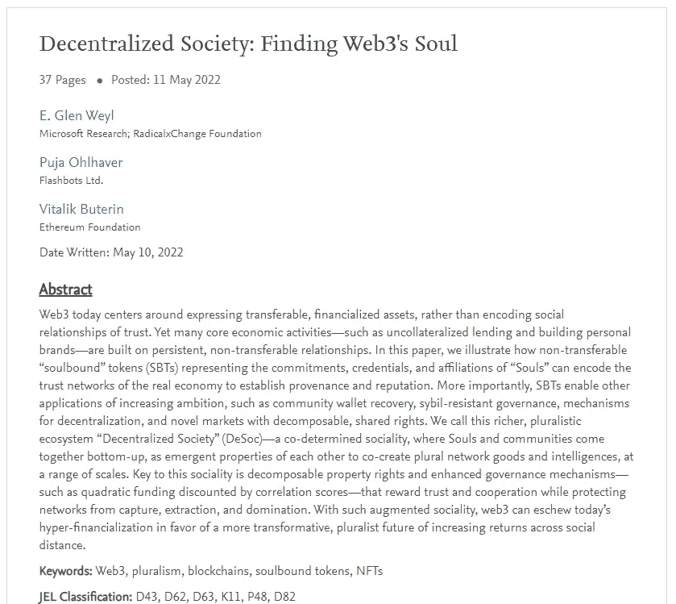
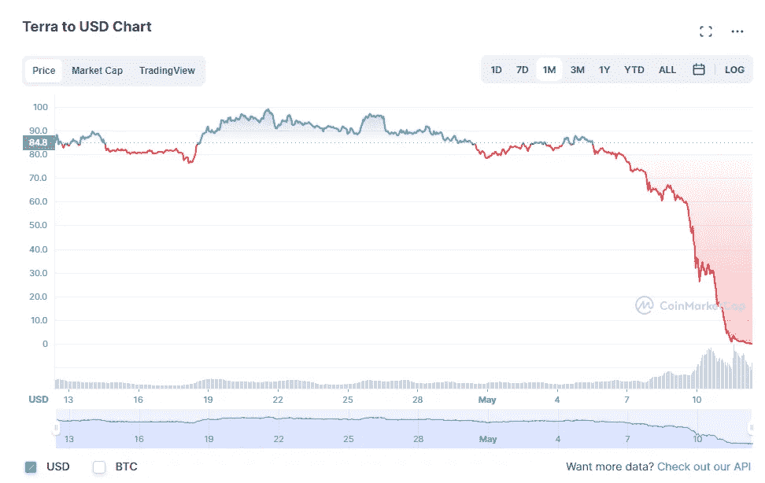
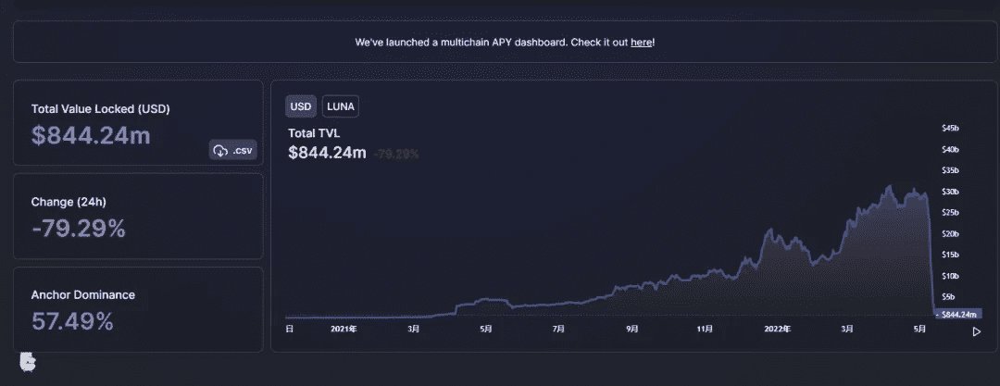
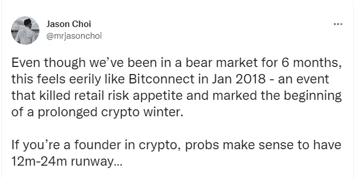

# LUNA 崩溃和 DeFi“出逃”后对 Web3 有什么影响？

> 原文：<https://medium.com/coinmonks/what-is-the-impact-on-web3-after-lunas-crash-and-defi-fled-b80334e00aba?source=collection_archive---------9----------------------->

经过连续暴跌，加密货币 LUNA 价格已经从 4 月 5 日的 119.5 美元跌至接近于零(且仍处于震荡下行过程中)，从 119.5 一路走低，“月亮女神”终于走下神坛。

在所有人都在关注 LUNA 崩溃的同时，昨天，Etherpad 的创始人 Vitalik 联合微软研究院首席研究员 E. Glen Weyl 和 Flashbots 研究员 Puja Ohlhaver 发布了一篇名为“*去中心化社会:寻找 Web3* 的灵魂”的论文。

该论文指出，今天的 Web3 围绕着可转让金融化资产的表达，但许多核心经济活动——如无担保贷款和建立个人品牌——都建立在持久、不可转让的关系上。因此，本文详细阐述了不可转让的“灵魂绑定”令牌(SBT)是如何编码实体经济中的信任网络的，这些令牌代表了“灵魂”的承诺、凭证和从属关系。同时，SBTs 支持诸如社区钱包恢复、抗女巫治理和具有可分解共享权利的新市场等应用。

在大家都在关注 LUNA 会不会再创新低的同时，或许我们可以思考一下，这次 LUNA 驱动的加密货币崩盘会对 Web3.0 产生什么样的影响？

# 1

**死亡螺旋中的露娜？**

Terra 是一个运行在 Proof of stablecoin(PoS)上的算法 stable coin 平台，Proof of stage(PoS)是区块链使用 Tendermint 构建的基础 stable coin 平台，而 LUNA 是 Terra 发行 stable coin(terras dr)、价格稳定和网络治理的平台令牌。用户可以使用 LUNA 令牌来换取 TerraSDRs stablecoins，反之亦然。这样就保证了稳定硬币的价格稳定性。

露娜是 Terra DPoS 区块链的采矿硬币，Terra 由露娜提供能量。因此，矿工提供了稳定和安全。在交易所，该协议通过交易费和铸币税在所有经济条件下提供稳定的采矿回报。

根据它的运行机制，当 UST 的市场需求增加，价格高于 1 美元时，用户可以向系统发送 1 美元的卢娜(卢娜被烧毁)来换取 1 UST (UST 被铸造)。相反，当 UST 需求减少，价格跌至 1 美元以下时，用户可以向系统发送 ust(正在燃烧的 ust)，以换取 1 美元 LUNA(正在铸造的 LUNA)，从而减少 ust 的市场供应，恢复 ust 与美元的锚定关系。

5 月 10 日，Terra 生态系统的原生算法 stablecoin，UST，因资本围捕和债务危机发生严重脱锚事件，LUNA 开始持续下跌。

5 月 13 日，Terra 生态系统的算法稳定币 TerraUSD (UST)跌至 0.01 美元。

在 5 月 11 日的一篇转述文章中，作者写道:“资深 DeFi 玩家应该知道，这种 UST 去锚定的影响可能不会仅限于 Terra 生态系统，就像雷曼兄弟破产一样，LUNA 生态系统的崩溃可能会波及整个加密市场。”

今天，答案出现了。

# 2

**露娜坠毁，德菲“逃离”**

DeFi 行业在过去两年中经历了价值的爆炸性增长，现在 DeFi 也经历了 LUNA 崩溃带来的危机。

根据 5 月 13 日的 DefiLlama 数据，Terra chain 上当前的 DeFi 锁定金额降至近 8 亿美元，在过去 24 小时内下降了 79.29%。相比之下，4 月 2 日，当 DefiLlama 数据显示 Terra 的链上有 336.6 亿美元的 DeFi 锁定。

DeFi 的愿景是将真实的金融系统映射到数字世界，通过智能合约技术实现普通用户之间的直接交易，实现传统金融机构的各种功能，如衍生品、借贷、交易、财富管理、资产管理等。

DeFi 对市场普遍感到担忧:当硬币价格快速下跌时，它有可能对系统产生负反馈死亡螺旋效应。

在一份证券报告中，研究人员指出，DeFi 内各种项目合同的组合性和趋同性带来了硬币之间复杂的嵌套和相关性，硬币价格的下跌肯定会带来比传统金融市场更快、更广泛的风险传递。

显而易见的是，主流抵押品、主流有限合伙人交易对于资产表现和项目令牌价格对于 DeFi 生态系统的健康至关重要；价格快速下跌的情况对 DeFi 生态系统造成了严峻的考验，看似死亡螺旋发生的概率不小；特别是鉴于最近主要代币资产价格的暴跌，DeFi 生态系统正面临着比传统金融市场更大的考验。

DeFi 热潮只是大规模 Web3 创新的开始，当 DeFi 受到影响时，它也会影响 Web3 的发展。

# 3

**LUNA 的崩溃会对 Web3 产生怎样的影响？**

2022 年，Web3 一跃成为科技界最热门的技术术语之一。

互联网在演进过程中，往往伴随着存储、网络、软件的全方位更新，从 Web1.0 到 Web2.0 时代，互联网技术更多地以点、线的状态迭代，而 Web3.0 时代则呈现出由 5G、VR、AR、区块链、云计算、芯片、边缘计算等多项技术全面融合的局面。

Web 3.0 不仅仅是过去技术的迭代，更是多种技术的融合。区块链技术将成为 Web 3.0 时代的核心技术:Web 3.0 技术架构分为基础层技术、平台层技术和交互层技术。与 Web 2.0 时代相比，Web 3.0 涉及的细分技术类别更多，范围更广，区块链技术因其去中心化的特点成为 Web 3.0 的核心底层基础技术。

不可否认的是，LUNA 崩溃和 DeFi“逃亡”也对 Web3 的发展产生了影响。

这件事肯定会在短期内影响 Web3 从业者的心态，斯巴达集团合伙人 Jason Choi 在推特上写道。

蜻蜓资本合伙人 Haseeb Qureshi 在推特上发布了 4 条关于损失惨重的教训。

# 4

**预防危险项目和安全审计的需要**

月球灾难结束了吗，也许还没有。当我们谈论区块链项目时，有更多的事情需要预防。

比如项目是否涉及庞氏骗局，项目合同代码是否安全，项目方是否要及时关注资金异常情况。Beosin EagleEye 使项目方和用户能够及时发现有风险的交易，以便他们能够迅速采取措施。比如立即暂停相关服务，或者通知用户取消授权等。，避免后续更大的损失。此外，项目安全审计仍然很重要。

当露娜继续堕落，开始颤抖，道在寻找拯救的方法，当未知，焦虑和恐惧交织在一起，科技的发展是我们追求的首要目标，而 Web3 的世界，我想，总有一天会变得崭新而强大。

# 更大的

[***1。VaaS —自动检测工具，让您的智能合约在 Web3.0***](/@Beosin_com/vaas-automatic-detection-tool-make-your-smart-contract-secure-in-web3-0-c3431f5c6ff) 中安全

[***2。在 Web 3.0 热潮下，如何保证 NFT 的安全？***](/@Beosin_com/how-to-ensure-the-security-of-nft-under-the-web-3-0-boom-beosin-vaas-has-provided-with-a-solution-50697ccd4f56)

[***3。DEUS Finance 遭遇今年第二次闪贷攻击:Beosin 详细分析***](/@Beosin_com/deus-finance-suffered-its-second-flashloan-attack-this-year-beosins-detailed-analysis-5032be0ec4f2)

[***4。Beosin 已完成加密乐高算法***](/@Beosin_com/beosin-has-completed-security-audit-service-of-crypto-lego-alg-no-critical-high-or-medium-risk-b656849e9334) 的安全审计服务

[***5。Beosin 在 PancakeSwap***](/@Beosin_com/beosin-has-completed-security-audit-service-of-masterchefv2-and-cake-pool-contracts-in-pancakeswap-4dafa0aa6068) 完成了 MasterChefV2 和蛋糕池合同的安全审计服务

[***6。「重述」AMA 关于如何在使用 Beosin VaaS***](/@Beosin_com/recap-ama-about-how-to-keep-your-smart-contract-secure-during-development-with-beosin-vaas-f7ecd2dc27a) 开发期间保护您的智能合约的安全

# 接触

如果您需要任何区块链安全服务，请联系我们:

[**网站**](https://beosin.com/) [**邮箱**](http://contact@beosin.com/) [**官方推特**](https://twitter.com/Beosin_com) [**预警**](https://twitter.com/BeosinAlert) [**电报**](https://t.me/beosin)**[**LinkedIn**](https://www.linkedin.com/company/beosin)**

> 加入 Coinmonks [电报频道](https://t.me/coincodecap)和 [Youtube 频道](https://www.youtube.com/c/coinmonks/videos)了解加密交易和投资

# 另外，阅读

*   [3 商业评论](/coinmonks/3commas-review-an-excellent-crypto-trading-bot-2020-1313a58bec92) | [Pionex 评论](https://coincodecap.com/pionex-review-exchange-with-crypto-trading-bot) | [Coinrule 评论](/coinmonks/coinrule-review-2021-a-beginner-friendly-crypto-trading-bot-daf0504848ba)
*   [莱杰 vs Ngrave](/coinmonks/ledger-vs-ngrave-zero-7e40f0c1d694) | [莱杰 nano s vs x](/coinmonks/ledger-nano-s-vs-x-battery-hardware-price-storage-59a6663fe3b0) | [币安评论](/coinmonks/binance-review-ee10d3bf3b6e)
*   [Bybit Exchange 评论](/coinmonks/bybit-exchange-review-dbd570019b71) | [Bityard 评论](https://coincodecap.com/bityard-reivew) | [Jet-Bot 评论](https://coincodecap.com/jet-bot-review)
*   [3 commas vs crypto hopper](/coinmonks/3commas-vs-pionex-vs-cryptohopper-best-crypto-bot-6a98d2baa203)|[赚取加密利息](/coinmonks/earn-crypto-interest-b10b810fdda3)
*   最好的比特币[硬件钱包](/coinmonks/hardware-wallets-dfa1211730c6) | [BitBox02 回顾](/coinmonks/bitbox02-review-your-swiss-bitcoin-hardware-wallet-c36c88fff29)