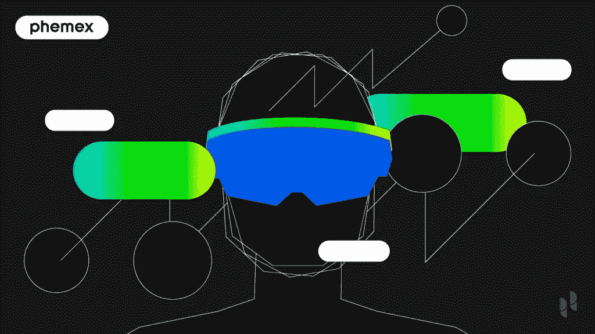
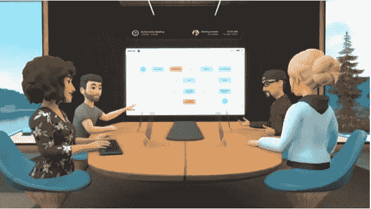
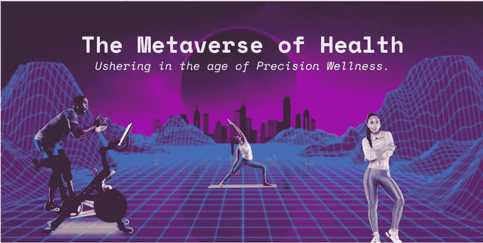

# 什么是元宇宙:一个虚拟的未来是拥抱还是恐惧？

> 原文：<https://medium.com/coinmonks/what-is-the-metaverse-a-virtual-future-to-embrace-or-fear-1a82f3936f66?source=collection_archive---------55----------------------->

世界正在以极快的速度发展，最近的新冠肺炎疫情加速了一些现有的趋势，这些趋势很可能会因为正在形成的不能再忽视气候危机的政治共识而得到巩固。虽然对这些现象的直接影响和反应是多种多样和多方面的，但旅行的可能方向似乎是增加身体上的社会隔离。随着人们花在面对面会议上的时间越来越少，每一代人都比上一代人更喜欢上网，团聚的新场所应该是网络空间，这是有道理的。元宇宙将超越国界、社会、商业、国家和文明。

# 什么是元宇宙？

元宇宙是尼尔·斯蒂芬森(Neal Stephenson)在 1992 年的小说《冰雪奇缘》(Snow Crash)中创造的一个术语，来自前缀“meta”，意思是“超越”，以及“宇宙”中的“韵文”因此，这个术语的概念是一个超越我们自己的世界；一个我们可以在这个之外访问的。在某些方面，它已经存在了:你可以通过虚拟现实(VR)探索另一个世界；用增强现实(AR)增强物理世界，比如在 PokemonGo 或者在视频游戏中移动你自己的角色，就像任天堂一样。然而，到目前为止，这都是相对简单和本地化的。或许除了作为虚拟角色与朋友和家人在线对战之外，这个数字世界还没有真正让人们彼此敞开心扉。

# 元宇宙是做什么的？

元宇宙将超越国界、社会、商业、国家和文明。它可以用于各种各样的事情，例如探索新世界、玩游戏、从医生或律师(他们将作为他们的化身出现在元宇宙)那里获得专业建议，或者作为你自己参加商务会议或会议。代替视频通话，你将作为你的化身走进一个数字房间，坐下来，听，贡献，或者向房间里的其他化身展示。

# 什么造就了元宇宙？

马修·鲍尔认为，造就元宇宙的一系列品质包括:

*   **连续的:**从未停止或结束，只是无限期地继续。
*   **开放:**任何人都可以访问并参与其中。
*   **经济:**要有货币，要有贸易。
*   二元性:超越数字和物理世界。
*   **互操作性:**资产——以金钱、**不可替代代币** (NFTs)或任何其他形式——可以在元宇宙的世界之间移动和使用，例如跨游戏，如堡垒之夜到脸书的元宇宙。
*   **贡献:**参与者和创建者可以创建、扩展和发展元宇宙。

# 一个普遍的元宇宙将如何构建？

随着元宇宙的发展，它将演变并采取不同的路线。很明显，从目前涉足该领域的公司来看，元宇宙将由许多世界组成:游戏世界、社交媒体世界、数字房地产世界等等。，但如果元宇宙存在，这些都必须以某种方式联系起来。就目前情况而言，有几个要素可能是一个普遍的元宇宙所必需的:

# 什么是元宇宙·区块链？

元宇宙对人们的工作、社交和个人生活有很大的影响力，它需要建立在分权的基础上。作为一个人们希望讨论个人问题或进行交易(例如，咨询律师和为律师付费)的地方，它需要有很高的安全性。最后，作为一个不断扩张的平台，它需要支持增长。所有这些导致了**区块链技术**，它以其安全性、分散性和扩展能力提供了完美的解决方案。像这样的东西可以在支持 **DApps** 的区块链上运行，比如以太坊，但为了提高速度，它具有更好的可扩展性，并且碳足迹更低——所有这些都有望在**以太坊 2.0 中成形。**

# 什么是元宇宙 NFT？

不可替代的代币使人们能够完全拥有数字资产。这对元宇宙的每个参与者来说都很关键，因为他们每个人都可以拥有自己的头像或角色。此外，他们可以开设并拥有自己的个性化房产:医生诊所和病人候诊室、招待朋友的房子、多功能厅、餐厅、酒店或赌场——可能性是无限的。这很容易创造出一个完整的经济，不仅仅是房地产，还包括贸易、娱乐和教育等等。虚拟人物可以参观美术馆，购买那里出售的 NFT 艺术品；度假者可以访问元宇宙的维加斯，消费或赢得元宇宙加密，或者个人可以访问并住在酒店。所有这些都是可能的，所有这些都可以产生收入。不仅如此，它还可以创造就业机会:元宇宙剧院需要虚拟演员，酒店需要搬运工，赌场需要服务员，等等。

# 什么是元宇宙加密？

许多元宇宙活动将需要一种货币，这意味着需要元宇宙密码。很可能元宇宙的每个世界都有自己的货币，要么可以在整个元宇宙使用，要么可以兑换元宇宙密码。这是因为元宇宙加密公司需要自己运营网站，按照标准的区块链费用、赌注和节点奖励。

# 你如何使用元宇宙？

如何使用元宇宙将取决于个人及其需求。但是一些例子已经开始出现:

*   **脸书·元宇宙和地平线工作室:**脸书公司正在进军元宇宙，引入虚拟办公空间，个人可以使用 Oculus Quest2 耳机和手持设备进入。这些工具有传感器，可以反映虚拟工作室中的实时运动。用户可以在他们的客厅四处走动，或者转身与同事击掌，所有这些都通过他们在虚拟工作室的化身反映出来。
*   **表演:**音乐家们已经在探索元宇宙的这一方面。在新冠肺炎期间，音乐会空无一人，Travis Scott 采取了一种新的方法，在在线游戏“堡垒之夜”中举办了一场音乐会在这里，他能够把自己变成一个巨人，一个电子人，一个深海潜水员，同时邀请他的粉丝和他一起在海里，围着他的巨脚游泳。可能性是无限的，如果搭配好的扬声器和耳机，这种接近和沉浸感甚至可以超过一场真正的音乐会。让我们不要忘记，作为一个元宇宙，你所有的朋友都可以在你身边欣赏表演。
*   **社交活动:**在元宇宙，朋友们可以一起出去玩，看电影，或者去餐馆、赌场或俱乐部。然而，正如 2020 年发生的那样，更大更重要的事件也开始在网上发生，比如婚礼。这也是 Covid 疫情的限制所推动的事情。然而，考虑到经济节约、易于组织以及对客人数量和地点没有实际限制，在元宇宙庆祝重要的生活事件可能会成为一件很正常的事情。
*   **军事、安全和安保:**这是元宇宙已经在探索的另一个方面，尤其是使用 VR 来构建训练场景的定制环境。然而，此外，元宇宙可能被用于远程安全会议，要么是因为该地区太危险，要么是因为个人不值得信任，不足以亲自会面。
*   **忠告:**对于那些病得太重或太虚弱而不能出门的人来说，元宇宙可以成为一个见医生的地方，可以不用亲自到场就能展示他们的病痛。也许有一天，医生可以虚拟地在元宇宙上进行常规检查的全身服会投入使用。类似的情况也适用于法律顾问或法庭案件，在这些案件中，证人、受害者或嫌疑人太脆弱或太危险而不能外出。

# 如何进入元宇宙？

目前，不同的类似元宇宙的环境可以单独在线访问或通过应用程序访问。然而，如果一个更加统一的元宇宙开始形成，这种情况可能会改变，一个应用程序可以充当多个不同世界的平台或门户。然而，如果埃隆·马斯克如愿以偿，或许可以通过植入人体大脑的 Neuralink 微芯片进行访问——在《黑镜》等作品中探索了这种技术的反乌托邦可能性，这可能会让用户难以接受这种类型的应用。

# 创造元宇宙有危险吗？

对于建立一个平行的数字世界有许多担忧。我们不用找很远就能找到非常受欢迎的探索这个主题的电影和电视剧。《黑客帝国》可能是最著名的电影之一，它让我们质疑我们是生活在现实中，还是生活在虚拟现实中而不自知。在《黑镜》系列中，类似的场景也被探索过——而且总是有负面的结果。当然，随着技术的进步，我们可能会迷失在其中，无法分辨什么是真的什么是假的。然而，这种完全沉浸式技术和互操作性的水平还有很长的路要走，这意味着个人还不能完全逃离到另一个世界。目前，元宇宙提供了一个令人兴奋的机会去探索，实验，并希望以以前未发现的方式帮助社会。

这种真实与虚幻之间界限的模糊也引发了对操纵的担忧。有了这样一个强大且可能改变思维的工具，如果那些既得利益者——无论是金融还是政治利益者——控制了元宇宙，进而控制了我们的生活，会发生什么？这也许是反对元宇宙私有制的一个理由。如何解决这个问题仍然是一个谜，特别是当你考虑到这项技术的早期采用者和驱动者大多是脸书这样的大公司时，这些公司已经受到公众信任度低的困扰，并面临着隐私问题的争议。然而，从积极的一面来看，区块链技术公司的分散化可能提供了防止强大的既得利益者积聚过于集中的权力的手段。

# 结论

元宇宙提供了一个激动人心的机会，让人们在虚拟世界中更紧密地联系在一起。它可以成为一个门户，为那些处于更弱势状态的人提供援助和机会，或为那些由于居住地点或残疾而无法亲自前往工作场所的人提供工作。此外，它给人们更多的自由去他们想去的任何地方，创造他们想看或想做的任何事情。

这项技术仍在发展，未来将走向何方仍是一个谜，但变革的车轮正在转动，看到它的未来令人兴奋。另一方面，为了防止“黑镜”般的反乌托邦场景，元宇宙必须保持安全和分散——从而开启区块链科技、crypto 和元宇宙之间的完美合作关系。

还知道:[加密量子飞跃](https://www.digistore24.com/redir/325658/mctria/)

> 加入 Coinmonks [电报频道](https://t.me/coincodecap)和 [Youtube 频道](https://www.youtube.com/c/coinmonks/videos)了解加密交易和投资

# 另外，阅读

*   [最佳以太坊钱包](https://coincodecap.com/best-ethereum-wallets) | [电报上的加密货币机器人](https://coincodecap.com/telegram-crypto-bots)
*   [交易杠杆代币的最佳交易所](https://coincodecap.com/leveraged-token-exchanges) | [购买 Floki](https://coincodecap.com/buy-floki-inu-token)
*   [3 commas vs . Pionex vs . crypto hopper](https://coincodecap.com/3commas-vs-pionex-vs-cryptohopper)|[Bingbon Review](https://coincodecap.com/bingbon-review)
*   [加密复制交易平台](/coinmonks/top-10-crypto-copy-trading-platforms-for-beginners-d0c37c7d698c) | [如何在 WazirX](/coinmonks/buy-bitcoin-on-wazirx-2d12b7989af1) 上购买比特币
*   [硬币评论](https://coincodecap.com/coinloan-review)|[Crypto.com 评论](/coinmonks/crypto-com-review-f143dca1f74c)