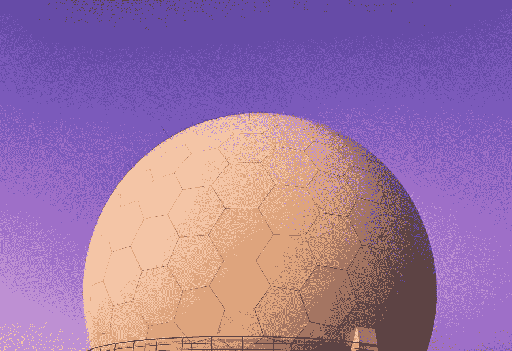

# 什么是元宇宙和 web 3.0——区块链和元宇宙有什么关系？

> 原文：<https://medium.com/coinmonks/what-is-the-metaverse-and-web3-0-how-does-blockchain-and-metaverse-relate-56b621d8d687?source=collection_archive---------11----------------------->

Photo by [Daniele Franchi](https://unsplash.com/@daniele_franchi?utm_source=medium&utm_medium=referral) on [Unsplash](https://unsplash.com?utm_source=medium&utm_medium=referral)

好吧。让我们跳进元宇宙。

*Tokens.com 元宇宙是一个万亿美元的市场机会*

元宇宙是互联网和区块链上的虚拟世界。你可能听说过虚拟现实(VR)，增强现实(AR)，或混合现实(MR)，人工智能和机器学习(AI)，现在元宇宙是所有这些的结合体，甚至更多。

## 什么是元宇宙？

元宇宙是一个身临其境的虚拟世界，对任何事情都有用。你可以在那里工作或玩耍。你可以在那里制作和玩游戏，去听音乐会或参加活动，还可以和朋友一起放松(就像和史努比·多格在他的沙盒 Meta mansion 里放松一样)。所有这一切都可以通过一个虚拟的卡通形象来体验，这个虚拟形象结合了通过区块链技术实现的(新互联网)Web3 技术(像 [NFTs](https://www.mugabiimran.com/post/nonfungible-tokens-blockchain-and-crypto-art) 和加密货币)。

因此，例如在上一篇 [NFTs](https://www.mugabiimran.com/post/nonfungible-tokens-blockchain-and-crypto-art) 的帖子中，我们了解到它们赋予人们拥有数字资产的权力，元宇宙允许你在实际游戏中使用你的 NFTs，或者出租它们来从中(被动收入)赚钱，除了交易它们之外。正如在上一篇文章中提到的，NFT 可以是卡通形象，或者是区块链游戏中使用的数字资产，如 Axie Infinity、[沙盒游戏](https://bit.ly/LinkedInLearningTrial)或分散土地。

你可能听说过地平线世界和 [Meta 的虚拟现实头盔](https://www.reuters.com/technology/meta-start-testing-money-making-tools-its-metaverse-2022-04-11/)，它可以将你的世界变成元宇宙，甚至允许你为地平线世界元宇宙创造资产。其他虚拟世界或元游戏包括分散之地、[沙盒游戏](https://bit.ly/EnterSandboxMetaverse)、Axie Inifinity 等等。

几乎每一个你可能知道的大公司，比如亚马逊、谷歌、英伟达、微软、苹果等等，要么已经建立了他们自己的元宇宙，要么已经购买了类似[分散土地](http://decentraland.org)和[沙盒](https://bit.ly/EnterSandboxMetaverse)的虚拟土地。

Sandbox Game Explained!

## **元宇宙简介**

在我们进入元宇宙之前，我们很容易认为元宇宙这个词是新的，其实它不是。

科幻作家尼尔·斯蒂芬森早在 1992 年就在他的[科幻小说](https://en.wikipedia.org/wiki/Science_fiction)小说*雪灾*中提到了“元宇宙”一词，人类作为可编程的化身，在三维虚拟空间中相互交流。

## web3 的网络革命史

**Web1.0** —这是一个不允许与内容互动的(只读)网络版本。只有几页可以阅读。你不能写评论或上传照片。就像现在你可以创建像 Twitter 这样的社交帖子一样。这是 90 年代最可靠的网络。尽管大多数公司并没有真正理解[拥有网站](https://www.mugabiimran.com/post/ascend-by-wix-business-tools)的好处。

网络只是由基本的 HTML 组成。HTML 是一种编程和脚本语言，在 PHP 等其他语言中，web 是建立在这种语言之上的。我们必须提到，当时的互联网有点慢，更不用说我们的设备还没有那么强大。

**Web2.0 —** 之后，Web2.0 的功能更加强大，允许人们进行基本的读写操作。人们实际上可以评论文章，亚马逊网站开始了客户评级，脸书和推特允许人们上传和分享照片。Web2.0 实际上允许我们所说的用户生成内容。

因此，随着 [web 2.0](https://www.oreilly.com/pub/a/web2/archive/what-is-web-20.html) ，其他更强大的 web 开发脚本语言诞生了，例如 HTML5、CSS3、JavaScript 等等。像脸书、亚马逊、维基百科和谷歌这样的网站变得更有活力、更有价值。人们开始注意到互联网的使用，并开始认识到网站的其他潜在用途。但这也导致了一个问题，互联网所有权的集中。大部分网络被一些大公司所拥有，小企业在网络上看不到。

*顺便说一句，你可以不去，但是如果你想学编程，你可以去 YouTube、*[*LinkedIn Learning*](https://bit.ly/LinkedInLearningTrial)*、Udemy、*[*uda city*](https://bit.ly/UdacityAccount)*、Discover by*[*Teachable*](https://bit.ly/TeachableFreeLogin)*、Codecademy 等在线学习平台。*

Photo by [Christine Sandu](https://unsplash.com/@lenscapewithme?utm_source=medium&utm_medium=referral) on [Unsplash](https://unsplash.com?utm_source=medium&utm_medium=referral)

Web 3.0——到目前为止，我们一直在谈论大公司在互联网上成名。Web 3.0 以不同的风格和模式出现。它实际上允许你拥有互联网的一部分。只要你能上网和带加密钱包，你住在哪里都没关系。这是因为 Web 3.0 允许去中心化。cryptos 运行在区块链上，区块链是一个由世界各地不同的强大计算机运行的去中心化网络。

***提示:*** *加密钱包可以自由创建。他们帮助你存储、购买和出售你可以在区块链电子游戏、现实世界和虚拟世界中使用的数字资产(像* [*沙盒*](https://bit.ly/EnterSandboxMetaverse) *或分散化)。像*[*【meta mask】*](https://metamask.io/)*钱包、信托钱包、* [*【币安链】*](https://bit.ly/BinanceFreeWallet) *等等都是为元宇宙打造的。*

有了 Web 3.0，你只需要一个加密钱包就可以访问区块链和虚拟互联网空间的各种服务。此外，你不必获得第三方的许可，就可以在元宇宙的虚拟土地上汇款或开设赌场。

**什么是代币？更妙的是，还有一种叫做代币的东西，类似于公司的股份或股票。代币也可以指数字资产，如比特币(BTC)、以太坊(ETH)、Axie Infinity (AXS)、沙盒(SAND)，甚至 NFT 也是代币类型。现在在分散的组织(DAO)中，比如分散的土地，本地货币是(MANA)代币，你可以根据你持有多少代币在董事会上做出决定。**

Web 3.0 还使每个人都可以访问虚拟世界，甚至不必佩戴像 Hive 或 Oculus Quest 这样的虚拟谷歌眼镜。现在有了更快更方便的互联网，你可以在你的电脑或手机上访问元宇宙。同样，区块链、NFTs 和 cryptos 使这成为可能。

Learn more about NFTs and Blockchain

# 如何在元宇宙赚钱？元宇宙的财经区块链应用

元宇宙跨越了经济的所有领域，从金融、时尚、科技产业到游戏和娱乐世界。Beeple 从 NFTs 一夜暴富，Snoop Dogg 现在拥有自己的 NFT 音乐唱片公司，旁边还有一个在 [Opensea](https://opensea.io/) 的沙盒元宇宙的虚拟土地。

*   首先，你可以投资区块链元宇宙的项目，其中最大和最成功的是 Axie Infinity、[沙盒游戏](https://bit.ly/EnterSandboxMetaverse)，以及其他一些已经打开了一个全新的世界的分散式项目，为初创企业和大公司提供全新的、创新的和多样化的营销机会，如 [Epic](https://www.theverge.com/2022/4/11/23020134/epic-2-billion-funding-metaverse-sony-lego) 和 [Theta.tv](https://www.theta.tv/invite/jwuv1)
*   你可能会说，穆加比，我没钱投资。当然，没问题，在元宇宙还有其他赚钱的方式，你可以为[元宇宙](https://www.wired.com/story/what-is-the-metaverse/)创作，在 OpenSea、币安、Foundation、Rarible、Niftygateway、分散地和沙盒等 NFT 市场出售你的商品或数字资产。
*   你可能听说过微软和脸书正在建立 metaverses，在这里团队可以使用他们自己的 3D 虚拟角色进行合作和举行虚拟现实会议。
*   虚拟旅游是另一个巨大的用例，其中 AR 和 VR 技术被用来创建史诗般的虚拟体验。像这样的事情已经在 Pokeman Go 游戏和类似的游戏中出现了。
*   随着 3D 化身的使用，[高校](https://hbr.org/2022/04/how-the-metaverse-could-change-work)已经开始使用虚拟世界，如《我的世界》和[第二人生](https://newsletters.theatlantic.com/galaxy-brain/6233ecafdc551a002089fb15/lessons-from-19-years-in-the-metaverse/)召开会议。如果你看过(马克·扎克伯格)[梅塔的元宇宙演示](https://youtu.be/Uvufun6xer8)，你就已经知道我们在这里谈论什么了。

# **元宇宙涉及的技术**

我不得不诚实地告诉你，我没有带着 VR 和 AR 技术进入元宇宙，这让我觉得我不是唯一的一个。这就是为什么我认为我们应该谈论一下虚拟现实，增强现实和人工智能技术。

## 什么是虚拟现实？

**VR(虚拟现实)**是利用计算机技术创造一个模拟的环境。如果你想伪造一场高尔夫比赛，VR 就是你的朋友。这是一种让你沉浸在数字世界中的技术。在 COVID19 爆发后，公司和国家继续利用 VR(虚拟现实)并采用协议来保持社交距离。

虚拟现实是近年来最大的技术发展之一。因此，虚拟现实(VR)会议确实已经成为当今时代的一种需要。

## 什么是增强现实？

**AR(增强现实)**既涉及虚拟现实，也涉及物理现实。这项技术结合了物理世界和数字世界，模拟了一个极其沉浸式的环境。

到 2023 年，增强现实是一项革命性的技术预计价值 614 亿美元！预计 AR 市场将从 2017 年的 35 亿美元 增长到超过 1980 亿美元 ***。这是因为 AR 的边界不仅限于游戏，而是延伸到零售、旅游、时尚、营销和娱乐等行业。***

## 什么是混合现实

混合现实(MR)是真实世界和虚拟世界的融合，以产生新的环境和可视化，其中物理和数字对象共存并实时交互。

## AR 和 VR 的区别

增强现实是混合现实的一个子类，其中物理和虚拟世界相遇，而虚拟现实只是创建一个可想象的世界，并通过 VR 护目镜使其感觉真实。一些最好的 VR 眼镜包括[索尼 PlayStation VR](https://amzn.to/3uGUo39) 、 [Oculus Quest](https://amzn.to/3Efel4e) 、[惠普混响](https://amzn.to/37NFpLV)和[阀门指数](https://amzn.to/3Of7f4i)。

Photo by [Andy Kelly](https://unsplash.com/@askkell?utm_source=medium&utm_medium=referral) on [Unsplash](https://unsplash.com?utm_source=medium&utm_medium=referral)

## 什么是人工智能？

AI(人工智能)是一种允许计算机/机器像人类或动物一样思考和行动的技术。像 Cortana，Siri，Sophia 这样的机器人模仿人类的行为。事实上，大多数机器都被编程为比人类更加见多识广，就像特斯拉汽车和其他电动汽车一样，只需轻点按钮，它们就可以停车或打开包装。

像谷歌分析和脸书洞察这样的工具使用人工智能来收集数据。

人工智能让亚马逊、谷歌和脸书等企业和大公司更容易、更快地根据认知技术的输出做出非常明智的商业决策。(机器数据)

通过部署[人工智能技术](https://www.mygreatlearning.com/blog/what-is-artificial-intelligence/)，企业可以专注于更紧迫的问题，也可以通过使用洞察力预测客户偏好并为他们提供更好的个性化体验来了解更多的销售机会。从长远来看，通过自动化和优化日常流程和任务，这极大地节省了时间和资金。

# 我为什么要关心元宇宙？元宇宙用例。我们在元宇宙能做什么？

## 经济和金融

正如提卡·提瓦里所说，有了密码，不可能的事情变成了可能。你能想象这样一个世界吗？在这个世界上，只要有一部智能手机和互联网，任何人都可以获得储蓄、贷款、交易、保险等金融服务。现在你可以用移动货币购买密码而不用 Hussle。

在区块链技术的帮助下，DeFI(分散融资)使这成为可能。

**什么是 DeFi(分散金融)——**这是一种不依赖于中央金融机构的金融系统，相反，它们依赖于投资者，这些投资者将他们的资金存放在他们那里来运行金融系统。例如，如果我想贷款，我需要做的就是在 DeFi 项目中存一些钱，他们会很乐意给你 3-10 倍的资金。他们利用区块链账本技术，就像比特币、以太坊和索拉纳等加密货币中使用的技术一样。

什么是赌注？— 在这里，大量加密资产和 NFT 相关代币被用作抵押品，以赚取更多代币和奖励来处理区块链交易。(也称为股权证明)。

*专家提示:ETH 2.0 运行于利害关系的证明之上。也就是说，如果你想开采 ETH，你只需要持有大量的 ETH 作为赌注。*

沙盒和分散的土地作为一些顶级的 NFT 区块链-元宇宙游戏，已经在他们的元宇宙注册了 DeFi(分散金融)银行。

> 交易新手？试试[密码交易机器人](/coinmonks/crypto-trading-bot-c2ffce8acb2a)或[复制交易](/coinmonks/top-10-crypto-copy-trading-platforms-for-beginners-d0c37c7d698c)

## 商业营销和广告

泰·洛佩兹(Tai Lopez)和他的合伙人亚历克斯·梅尔博士(Alex Mehr PhD)甚至为他的社交媒体营销机构(SMMA)课程创造了一个令牌，并为他拥有的大多数公司创造了硬币，如知识社会令牌(Knowledge Society token)、Radio Shack (RADIO)。和整个 REV(零售电子商务企业)。

因快速采用数字平台而闻名的 VaynerMedia 的联合创始人兼首席执行官 Gary Vaynerchuck 表示，随着消费者更多地转向数字世界，我们将看到更多的品牌 NFT。早在 20 世纪初，他就是最早采用电子商务的人之一。回到人们不相信网上购物的时候。现在人们实际上更喜欢网上购物，而不是排队。加里也是最早推出自己的 NFT 系列的人之一。

*注:你可以在 Opensea 上找到*[*Gary Vee NFTs*](https://veefriends.com/)*以及他在官网、博客和社交媒体渠道上的 NFT 推荐。*

就像可口可乐[这样的大公司在 2021 年推出了他们的第一个 NFT 一样，Gary 对 NFTs 总体上非常乐观，并通过他的播客、YouTube 内容和社交媒体帮助人们了解这项技术。](https://finfan.vn/News/more-brands-are-entering-the-metaverse-as-coca-cola-auctions-its-first-nft-2631)

## 元宇宙的虚拟房地产

在元宇宙，土地是以不可替代的方式拥有的(NFT)。这样，主人就可以在像 Blockchain.com 这样的区块链探险家身上得到验证。

如果我们单独谈论区块链，我们可能会谈论非洲，以及他们如何越来越多地采用这项技术来帮助房地产验证，以避免土地丑闻和其他法律问题。你必须从我们最近的 [NFTs 帖子](https://www.mugabiimran.com/post/nonfungible-tokens-blockchain-and-crypto-art)中熟悉区块链是如何工作的，否则你需要[查看这个视频](https://youtu.be/ov5Vx7n0bco)。

就像在现实世界中一样，元宇宙的虚拟土地允许你在上面建造任何你想要的东西。就像在史努比狗狗的沙盒豪宅里一样，你可以在元宇宙举办自己的派对，或者在你的虚拟土地上举办音乐会，并在 NFT 市场上筹集门票钱。

## 元宇宙的社会互动

当你谈论元宇宙的会议和社交互动时，微软、英伟达和 Horizon Worlds by Meta 都不能被忽略。

Horizon Worlds 于 2019 年 9 月首次宣布作为私人测试版，它已经从主要是一个类似于*《我的世界》*的游戏开发环境发展成为 Meta CEO 想要的社交平台。马克·祖克伯格计划让地平线世界变得更容易接近，即使不需要 Oculus Quest。

就像[沙盒 Voxedit](https://bit.ly/EnterSandboxMetaverse) 和[游戏制造商](https://bit.ly/EnterSandboxMetaverse)一样，Horizon Worlds 在一个应用程序和 VR 眼镜的帮助下，允许你创建 3D 虚拟对象并与之互动，甚至通过设置已经编程的规则用快速代码制作它们的动画。

2021 年 8 月，Meta(脸书)推出了 [Horizon Workrooms](https://about.fb.com/news/2021/08/introducing-horizon-workrooms-remote-collaboration-reimagined/) 来重新想象虚拟世界中的远程工作策略和远程协作，以适应物理世界中的 COVID19 情况。

2021 年 12 月，Meta [从测试版开始正式发布了作为社交平台的 Horizon Worlds](https://www.bbc.com/news/technology-59609996) 。Meta 投资了超过 1000 万美元(760 万英镑)到一个“创造者基金”来奖励社区创造者，并帮助建立马克·扎克伯格一直在谈论的元宇宙。

## 元宇宙的电子商务

在分散的土地和其他区块链 metaverses，你会发现购物中心，超市，时装表演，赌场和广告牌，以促进虚拟世界中的电子商务。

我们必须提到，就像元宇宙的其他事物一样，电子商务仍在发展。但随着 NFT 市场如 OpenSea、[币安·NFT](https://bit.ly/BinanceAccountLogin)、 [Rarible](https://rarible.com/) 、Foundation、 [Niftygateway](https://niftygateway.com/) 、[沙盒市场](https://bit.ly/EnterSandboxMetaverse)、[分散的土地](http://decentraland.org)、Axie Infinity、地平线世界以及其他元诗，元宇宙的电子商务日益改善。

在《地平线世界》中，[创作者可以在闲暇时使用商业标签和 gizmo 出售他们的商品](https://vrscout.com/news/horizon-worlds-creators-can-sell-virtual-goods-using-new-tools/)和其他物品，同时在《地平线世界》的其他货币化工具中处于创作模式。

冥想课程和活动在 Horizon Worlds 中是实时的，但是值得注意的是，在 Horizon Worlds 中，大多数服务和产品只能通过 Oculus Quest 访问，即使 Meta 计划在不需要创建脸书帐户的情况下也可以访问它们。

## 元宇宙博彩业

元宇宙和区块链的应用之一是游戏产业。正如我前面提到的，你不需要成为亿万富翁才能进入元宇宙。你所需要的只是一部智能手机，一个互联网连接和一个区块链加密钱包。

以 Axie Infinity 项目为例，即使在 Ronin network 黑客入侵超过 5 亿美元之后，它也没有从 2022 年最佳区块链 NFT 游戏中退出。Axie Infinity 是首批引入使用移动应用程序玩游戏的 NFT 游戏之一，甚至在他们推出 Axie Infinity Origin 之前。

Photo by [Erik Mclean](https://unsplash.com/@introspectivedsgn?utm_source=medium&utm_medium=referral) on [Unsplash](https://unsplash.com?utm_source=medium&utm_medium=referral)

**什么是免费玩和玩赚？**

游戏向加密的迁移导致了许多“玩到赚”的区块链游戏的诞生。这些游戏实际上奖励你代币(简单地玩)，你可以转换成真钱。他们中的大多数允许你使用你自己的角色，你可以交易或出租他们来获得被动收入。

玩赢游戏的例子包括:Crypto kitties，Axie Infinity，[沙盒](https://bit.ly/EnterSandboxMetaverse)游戏，分散之地，Theta Arena，Cryptobites，[游戏](https://www.wired.com/story/video-games-ahead-of-metaverse/)你可以在元宇宙的多个设备上玩。更不用说[《第二人生》](https://www.pcgamer.com/second-life-metaverse-interview/)《伊鲁威姆》《罗布罗克斯》《堡垒之夜》或者《罪恶之城》了。

亚马逊拥有互联网的支柱亚马逊网络服务，同时也经营着 MMORPG。

## 娱乐空间

你可能会认为流行歌手兼词曲作者爱莉安娜·格兰德是最新一位在元宇宙举办一系列音乐会的音乐家(在热门视频游戏《堡垒之夜》中)。数百万玩家观看了虚拟演出。

2022 年初，华纳音乐唱片公司与[沙盒](https://bit.ly/EnterSandboxMetaverse)合作，创建一个虚拟表演空间。后来，Quavo 与 SecondLive、Innocent cats 和 BNB 智能链在 2022 年 4 月举行了音乐会。

除了史努比狗狗对沙盒元宇宙的热爱之外，史努比凭借他的 BOVR 和他的 NFT 音乐专辑已经证明，如果你的娱乐公司准备好了，元宇宙也准备好了。像史努比、阿姆、杰兹这样的艺术家是区块链音乐和元宇宙的早期投资者。像阿迪达斯、NFL 和耐克这样的知名时尚巨头很早就在市场上列出了他们的 NFT。

区块链技术和元宇宙应用的其他领域是旅游、个性化头像和数字身份。

# 什么是去中心化、智能合约，它们与区块链和元宇宙有什么关系？

## 元宇宙的权力下放

在去中心化领域，越来越多的公司正在采用我们所说的 DAO(去中心化自治组织)。这些组织没有单一的治理。他们由世界各地的团队来管理。前面我们提到了令牌，当令牌持有者参加董事会会议时，他们委派或选择特定 DAO 的下一个代表。

## 区块链上的智能合约

智能合约只是在区块链上存储和运行的程序，并设置了在满足特定条件时触发的预定条件。它们帮助自动执行程序，无需人工干预。把智能合约想象成区块链的自动应用程序。

例如，如果你想让冰箱在每次牛奶快煮好的时候提醒你。你可以为此编写一个程序，但是一个智能合同会自动为你订购牛奶或者为你重新进货。

## **元宇宙和区块链有什么关系？**

正如我们前面提到的，区块链技术使人们能够拥有他们的数字资产或 NFT，以及物理资产。元宇宙使人们能够在虚拟世界中使用他们拥有的数字资产。既然我们在谈论元宇宙，你可以使用自己的 NFT 的三个好例子是沙盒游戏，Axie Infinity 和分散的土地，因为它们都使用区块链和元宇宙。

顺便说一下，我有没有提到如果你想在数字世界中验证谁拥有什么，有一种方法可以做到这一点？只需访问您选择的区块浏览器，如 [*以太扫描*](https://etherscan.io/)*[*区块链*](https://www.blockchain.com/explorer) *、区块浏览器、* [*区块椅*](https://blockchair.com/)*[*Coinmarketcap*](https://blockchain.coinmarketcap.com/)*、btc.com。***

## **了解元宇宙中的加密令牌和 NFT**

**你知道现在有些人使用 NFTs 作为服务吗？**

**但是什么是 NFT 呢？NFT 和令牌有什么不同？**

**如果你还不明白，NFT 不是物体，但它们代表了区块链上数字和实物商品的所有权。代币是使用智能合约建立在另一种加密货币的区块链上的数字资产。顺便说一下，智能合约是使用 Solidity 编程语言创建的，这种语言非常类似于 JavaScript。**

***提示:你可以在这里* *了解更多关于扎实度的知识。***

****令牌的常见类型****

**例如，你可能听说过 ETH 或以太坊，比特币被称为代币。这很好，因为大多数数字资产都可以被称为令牌。如果你还记得，我们提到过 DeFi(分散财务)，大多数 DeFi 项目都有他们自己的治理令牌(作为治理令牌)。这个治理令牌是赋予令牌持有者决策权的令牌。**

**例如，MANA 是分散元宇宙游戏中可替换的 ERC20 加密货币代币。法力换土地。土地是由智能合同管理的不可替代的数字资产。每个土地标记都包含一个坐标记录。$SAND token 用于[沙盒游戏](https://bit.ly/EnterSandboxMetaverse)。**

**你可以从比特币基地、双子座或币安等交易所购买代币。**

# **结论**

**恭喜你，如果你走到这一步，这是你应得的。你领先于许多人。**

**这当然不能回答你在区块链和元宇宙的所有问题，但我相信它可以让你像 Snoop Dogg 一样从你在元宇宙的豪宅开始，像 Samsung 一样推出下一个小工具，或者像 yuga labs(crypto 朋克、Bored Ape Yatch club 和 Meebits 的制造商)一样建立你的下一个元宇宙游戏或时尚竞技场。无论你是建筑师、酒保、企业家还是投资者，元宇宙都有你的一席之地。**

**我第一次遇到真正的推特朋友是在[沙盒游戏](https://bit.ly/LinkedInLearningTrial)元宇宙中。**

**所以让我们在元宇宙见面。**

**如果你还不明白 NFTs 和元宇宙是如何连接的。我建议你首先阅读我在[的上一篇文章，了解 NFT](https://www.mugabiimran.com/post/nonfungible-tokens-blockchain-and-crypto-art)以及它们如何应用在[区块链和](https://youtu.be/ov5Vx7n0bco)元宇宙。**

**如果你正在 LinkedIn 或 Medium 上阅读这篇文章，并且你有兴趣了解更多信息，请[查看我的网站](http://mugabiimran.com/)或[我的 YouTube 频道](http://bit.ly/MugabiImranYouTube)。你也可以通过 [Twitter](http://twitter.com/mugabiimran) 或 [LinkedIn](http://linkedin.com/in/mugabiimran) 联系我。**

**请评论一下你第一次去元宇宙的经历。**

> **加入 Coinmonks [电报频道](https://t.me/coincodecap)和 [Youtube 频道](https://www.youtube.com/c/coinmonks/videos)了解加密交易和投资**

# **另外，阅读**

*   **[币安期货交易](https://coincodecap.com/binance-futures-trading)|[3 comas vs Mudrex vs eToro](https://coincodecap.com/mudrex-3commas-etoro)**
*   **[如何购买 Monero](https://coincodecap.com/buy-monero) | [IDEX 评论](https://coincodecap.com/idex-review) | [BitKan 交易机器人](https://coincodecap.com/bitkan-trading-bot)**
*   **[CoinDCX 评论](/coinmonks/coindcx-review-8444db3621a2) | [加密保证金交易交易所](https://coincodecap.com/crypto-margin-trading-exchanges)**
*   **[红狗赌场评论](https://coincodecap.com/red-dog-casino-review) | [Swyftx 评论](https://coincodecap.com/swyftx-review) | [CoinGate 评论](https://coincodecap.com/coingate-review)**
*   **[Bookmap 评论](https://coincodecap.com/bookmap-review-2021-best-trading-software) | [美国 5 大最佳加密交易所](https://coincodecap.com/crypto-exchange-usa)**