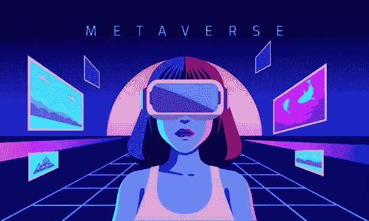
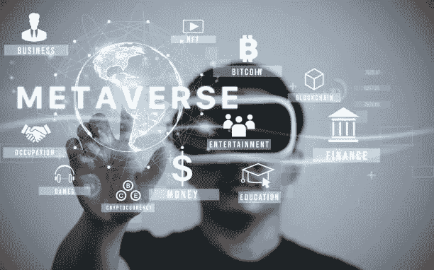
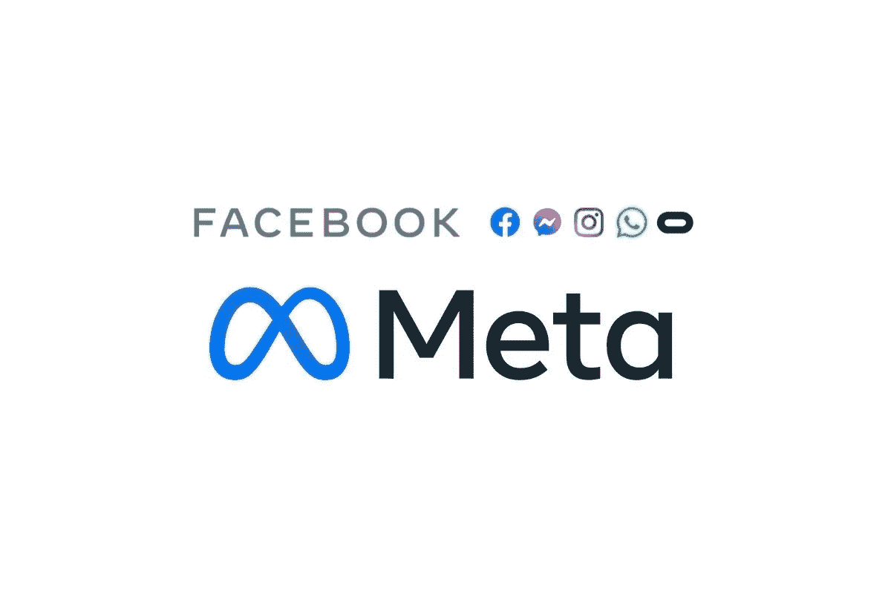
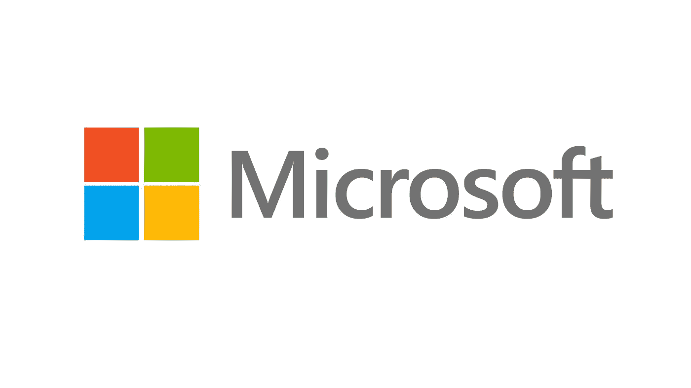

# 什么是元宇宙？

> 原文：<https://medium.com/coinmonks/what-is-the-metaverse-d0112d2dc242?source=collection_archive---------42----------------------->

这个术语是所有科技公司的最新流行语。有人说这是电子游戏。其他人说它是仅次于互联网的最好的东西。但是什么是元宇宙呢？

# 元宇宙。

元宇宙是由希腊单词“Meta”和“verse”创造的，Meta 的意思是高于或超越，Verse 是宇宙的缩写。根据维基百科，元宇宙是互联网的迭代，是通过使用虚拟现实、混合现实和增强现实促进的单一通用虚拟世界。

这是一个让人们能够通过使用个性化头像来联系的世界，让他们感觉不像普通视频通话那样虚构。元宇宙一词不仅仅是 21 世纪出现的一个新技术概念。它首次用于尼尔·斯蒂芬森 1992 年的科幻小说《冰雪奇缘》。作者设想基于虚拟现实的互联网将在未来几十年为未来提供动力。这个现实将是一幅真实世界的图画，其中化身代表人类。

# 元宇宙的意义。

这个虚拟世界使用户能够创建自己的虚拟版本，买卖资产，支付设备和经营经济，而不受现实世界的限制。这就像在 PlayStation 中购买玩家或在使命召唤游戏中与队友合作一样，元宇宙提供了一个我们使用虚拟现实的生态系统。

这款元宇宙和电子游戏的不同之处在于，它并不局限于手机和平板电视。这项技术还利用虚拟和增强现实设备进行交互。在写这篇文章的时候，元宇宙的完全显现还没有和我们见面，但是这个过程正在进行中。

但是很明显，一个人在元宇宙将会做的功能是会见人、交朋友、参加虚拟音乐会、购买和试穿数字服装、创作艺术品、玩游戏和娱乐。

# 科技巨头及其在元宇宙的参与。

虽然主要的科技巨头已经利用了这个机会，但其他人仍然在寻找人们对元宇宙的一些问题的答案。

Meta by BBN Times.

Meta 原名脸书，2014 年通过收购 Oculus 开始投资虚拟现实。根据主持人马克·扎克伯格的说法，下一个平台和媒介将是一个更加身临其境和具体化的互联网，你将体验到它，而不仅仅是看着它，我们称之为元宇宙。

Microsoft by Business Post Nigeria.

微软也看好元宇宙。该平台已经在为微软网格开发一个混合和扩展的现实界面。2022 年，这家科技巨头计划将全息图和虚拟化身带到其工作场所——微软团队。这是为了让元宇宙上的合作更加个性化。

《两周》的创造者 Epic Games 在建设元宇宙方面并未落后。这家视频游戏公司举办过爱莉安娜·格兰德和特拉维斯·斯科特等人的演唱会、电影预告片、音乐首发式。这家公司计划重新构思马丁·路德·金 1963 年的历史性演讲“我有一个梦想”。

苹果一直是增强现实的忠实粉丝。索尼、惠普公司和谷歌也生产各自版本的增强现实眼镜和虚拟现实耳机，用于元宇宙。随着游戏迅速成为元宇宙的基石，Epic Games、Roblox、Spatial、Nvidia 和微软的《我的世界》等公司已经在生产导航和享受这个虚拟世界的工具。

你可以创建自定义头像，更好地展示你的真实身份，而不是拍照并经历数小时的过滤和更改。这正是社交媒体公司 Snapchat 试图实现的目标。彭博预测，到 2024 年，元宇宙将成为 8000 亿美元的产业，这些跨国公司完全有理由看好元宇宙。

# 元宇宙和加密货币。

加密货币将在元宇宙发挥巨大作用，因为它们以去中心化为核心。当人们在元宇宙交易数字资产时，如何才能确保他们的交易是安全的，并且他们没有窃取的空间？这是加密货币回答的问题。

区块链技术的基本特征包括:它是可编程的；它是不可改变的；它是安全的；它是一致的；它是有时间标记的；而且是在分布式账本上。由区块链技术提供动力，加密是元宇宙安全交易的希望。区块链技术将使交易具有密码安全性。像分散土地和沙盒这样的公司正在创建虚拟房地产，游戏玩家可以发明他们的赌场，并使用加密货币使其合法化。正常人可以永久拥有自己的角色，注册虚拟土地，游戏内交易。

# 如何在元宇宙成为一名创造者？

在元宇宙有不同的方式让你成为一名创造者。一些例子是:

> ***股票。***

由于这可能是加密货币之后蓬勃发展的新想法，购买元宇宙公司的股票可能是一项会有回报的金融投资。通过购买元宇宙公司的股票，你有机会获得虚拟世界的第一手信息。你可以从脸书、索尼、Magic leap、Epic Games 和微软等元宇宙大公司购买股票。

> **拥有虚拟资产**

即使元宇宙的搜索查询增多，在这个生态系统中拥有一项数字资产也是你应该迈出的一步。像高地或分散土地这样的虚拟现实平台正受到全球投资者的关注。同样的，你可以在纽约购买房产或者在纽约股票市场购买股票，这些都可以在虚拟世界中完成。

你可以在高地购买虚拟土地，这是一个财产交易游戏。这可以通过使用高地平台上的高地货币 UPX 来完成。即使分散土地正在成为数字资产的虚拟目的地，你也可以使用以太坊区块链上构建的 MANA 加密货币在平台上购买虚拟地块。随着这些数字资产价值的上升，你的价格也会上涨。分散化土地也为人们提供了工作和谋生的机会，或者创造艺术和服装并出售获利的机会。

# 结论。

关于隐私和安全问题，一直在进行对话，以便为元宇宙的所有用户创造一个和平的环境。通过正确的方法，可以制定策略来消除在线骚扰、个人数据收集和网络盗窃。

从元宇宙获得最大的投资回报需要适当的研究。无论是游戏中的资产，还是仅仅从其公司购买股票，元宇宙都可能成为下一个大事件。虚拟现实的整个想法是迷人的，即使它还没有完全发展。唯一的问题是，元宇宙会成为互联网的继承者，还是仍然只是局限于游戏机的想象中的人类概念？

如果你喜欢这篇文章，请为它鼓掌，如果你觉得它有帮助，请发表评论。

在这里查看我的新书。

跟我来:

*   领英:[@伊曼纽尔·恩瓦卡](https://www.linkedin.com/in/emmanuel-nwaka)
*   推特: [@EmmanuelNwaka_](https://twitter.com/EmmanuelNwaka_)
*   Instagram: [@Emma_Nwaka](https://instagram.com/emma_nwaka)

> 加入 Coinmonks [电报频道](https://t.me/coincodecap)和 [Youtube 频道](https://www.youtube.com/c/coinmonks/videos)了解加密交易和投资

# 另外，阅读

*   [最佳以太坊钱包](https://coincodecap.com/best-ethereum-wallets) | [电报上的加密货币机器人](https://coincodecap.com/telegram-crypto-bots)
*   [最佳杠杆代币交易交易所](https://coincodecap.com/leveraged-token-exchanges) | [买入弗洛基](https://coincodecap.com/buy-floki-inu-token)
*   [3 commas vs Pionex vs Cryptohopper](https://coincodecap.com/3commas-vs-pionex-vs-cryptohopper)|[bing bon Review](https://coincodecap.com/bingbon-review)
*   [加密拷贝交易平台](/coinmonks/top-10-crypto-copy-trading-platforms-for-beginners-d0c37c7d698c) | [如何在 WazirX 上购买比特币](/coinmonks/buy-bitcoin-on-wazirx-2d12b7989af1)
*   [共贷回顾](https://coincodecap.com/coinloan-review)|[Crypto.com 回顾](/coinmonks/crypto-com-review-f143dca1f74c)