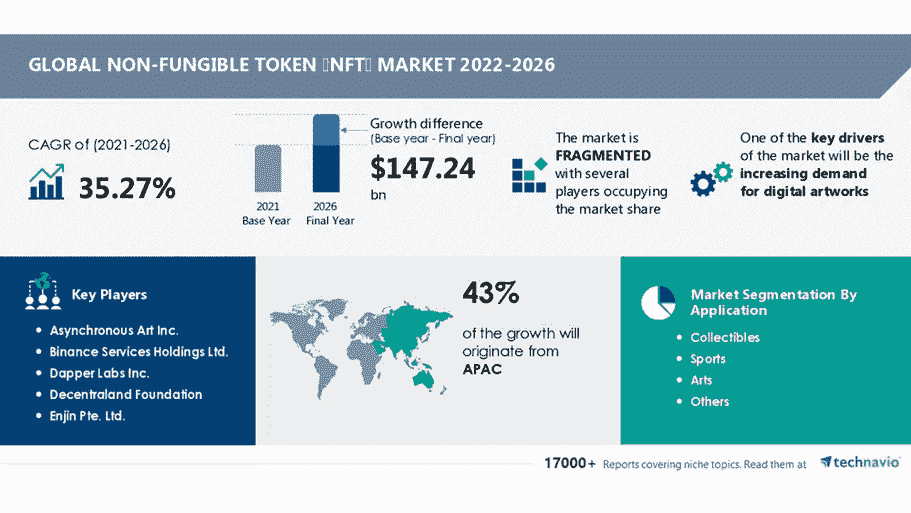
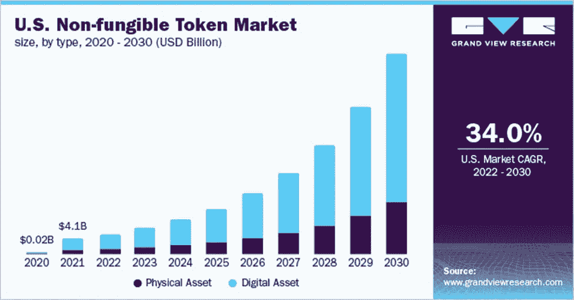

# NFT 市场的预测是什么？蓬勃发展的行业！

> 原文：<https://medium.com/coinmonks/what-is-the-nft-markets-forecast-a-booming-industry-370c9cfacf44?source=collection_archive---------8----------------------->

Credits: technavio

推动全球数字艺术需求增长的一个关键原因是区块链技术，尤其是不可替代代币(NFT)。在线艺术市场为投资者提供了新的机会和更有利可图的投资选择，使得数字艺术近年来获得了发展。不可替换令牌(NFT)是区块链上的加密资产，通过唯一的身份验证代码和元数据来区分。NFT 是一个加密令牌，代表现实世界的项目，如艺术，音乐，游戏中的项目和电影。它是区块链上独一无二的加密令牌，无法复制。

有许多出版物已经发布，以回应各种问题，如什么是推动 NFT 市场的主要因素？NFT 市场的全球动态是什么？谁是主要参与者？还有很多。他们主要考察 NFT 市场各个细分市场的规模。目标是评估几个细分市场的规模和增长潜力:应用(收藏品、体育、艺术、其他)、最终用户(个人、商业)和地区(北美、欧洲、亚太地区、拉丁美洲、中东和非洲)。

2021 年，数字资产部门引领市场，占全球收入的近 71.0%。世界各地的艺术家越来越多地使用 NFT 来获得数字创作的所有权，这可能会推动细分市场的增长。同时，越来越多的使用 NFTs 来销售现实和虚拟世界中的数字房地产可能会进一步推动行业的发展。NFT 也可以用来购买任何实物资产，比如房子、画或汽车。NFT 在实物上显示为条形码或标签，可以代替实物进行编码和交易。对 NFT 的需求很高，因为它们允许消费者在发生欺诈活动时要求其资产的所有权并确认其身份。

> 下面的分析是基于多个出版物的调查结果，这些调查结果被结合在一起，以提供有关 NFT 市场的信息，并帮助用户了解整体市场和子细分市场。
> 
> 它提供了对市场脉搏的透彻理解，以及关于重要市场驱动因素和机会的信息。

以下是基于各种出版物的增长预测:

*   根据 MarketsandMarkets 发布的“不可替代代币市场(业务战略制定、NFT 创建和管理、NFT 平台—市场)、最终用户(媒体和娱乐、游戏)、地区(美洲、欧洲、中东和非洲、APAC)—2027 年全球预测”，*全球 NFT 市场规模预计将从 2022 年的 30 亿美元增长到 2027 年的 136 亿美元，2022 年至 2027 年的复合年增长率为 35.0%(CAGR*。
*   根据 Grand view Research 联系的另一份出版物《2022-2030 年按类型(实物资产、数字资产)、按应用(收藏品、艺术、游戏)、按最终用途、按地区和细分市场预测的不可替代代币市场规模、份额和趋势分析报告》，*2021 年全球不可替代代币市场规模价值为 155.4 亿美元，预计 2022 年至 2030 年的复合年增长率(CAGR)为 33.9%。*
*   商业研究公司发布的《2022 年令牌全球市场报告》预测， *NFT 市场规模预计将从 2021 年的 140.2 亿美元增长到 2026 年的 824.3 亿美元，CAGR 为 40.2%* 。

> NFT 市场预计将以 33–40%的复合年增长率增长。

Credits: Grand View Research

T 推动 NFT 市场增长的关键因素是:

*   **对数字艺术品日益增长的需求**是推动全球不可替代代币(NFT)市场增长的主要因素之一。不可替代的标记在艺术家中很受重视，因为它们确保了他们的作品在区块链表现中的有效性和唯一性。例如，Grimes 是最近从 NFT 淘金热中获利的艺术家，2021 年售出的数字艺术品价值约 600 万美元。此外，数字艺术家 Pak 的收藏在 2021 年以 1700 万美元购买，数字艺术家 Beeple 的艺术品在 2020 年通过 Nifty Gateway 以 350 万美元售出。
*   **博彩业**是需求指数增长背后的另一个重要因素。金恩是第一批将区块链技术集成到其基础设施中的大型游戏公司之一，于 2017 年发布了 ENJ，这是一种游戏加密货币，被官方列入白名单，可在日本使用。例如，像 Axie Infinity 和 Splinterlands 这样的游戏允许用户将稀有的游戏内资产转换成 NFT 并获得收入。挣区块链游戏模式已被证明是一个巨大的 NFT 增长前景。因此，游戏行业，尤其是“玩到赚”的区块链游戏模式，允许玩家购买、出售和交换获得的游戏内资产，已经成为 NFT 的一个巨大增长机会。
*   NFT 市场是快速增长的另一个重要因素，因为它们让人们更容易接触到艺术世界。消费者可以通过互联网平台购买 NFT 艺术品，而不是去画廊。不可替代代币(NFT)市场正在被这些新的不可替代代币平台所塑造。主要的不可替代代币公司正在集中精力开发新的不可替代代币平台，这些平台将通过独特的高级铸造方案提供可定制的曝光。例如，总部位于美国的移动游戏和应用程序开发商 Tapinator，Inc .在 2021 年 3 月表示，它将推出 NFT500，这是一个基于蓝筹 NFTs 的高级选角服务和收集平台。
*   **通过虚拟平台直接对艺术品使用加密令牌**减少了购买的周转时间。令牌将数字艺术品连接到 NFT。然后，所有者或艺术家可以为 NFT 艺术品设定一个合理的价格。然后，密钥将作为所有权的证明交给最终用户。例如，数字艺术家可以使用代币出售一个或多个 NFT 限量版产品。艺术家也可以开发新的 NFT 形式。因此，令牌的使用是另一个主要因素。

T 引领 NFT 市场趋势的关键因素是:

*   元宇宙将成为 NFT 趋势的主要参与者。元宇宙是一个互联网虚拟世界的愿景，其中个人使用增强现实(AR)、虚拟现实(VR)和扩展现实(ER) (XR)与数字资产进行交互。由于元宇宙将以数字化身为特色，NFTs 将提供进入元宇宙的现实生活身份和数字化身的直接访问。NFTs 计划在广泛的元宇宙应用中使用，包括用户交互、社交和交易。例如，分散土地允许用户虚拟购买元宇宙房地产，并使用土地令牌显示他们在元宇宙拥有房地产的位置。行业专家还认为，在元宇宙，NFT 可以作为货币使用，可以用于交易，以及虚拟数字资产(如虚拟财产)的收购和交易。因此，元宇宙很可能是非森林旅游的最大机会。
*   NFT 有可能完全改变电影在媒体和娱乐领域的生成、制作和发行方式，在这个过程中使这个垄断行业民主化。NFT 社区阿拉伯骆驼队正在制作一部耗资 5000 万美元的好莱坞电影《Antara 》,以展示世界各地非正规金融服务的未来。NFT 对有志的电影制作人和业内不知名的艺术家尤其有利。NFTs 提供了一个独一无二的机会，让数以百万计的影迷来加强他们在元宇宙的支持。包括迪士尼和狮门影业在内的几家制作公司已经在开发自己的 NFT 市场。将 NFTs 整合到娱乐业务中有可能让用户积极参与电影制作和传播的所有阶段。NFTs 将使观众和艺术家超越屏幕，推动行业达到新的高度。
*   在预测期内，预计将对行业产生有利影响的一个重要 NFT 市场趋势是越来越多的**大品牌**进入市场。例如，阿迪达斯与 NFT 社区 Bored Ape 游艇俱乐部和众多密码艺术家合作创作的“走进元宇宙”系列于 2021 年 12 月出版。drop 是一款限量版的数字收藏品，很快就销售一空。
*   另一个促进市场增长的因素是 NFT 公司筹集的 T4 资金。例如，NFT 市场 Magic Eden 在 2022 年 3 月的首轮投资中筹集了 2700 万美元。Paradigm 领投，投资还包括来自 Solana Ventures 和 Sequoia Capital 的赠款。这些资金将用于扩大公司的服务和产品。
*   像 Visa Inc .和百威啤酒这样的大公司更感兴趣的是购买 NFT，而不是创造自己的。例如，2021 年 8 月，Visa Inc .支付了大约 165，000 美元购买了一台加密朋克 NFT。这张 NFT 的照片被加入了 Visa 公司的历史商业文物收藏中。

T 该地区的主要参与者有:

*   预计美国和加拿大将推动该地区的市场增长，因为这些国家创作数字艺术品的艺术家数量正在增加。
*   就市场规模而言，北美有望成为全球 NFT 市场的最大贡献者。
*   亚太市场预计将以最快的速度增长。亚太国家加密货币使用的增加可能会推动该地区的市场增长。该地区开发元宇宙平台的创业公司数量的增加预计也将推动行业增长。此外，该地区不断扩大的博彩业也带来了新的商业潜力。

T 最终用户关键细分市场是:

商业类有望以最快的 CAGR 速度增长。越来越多的将非功能性交易用于商业目的，如供应链管理和物流创新，可能会推动行业向前发展。物流行业的公司正逐步将区块链技术融入到他们的运营中，为行业的发展带来了新的机遇。

T 关键应用领域是:

收藏品市场不可替代代币(NFT)的市场份额增长将非常显著。该细分市场的增长可归因于对艺术、体育和游戏收藏品的需求不断增长。例如，体育收藏品允许粉丝与他们的英雄直接互动，游戏收藏品允许玩家交流和游戏，艺术家收藏品允许他们与潜在客户联系并出售他们的作品。

在预测期内，体育细分市场有望稳步增长。NFT 在世界各地的体育行业越来越受欢迎，因为它们允许运动员推销自己的身份，同时也增加了粉丝的参与。

TNFT 无损检测市场的主要公司有:

*   **币安服务控股有限公司**。:该公司提供各种不可替代的令牌，如《异形世界币安任务》、《无聊的像素 en》、《怪异的山魈猿》、《传奇的 X 乌贼游戏》和《圣母玛利亚》。第 17 版。
*   **去中心化基金会:**该公司提供各种不可替代的代币，如 AustinDCL 安全头盔、区块链伪装守护者、棍子女人和能源。
*   Funko Inc.: 该公司提供不可替代的代币，如史酷比 X Funko、变形金刚 X Funko、尼克卡通 X Funko 和复古漫画 X Funko。
*   **Gemini Trust Co. LLC:** 该公司提供不可替代的代币，如 Pak 的五十个立方体、崔佛·琼斯·阿特的 Eardly 和戴夫·波洛特的密码制图员。
*   **OpenSea:** 该公司提供不可替代的代币，如志那都红豆、BEANZ 官方、KIWAMI Genesis、Bored Ape 游艇俱乐部、Doodles 和 CyberBrokers。

TNFT 市场的主要供应商有:

Cloudflare(美国)、Gemini Trust(美国)、OpenSea(美国)、Semidot Infotech(美国)、Dapper Labs(加拿大)、The Sandbox(中国)、Axie Infinity(越南)、Rarible(美国)、Art Blocks(美国)、Foundation(美国)、Superrare(美国)、Mintbase(葡萄牙)、幼虫实验室(美国)、Appdupe(印度)、CryptoKitties(加拿大)、Sorare(法国)、Yellow Heart(美国)、Onchain Labs(中国)、Solanart(法国)、Gala Games(美国)

参考资料:

1.  不可替代代币市场规模、份额和趋势分析报告，按类型(实物资产、数字资产)、应用(收藏品、艺术品、游戏)、最终用途、地区和细分市场预测，2022 年–2030 年，2022 年，Grand View Research，Inc .
2.  按应用和地理区域划分的不可替代令牌(NFT)市场—2022 年–2026 年预测和分析，Technavio
3.  按产品(业务战略制定、NFT 创建和管理、NFT 平台—市场)、最终用户(媒体和娱乐、游戏)、地区(美洲、欧洲、中东和非洲、APAC)划分的全球不可替代令牌市场—到 2027 年的预测，2022 年 5 月，市场和市场
4.  《2022 年不可替代代币全球市场报告》——按类型(艺术、收藏品、游戏、Metaverses、体育、公用事业)、按市场类型(一级、二级)、按加密货币使用(ETH、DAI、MANA、SAND、REVV、MATIC、CUBE、FOAM)——市场规模、趋势和 2022–2026 年全球预测，商业研究公司，2021 年 12 月

> 加入 Coinmonks [电报频道](https://t.me/coincodecap)和 [Youtube 频道](https://www.youtube.com/c/coinmonks/videos)了解加密交易和投资

# 另外，阅读

*   [3 商业评论](/coinmonks/3commas-review-an-excellent-crypto-trading-bot-2020-1313a58bec92) | [Pionex 评论](https://coincodecap.com/pionex-review-exchange-with-crypto-trading-bot) | [Coinrule 评论](/coinmonks/coinrule-review-2021-a-beginner-friendly-crypto-trading-bot-daf0504848ba)
*   [莱杰 vs n rave](/coinmonks/ledger-vs-ngrave-zero-7e40f0c1d694)|[莱杰 nano s vs x](/coinmonks/ledger-nano-s-vs-x-battery-hardware-price-storage-59a6663fe3b0) | [币安评论](/coinmonks/binance-review-ee10d3bf3b6e)
*   [Bybit Exchange 审查](/coinmonks/bybit-exchange-review-dbd570019b71) | [Bityard 审查](https://coincodecap.com/bityard-reivew) | [Jet-Bot 审查](https://coincodecap.com/jet-bot-review)
*   [3 commas vs crypto hopper](/coinmonks/3commas-vs-pionex-vs-cryptohopper-best-crypto-bot-6a98d2baa203)|[赚取加密利息](/coinmonks/earn-crypto-interest-b10b810fdda3)
*   最好的比特币[硬件钱包](/coinmonks/hardware-wallets-dfa1211730c6) | [BitBox02 回顾](/coinmonks/bitbox02-review-your-swiss-bitcoin-hardware-wallet-c36c88fff29)
*   [BlockFi vs Celsius](/coinmonks/blockfi-vs-celsius-vs-hodlnaut-8a1cc8c26630)|[Hodlnaut 点评](/coinmonks/hodlnaut-review-best-way-to-hodl-is-to-earn-interest-on-your-bitcoin-6658a8c19edf) | [KuCoin 点评](https://coincodecap.com/kucoin-review)