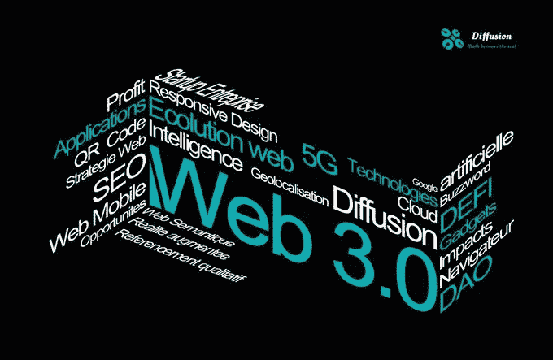

# Web 3.0 的起源和未来是什么？

> 原文：<https://medium.com/coinmonks/what-is-the-origin-and-future-of-web-3-0-b26463d12770?source=collection_archive---------24----------------------->

让我们来看看 web3.0/Web3(也称为 web3.0，也写作 web3)这是一个关于万维网发展的概念，主要涉及基于区块链的去中心化、加密货币和不可替代的代币相关。

与区块链相关的 web3 概念由以太坊联合创始人加文·伍德(Gavin Wood)于 2014 年提出，并于 2021 年引起了加密货币爱好者、大型科技公司和风险投资公司的关注。

此外，有人提出 Web 3.0 与 Web 2.0 相关。

Web 3.0 与 web 2.0 相关，此外，Web 3.0 还有其他含义。比如有人针对 Web 2.0 提出 Web 3.0。功能包括:将互联网本身转化为通用数据库；跨浏览器和超级浏览器内容交付和请求机制；人工智能技术的应用；语义网；地理制图网；用 3D 技术构建的网站甚至虚拟世界或者网络公国等等。著名的第一次提及是在 2006 年初 Jeffrey Zeldman 的博客中的一篇批评 Web 2.0 的文章中。

2006 年 5 月，蒂姆·伯纳斯·李说:

— —蒂姆·伯纳斯·李，一个“更具革命性”的网络

“人们一直在问什么是 Web 3.0。我认为，当 SVG 在 Web 2.0 之上被广泛使用时——所有东西都是波纹状的、折叠的，看起来没有棱角——一个完整的语义网覆盖了大量数据，你将可以访问这个令人难以置信的数据资源。”

— —蒂姆·伯纳斯·李，一个“更具革命性”的网络

“现在有很多关于 Web 2.0 的文档和讨论。网络的力量已经达到了一个临界点，在网络层面上可以实现什么。在过去的 4 年中，我们还看到了更先进的设备以及与网络更先进的集成。交互式方法不仅存在于像游戏控制台和移动设备这样的硬件中，也存在于软件中。你不必成为一名计算机科学家来创造一个程序。这种现象最早出现在 Web 2.0 中，在 Web3.0 中，它将深化，成为真正的共同信息载体……专业、半专业和消费者之间的界限正在模糊，创造出商业和应用的网络效应。”

———杨致远

在这次峰会上，网飞创始人雷德·哈斯汀斯提出了一个定义网络术语的简单公式:

“Web 1.0 是拨号上网，50K 平均带宽，Web 2.0 是 1M 平均带宽，Web 3.0 应该是 10M 带宽，全镜像网络，这感觉才是真正的 Web 3.0。”

— —雷德·哈斯汀斯

———埃里克·施密特

2007 年 8 月 7 日，谷歌 CEO 埃里克·施密特在出席首尔数字论坛时被问及 Web 3.0 的定义。埃里克·施密特首先开玩笑说“Web 2.0 只是一个营销术语，你只是发明了营销术语 Web 3.0。”接着他谈了自己的具体看法:

“……(Web 3.0)构建应用程序的方法将会不同。到目前为止，Web 2.0 这个术语的出现主要是对一个叫做“AJAX”的概念的回应……我对 Web 3.0 的预测将是拼凑起来的应用程序，具有一些主要特征:相对较小的程序，数据在网络中，程序可以在任何设备(PC 或手机)上运行，程序非常快，具有许多定制功能，应用程序将像病毒一样传播(社交网络、电子邮件等)。)."

———埃里克·施密特

从 2006 年底开始，Web 3.0 这个名词受到越来越多的关注，成为越来越多争论的焦点，这种现象一直延续到现在。关于如何定义 Web 3.0，以及它代表什么的争论非常激烈，有很多观点。

可以肯定的是，统一结论的 web 3.0 实际上并没有发生，但正如我们在上一篇文章中提到的，数字世界的到来是一个必然的结果。在扩散道的理解中，web3.0 主要是依靠区块链技术在数字空间中完成一种思想投射，让个体更深入数字空间，让数字空间成为个体的第二空间，这与元宇宙的概念非常相似，但 web3.0 的出现可能更具体、更准确地表达未来数字空间的形态。既然成为了个体的“第二空间”，那么个体就会在这个空间里度过更多的时间，个体的注意力就会投射到这里。笛卡尔曾经说过:“我思故我在”。毫不夸张的说，我们灵魂也会存在于 web3.0 中，意志的存在意味着人格需要存在。那么与数学世界相对应的人格需求成为 web3.0 中个人的基本需求——“公共权力”，对正义、公开的需求，以及对个人数字资产产权的隐私治理权的需求将会相继出现，而在可见范围内能够完成这种需求的技术支持，只有区块链和 IPFS 以及存在于其上的加密资产才能实现。当然，周围的要素也同样重要，如扩散道的 web3.0 要素群图所示，包括去中心化的金融基础设施、道组织、VR、5G……等等。

一个新空间的出现，首先必须是新思想的出现，然后才是思想引导的技术的实现。也就是说首先要有一个设计思路，需要什么样的场景等等。，然后通过技术实现。在 web 3.0 中，一个非常重要的元素是 DEFI 基金会，它是由区块链技术支持的去中心化金融的基础。

几乎绝大多数的加密货币都没能告诉你他的代币的经济体系是怎么来的。原因是因为传统、严谨、科学的经济机制还没有被带入加密货币世界。因此，如果要有序地开发 web3.0，必须以科学严谨的态度，运用经济学知识、金融工程知识、数理金融工具等，设计和构建 web3 中存在的 DEFI 金融基础

到目前为止，我想大家都可以理解为什么扩散道的第一大目的是建立一个 web3.0 的组合储备系统。

> *加入 Coinmonks* [*电报频道*](https://t.me/coincodecap) *和* [*Youtube 频道*](https://www.youtube.com/c/coinmonks/videos) *了解加密交易和投资*

# 另外，阅读

*   [Bookmap 评论](https://coincodecap.com/bookmap-review-2021-best-trading-software) | [美国 5 大最佳加密交易所](https://coincodecap.com/crypto-exchange-usa)
*   最佳加密[硬件钱包](/coinmonks/hardware-wallets-dfa1211730c6) | [Bitbns 评论](/coinmonks/bitbns-review-38256a07e161)
*   [新加坡十大最佳加密交易所](https://coincodecap.com/crypto-exchange-in-singapore) | [购买 AXS](https://coincodecap.com/buy-axs-token)
*   [红狗赌场评论](https://coincodecap.com/red-dog-casino-review) | [Swyftx 评论](https://coincodecap.com/swyftx-review) | [CoinGate 评论](https://coincodecap.com/coingate-review)
*   [投资印度的最佳密码](https://coincodecap.com/best-crypto-to-invest-in-india-in-2021)|[WazirX P2P](https://coincodecap.com/wazirx-p2p)|[Hi Dollar Review](https://coincodecap.com/hi-dollar-review)
*   [加拿大最佳加密交易机器人](https://coincodecap.com/5-best-crypto-trading-bots-in-canada) | [库币评论](https://coincodecap.com/kucoin-review)