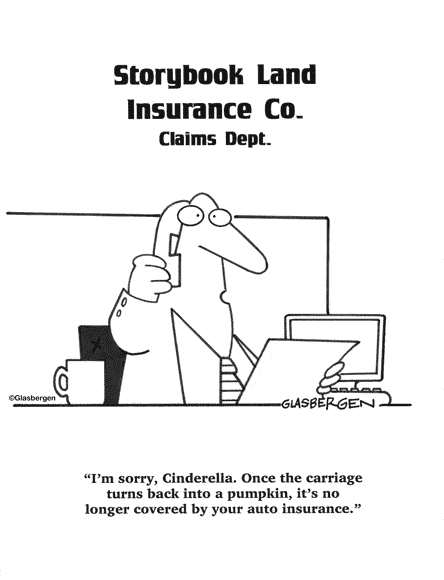
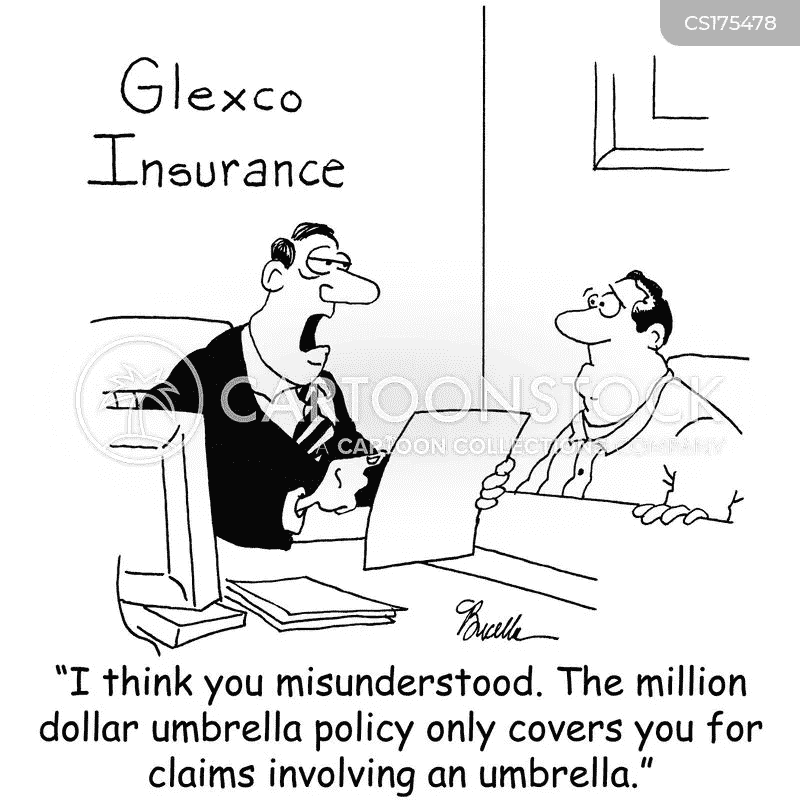

# 人生(保险)的价格是多少？？

> 原文：<https://medium.com/coinmonks/what-is-the-price-of-life-insurance-124aeddf7a4c?source=collection_archive---------10----------------------->

感谢你们对这个关于保险的新系列的热烈回应。在上一篇文章中，我们讨论了什么是保险，保费是如何确定的简单概念，以及最重要的是，我们为什么要考虑投保任何有价值的东西。因此，这篇文章的逻辑进展将是谈论我们最珍贵的财产，即我们的“生命”和人寿保险。我们还简要地谈到了谁应该考虑投保的问题，简单的回答是,**如果在你之后，你的直系亲属可能会因为收入来源枯竭而面临经济困难，那么从严格的财务角度来看，你当然必须购买人寿保险。因此，**为家庭中没有收入的成员购买人寿保险可能在经济上不利，因为他们有更好的投资选择**。**

好的……我希望到现在为止，你们中的大多数人都确信要购买人寿保险。那么下一个显而易见的问题是，保险金额应该是多少？不幸的是，这个问题也没有直接的答案，类似于我们在共同基金解决方案中讨论的问题。然而，我们可以考虑几个基本参数，如直系家庭的规模、基本月支出、计划的几笔大额支出(如子女教育和他们的婚姻),最后是最重要的参数——这个家庭预计需要多长时间才能实现财务自立？正如我们所看到的，这些问题可能没有简单的答案，因此，它基本上归结为你能够在一段很长的时间内维持多少溢价。但是，不要因为这些问题的难度而灰心丧气，至少做一次这个练习来了解你的财务优势和劣势。**如果不担心支付保费，那么基本的经验法则可以认为是一年的平均费用，根据通货膨胀推算至少五年，应该是你的保险金额**。例如，如果你的年平均支出约为 50 万卢比，那么用 5 年 6%的通货膨胀率进行外推，这将变成 67 万卢比。简单到目前为止……..不是吗？？？？？请随意推断 10 年或 20 年，如果你的算命师这么说的话(哈……哈……..哈……)但不能少于 5 年。

现在到了棘手的部分…… **选择哪种产品？**正如我们在共同基金中看到的那样，有如此多类型的产品可供选择，人们可能很难选择正确的产品。解决这个问题的方法是了解市场上所有种类的产品，将它们与你的不安全感或贪婪相匹配，然后选择最吸引你的一种。如果你认为保险是一种费用，并认为它与投资是分开的，那么你可以选择定期计划，这样保险费最少，而且它提供特定时期的保险。这一方面提供了更高的金额投保相同数额的保费，但另一方面，这是一个纯粹的费用，因为你得不到任何回报。如果你想混合保险和投资的好处，那么你可以考虑单位挂钩保险计划(ULIP)，退款政策或养老计划，这些计划在提供保险的同时也提供一些储蓄或财富创造的成分。如果你倾向于定期计划，但希望在期末收回你的钱，你可以考虑返还保费的定期保险。然而，在这种情况下，保费金额肯定会超过简单的长期计划。或者最后，你可以选择传统的终身寿险，一旦你去世，它会向受益人支付保险金额和一些储蓄部分。迷惑？？？然后……为了便于理解，我们把它们分组-

**纯保险+期末赔付**

**期限计划** —只有在您未能在保险期限内生存的情况下，才会支付保险金额。

**返还保费的定期计划** —如果您未能挺过该期限，全额支付保险金额，但是，如果您挺过了该期限，所支付的全部保费将在期限结束时返还给您。

**终身寿险** —这是传统的保险政策，投保金额仅在您去世时支付，与期限或年龄无关。它也可能包括储蓄或奖金的一些组成部分。

**保险+投资**

**投资连结保险计划(ULIP)** —对于那些希望将两者结合起来的人来说，这是一个不错的投资和保险工具。然而，请记住，保费高得多，回报可能比纯粹的投资选择略低，但它提供了便利。

养老计划——对于那些正在寻找保险但也想把它作为一种投资手段的人来说，这又是一个不错的选择。与 ULIP 相比，这种方法更为经典，因为捐赠金额通常是固定的，在保单期限结束时提供的生存福利中有一个较小的可变部分。这种可变部分或奖金通常由金融市场机制驱动，可以被视为该计划产生的利润红利。

**退款计划** —该保险计划提供定期预定义的支出(例如每五年或四年一次)，剩余金额和到期福利在期限结束时支付。非常适合那些寻求定期支出以满足其计划支出，同时享受保险福利的人。

可能会有更多的定制方案，这些方案可能是上述两个或更多基本计划的组合。因此，去选择最吸引你的计划吧。唯一的警告是在考虑之前先阅读一下这个计划。

这就是这篇文章的全部内容…..由于保险费有时可能会成为许多人痛苦的根源，下周我将介绍一些快速解决方案，以涵盖如何规划您的保险费这一主题。

> 加入 Coinmonks [电报频道](https://t.me/coincodecap)和 [Youtube 频道](https://www.youtube.com/c/coinmonks/videos)了解加密交易和投资

## 也阅读

 [## 2022 年 2 月将购买的五大加密技术| CoinCodeCap

### 加密货币是不受任何中央机构监管的数字货币，并且不稳定。有些日子…

coincodecap.com](https://coincodecap.com/top-5-crypto-to-buy-in-february-2022)  [## Bitsgap 评论-交易机器人加密信号和套利 2022

### 这篇文章的重点是 Bitsgap 审查，这是一个最终的交易解决方案，并提供交易机器人，信号…

coincodecap.com](https://coincodecap.com/bitsgap-review)  [## 40 个最佳电报频道，用于加密、电影、表演和演讲| CoinCodeCap

### 免费下载所有电影。德国免费加密信号。下载讲座。CoinCodeCap 经典，网飞电影等。是……

coincodecap.com](https://coincodecap.com/best-telegram-channels)  [## Keevo 钱包点评:是最安全的硬件钱包吗？2022 | CoinCodeCap

### 在这篇 Keevo Wallet 评论中，我们将讨论他们如何改变我们看待硬件钱包的方式。基沃是…

coincodecap.com](https://coincodecap.com/keevo-wallet-review)  [## 2022 年 5 大最佳社交交易平台

### 5 个最佳社交交易平台阅读加密产品评论和比较，了解比特币交易和…

coincodecap.com](https://coincodecap.com/best-social-trading-platforms)  [## BlockFi 评论:2022 年的利弊和利率

### 今天，我们提出了一个全面的 BlockFi 评论，这是一个成立于 2017 年的加密贷款平台，拥有其…

coincodecap.com](https://coincodecap.com/blockfi-review)  [## 如何在印度购买比特币？2021 年购买比特币的 7 款最佳应用[手机版]

### 如何使用移动应用程序购买比特币印度

medium.com](/coinmonks/buy-bitcoin-in-india-feb50ddfef94)  [## 加密税务软件——五大最佳比特币税务计算器[2021]

### 不管你是刚接触加密还是已经在这个领域呆了一段时间，你都需要交税。

medium.com](/coinmonks/best-crypto-tax-tool-for-my-money-72d4b430816b)  [## 9 个 2022 年最值得购买的密码| CoinCodeCap

### 9 个 2022 年最值得购买的加密产品阅读加密产品评论和比较，了解比特币交易和…

coincodecap.com](https://coincodecap.com/crypto-to-buy-in-2022)