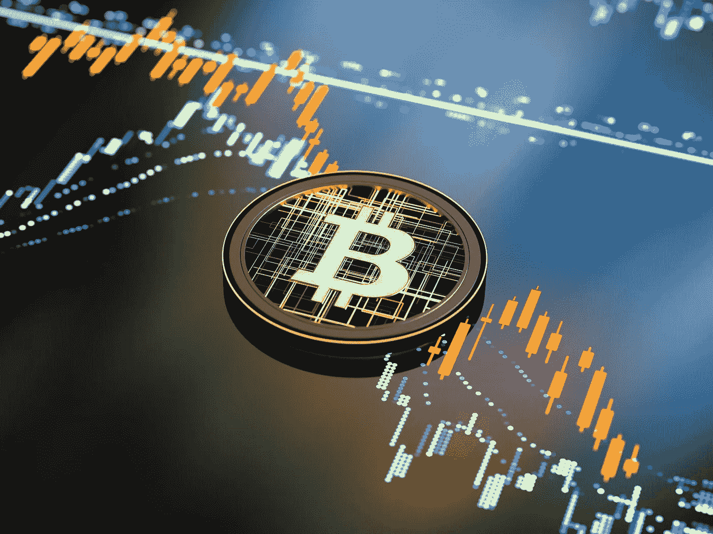

# 加密货币如此不稳定的原因是什么？

> 原文：<https://medium.com/coinmonks/what-is-the-reason-why-cryptocurrency-are-so-volatile-7b48eb57b9f7?source=collection_archive---------14----------------------->

加密货币市场从一开始就不稳定，但过去几年对全球数百万投资者来说是一次特别疯狂的经历。许多人在股市大涨时赚了数百万，但也有许多人在泡沫破裂和市场突然低迷时损失了大大小小的投资。

Photo Source on Google

加密货币是一项正在进行的技术和社会经济实验。因此，区块链空间正因新的机遇而蓬勃发展。这个新行业在不断发展，因此你越早了解它，你就越有可能从它未来的发展中获益。

尽管如此，营销专家应该知道如何在高波动性和投资者不确定性时期推广加密货币品牌。为了理解如何做到这一点，我们应该确定影响数字货币价格的因素以及如何利用这些因素为我们带来好处。

# **1。加密货币仍是一个新兴市场**

尽管加密货币多年来一直受到媒体的关注，但与法定货币和黄金相比，市场规模仍然微不足道。即使在高峰期，加密货币市场也只有 8000 亿美元左右。与黄金市场 7.9 万亿美元的总价值和美国股市的 28 万亿美元相比，这是微不足道的变化。

这种相对较小的市场规模意味着较小的力量可以对价格产生较大的影响。如果一群投资者决定出售 5 亿美元的黄金，这几乎不会对金价产生任何影响。如果同样的事情发生在比特币身上，将足以破坏整个市场的稳定，并导致价格暴跌。

然而，加密货币市场仍在发展的事实也意味着有很多机会用一个新的令人兴奋的项目来打击它。例如，不久前电报开发商宣布推出区块链平台吨和硬币克。有趣的是，这两个项目都还没有完成，但新闻媒体已经公布了这一举措。因此，进入新兴市场是一个让你的产品被谈论的好方法，因此，被了解和认可。

# **2。加密货币是纯数字的**

比特币等大多数加密货币都是纯数字资产，没有货币或商品等任何实物支持。这意味着它们的价格完全由供求规律决定。由于像比特币这样的许多加密货币的供应是固定的或可预测的，价格取决于现在有多少人想购买比特币。

没有实物资产来支撑主要加密货币的价值，也没有政府来强制它们作为货币使用。这意味着他们的价值完全由信念支撑。如果人们不再相信比特币的价值会保持或继续上升，他们可能会出售。这可以降低价格，并说服其他人也出售，因此形成了一个循环，并迅速使价格下跌。相反的情况也可能导致价格飙升，形成过度膨胀的价格泡沫。

# **3。该技术仍在开发中**

区块链和其他替代加密技术仍处于早期发展阶段。基于加密技术的分散货币的想法在比特币白皮书中发表还不到十年，所以市场成熟还需要一段时间。尽管如此，许多公司已经采用了区块链技术，并积极将其用于营销和广告目的。该领域最有前途的项目是 AdEx、Brave 和 Steem。由于许多客户发现区块链的透明度和其他优势很有吸引力，因此探索这项技术可能对品牌营销非常有益。

特别是像区块链可扩展性问题这样顽固的技术障碍，当它们没有在许多人预期的时间框架内得到解决时，就会给加密价格带来下行压力。或者，当它们的后果以网络拥塞和高交易价格的形式具体化时。

另一方面，技术的关键发展可以起到推动作用。这包括比特币闪电网络(Bitcoin Lightning Network)等结构性进展，或者以太坊(Ethereum)等区块链平台上新的流行应用。也有许多新的加密货币不断涌现，试图竞争并从现有的加密货币中夺取一些市场份额。

# **4。猜测**

加密货币市场波动的最大驱动因素之一是投机。这涉及投资者通过买卖加密货币来押注不同加密货币的价格会上涨或下跌。事实上，正是加密货币市场的波动性吸引了那些希望通过猜测波动来赚大钱的投机交易者。

如果你能预测比特币或 XRP 的价格何时会上涨，并在此之前买入，你就能大赚一笔。同样，如果你能在加密货币崩溃前卖空它，你也能获利。许多投资者不断试图猜测加密货币市场的上下波动。这些投机性的赌注在一个已经波动的市场上引起了更多的波动。

> *加入 Coinmonks* [*电报频道*](https://t.me/coincodecap) *和* [*Youtube 频道*](https://www.youtube.com/c/coinmonks/videos) *了解加密交易和投资*

# 另外，阅读

*   [3 商业评论](/coinmonks/3commas-review-an-excellent-crypto-trading-bot-2020-1313a58bec92) | [Pionex 评论](https://coincodecap.com/pionex-review-exchange-with-crypto-trading-bot) | [Coinrule 评论](/coinmonks/coinrule-review-2021-a-beginner-friendly-crypto-trading-bot-daf0504848ba)
*   [莱杰 vs n 格拉夫](/coinmonks/ledger-vs-ngrave-zero-7e40f0c1d694) | [莱杰纳诺 s vs x](/coinmonks/ledger-nano-s-vs-x-battery-hardware-price-storage-59a6663fe3b0) | [币安评论](/coinmonks/binance-review-ee10d3bf3b6e)
*   [Bybit Exchange 审查](/coinmonks/bybit-exchange-review-dbd570019b71) | [Bityard 审查](https://coincodecap.com/bityard-reivew) | [Jet-Bot 审查](https://coincodecap.com/jet-bot-review)
*   [3 commas vs crypto hopper](/coinmonks/3commas-vs-pionex-vs-cryptohopper-best-crypto-bot-6a98d2baa203)|[赚取加密利息](/coinmonks/earn-crypto-interest-b10b810fdda3)
*   最好的比特币[硬件钱包](/coinmonks/hardware-wallets-dfa1211730c6) | [BitBox02 回顾](/coinmonks/bitbox02-review-your-swiss-bitcoin-hardware-wallet-c36c88fff29)
*   [BlockFi vs Celsius](/coinmonks/blockfi-vs-celsius-vs-hodlnaut-8a1cc8c26630)|[Hodlnaut 点评](/coinmonks/hodlnaut-review-best-way-to-hodl-is-to-earn-interest-on-your-bitcoin-6658a8c19edf) | [KuCoin 点评](https://coincodecap.com/kucoin-review)