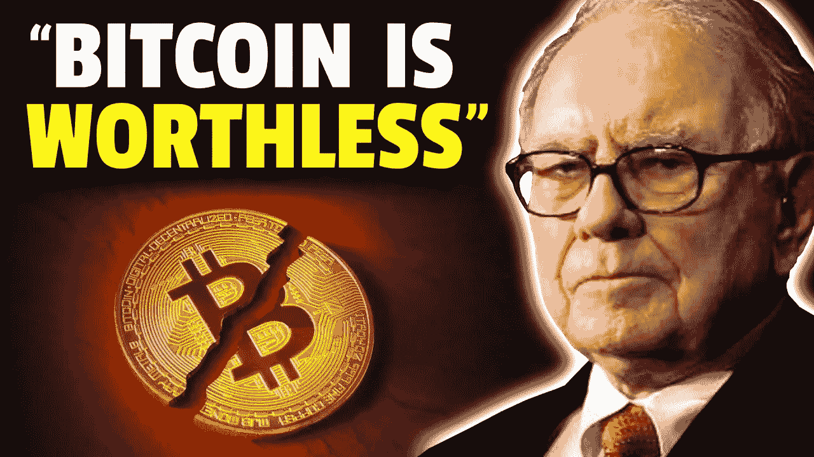

# 沃伦·巴菲特讨厌 Crypto 的原因是什么？

> 原文：<https://medium.com/coinmonks/what-is-the-reason-why-warren-buffett-hates-crypto-b6c521c9adb5?source=collection_archive---------44----------------------->

## 为什么沃伦·巴菲特不相信比特币？

Photo Source on Google

巴菲特一直反对加密货币。他在 2018 年告诉美国消费者新闻与商业频道，“他们将会有一个糟糕的结局”，并表示伯克希尔·哈撒韦公司将“永远不会在他们中间有职位”“在我认为自己了解的事情上，我已经陷入了足够多的麻烦，”他当时说道。

或者当他说他不会用 25 美元买下世界上所有的密码时。

但他的一句话在应用于 crypto 时确实听起来很真实:

当别人恐惧时，你要贪婪。这些天来，由于几个宏观经济因素，市场真的被恐惧麻痹了。

无论是与美元脱钩，美联储提高利率并开始“量化紧缩”，还是标准普尔 500 指数暴跌并跟风使用加密技术，市场似乎对普通交易者和投机者充满敌意。

这不仅仅是我的观察。

恐惧和贪婪指数证实了看跌的市场情绪，该指数在过去三周一直显示“极度恐惧”。

5 月 9 日，当 BTC 自 2021 年 7 月以来首次跌破 31，000 美元时，市场开始经历恐慌。从那以后就没有停止过。

## **尽管对加密技术来说这是一个可怕的时代，但它们远非没有希望。**

投资者需要精明和冷静，这样他们才能发现投资机会并抓住它——当其他人都陷入不太愉快的现状时，他们向前看并获得利润，但不会失去耐心。

这类投资者可以使用一些策略在熊市或中性市场中赚钱。

## **风险较高的方式之一往往有可能获得最高回报:把握市场时机。**

确定市场底部——当市场价格达到周期的最低点——标志着抛售的结束和上升趋势的开始。在这个价格买入可以让投资者乘风破浪，最大化潜在利润。

> 加入 Coinmonks [电报频道](https://t.me/coincodecap)和 [Youtube 频道](https://www.youtube.com/c/coinmonks/videos)了解加密交易和投资

# 另外，阅读

*   [Bookmap 评论](https://coincodecap.com/bookmap-review-2021-best-trading-software) | [美国 5 大最佳加密交易所](https://coincodecap.com/crypto-exchange-usa)
*   最佳加密[硬件钱包](/coinmonks/hardware-wallets-dfa1211730c6) | [Bitbns 评论](/coinmonks/bitbns-review-38256a07e161)
*   [新加坡十大最佳加密交易所](https://coincodecap.com/crypto-exchange-in-singapore) | [收购 AXS](https://coincodecap.com/buy-axs-token)
*   [红狗赌场评论](https://coincodecap.com/red-dog-casino-review) | [Swyftx 评论](https://coincodecap.com/swyftx-review) | [CoinGate 评论](https://coincodecap.com/coingate-review)
*   [投资印度的最佳加密软件](https://coincodecap.com/best-crypto-to-invest-in-india-in-2021)|[WazirX P2P](https://coincodecap.com/wazirx-p2p)|[Hi Dollar Review](https://coincodecap.com/hi-dollar-review)
*   [加拿大最佳加密交易机器人](https://coincodecap.com/5-best-crypto-trading-bots-in-canada) | [库币评论](https://coincodecap.com/kucoin-review)