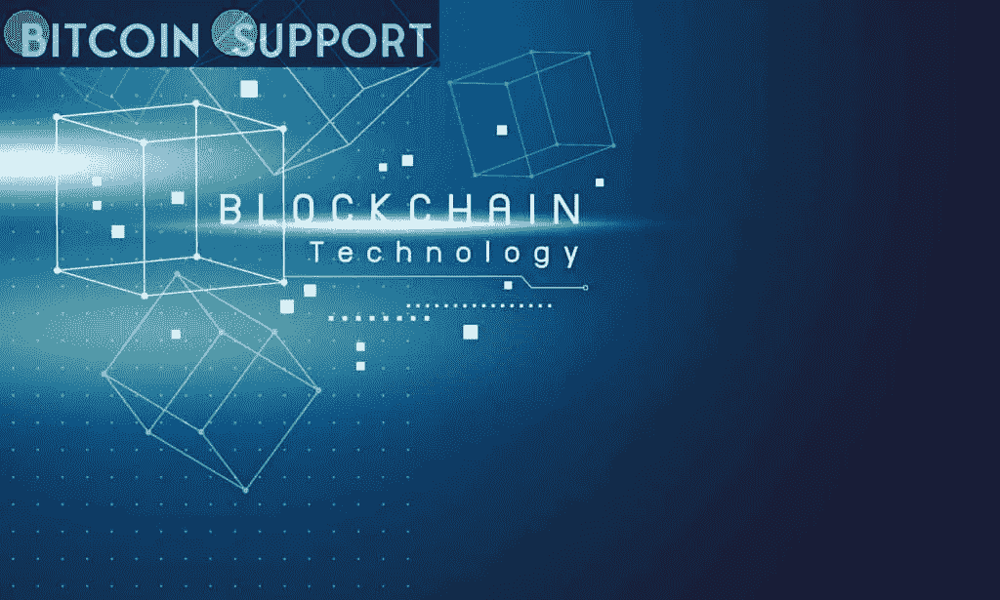

# 区块链在 RegTech 世界中的角色是什么？

> 原文：<https://medium.com/coinmonks/what-is-the-role-of-blockchain-in-the-regtech-world-58957c40701b?source=collection_archive---------44----------------------->

[https://bitcoinsupports.com/](https://bitcoinsupports.com/)

**What is RegTech?**

RegTech is the use of technologies like big data, data mining, artificial intelligence, and blockchain to manage regulation, compliance, reporting, and monitoring. These technologies can be used to build strong, reliable, and effective solutions.

The technologies give information about money laundering and help to cut down on the risk of financial fraud. It’s not all roses for regtech, though. There are operational barriers, a lack of recourse, high costs, and a long and time-consuming process of automating manual tasks.

After the global financial crisis, regulators started to pay more attention to the compliance part of the business. Thousands of rules and provisions were put in place all over the world. About £189.8 million has been paid in fines to the Financial Conduct Authority (FCA) for breaking rules. The cost of doing business legally is more, which is why all of the world’s regulators are interested in blockchain technology for regulatory purposes.

Even if you work for a big company like HSBC or a small business, you have to pay a lot of money to stay in line with rules. All of the world’s financial regulators are now trying to work with organizations that use software-as-a-service (SaaS) or cloud computing technologies to help businesses comply with laws more quickly and cheaply.

This article will talk about how regtech can be used for compliance and how blockchain technology can be used in the regtech world.

**How does blockchain work in banking?**

Blockchain is a decentralized, distributed ledger that is made up of blocks that store the records of transactions using cryptography. In addition to payments, blockchain can help banks speed up complicated processes and improve internal processes.

There are a lot of high stakes for the traditional banking industry, which is why they have been slow to change. However, 90% of members of the European Payments Council recently said that blockchain technology in regulatory compliance will have a huge impact on the business by 2025\. It looks like distributed ledger technology is going to change or improve parts of the financial system soon.

As of right now, blockchain technology is mostly used to keep track of cryptocurrencies on a shared ledger. However, for the banks, blockchain technology has a lot of advantages, like automating transactions and cutting down on the number of middlemen. For example, the use of blockchain reduces the number of people who need to be involved in issuing financial instruments, like stocks and bonds.

Furthermore, banks can use blockchain regulation technology to show their users how they work, make cross-border transactions happen in real time, and process payments faster. Blockchain also speeds up back-office settlements, reduces the cost of doing business, and speeds up inter-bank transactions.

According to a study by German fintech company Cashlink, using blockchain technology to automate tasks like correspondence, validation, and manual updating of bond documentation could save at least 35% of bond issuance costs over the life of the bond.

There are many ways that blockchain technology can improve productivity and save money. It makes it easier and safer to send information across financial institutions by storing customer information on decentralized blocks to meet regulations. Here is where blockchain comes in. Even though, it will still take a long time to build the blockchain system for the banks.

**How blockchain is disrupting the RegTech ecosystem?**

Blockchain is already a big part of the regtech revolution because of its many advantages: transparency, decentralization, faster and cheaper processing through automation, and better security through cryptography.

A regtech ecosystem is made up of companies that use computing technology, offer SaaS, and help businesses meet regulations quickly and cut costs. Because regtech companies work together with financial institutions and regulatory bodies, RegTech is also known as a regulatory technology. Cloud computing and big data are used to share information.

Many banks get a lot of data, and they may find it difficult, valuable, and time-consuming to go through it all. Regtech companies can use data from regulatory failures to look at complicated information from a bank and figure out where the bank should focus its attention.

Regtech companies make it easier for banks to comply with the law and regulations by making the analytics tools they need. This saves the bank money and time. A good analytical tool is used by the banks in this way so they can stay in line with rules set by the financial authorities.

Banks still pay a lot to use RegTech because hundreds of new rules are set up every year, so the cost is still high. So, banks have to follow the new rules in order to avoid being punished by the regulators, so they have to.

What are the key areas where blockchain is adding value to the RegTech ecosystem?

Financial regulators and service providers are looking for the best and most cost-effective ways to help banks and other financial institutions follow the rules and do business in a way that is legal and safe.

As blockchain is already changing the way businesses are done, thanks to its benefits like increased transparency, faster procedures, decentralization, and cost-effective nature, more and more people are starting to use it to run their own businesses.

AML and KYC regulations are two problems that financial institutions have. Blockchain solves these problems by making it easier for financial institutions to keep track of their customers. As the transactions in the blockchain system are immutable, they can’t be changed or altered, which makes it easier to see how AML and KYC rules are being followed.

Blockchain technology can help with AML and KYC issues when it comes to customer onboarding, enhanced due diligence, transaction monitoring, blacklist screening, and changes in customer prospect status, among other things.

Customers’ names can be checked through the automated regulatory compliance system; data can be checked in real time, and compliance officers can automatically keep an eye on the transactions that take place. The Danish banking solution is an example of how to use regulatory technology to make payments faster and more secure. It does this by using KYC data and compliance information with the help of blockchain technology.

**AML and KYC**

All of the financial institutions must get information about their customers, like their IDs, their employers, and their business plans, before they do business with them. This is part of their KYC and AML compliance procedures.

In the past, all of the important data had to be checked by independent sources and updated regularly or when the expected business activities changed. It takes a lot of time and money for the business to follow all of these procedures one by one. Blockchain apps already have AML software for the cryptocurrency space, where all KYC is done quickly and cheaply.

Similarly, the identity management crisis is another problem for the banks that needs to be solved to stop and stop fraud. A third party often has to verify a user’s identity in current systems, which adds another layer of risk and sharing to the process.

It might be possible to solve this old-fashioned practise with trustless blockchain technology, which lets people authenticate their identities safely while still having control over their data. Using biometrics and social media analytics, blockchain can also help to verify the identity of a person who has been exposed to a lot of attention because of their job.

**Transaction monitoring**

The second big service that regtech providers offer is real-time monitoring of their clients’ transactions.

Machine learning and artificial intelligence technologies use algorithms to look at how clients act when they make transactions and build up patterns to tell the compliance team if there are any suspicious activities or red flags. Companies like Skry and Elliptic are working on this kind of thing, and they are working on it.

Skry has a data platform that can help financial institutions and law enforcement agencies get real-time business intelligence and risk assessments from blockchains and decentralized apps.

Elliptic is a tool that helps financial services and crypto exchanges use anti-money laundering software by looking at the blockchain. In addition, law enforcement has used the company’s forensics tools to track Bitcoin money used by terrorists.

**Record keeping**

When it comes to internal use, like auditing and operational use, getting the data and then retrieving it can be difficult. But failing to protect the data from hackers is also a big problem for financial institutions.

Despite the fact that KYC processes are important, they are time-consuming and labor-intensive manual processes, there is a chance of error, and there is a lot of duplication of work.

When a KYC transaction happens at a participating institution, the most up-to-date information is added to the shared distributed ledger. This means that different institutions can use the same checks and information up to a certain level. In contrast to a bank or financial accounting system, the ledger is not kept in one place. All the computers in the chain have access to it.

A blockchain KYC utility could also give authorities more information about how users have been onboarded and how their KYC information has been used. PeerNova, for example, helps financial institutions make sure their data is up to standard and deal with problems that arise from both internal and external data sources.

**Disclaimer: These are the writer’s opinions and should not be considered investment advice. Readers should do their own research.**

> *加入 Coinmonks* [*电报频道*](https://t.me/coincodecap) *和* [*Youtube 频道*](https://www.youtube.com/c/coinmonks/videos) *了解加密交易和投资*

# 另外，阅读

*   [Bookmap 评论](https://coincodecap.com/bookmap-review-2021-best-trading-software) | [美国 5 大最佳加密交易所](https://coincodecap.com/crypto-exchange-usa)
*   最佳加密[硬件钱包](/coinmonks/hardware-wallets-dfa1211730c6) | [Bitbns 评论](/coinmonks/bitbns-review-38256a07e161)
*   [新加坡十大最佳加密交易所](https://coincodecap.com/crypto-exchange-in-singapore) | [购买 AXS](https://coincodecap.com/buy-axs-token)
*   [红狗赌场评论](https://coincodecap.com/red-dog-casino-review) | [Swyftx 评论](https://coincodecap.com/swyftx-review) | [CoinGate 评论](https://coincodecap.com/coingate-review)
*   [投资印度的最佳密码](https://coincodecap.com/best-crypto-to-invest-in-india-in-2021)|[WazirX P2P](https://coincodecap.com/wazirx-p2p)|[Hi Dollar Review](https://coincodecap.com/hi-dollar-review)
*   [加拿大最佳加密交易机器人](https://coincodecap.com/5-best-crypto-trading-bots-in-canada) | [库币评论](https://coincodecap.com/kucoin-review)
*   [用于 Huobi 的加密交易信号](https://coincodecap.com/huobi-crypto-trading-signals) | [HitBTC 审查](/coinmonks/hitbtc-review-c5143c5d53c2)
*   [如何在 FTX 交易所交易期货](https://coincodecap.com/ftx-futures-trading) | [OKEx vs 币安](https://coincodecap.com/okex-vs-binance)
*   [OKEx vs KuCoin](https://coincodecap.com/okex-kucoin) | [摄氏替代度](https://coincodecap.com/celsius-alternatives) | [如何购买 VeChain](https://coincodecap.com/buy-vechain)