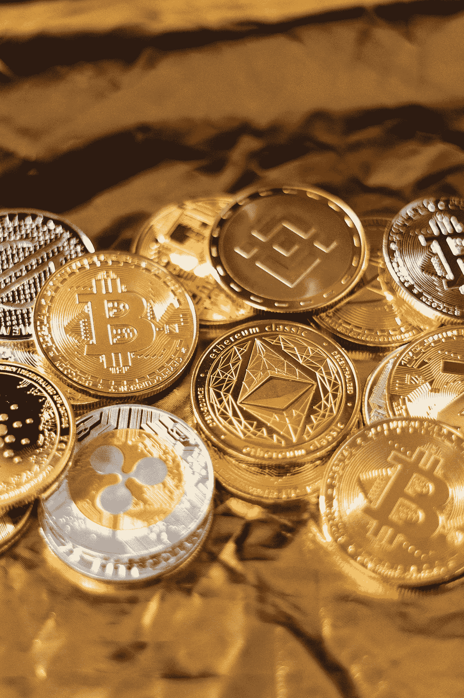

# $ELMNT 的 Tokenomics 是什么？elements NFT 的象征。

> 原文：<https://medium.com/coinmonks/what-is-the-tokenomics-of-elemints-nft-556c9c50030a?source=collection_archive---------56----------------------->

Photo by [Art Rachen](https://unsplash.com/@artrachen?utm_source=medium&utm_medium=referral) on [Unsplash](https://unsplash.com?utm_source=medium&utm_medium=referral)

***免责声明:*** *本博客仅用于一般教育目的。此处提供的信息不构成投资或交易的建议或推荐。在承担财务风险之前，请寻求专业建议。*

# 为什么设计良好的记号组学很重要？

“令牌组学”解释了控制或管理加密资产的逻辑和动机。它包括资产运营的所有方面，以及可能对其长期价值产生影响的任何心理或行为因素。

拥有出色的令牌组学意味着加密货币是长远之计。对于 DeFi 和 NFT 合作的项目来说也是如此。就在这个月，2022 年 4 月，NFT Elemints 将推出自己的令牌，命名为$ELMNT。(https://app.elemints.io)

$ELMNT 将成为[elements NFT](https://app.elemints.io)的加密货币代币，这是一种 NFT，通过交易和押注其(区块卡)来整合 DeFi 的效用。想了解更多关于 Elemints NFT 的信息，可以阅读我之前的博客[https://medium . com/coin monks/why-Elemints-NFT-project-have-a-great-potential-a 837 a4 b 5071 f](/coinmonks/why-elemints-nft-project-have-a-great-potential-a837a4b5071f)。

# $ELMNT 的初始令牌组学:

**初始硬币发售(ICO) = 30 万** *(27 万 ICO 销售+ 3 万促销赌注池空投)*

**锁定的元件= 200，000**

**elements 团队分配= 100，000***(1 年以上既得—每季度 25，000)*

**专用于流动性池= 400，000**

**专用于交易所= 100 万**

# 还有更多！

连续 60 天以上持有$ELMNT 的钱包地址将收到从投资中产生的季度利润分配和从抵押中赚取的收益。

# 最后的想法

**代币供应—** 总共将有 2，000，000 美元的 ELMNT 代币在流通。代币可能会升值，因为流通中的代币将会很少。

**需求—** 现在预测还为时过早，因为 NFT 相对较新，但是，由于 NFT 的标桩功能，很可能新手和经验丰富的 NFT 收藏家也会尝试其治理令牌$ELMNT。

总之，具有良好设计的令牌组学的项目将更有可能成功，因为它激励用户或持有者购买和持有他们的令牌，另一方面，具有糟糕的令牌组学的 NFT 项目将是一个失败。

***关于作者***

Brayan Nelson 是一名业余作家，目前是一名大学讲师，同时在 NFT 的一个项目中实习。在 Medium 上，他写了他在 NFT 和元宇宙的联系和教育之旅。订阅他的时事通讯，成为第一个阅读他的博客故事的人。你也可以在 bnelsonsep3@gmail.com 通过电子邮件联系他

> 加入 Coinmonks [电报频道](https://t.me/coincodecap)和 [Youtube 频道](https://www.youtube.com/c/coinmonks/videos)了解加密交易和投资

# 另外，阅读

*   [币安 vs FTX](https://coincodecap.com/binance-vs-ftx) | [最佳(SOL)索拉纳钱包](https://coincodecap.com/solana-wallets)
*   [比诺莫评论](https://coincodecap.com/binomo-review) | [斯多葛派 vs 3Commas vs TradeSanta](https://coincodecap.com/stoic-vs-3commas-vs-tradesanta)
*   [Capital.com 评论](https://coincodecap.com/capital-com-review) | [香港的加密借贷平台](https://coincodecap.com/crypto-lending-hong-kong)
*   [如何在 Uniswap 上交换加密？](https://coincodecap.com/swap-crypto-on-uniswap) | [A-Ads 评论](https://coincodecap.com/a-ads-review)
*   [WazirX vs CoinDCX vs bit bns](/coinmonks/wazirx-vs-coindcx-vs-bitbns-149f4f19a2f1)|[block fi vs coin loan vs Nexo](/coinmonks/blockfi-vs-coinloan-vs-nexo-cb624635230d)