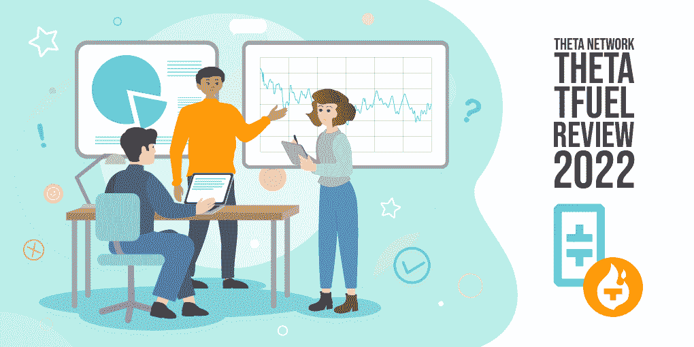

# 什么是θ？2022 年西塔评论

> 原文：<https://medium.com/coinmonks/what-is-theta-theta-review-2022-ec8f386d7a6?source=collection_archive---------3----------------------->

流媒体和视频分享平台占据了互联网流量的很大份额。然而，像 YouTube 这样的公司和服务是那些获取大部分利润的人，而不是真正推动流媒体服务增长的内容制造商。有机会创造一个更公平的制度吗？

[**Theta**](https://changenow.io/currencies/theta) 旨在通过引入去中心化的视频流网络来解决这个问题。该平台在内容创作者、观众和所有帮助推广它的人之间分配奖励。所有帮助在线视频行业民主化的用户都可以从 Theta 中获利。

# Theta 如何革新视频流？

Theta 是一个去中心化的流媒体平台和内容交付网络。它的主要目标是提高交付内容的质量，减少观众加载视频的时间。该项目由 Theta Labs，Inc .公司在旧金山创立，在 2017 年的一次象征性销售中，该团队吸引了 2000 万美元的初始投资。

Theta 出现在区块链技术和流媒体的交汇点，当时很明显:人们对分布式 P2P 网络的兴趣正在增长，视频平台也有需要解决的问题。以下是其中的主要内容:

*   视频的质量取决于你在世界的哪个地方。许多地区遭受重新缓冲和加载内容的麻烦。
*   4K 和 8K 视频有需求，但很多用户因为交付效率低而无法访问。
*   在 YouTube 等内容交付的集中模式中，内容创作者和观众从他们的活动中获得一小部分利益。

Theta 旨在通过分散的点对点服务来解决这些问题，该服务将通过以下方式激励用户，包括内容创作者和观众:

*   消费者使用该平台将获得一个[**t 燃料**](https://changenow.io/currencies/theta-fuel) 代币奖励。如果他们有一些未使用的带宽，他们可以和其他人分享，也可以赚到 TFUEL。
*   由于该系统是分散的，全球所有用户将平等地访问内容和相同的视频加载时间。
*   这种模式的流媒体成本要低得多，因为不需要昂贵的硬件来支持流媒体。

Theta 是一个开源平台，任何人都可以使用它进行直播、托管 VR 内容、电子竞技和音乐。开发人员可以在 Theta 上构建他们的 dApps，因为该平台支持智能合约。

# Theta 背后的团队是什么？

Theta 由首席执行官 Mitch Liu 和首席技术官 Jieyi Long 共同创立。他们一起想出了一个想法，重新思考视频流，使其在一个分散的网络中运行。Theta 团队包括 21 名开发人员、工程师和经理。该平台得到了数十家投资者的支持，包括大型风险基金和索尼(Sony)和三星(Samsung)等科技公司。

Theta 拥有一个令人印象深刻的顾问小组，包括来自微软、索尼、威瑞森和 Twitch 的顶级专业人士。最著名的 Theta 支持者是 YouTube 的联合创始人陈士骏。他相信，由于更好的图像质量和更低的内容交付成本，该平台将成功地变革视频行业。

Theta 还拥有强大的合作伙伴网络，包括米高梅公司、美国宇航局和凯蒂·佩里等名人。

# Theta 路线图

Theta 在其官方网站上公布了一份详尽的路线图。至于 2021 年，最显著的成就包括推出 NFT 市场**(测试版)以及与 Ledger 的集成——钱包增加了对 THETA 令牌的支持。**

**Theta 为 Q1 2022 制定的计划包括:**

*   **推出 TD ROP——这是一种新的象征，将促进 NFT 流动性挖掘和分权治理。**
*   **一个带有以太坊的跨链桥计划上线。它将允许基于 Theta 和以太坊的 dApps、分散式交换和 NFT 进行互操作。**
*   **精英边缘节点将获得存储 NFT 的机会。**

**这是 Q2 的计划:**

*   **一个用于点对点视频分享的 NFT 平台将会推出测试版。**
*   **将向用户介绍现场体验视频流平台。**
*   **边缘流节点将经历重大改进。**

# **Theta 区块链**

**西塔区块链是分散式视频分享平台的支柱。它支持智能合约和 NFTs，基于多级拜占庭容错共识算法，每秒可处理 1，000 笔交易。**

**有两种主要的节点类型通过验证交易和托管视频来支持网络:**

*   ****企业验证器节点。这种类型的节点只有 20-30 个，由谷歌、币安和西塔实验室这样的巨头运营。企业验证器节点将事务放入块中，并将它们引入网络。****
*   ****守护节点。**这是 Theta 区块链的第二层安全:守护节点密封这些块，检查它们的有效性，并充当检测故障节点的守护者。**

**Theta 中还有 13 万个**边缘节点**提供计算能力，通过 [**EdgeCast**](https://community.theta.tv/theta-edgecast/) 服务在平台上中继视频流，并获得 TFUEL 代币奖励。边缘节点有助于网络抵御审查:由于 Theta 是分散的，没有人能像集中服务那样控制或禁止视频。**

****

# **Theta 如何提供高质量的视频？**

**传统的视频流服务通过从它们的数据服务器广播视频来运行。如果你住在一个基础设施良好的大城市，你可以享受高质量的图像。然而，在世界上的许多地区，包括贫穷国家和偏远地区，如森林和沙漠，这一水平是无法达到的。**

**由于这些地区几乎没有服务器，那里的用户会经历持续的延迟和低质量的流媒体。在这样的地区建设基础设施是昂贵的。Theta 提供了一个替代方案:它鼓励用户通过全球缓存计划共享他们的带宽和计算能力。**

**这就是流媒体在偏远地区也能很好工作的原因。它变得独立于中央服务器，并走向点对点:用户观看其他 Theta 用户与他们分享的视频。要欣赏这些内容，你必须支付一些 Theta 代币，自己成为一名主持人——但反过来，当有人为你的流媒体发送代币时，这将会得到回报。**

# **双令牌系统**

**在 Theta 生态系统中有两个标志:**

*   **[**THETA**](https://changenow.io/currencies/theta) 是一个确保网络安全和去中心化治理的打桩令牌。它的最大供应量是 10 亿代币。**
*   **[**TFUEL**](https://changenow.io/currencies/theta-fuel) 是一种用于支付交易费用、奖励赌注者、为智能合约提供动力的代币。它的最大供应量是 50 亿。燃料是通货紧缩的——用它支付的汽油费被烧掉了。这有助于将代币价格保持在较高水平。**

# **我能开采 THETA 和 TFUEL 吗？**

**你不能挖掘 THETA 和 TFUEL，但是可以在[**THETA Web Wallet**](https://wallet.thetatoken.org/unlock/keystore-file)中下注。西塔赌注的最低金额是 1000 个代币，这允许你成为一个守护节点。没有具体的硬件要求—节点可以在 PC 或手机上运行。奖励以 TFUEL 支付，取决于您下注的代币数量。股份可以随时收回。一旦您认领，资金将在 48 小时内到达您的钱包。**

**对于在 Theta 上托管和中继视频并赚取 TFUEL 的边缘节点，也可以使用 Staking。他们可以获得这个令牌，成为精英边缘节点。TFUEL 赌注的最低限额为 10，000 个代币，最高限额为 500，000 个代币。如果边缘节点取消标记，它们将在 60 小时内返回。**

# **THETA 和 TFUEL 2022 价格预测**

**自从 THETA 在各大密码交易所上市以来，其投资回报率一路飙升至 1800%。硬币价格从 2021 年 1 月 1 日的 2 美元，短短 4 个月就涨到了 14.3 美元，2021 年 4 月达到历史最高。2022 年 3 月，代币交易价为 3 美元。**

**大多数平台都看好 THETA。[**trading beats**](https://tradingbeasts.com/price-prediction/theta-network)**认为该代币到 2022 年底将上涨 18%，达到 3.5 美元。该平台预计，到 2025 年，THETA 将实现 100%的投资回报率，交易价格将在 5.7 美元至 6.6 美元之间。[**CryptoGround**](https://www.cryptoground.com/theta-price-prediction)**从现在开始仅仅一年就给了θ$ 5.6。该服务预测，这种代币 6 个月后的价格为 3.9 美元，5 年后为 20 美元。******

******TFUEL 也被许多人视为一项潜在的好投资。目前，代币价格为 0.17 美元，也从 2021 年 1 月的 0.04 美元飙升至同年的 0.58 美元。TFUEL 的整体投资回报率为 890%。 [**钱包投资者**](https://walletinvestor.com/forecast/theta-fuel-prediction) 预计代币一年后的价格为 0.19 美元，5 年后为 0.27 美元。 [**GOV Capital**](https://gov.capital/crypto/theta-fuel/) 给 TFUEL 一年 0.69 美元，并假设该令牌将在 2024 年越过 1 美元大关，在 5 年内达到 4.38 美元。******

# ****最佳 THETA 和 TFUEL 钱包****

****为了在用户友好的界面中私密和安全地存储 THETA 和 TFUEL，使用 [**NOW Wallet**](https://walletnow.app/) 。这款非托管的移动应用程序适用于 iOS 和 Android。在 NOW Wallet 中，您可以享受内置的加密交换，用数百种加密货币交换 Theta 令牌，并将其与 350+其他数字资产一起存储。你可以在 NOW Wallet 里用信用卡购买 THETA 和 TFUEL。****

****如果你想充分利用 Theta 生态系统，请下载 Theta 官方钱包。它有 web 界面和移动应用程序两种形式，还可以与 Ledger 和 Trezor 等硬件钱包配合使用。不过注意，Ledger 只支持 THETA，Trezor 只保留 TFUEL。****

# ****怎样才能买到 THETA 和 TFUEL？****

****无需注册即可购买 [**THETA**](https://changenow.io/currencies/theta) 和 [**TFUEL**](https://changenow.io/currencies/theta-fuel) 以及拥有 350+加密货币的 KYC on ChangeNOW。所有费用都已经包含在估计价格中:没有隐藏的费用。您可以在经典利率流(汇率在交换期间会略有波动)或 [**固定利率流**](https://changenow.io/blog/theta-and-tfuel-now-available-for-fixed-rate-exchange-on-changenow) 中交换代币(保护您免受市场波动的影响，并帮助您消除风险——您将获得与您看到的一样多的代币)。****

# ****摘要****

****Theta 是一个实现点对点视频流的平台，内容制作者因其内容而获得奖励，用户因与其他观众分享内容而获得报酬。由于网络的分散化，视频不能被任何集中的实体审查或删除，并且在世界上任何地方都可以获得相同质量的视频。****

****THETA 是允许分散治理的主要筹码，TFUEL 用于分配奖励和支付交易费用。Theta 网络由顶级加密行业公司和专业人士支持，它有一个强大的路线图。这些事实对其价格动态产生积极影响，并激励专家做出看涨的价格预测。您可以在 ChangeNOW 上购买 [**THETA**](https://changenow.io/currencies/theta) 和 [**TFUEL**](https://changenow.io/currencies/theta-fuel) 而无需注册，并将代币存储在一个安全轻便的手机 [**NOW 钱包**](https://walletnow.app/) 中。****

> ****加入 Coinmonks [电报频道](https://t.me/coincodecap)和 [Youtube 频道](https://www.youtube.com/c/coinmonks/videos)了解加密交易和投资****

# ****另外，阅读****

*   ****[印度的加密交易所](/coinmonks/bitcoin-exchange-in-india-7f1fe79715c9) | [比特币储蓄账户](/coinmonks/bitcoin-savings-account-e65b13f92451)****
*   ****[Cloudbet 赌场评论](https://coincodecap.com/cloudbet-casino-review) | [点火赌场评论](https://coincodecap.com/ignition-casino-review)****
*   ****[币安费用](/coinmonks/binance-fees-8588ec17965) | [Botcrypto 审查](/coinmonks/botcrypto-review-2021-build-your-own-trading-bot-coincodecap-6b8332d736c7) | [Hotbit 审查](/coinmonks/hotbit-review-cd5bec41dafb)****
*   ****[MyConstant Review](https://coincodecap.com/myconstant-review) | [8 款最佳摇摆交易机器人](https://coincodecap.com/best-swing-trading-bots)****
*   ****[我的加密副本交易经历](/coinmonks/my-experience-with-crypto-copy-trading-d6feb2ce3ac5) | [AAX 交易所评论](/coinmonks/aax-exchange-review-2021-67c5ea09330c)****