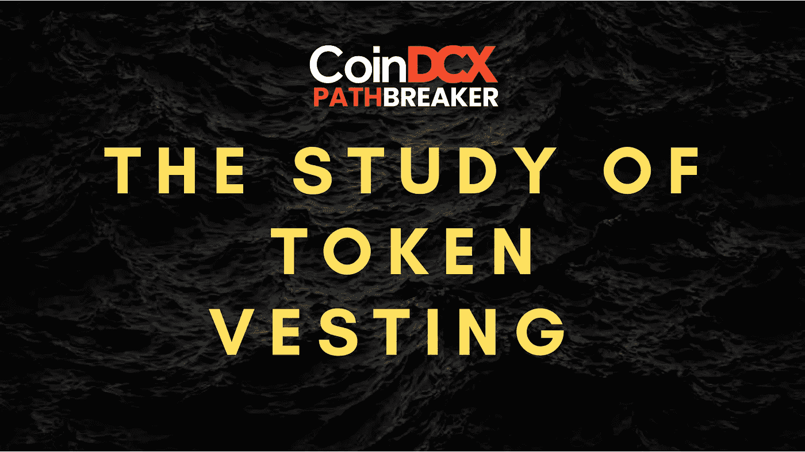
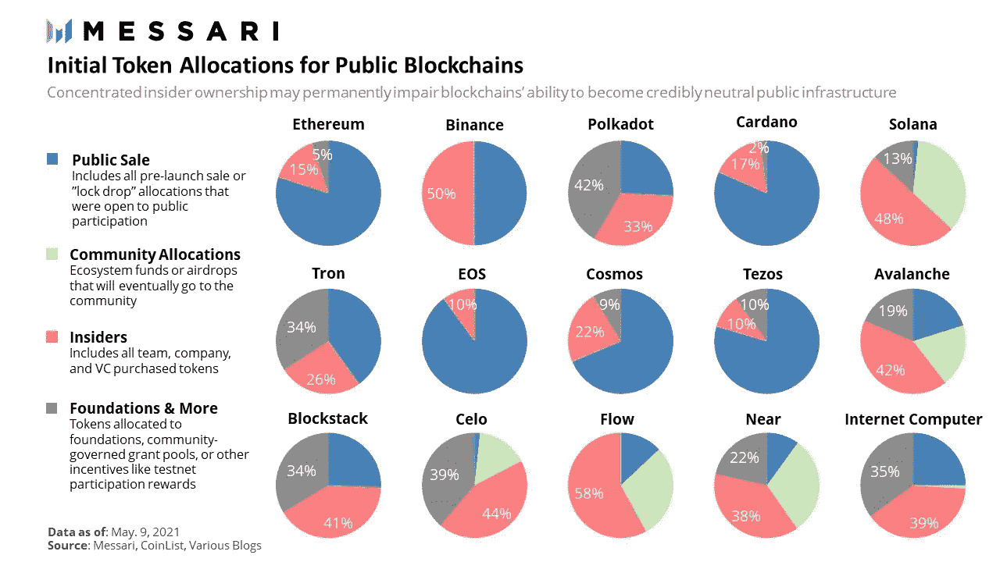
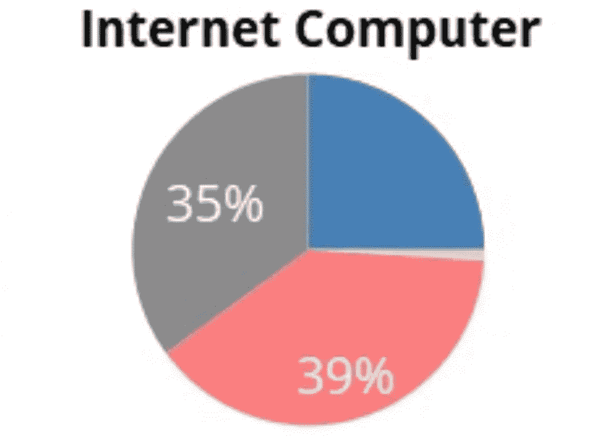
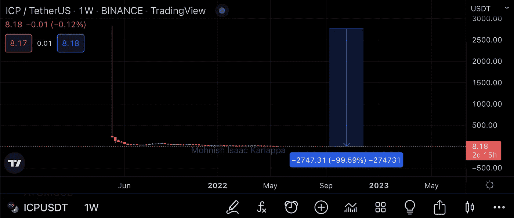

# 什么是代币归属？

> 原文：<https://medium.com/coinmonks/what-is-token-vesting-5838217beb51?source=collection_archive---------18----------------------->

# CoinDCXpathbreaker

# 介绍📚

加密空间正在飞速发展🚄似乎每隔一天我们都会听到一个旨在解决现实世界问题的新项目发布，但是如何解决项目本身的实际问题呢？🤔让我解释一下…

多个项目在一轮秘密牛市中出现，在熊市中消失在深渊中。你知道原因吗？这主要是因为团队放弃了他们的代币&继续前进。此外，在加密的狂野西部，团队倾销代币和骚扰投资者是非常真实的事情。

**Team go Dumpy Dumpy 📉**

这就是**令牌授予**进入场景的地方(将在下面详细解释)，这也是 **Streamflow** 作为一个平台旨在解决的问题。

下面的深入探讨不仅旨在涵盖关于 Streamflow 的所有知识，而且我们还将讨论归属、悬崖期的重要性，并使用实际项目来理解 Crypto 中令牌归属合同的重要性。

# 了解令牌归属和悬崖⏱

**Crypto jargon got the new guy like…**

授予一词源于拉丁语" *vestire* "更简单地说， *vestire* 是指将资产交由第三方保管的行为。

我知道术语**归属**可能听起来很隐晦，让你迷惑😵‍💫，但是等一下，我将把它分解成更简单的术语。**令牌授予**只不过是项目令牌的**锁定期**，这些令牌是 **ICO** (首次发行硬币) **IDO** (首次发行股票)&/或分配给**团队/合作伙伴/风险投资家**的令牌的一部分。

归属可以进一步分为两大类:

**线性归属:**在这种分配方法下，代币以线性方式或简单地说，以相等的部分释放。

例如，XYZ 项目已经为其团队授予了 100，000 枚代币。在线性授权模式下，每月可以解锁 10，000 个项目令牌，这将在 10 个月的时间内完成整个授权计划。

**扭曲授予:**在这种分配方法下，代币在特定的时间范围内在随机的部分解锁。

例如，XYZ 项目已经为其团队授予了 100，000 枚代币。在扭曲授权模式下，100，000 个项目令牌中的 20%可以在 3 个月内每月发放，剩余的 80%可以在 9 个月的悬崖后发放。

我将在文章的后面用真实的项目例子来介绍这两种类型的授权方法。

## “爵士，那悬崖是什么？”

**Cliff** 不过是一个花里胡哨的术语，用来解释既得权标的存续期。

现在让我们来看看下面这个更重要的问题:

## 那么为什么需要授权呢？😶‍🌫️

你看，每个项目都需要一些资金💰为了**维持、启动、发展和分销**。所有这些都需要团队可以立即部署的流动资金。但是这个资金从哪里来呢？它们可能有多种来源，但我们将讨论两种最主要的资金来源:

1.  **风险投资人****&/或合伙人**
2.  **私人销售回合**

现在，风险投资家是中坚力量——他们会投资一个潜在的项目，这个项目会给他们带来绝对爆炸性的初始投资回报。但是，就像生活中的大多数事情一样，这种初始资金也有一定的条件。一个风险投资家将大量现金投入项目团队的金库，要求某种形式的即时回报…这就是项目最终分配其总可用令牌的一部分以确保资金的地方。

让我们考虑一些核心数据，以便更好地理解:

**Total token allocation breakup vis a vis projects**

上述数据取自 Mesari.io，显示了不同类型投资者类别的一些重要令牌分配:

*   拍卖
*   社区分配
*   **内部人士(风险投资家、合伙人&团队)**
*   基础

出于深入探讨的目的，我们将重点关注第三类投资者，上图用粉色表示投资者类别分配(*不要* *引用我对* 🫠的评价)

我们研究的完美例子是**互联网计算机(ICP) :**

**Total allocation percentage of $ICP**

上图显示**互联网计算机**将 39%的代币供应分配给了**风险投资家、合伙人&团队**。$ICP 令牌总数数据:

**Internet Computer tokenomics**

猜猜当这些代币同时在集中交易所上市时会发生什么？👇

**The aftermath of $ICP 💀**

正如你在上面的图表中所看到的，ICP 在首次 CEX 上市后大举抛售股票，自其上市价格以来，其今天的市值已经损失了 99%以上。

**今日脑筋急转弯:** *在散户投资者无法进入⛔️to 这个项目的时候，谁会在上市时抛售这些股票？🤯*

是的，是风险投资家&项目内部人员！这整个大屠杀都要归咎于一个绝对恐怖的**令牌分配模型**被 **Dfinity (** 互联网计算机**的开发者)**所采用

> “我们的分析让我们相信，可能与 Dfinity 有关的内部人士一直在交易所倾销数十亿美元的 ICP，损害了早期小支持者和散户投资者的利益。”

那么，这本来是可以避免的吗？

**绝对**。如果$ICP 的项目团队更加努力，部署了一个适当的令牌授权计划，并预先定义了一个悬崖周期&令牌的预定解锁百分比，那么这一预防措施绝对可以将项目从这个糟糕的转储中拯救出来。

## 需要来自安全视点的令牌授权:

既然我们已经了解了令牌归属及其在现代加密空间中的相关性，现在让我们试着从网络安全的角度来看令牌归属的必要性。

如果重新审视加密领域过去的安全漏洞，这些数据会让你喘不过气来，因为大量的资金将永远消失。

**2022 年 3 月 23 日**见证了加密领域有史以来发生的最大规模的加密黑客攻击——**从浪人网络中流失了 6 . 25 亿美元的 ETH** 累积损失，严重破坏了 Axie Infinity 生态系统。

如果 Axie Infinity 的团队已经部署了一个带有可靠发布计划的令牌授权合同，那么智能合同将更难破解。在当今这个时代，当加密技术不断发展，黑客技术变得更加复杂时，令牌授权就成了当务之急。

非常感谢 CoinDCX 给我这个机会来撰写如此详细的报告，并成为# CoinDCXpathbreaker 计划的一部分，使我能够与加密领域的每个人分享这些知识。

> 加入 Coinmonks [电报频道](https://t.me/coincodecap)和 [Youtube 频道](https://www.youtube.com/c/coinmonks/videos)了解加密交易和投资

# 另外，阅读

*   [5 款最佳加密交易终端](https://coincodecap.com/crypto-trading-terminals) | [最佳 DeFi 应用](https://coincodecap.com/best-defi-apps)
*   [比特币基地 vs 瓦济克斯](https://coincodecap.com/coinbase-vs-wazirx) | [比特鲁点评](https://coincodecap.com/bitrue-review) | [波洛涅克斯 vs 比特鲁](https://coincodecap.com/poloniex-vs-bittrex)
*   [德国最佳加密交易所](https://coincodecap.com/crypto-exchanges-in-germany) | [Arbitrum:第二层解决方案](https://coincodecap.com/arbitrum)
*   [币安交易机器人](/coinmonks/binance-trading-bots-d0d57bb62c4c) | [OKEx 评论](/coinmonks/okex-review-6b369304110f) | [阿塔尼评论](https://coincodecap.com/atani-review)
*   [最佳加密交易信号电报](/coinmonks/best-crypto-signals-telegram-5785cdbc4b2b) | [MoonXBT 评论](/coinmonks/moonxbt-review-6e4ab26d037)
*   [如何在 Bitbns 上购买柴犬(SHIB)币？](https://coincodecap.com/buy-shiba-bitbns) | [购买弗洛基](https://coincodecap.com/buy-floki-inu-token)
*   [CoinFLEX 评论](https://coincodecap.com/coinflex-review) | [AEX 交易所评论](https://coincodecap.com/aex-exchange-review) | [UPbit 评论](https://coincodecap.com/upbit-review)