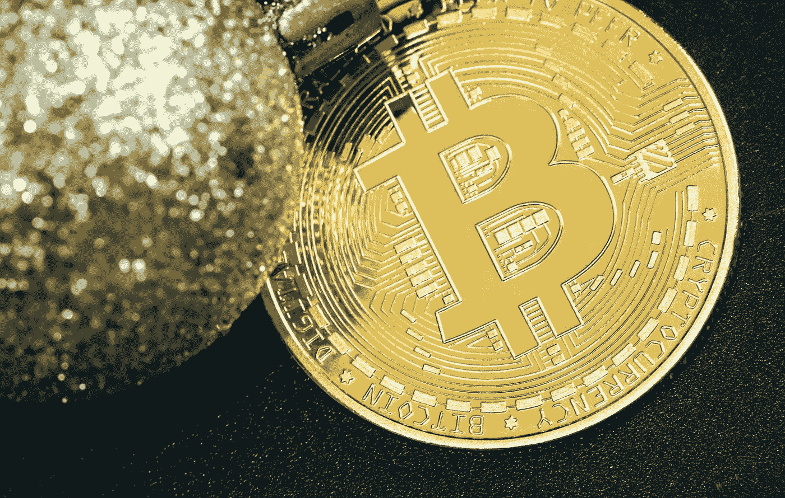

# 区块链中什么是令牌化？

> 原文：<https://medium.com/coinmonks/what-is-tokenization-in-blockchain-153e40e2d287?source=collection_archive---------8----------------------->

## 区块链令牌化终极指南

Tokenization

今天的话题是**什么是区块链中的标记化**。在与区块链技术和加密货币相关的讨论中，您可能听说过“令牌”这个术语。代币具有改变数据传输方式的力量，同时也提供了创新的投资新途径。让我们来看看什么是标记化！

令牌化的数字资产正在改变我们交换信息和价值的方式。

# 什么是代币？

这些是以另一种形式(通常是数字形式)表示敏感资产或数据点的实体。为了使其概念化，我们可以看一个实物形式的代币的例子，如赌场筹码。这些筹码用于将它们背后的实际货币代币化，从而在玩赌场游戏时易于使用。

赌场筹码完全取代了基础资产，只能在预先确定的情况下使用——在这种情况下，就是赌场本身。如果你持有价值 500 英镑的赌场筹码，你可以把它们换成 500 英镑的法定货币——你不能拿它们去买杂货。

多年来，物理令牌的概念已经在各种行业的数字系统中实现。使用这一过程的最流行的方式之一是在进行卡支付时，作为加密的替代方案。这是通过用户将他们的卡信息存储为“令牌”来实现的，令牌是物理信用卡和借记卡上敏感卡信息的替代品。

这些令牌充当卡信息的“替身”,通常表示为随机的数字串。由于这个令牌链接到底层的信用卡或借记卡，商家不需要敏感的卡信息来处理支付——他们需要的只是令牌。

在交易的另一端，银行将接收来自商家的资金请求，以支付付款人请求的商品或服务。银行还将令牌化元素纳入其服务产品中，因为客户的资金以令牌化的数字格式存储。这种格式以数字形式表示客户的资金，允许各方之间进行快速转账。

这一过程消除了敏感卡信息被盗或复制的风险。然而，在支付处理过程中使用令牌化只是这个过程的一个例子。当与区块链技术相结合时，令牌化开辟了改变当今世界企业运营方式的途径。

# 标记化和区块链技术的结合

就像赌场发行筹码作为自己的代币一样，区块链也可以允许代币在网络内发行和存储。由于区块链是一个公开分发的账本，无论何时在网络上发行令牌，所有区块链用户都可以看到令牌并监控其移动——但他们不会看到底层的确切资产。

在区块链使用代币最流行的例子是比特币——作为货币的代币化。每个比特币都是一个令牌，可以在整个网络中被追踪。因此，如果 A 给 B 一个比特币，网络上的所有其他用户都可以实时看到交易的发生。

Blockchain crypto token

# 安全令牌、公用令牌和加密货币

一般来说，令牌是特定资产或工具的表示。在区块链技术的上下文中，令牌化是将有价值的东西转换成可在区块链应用程序上使用的数字令牌的过程。在区块链证券化的资产有两种形式。它们可以代表**有形资产**如黄金、房地产和艺术品，或者**无形资产**如投票权、所有权或内容许可。实际上，任何东西都可以被令牌化，如果它被认为是可以被拥有的资产，对某人有价值，并且可以被纳入更大的资产市场。

记号化的概念先于区块链技术。自 20 世纪 70 年代以来，金融服务行业已经实施了某种形式的令牌化来保护客户的机密信息。这一过程通常包括将敏感信息(如信用卡号、社会保险号和其他个人身份信息)转换为一串字母数字字符，然后通过加密功能对其进行处理以创建唯一的令牌。

在某种程度上，这种方法与区块链技术实现的标记化过程有一些相似之处。然而，尽管过去的令牌化机制主要旨在保护敏感数据，但区块链支持的令牌化允许对资产进行更安全、更灵活的令牌化，从而显著拓宽了数字令牌在各行各业的潜在应用。

# 什么是资产令牌化？

资产虚拟化是将现实世界的资产虚拟化到区块链网络上。

想象一下你拥有一栋房子——你对那栋房子所有权的记录会以各种实体文件的形式出现，比如地契。如果你卖了房子，转让房屋所有权的过程是一个物流难题，在销售过程中，所有的文件和文书工作都由各方处理，存在更高的人为错误风险。

相反，你可以将你的房子作为区块链网络上的一个“令牌”——将所有现有的必需数据附加到令牌本身。转让所有权的过程将更加容易和顺畅，因为不需要中间人来促进交易。此外，由于所有权的转移将是特定区块链上所有用户的公开可用信息，因此整个过程将是透明的，并且在将来易于参考。

# 令牌化的好处

加密令牌为用户提供了多种好处，这些好处可以归纳为三大类:

**更高的流动性:**一旦被令牌化，资产就可以提供给更多的受众，这增加了市场流动性，并消除了与传统上更难或更耗时出售的投资(如艺术品或房地产)相关的“流动性溢价”。代币化资产可以设计为在线自由交换，并允许投资者获得代币基础资产的部分所有权。因此，加密令牌既可以提高现有市场的流动性，又可以为更多的投资者提供更广泛的投资机会。

**更快、更便宜的交易:**加密令牌允许投资者绕过市场中介和其他通常参与传统资产管理流程的中间人。这有效地降低了每笔交易的交易成本和处理时间，提供了一种更加简化、更具成本效益的价值转移方法。此外，由于加密令牌存在于区块链上，它们可以在全球范围内全天候交易和销售。

**透明性和可证明性:**由于加密令牌位于区块链，用户可以通过加密验证的方式轻松追踪其来源和交易历史。交易可以自动记录在区块链上，区块链技术实现的不变性和透明性有助于保证每个代币所述历史的真实性。这些特性使加密令牌能够达到大多数其他数字资产无法比拟的可靠性水平。

加密令牌使信息和价值能够以高效和安全的方式进行传输、存储和验证。虽然资产令牌化对金融服务行业有着巨大的影响，但这项技术对小投资者和其他个人同样有价值，他们可以从更多的市场准入和更有效的利用现有资产的方式中受益。

# 令牌化面临的挑战

使用加密令牌的区块链项目可能会遇到监管障碍，因为世界各国政府都在争先恐后地应对这项新技术前所未有的性质。这些代币通常包含金融证券中常见的特征，但通常不受与传统证券相同的法规约束。这给试图平衡创新和合规性的政府机构和区块链项目都带来了挑战。

虽然越来越多的国家已经实施了加密法规以鼓励增长，但其他国家正在采取更严格的方法以防止潜在的问题。例如，美国证券交易委员会(Securities and Exchange Commission)正在考虑将某些代币正式归类为证券，这将使这些项目受到更严格的外部审查。

监管者的另一个主要担忧是，证券代币将如何与其基础资产挂钩。如果成千上万的匿名投资者集体拥有一个令牌化的酒店，他们将如何确定谁负责酒店的维护和运营？或者，如果支撑资产支持代币的黄金储备消失了，会发生什么？换句话说，虽然对数字资产进行令牌化允许分散、不可信的价值转移，但物理资产令牌化可能仍需要某种程度的集中化和第三方参与。

因此，为了在更广泛的行业中实现加密令牌的大规模采用，可能需要更成熟的监管环境；法院需要明确的规则来仲裁区块链环境和传统世界重叠的案件。许多投资者希望获得特定的保护，以及在智能合约尚未完全规定的情况下寻求追索权的能力。

# 加密令牌化是什么样子的？

加密令牌有四个主要类别，尽管根据特定令牌或令牌化平台的具体情况，这些描述可能会变得模糊。

**安全令牌:**安全令牌体现了特定的投资，例如公司的股票、公司或其他中央集权组织的投票权，或者一些有形或数字的有价值的东西。除了作为基础资产或设施的数字表示之外，安全令牌还可以被编程为具有无穷无尽的独特特征和所有权。因此，这些令牌构成了一种全新类型的数字资产。

**令牌化证券:**需要注意的是，安全令牌不同于“令牌化证券”虽然这两个术语经常被混为一谈，但令牌化安全性是其基础安全性的直接数字替代，通常被设计为易于交换、聚合或使用。换句话说，令牌化证券的存在主要是为了扩大被令牌化的证券的市场可及性或流动性，而没有添加诸如在安全令牌中发现的独特的编程或加密特征。

**公用令牌:**公用令牌代表对给定产品或服务的访问，通常在特定的区块链网络上。公用事业代币可用于为区块链网络的共识机制提供动力，提供分散市场的运营，支付交易费用，或授予持有者在[分散自治组织(DAO)](/coinmonks/what-are-daos-why-do-we-need-them-23738ab528df) 或另一个分散网络内提交和投票表决新发展的权利。虽然安全令牌主要用于建立所有权，但实用令牌更侧重于实际使用。以太坊平台上通过初始硬币发行(ICO)推出的许多加密令牌旨在充当实用令牌。

**货币代币:**货币代币是设计用来交易和消费的。有些是基于基础资产的，如 MakerDAO 的戴和 Gemini 的等资产支持的稳定债券。然而，许多其他的不基于任何基础资产。相反，它们的价值与其分销机制和潜在的区块链网络直接相关。

重要的是要注意，仅仅因为加密令牌是为特定目的而设计的，并不意味着用户只会将令牌用于该预期目的。例如，虽然公用事业代币没有明确设计为投机性投资，但许多人购买这些代币，希望它们的价值会随着对公司产品或服务需求的增长而增加。

除了上述分类之外，令牌还可以设计为可替换或不可替换，这取决于它们的预期用途。可替换的令牌是完全相同的，可以无缝地相互替换。另一方面，不可替代令牌(NFT)是独特的，并且可证明是稀缺的，这意味着它们的历史可以追溯到个体水平。NFT 的例子包括以太坊的 Cryptokitties 和 NFT 市场上可买到的数字艺术和收藏品，如 Nifty Gateway、OpenSea 和 NBA Top Shot。因此，可替换令牌通常用在不关心个人可追溯性的环境中(如提供市场流动性)，而 NFT 用在重视唯一性和可证明的稀缺性的情况下(如数字艺术和收藏品)。

# 我能转让我的代币吗？

代币可以使用区块链技术转移到不同的钱包(或其他方)。当你在区块链的平台上购买代币时，比如以太坊，代币将被转移到你的钱包里。特定令牌将在某些平台上开发，这意味着它们不能转移到另一个平台上。

例如，如果您购买了在以太网上创建的不可替换的令牌(NFT)。这个 NFT 可以很容易地发送给网络上的其他人，只需要接收者的钱包地址。然而，将一个基于以太坊的 NFT 转移到另一个网络是不可能的，因为它将使用完全不同的技术建造。

# 二等兵区块链上可以存在代币吗？

最后，代币可以(也确实)存在于私人区块链上。它们的工作方式与在公共区块链上的工作方式相同，关键的区别在于，在公共区块链的环境中，私有令牌是不被认可的，反之亦然。公共和私有区块链往往不相连，这意味着令牌只能在一种区块链类型上发行和转让。

# 加密令牌化的未来

令牌化——从资产令牌化到房地产令牌化——正在从根本上改变我们与有价值资产互动的方式。区块链技术使任何资产或服务都可以在区块链上表示和存储，从而使资产访问民主化，同时提供前所未有的在线透明度和安全性。然而，由于控制加密令牌的销售、分发和管理的规则继续因国而异，因此需要大规模的多边努力来建立加密令牌有朝一日可能实现的全球无国界价值转移系统。随着世界上越来越多的人和政府开始接受区块链不可思议的力量和效用，象征性的未来正迅速成为现实。

## 在 Linkedin 上关注我，保持联系

[https://www.linkedin.com/in/ishanshahzad/](https://www.linkedin.com/in/ishanshahzad/)