# 什么是令牌组学？

> 原文：<https://medium.com/coinmonks/what-is-tokenomics-14b624b48309?source=collection_archive---------7----------------------->

## 如果你不懂词汇学，你会被淘汰。但什么是令牌组学，你应该警惕什么？以下是你需要了解的关于令牌组学的所有信息。

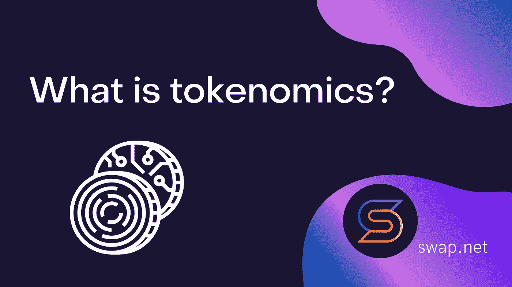

## 今天的菜单上有:

*   什么是令牌组学？
*   通过供给、需求和激励进行估价；
*   记号组学的例子；
*   免费清单。

# 什么是令牌组学？

代币经济学研究影响代币需求的因素。这包括:

*   数学；
*   供应与需求；
*   激励措施；
*   价值累计；
*   人类行为和博弈论。

代币经济学=代币+经济

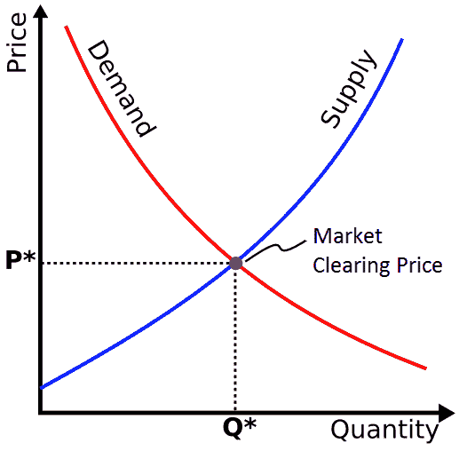

一些最糟糕的投资是因为人们不理解象征经济学。

*   这些代币在没有足够效用的情况下会导致通货膨胀。
*   代币集中在风险投资家和巨鲸手中，导致了散户投资者的头上。

研究令牌组学有助于提高你的加密投资。

# **美元**

2020 年，美国政府印刷了美国货币供应量的 40%。

*   资金涌入市场。
*   住房供应保持不变。(他们无法在 COVID 期间构建)。

这就是美国房地产价格失控的原因。

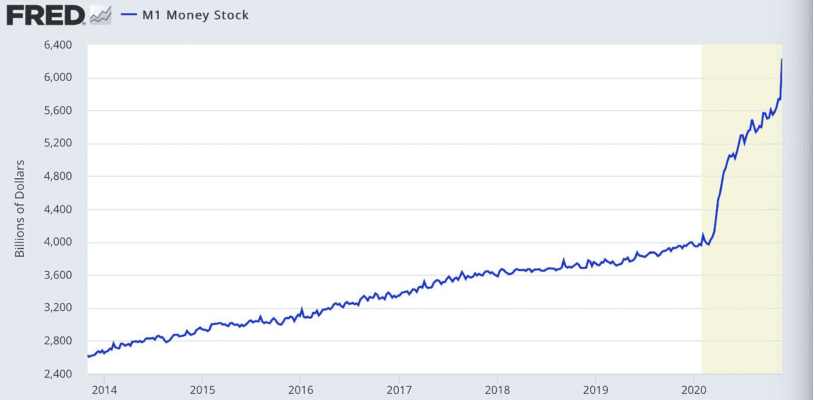

# 供应方的令牌组学

这就是你要注意的:

*   有多少代币？
*   总共有多少代币？
*   谁有代币供应？他们什么时候能出售它们？
*   随着时间的推移，供应量将如何变化？
*   他们的改变政策是什么？

# 新来者如何破产

他们认为 meme 币的价格是 0.00000002 美元，认为只要价格达到 1 美元，他们就会发财。

理解市场资本化将表明这是不可能的。达到 1 美元意味着它比世界上所有的货币供应量都要大。

## 你应该知道的供应指标

*   供应:现在有多少代币
*   最大供应量:可以存在的最大数量
*   市值:当前价格*流通供应量
*   完全稀释资本化:价格*最大供应量。

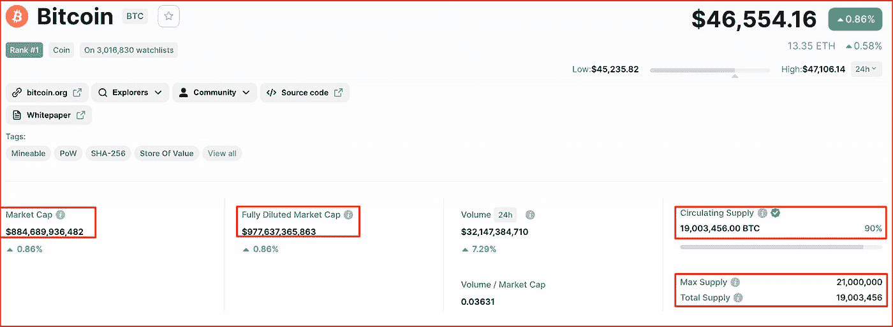

## 为什么上述指标很重要？

指标有助于您了解未来的供应和短缺。比如流通供应量只有 40%你就不会觉得好。这意味着供应量将增加 60%。制造更多的硬币会给价格带来压力。

# 安全货币——比特币

只会有 2100 万个比特币，没人能创造出更多的比特币。

*   比特币供应有限
*   需求正在增长
*   价格应该上涨。

这就是为什么人们经常把比特币比作黄金。

## 比特币减半

除了提供代币，确保考虑发行利率。新代币的印刷速度是多少？

尽管矿商创造了新的比特币，但发行速度放缓。每减半一次，比特币挖矿奖励的发放量就减半。

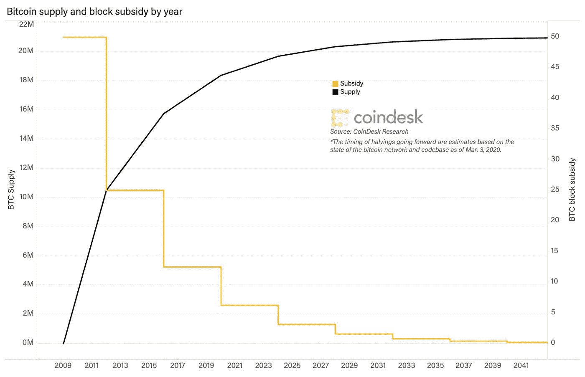

# 通货膨胀的象征——doge coin

Dogecoin 的供应量每年都在增加，而且供应不受任何限制。这对令牌经济学没有好处，因为它是稀缺的反义词

(注意:尽管象征经济学不好，但去年玉米价格仍在上涨)

# 通货紧缩标志

随着时间的推移，当供应量减少时，一些硬币会变得通货紧缩。该协议可以赎回令牌并烧掉它们。

烧毁的硬币=永远丢失。供给下降应该会增加代币的价值(理论上)

## 博柏利烧掉了它的袋子

博柏利创造奢华的包包，独特性是其吸引力的一部分。他们有些包卖不出去——不是打折卖，而是把包烧了。

这让这些包包变得“独一无二”。一个“燃烧”机制的真实例子。

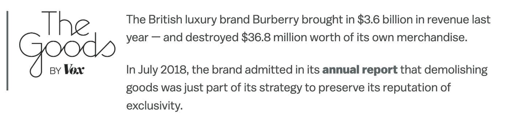

# 以太坊能成为安全货币吗？

*   向股权证明的转变降低了 ETH 的通胀供给。
*   EIP-1559 收取一部分交易费，然后烧掉。

所有这些加在一起(以及更高的需求)意味着以太网可能会陷入通缩。

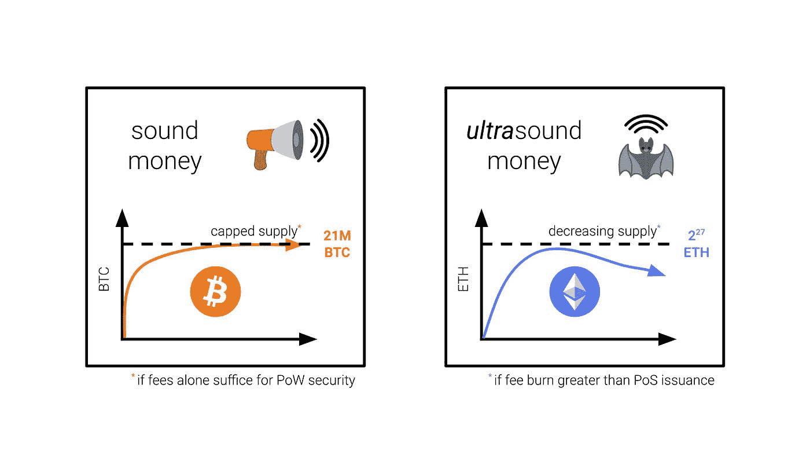

# 分配和分发

初始令牌是如何分配的？大概有两种方式:

**预采:**

*   团队给自己分发代币。
*   分发给内部人员，如团队和风险资本家。

**展会启动:**

*   百分百公平。每个人都有平等的机会。

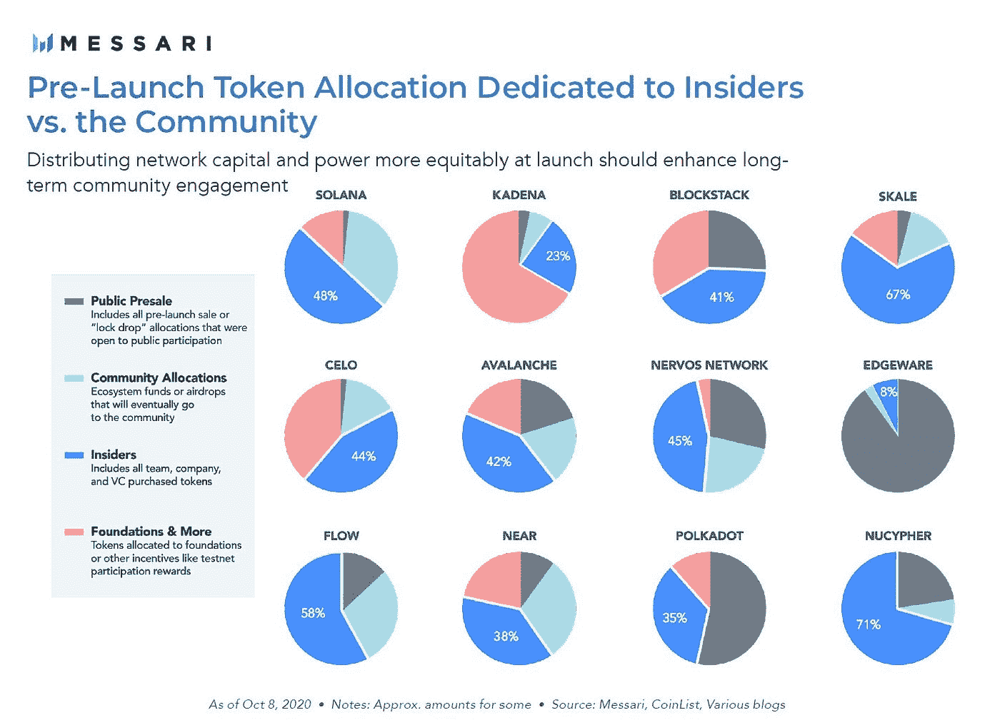

## 为什么重要？

风险资本家和内部人士可以抛售手中的代币，导致价格暴跌。授权意味着他们可以出售代币。

你应该确保早期的支持者从长远来看会受到该协议的刺激。

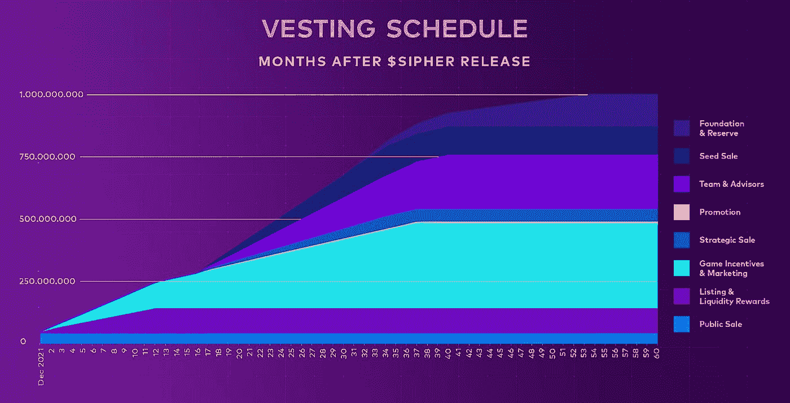

风险投资家并不邪恶。他们可以通过建议、分配和联系为创始团队创造价值。并非所有的风险投资家都是一样的。一些人想为他们的投资创造价值，另一些人想快速转手。

## 团队也可以出售他们的代币

*   这些庞大的循环基金(insentives)？它来自出售代币。
*   他们通过出售来筹集资金。人们忘记了一些工资和费用是以法定形式支付的。

团队销售会降低价格。

# 等式的另一半:需求

需求:让人产生购买欲的因素，以及愿意支付的价格。尽管有通货膨胀，但美元的需求很高，因为它们是美元。世界是靠美元运转的(到目前为止)。

## 是什么推动了代币的需求？

可以注意到三大类:

*   **效用**
*   **累算权益**
*   **迷因和故事**

**公用事业——天然气费用。**

这是使用区块链的费用。

*   你想在 Opensea 上买 NFT 吗？你需要 ETH 来支付汽油费。
*   你想进入范顿的生病的德根农场吗？你需要 FTM。

网络/DAPP 越受欢迎，需求越高。

**实用—有趣**

当游戏真正变得有趣时，GameFi 具有疯狂的潜力。看看 GTA 和堡垒之夜印了多少钱。我们对像 Illuvium 这样的 3a 游戏感到兴奋。这就是我们让更多普通人加入 crypto 的方法。

**效用——大屠杀**

加密货币在现实世界中逐渐获得动力，这刺激了需求。

*   当 TSLA 将比特币加入其资产负债表以对冲通胀时，比特币价格飙升。
*   当 AMC 宣布接受它时，Dogecoin 跳了起来。

## 获取价值。

协议规则。协议打印钱。但是投资者没有得到任何份额。

我们已经在大多数 DeFi 1.0 巨头如 Uniswap 和 Compound 中看到了这种情况。人们想要的是价值，而不仅仅是控制令牌。

**xStaking**

去年我们看到了 xToken 的成长。堆叠代币会给你带来一定比例的平台收益。

*   xSushi — SushiSwap
*   斯佩尔——阿布拉卡达布拉。

这增加了代币的价值。

**治理**

在 DeFi 1.0 中，许多协议打印的令牌除了控制之外没有其他用途。人们种植年息，然后出售代币。

这就是 SushiSwap 刚推出时从 Uniswap 那里抢走这么多用户的原因。

**阻止逃犯**

在 DeFi，人们可以成为逃亡者。APR 农场随着时间的推移而下降，你可以换一个百分比更高的农场。该协议仍然需要流动性。那么他们是如何鼓励人们持有代币而不是追逐年利率的呢？

# 鼓励长期所有权

去年，我们在协议如何激励长期资产所有权方面看到了许多创新。他们的存在减轻了代币销售者的压力。让我们来看看其中的一些:

## **现在的主要机制是锁(时间锁桩)**

你如何停止价格压力？你要求人们锁定他们的代币(有时长达数年)。关键是找到刺激人们这样做的因素。

*   存在阻塞风险
*   替代流动性成本

## 持有-否决(曲线)

当 Curve 引入 veTokens 时，它有了很大的创新。Ve =有条件投票托管。

*   锁定您的代币=投票权。
*   你把它锁得越久，你的投票权就越多。(最长 4 年)

**那么，为什么要关心投票权呢？**

稳定的心脏是 DeFi 的支柱。协议发动了一场战争，以获得更多的流动性/接受他们的稳定硬币。每周 Curve 都会举行投票，决定哪些池获得的奖励最多。而这些协议中的一些会贿赂你投他们的票！

**持有—养殖奖励增加**

我们看到 AMMs 采用这种报酬递增的模式。区块链代币给你投票选池的权力。协议现在为了自己的利益发动了一场争夺控制权的战争。

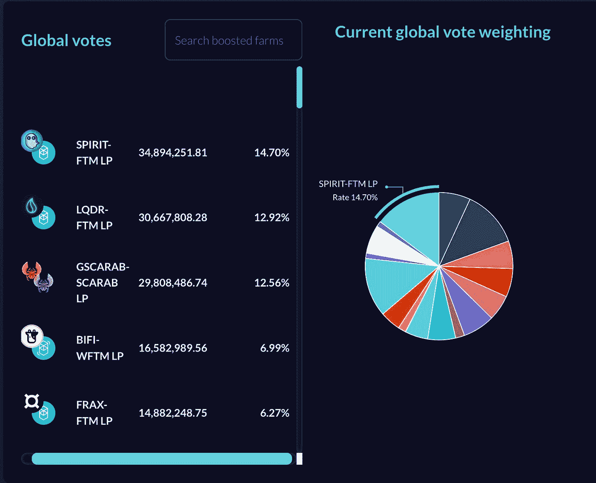

**持有——麻醉，失去一切。**

鸭嘴兽金融为虚拟企业引入了一个最有趣的机制。

*   通过放置$PTP，你得到$vePTP。这给你的稳定投资带来了更高的年回报率。
*   解锁$vePTP？你失去了所有的视觉诱发电位。

那就没那么好卖了。

**持有—奖励/赠品/抽奖**

对抗王国允许你获得赌注的奖励，这是收入的一小部分。

他们还拥有:

*   下注 xJewel / xCrystal 可让您进入抽奖活动以获得赠品。这包括有价值的 0 代英雄。
*   牛排吃得越多，赢得的奖券就越多。

**保持—锁定/锁定光线**

对抗是一个正在制作中的游戏。他们是如何防止人们掉落游戏代币的？他们会自动屏蔽一部分。Crystalvale 刚刚推出。可以获得 4k APR，但是如果现在申请提现，95%会被屏蔽一年。

**一年内所有的代币都会进杯子吗？**

*   他们一旦解锁，不会一下子全部解锁，而是会逐渐发生。
*   他们会利用这段时间给游戏增加很多东西，比如 PVE 和 PVP。

他们希望一年后游戏会更完整。

## 模因和叙事

这是一种奇怪的人类欲望。有人花了 2000 美元从 Salt Bae 买了一块金牛排。尽管存在可怕的象征经济学，但硬币可能会遭到重击。有时候，迷因、叙事和营销可能是巨大的。

# Dogecoin 神秘案件

Dogecoin 去年有疯狂的增长。世界首富伊隆对 Dogecoin 有一种奇怪的痴迷。当他出现在周六夜现场时达到了顶峰。人们纷纷购买，希望伊隆能继续给 Dogecoin 打气。

人们买他们认为会赚钱的东西。有一些协议有很好的令牌组学，但它们的价格是垃圾。这可能是因为叙事——人们在追逐下一个明亮闪亮的物体。

# 糟糕的令牌组学— PancakeSwap

PancakeSwap 在一年前见顶，目前呈下降趋势。

*   这是通货膨胀的象征。(供应)
*   代币没有价值(需求)

**煎饼“打印”蛋糕，用户立即出售。**

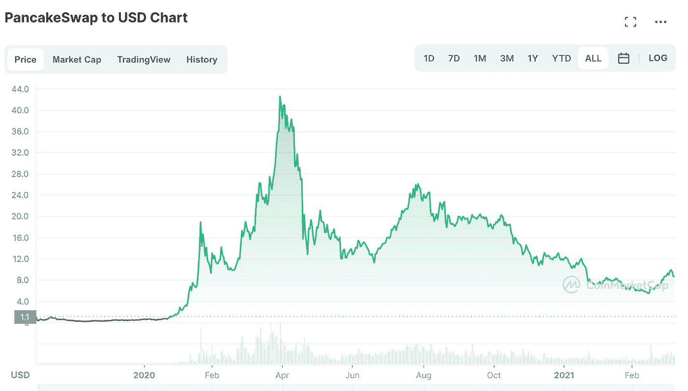

## 令牌组学修订

当协议修改它们的标记组学时，这是非常有趣的。当 Trader Joe's 首次推出时，它有一个基本的令牌组学结构。他们在第一季度修改了他们的模型。以前是牛排乔，你得到协议收入的 1%。以下是最新消息:

**赌注乔氏，现在:**

*   rJOE——访问午餐垫
*   sJOE —赚取以稳定硬币支付的平台收入的百分比。
*   ve Joe——农场助推+管理。(安斯塔克，你会像 PTP 一样失去它)

他们通过各种激励措施来增加需求。这会改变 TJ 的命运吗？

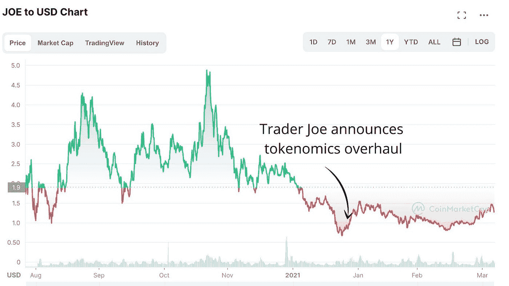

# 结论:

*   掌握基础知识，因为从现在开始会变得更加困难。
*   从需求、供给和长期激励的角度来看象征经济学。
*   虽然象征经济学很重要，但它不是一切。叙事和炒作可能会超过表面文章。

# SWAP.NET 队
官方网站—[https://swap.net/](https://swap.net/)推特—[https://twitter.com/NFTSwapnet](https://twitter.com/NFTSwapnet)不和—[http://discord.gg/35K7H9RqJd](http://discord.gg/35K7H9RqJd)电报—[https://t.me/NFTswapnet](https://t.me/NFTswapnet)
中—[https://medium.com/@NFTSwapnet](/@NFTSwapnet)
Docs&白皮书—[http://docs.swap.net](https://t.co/5qc7Mxt2p5)

> 加入 Coinmonks [电报频道](https://t.me/coincodecap)和 [Youtube 频道](https://www.youtube.com/c/coinmonks/videos)了解加密交易和投资

# 另外，阅读

*   [3 商业评论](/coinmonks/3commas-review-an-excellent-crypto-trading-bot-2020-1313a58bec92) | [Pionex 评论](https://coincodecap.com/pionex-review-exchange-with-crypto-trading-bot) | [Coinrule 评论](/coinmonks/coinrule-review-2021-a-beginner-friendly-crypto-trading-bot-daf0504848ba)
*   [莱杰 vs n rave](/coinmonks/ledger-vs-ngrave-zero-7e40f0c1d694)|[莱杰 nano s vs x](/coinmonks/ledger-nano-s-vs-x-battery-hardware-price-storage-59a6663fe3b0) | [币安评论](/coinmonks/binance-review-ee10d3bf3b6e)
*   [Bybit Exchange 审查](/coinmonks/bybit-exchange-review-dbd570019b71) | [Bityard 审查](https://coincodecap.com/bityard-reivew) | [Jet-Bot 审查](https://coincodecap.com/jet-bot-review)
*   [3 commas vs crypto hopper](/coinmonks/3commas-vs-pionex-vs-cryptohopper-best-crypto-bot-6a98d2baa203)|[赚取加密利息](/coinmonks/earn-crypto-interest-b10b810fdda3)
*   最好的比特币[硬件钱包](/coinmonks/hardware-wallets-dfa1211730c6) | [BitBox02 回顾](/coinmonks/bitbox02-review-your-swiss-bitcoin-hardware-wallet-c36c88fff29)
*   [BlockFi vs Celsius](/coinmonks/blockfi-vs-celsius-vs-hodlnaut-8a1cc8c26630)|[Hodlnaut 点评](/coinmonks/hodlnaut-review-best-way-to-hodl-is-to-earn-interest-on-your-bitcoin-6658a8c19edf) | [KuCoin 点评](https://coincodecap.com/kucoin-review)