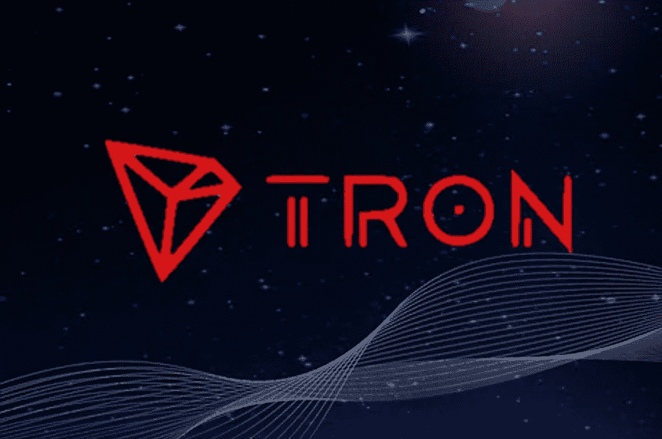

# 什么是创(TRX)加密货币？

> 原文：<https://medium.com/coinmonks/what-is-tron-trx-cryptocurrency-2e6f1b4d7d0?source=collection_archive---------26----------------------->

Source photo [trx crypto — Bing images](https://www.bing.com/images/search?view=detailV2&ccid=v8I0mE0%2b&id=307B8FE4E5CF058A256A4BDC884F327BEDB5F1B6&thid=OIP.v8I0mE0-xL77PnurtLq7uQHaE6&mediaurl=https%3a%2f%2fblockmanity.com%2fwp-content%2fuploads%2f2018%2f10%2ftrx-960x637.png&cdnurl=https%3a%2f%2fth.bing.com%2fth%2fid%2fR.bfc234984d3ec4befb3e7babb4babbb9%3frik%3dtvG17XsyT4jcSw%26pid%3dImgRaw%26r%3d0&exph=637&expw=960&q=trx+crypto&simid=608026649146573072&FORM=IRPRST&ck=45502EBB9D8F29E5D4C8AFF3BC4826AF&selectedIndex=7&ajaxhist=0&ajaxserp=0)

企业家 Justin Sun 在 2017 年提出了 Tron (TRX)的想法。TRON 项目通过首次发行硬币(ICO)获得了总计 7000 万美元的认购资金。这是最大的 ico 之一，进一步提高了对加密货币的兴趣。

Tron 现在是最有价值的加密货币之一，市值超过 64 亿美元，日交易量超过 1 美元…