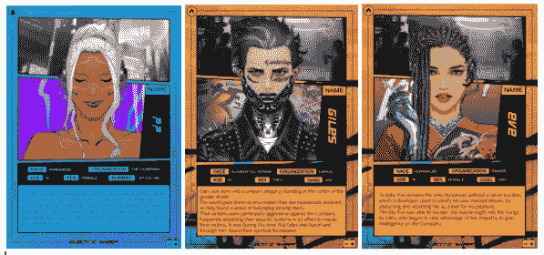
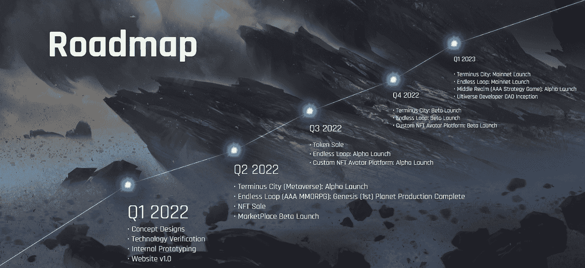

# 什么是 Ultiverse，它能让“MetaFi”成为现实吗？

> 原文：<https://medium.com/coinmonks/what-is-ultiverse-and-can-it-make-metafi-a-reality-c75a3a451514?source=collection_archive---------24----------------------->

在末尾贴个“Fi”获利？

2022 年 4 月

数据来源:[足迹分析](https://www.footprint.network/dashboards?channel=EN-241)

*   Ultiverse 是一款区块链 P2E 游戏，被称为第一个“元菲”项目，有[、SocialFi](https://www.footprint.network/article/Footprint-Analytics%3A-A-quick-look-at-SocialFi-fp-61c3e5c0-3e62a400-1774746b?channel=EN-241) 、GameFi、DeFi、NFT、元宇宙和 Web3 元素。
*   玩家可以通过参与战斗或完成其他任务获得奖励(代币、NFT 和其他游戏资源)。
*   Ultiverse 还没有上线，但是它的 [Discord](https://discord.gg/ultiverse) 已经有超过 679，000 名成员，它的 [Twitter](https://twitter.com/UltiverseDAO) 有 207，000 名粉丝。

# 什么是 Ultiverse？

Ultiverse 希望开发第一款成功的区块链 AAA 游戏，就像 Ready Player One 中的绿洲一样。该团队的愿景是创建一个连接区块链世界和真实世界的 DApp。

Ultiverse 目前在[网站](https://www.ultiverse.io/)上线，没有在**、**进行测试，预计 2022 年 6 月在 Alpha 上线。它已经从包括币安实验室、迪法恩斯资本、三箭资本和创维资本在内的风投那里获得了 950 万美元的投资。

Ultiverse 的令牌尚未上市，预计将于 2022 年第三季度在 BNB 连锁店发布。

[*Source: Ultiverse Future City*](https://city.ultiverse.io/)

# Ultiverse 游戏是如何运作的？

多元宇宙创造了一个虚拟城市(类似于绿洲)。它包罗万象，可以被认为是真实世界的物理复制品。

现实世界由不同的国家组成，最终，不同的“成分”组成了完整的宇宙。

*Source: Ultiverse’s Architecture by Footprint Analytics*

## 组件 1:终点城市

终点城市是终极世界的核心，它将在 [BNB](https://www.footprint.network/@Hige/Binance-Dashboard?date=2021-04-30~&channel=EN-241) 链(前 BSC)上发射。)它是 Ultiverse 的 MetaFi 哲学的集中体现。

*   **SocialFi。**玩家可以与他人交流。
*   **DeFi。玩家可以去市场交易。**
*   NFT。玩家可以展示和交易他们的 NFT。
*   Web3。玩家可以参与 Ultiverse 的社区道的治理。
*   **GameFi。一些有创意的玩家可以发布他们的游戏，让其他玩家访问和体验。**

在绿洲中，玩家戴上 VR 设备，进入绿洲大厅，然后瞬移到不同的战场开始游戏。终结者城作为终极时空的传送大厅，允许玩家从终点城传送到终极时空的不同游戏中。

玩家可以用他们在不同游戏中获得的资源在终点城市兑换当地的终极令牌。

*Source: Ultiverse Terminus City*

*Source: Ultiverse Terminus City*

## 组件 2:无限循环

《无尽循环》是《终极世界》中一款被期待的 MMORPG，它是在《虚幻引擎 5》上开发和设计的，这可能使它成为第一款 AAA 级区块链游戏。

Endless Loop 是一个拥有许多不同行星的星系。每个星球都有不同的挑战，玩家可以组队一起探索不同的星球，征服星球并获得资源。

无限循环的模式都是 PVP 和 PVE。根据 Ultiverse 的说法，Endless Loop 在概念和设计上与魔兽世界相似。

*Source: Ultiverse Interface — Endless Loop*

*Source: Ultiverse Interface — Endless Loop*

## 组件 3:电动绵羊

电子羊是终极宇宙的创世纪 NFT 收集。连接到终极宇宙的世界建筑，这不同于许多今天的 JPG NFT。

持有电动绵羊以奖金的形式提供激励，以及进入 Terminus 中其他 DApps 的凭证(目前还不知道是否有其他凭证可用。)

4 月 9 日，电羊开启白名单售卖。在 OpenSea、LooksRare 和其他 NFT 交易平台上还找不到公开销售价格等更多细节。但你可以在[推特](https://twitter.com/0xElectricsheep)或 Ultiverse 的 Discord 上关注他们，电动绵羊将于 2022 年在 Q2 发布。

*Source: Ultiverse‘s First NFT — Electric Sheep*

## 组件 4:黑暗幻想

黑暗幻想是一款在 Ultiverse 网站游戏中心被戏弄的游戏。Ultiverse 声称提供所有类型的游戏，如 MOBA、纸牌、战斗等。其中黑暗幻想是一个幻想，玩家挑战黑暗君主并从他那里拯救领土。

*Source: Ultiverse Interface — Dark Fantasy*

# Ultiverse 的主要特点是什么？

*   **AAA 级生产质量。**对寻求 AAA 游戏体验的玩家极具吸引力的高品质游戏。
*   **自由发挥。虽然许多连锁游戏需要花钱才能玩，但 Ultiverse 的零硬币门槛对许多玩家或进入 GameFi 领域的人来说是友好的。**
*   **游戏引擎。** Ultiverse 将内置全系列连锁游戏，并在未来扩展到以太坊、索拉纳等公共连锁。这对于 GameFi 来说会是一个比较大的发展。
*   **第一元菲。** Ultiverse 为不同的角色提供了不同的游戏和访问现实世界的方式，或许会成为第一个元菲。
*   **VR 体验。** Ultiverse 将与桌面兼容的 VR 设备一起发布，并将作为奖励提供给符合条件的人(条件尚未公布)。

*Source: Ultiverse‘s Roadmap*

# 怎么去 Ultiverse？

Ultiverse 公布了一份不和谐名单。要获得获得白名单的机会，您必须完成官方要求的任务。这包括寻找绵羊，完成原始的 Ultiverse 介绍性文章或视频等。更多细节可以在足迹分析社区贡献的另一篇文章中找到。

***此片由*** [***足迹分析***](https://www.footprint.network/?channel=ENG-209) ***社区供稿。***

*Footprint 社区是一个世界各地的数据和加密爱好者互相帮助了解和获得关于 Web3、元宇宙、DeFi、GameFi 或区块链新兴世界任何其他领域的见解的地方。在这里，你会发现活跃的、不同的声音相互支持，推动着社区向前发展。*