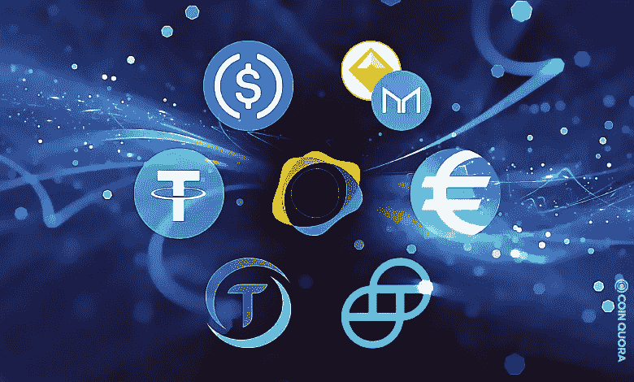
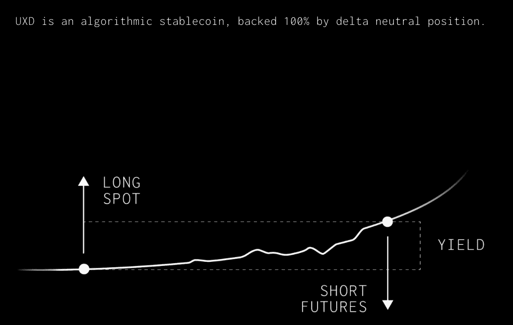
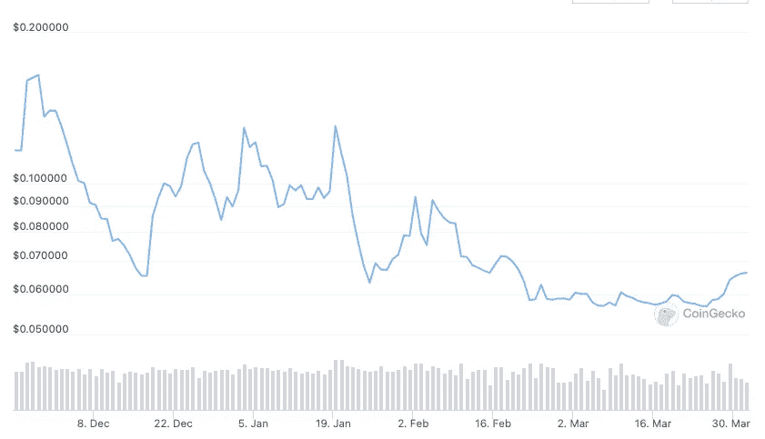
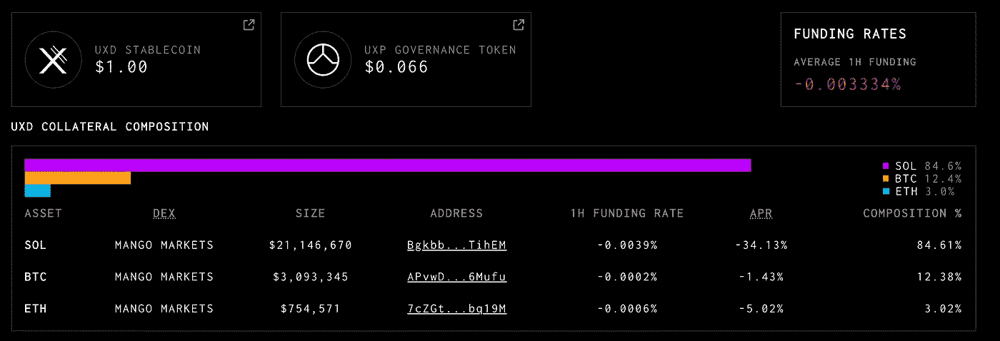

# 什么是 UXD 协议，$UXD 和$UXP？

> 原文：<https://medium.com/coinmonks/what-is-uxd-protocol-uxd-and-uxp-2cce347d7520?source=collection_archive---------17----------------------->

Stablecoins

密码行业有许多稳定的行业。集中的稳定型如、等，分散的稳定型如戴、等。但是 d-stablecoins 之间是有区别的。抵押品支持的稳定币，如$戴，算法支持的稳定币，如$UST，部分算法和部分抵押品支持的稳定币，如$FRAX。

但是在分散的稳定币范畴中，没有真正分散的抵押品支持的稳定币。美元的抵押品大部分是由美元组成的。当然，我认为$USDC 是足够安全的，但就去中心化而言，它不符合标准。

$UST 和$FRAX 也有抵押品，然而$UST 依赖于$卢娜，$FRAX 依赖于$FXS。我不是说$露娜和$FRAX 不可靠。他们的设计同时具有复杂性和坚固性。

但是，我们迫切需要 d-抵押品-稳定币。特别是 SOL 需要天然 d-侧枝稳定币。卢娜有$UST，联邦理工学院(和每个 EVM 连锁店)有$FRAX。索尔？索尔一无所有。solUST？我说的是本地人。

UXD protocol mechanism, website

其实 SOL 有答案是 [$UXD](https://www.coingecko.com/en/coins/uxd-stablecoin) 。$UXD 是 2022 年 1 月推出的 [UXD 协议](https://uxd.fi/)的稳定版本。阿拉米达研究，Multicoin 资本，索拉纳基金会和迪法恩斯资本投资了 UXD 议定书。UXD 于 2021 年 9 月在 IDO 发射。价格怎么样？

$UXP price, coingecko

不太好。那么 rekt 这个项目呢？风投们错了吗？也许吧。也可能不是。

我在 2022 年 1 月推出的 stablecoin $UXD 上面写了。在此之前的协议是蒸汽(像 Cardano？).然而最近我们可以看到$UXP 的微小反弹。当然，这是因为加密市场的复苏，也是因为 UXD 的推出和产品的小成功，至少我是这样认为的。

UXD protocol dashboard

# **什么是$UXD？**

$UXD 是 SOL-native 抵押品支持的稳定货币。抵押品是什么？Delta 中性头寸是抵押品。让我解释一下。

当我在 CEX 如币安购买 BTC、瑞士联邦理工学院和索尔时，我没有任何现货持有成本。如果我在 BTC 抵押品下做空 BTC，就美元而言，我处于中性头寸。如果融资利率为正，我可以用 delta 中性得到融资利率作为收益率。

但融资利率可能会变成负值。在当前的智能合约中，UXD 协议确实与现货 BTC 保持空头头寸。所以协议必须支付基金费用，这笔费用不是来自$UXD 持有者，而是$UXP 持有者的保险基金。

有了这种机制，UXD 持有者可以放心地持有稳定的货币。抵押品是稳定的美元 term。

# 什么是$UXP？

如果我们看好这个协议，我们应该购买治理令牌$UXP。所以$UXP 的效用对我们来说也很重要。

目前$UXP 单桩系统(也许 ve？)不在现场。UXP 持有者对通过抵押融资费获得的资金拥有控制权。他们还应该以保险基金的形式支付负基金费用。

# **结论**

UXD 供应上限为 2500 万美元。供应量达到了上限。第二次审计后，上限将增加。目前，$UXP 的 FDV 约为 6.6 亿美元。我可以说，市场认为没有上限的 UXD 供应量大约为 3.3 亿至 6.6 亿美元。与$FRAX 和$UST 相比，这个假设是合理的。

那么我的想法是什么？

考虑到 6.6 亿美元作为潜在稳定资本，目前 UXP FDV 6.6 亿美元并不算高。

> 加入 Coinmonks [电报频道](https://t.me/coincodecap)和 [Youtube 频道](https://www.youtube.com/c/coinmonks/videos)了解加密交易和投资

# 另外，阅读

*   [Botsfolio vs nap bots vs Mudrex](/coinmonks/botsfolio-vs-napbots-vs-mudrex-c81344970c02)|[gate . io 交流回顾](/coinmonks/gate-io-exchange-review-61bf87b7078f)
*   [CoinFLEX 评论](https://coincodecap.com/coinflex-review) | [AEX 交易所评论](https://coincodecap.com/aex-exchange-review) | [UPbit 评论](https://coincodecap.com/upbit-review)
*   [AscendEx 保证金交易](https://coincodecap.com/ascendex-margin-trading) | [Bitfinex 赌注](https://coincodecap.com/bitfinex-staking) | [bitFlyer 点评](https://coincodecap.com/bitflyer-review)
*   [Bitget 回顾](https://coincodecap.com/bitget-review)|[Gemini vs block fi](https://coincodecap.com/gemini-vs-blockfi)cmd |[OKEx 期货交易](https://coincodecap.com/okex-futures-trading)
*   [AscendEx Staking](https://coincodecap.com/ascendex-staking)|[Bot Ocean Review](https://coincodecap.com/bot-ocean-review)|[最佳比特币钱包](https://coincodecap.com/bitcoin-wallets-india)