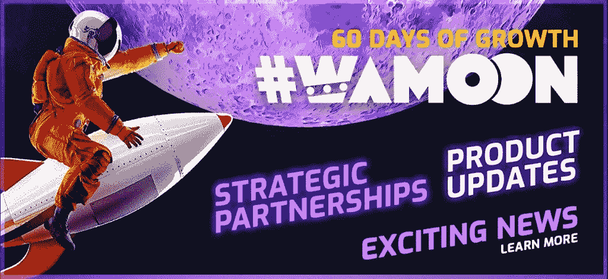

# 什么是 wam coin——您需要知道的一切

> 原文：<https://medium.com/coinmonks/what-is-wamcoin-everything-you-need-to-know-52eaaad65888?source=collection_archive---------44----------------------->

Wam Coin 是为热爱游戏生态系统的用户提供的加密硬币，用户可以通过拥有 Wam Coin 来参加平台上的锦标赛。Wam 硬币的特点包括:复兴，NFT 铸造，硬币锁定赚取巨大的奖励，等等。

持有 wam 硬币的用户可以使用他们的钱包参加他们选择的锦标赛，并通过玩 Wam Play-To-Earn 游戏赢得官方公用令牌，Wam 是第一个创建商业就绪链不可知平台的同类产品。

wam 生态系统充满了巨大的盈利功能，用户可以从其生态系统中受益，Wam 已经与许多 NFTs 公司合作，包括与 unstopped Domains(UD)合作；一家创建 NFT 域的公司，让用户重新控制你的数据。他们还与 Subcarpați OGs 合作；由著名的罗马尼亚音乐团体 subcarpați.с发起的 NFT 项目，通过数字价值创造现实生活的价值，使用现代技术和仪器将当地文化和民间传说与今天联系起来。

然而，这篇文章需要 Wam 的细节；什么是温暖和它的硬币，wam 生态系统和 wam 的特点，所以请拿一杯酒和一个座位，而你阅读。

# 什么是 WAM？

WAM 是一个平台，人们在这里参加锦标赛，赢得$WAM 和 [NFTs](https://bulliscoming.com/liverpool-nfts/) 的加密奖励。个人可以使用他们的手机从 Chrome 或 Safari 玩游戏，或者你可以从 Google Play 和 Apple AppStore 下载 WAM.app。

WAM 的用户可以拥有游戏和锦标赛来产生经常性收入，开发者可以发布游戏和销售 NFT，营销者可以推广锦标赛来从中赚取$WAM。

通过玩基于技能的超休闲游戏赚钱的概念在游戏行业是新的。所有用户都需要在 WAM 平台上玩上几分钟，你的时间和渴望是最好的。个人可以参加世界各地的比赛，只要他们有互联网接入；玩家可以连接到 wam 应用程序或网络，开始玩他们选择的任何游戏。

# 什么是 Wamcoin

因此，Wamcoin 是 WAM 的官方公用令牌，用于其生态系统，奖励玩游戏的用户，也可用于在平台上创建 NFTs。与此同时，许多用户喜欢这种硬币，因为它的实用性和为加密投资者带来良好投资回报的潜力。

**另请查看:** [幸运足球评论—没看这个就不要投资幸运足球平台！！！](https://bulliscoming.com/lucky-football-review/)

# WAM 的生态系统

Wam 生态系统对其用户有很大的潜力，包括以下特性:玩赚，拥有赚，开发赚，推广赚。这个功能就是用户目前通过玩、拥有、开发、推广赚到的。

# 玩游戏赚钱

在 WAM 赚钱最简单的方法就是参加锦标赛。每场锦标赛都有入场费，持续时间在 12 小时到 120 小时之间，让每个人都有公平的机会在排行榜上晋级。

有达到高分的无限尝试，玩家可以使用游戏中的复活从最后一个分数继续，但只能连续 3 次。如果玩家达到了第三次尝试；系统会将玩家分数重置为 0，这样就无法通过付费来晋级。

# 自己去挣

NFT 已经彻底改变了我们对开放网络上的数字内容、所有权和稀缺性的认识。在 WAM 上，用户可以拥有游戏、头像、昵称等等。例如，NFT 游戏所有者将能够从该游戏的比赛中、从用户支付的费用中产生经常性收入。

# 发展以获得

游戏发布的新时代从 WAM 开始，独立游戏开发者可以发布他们的游戏，并让 WAM 用户从发布的游戏创建的锦标赛中为开发者创造收入。开发者将能够向他们的粉丝群部分或全部出售已发布游戏的令牌化版本，即 NFT。这确保了开发者的初始收入，然后激励社区进一步支持他们喜爱的游戏创作者。

使用 launchpad 格式，开发者还可以通过新的标题提案接触到他们的粉丝群，并为此筹集资金，使用$WAM。

# 促销以赚取利润

在网络 3 的现实中做一名营销人员将会发生巨大的变化。未来产品和服务的无许可推广，WAM 正走在前面。

营销人员将能够通过发送流量并将发送的用户转化为 WAM 社区的活跃成员来推广个人锦标赛或整个 WAM 平台。每一次转换和收入都将通过智能合约来结算，这意味着世界上的每个人都可以通过推广 WAM 来赚钱。

# WAM 的特色

*   社会概况

用户可以通过参加锦标赛来增加自己的个人资料，定制自己的头像并使其成为 NFT，发现朋友并与他们交朋友

*   锦标赛

参加快速、精彩的锦标赛，赢取加密奖励

*   闲谈

无需离开应用程序即可与朋友聊天

*   奖励

一个专门的奖励中心，个人可以获得每天$WAM 和更多

*   NFT 市场

直接与其他玩家一起买卖 NFT 和数字物品

*   安全钱包

用户可以从应用程序访问$WAM，他们可以用信用卡给自己的账户充值

*   创作者工作室

想象新的游戏或新的比赛。用手机创造它们。

**也可阅读:** [86FB 评论——86FB.com 是合法的还是骗局？](https://bulliscoming.com/86fb-review/)

# Wam 币是好的投资吗？

很多投资者现在都在问。wam 币是一个好的投资吗？有兴趣投资 wam 币的投资者想知道 wam 币是不是一个好的投资。与此同时，wam 硬币是一种公用令牌，为 wam 应用程序或网络游戏系统提供动力，其生态系统是其社区或投资者的巨大受益者。

同时，让我们看看 wam 生态系统的一些线索，看看它的一些潜力，以及为什么人们总是会在加入 wamcoin 社区中找到乐趣，尽管 wam coin 由于其规格可能会带来良好的投资回报。

Wam 生态系统具备:玩赚，拥有赚，发展赚，推广赚，它具有聊天，社交档案，锦标赛，NFTs 市场，安全钱包，奖励和创作者工作室。同时，它的一些功能正在开发中，而一些功能已经开发出来了。

# 结论

WAM 是一个独特的 [play-2-earn](https://bulliscoming.com/metasoccer-crypto/) 平台，个人可以参加超级休闲游戏锦标赛，与其他玩家竞争。有人以$WAM 代币支付报名费以进入锦标赛，如果有人发现自己是该锦标赛中表现最好的球员之一，他们将赢得更多的硬币。

创作者的工作室和 Wam [NFTs](https://bulliscoming.com/revv-racing-nfts/) marketplace 正在进行中，比你预期的要快。

加入我们的电报社区，获取加密新闻、加密宝石、支持和加密教程；

电报链接:[https://t.me/+6ek5FpdVW89jNjE0](https://t.me/+6ek5FpdVW89jNjE0)

> 加入 Coinmonks [电报频道](https://t.me/coincodecap)和 [Youtube 频道](https://www.youtube.com/c/coinmonks/videos)了解加密交易和投资

# 另外，阅读

*   [Bookmap 评论](https://coincodecap.com/bookmap-review-2021-best-trading-software) | [美国 5 大最佳加密交易所](https://coincodecap.com/crypto-exchange-usa)
*   最佳加密[硬件钱包](/coinmonks/hardware-wallets-dfa1211730c6) | [Bitbns 评论](/coinmonks/bitbns-review-38256a07e161)
*   [新加坡十大最佳加密交易所](https://coincodecap.com/crypto-exchange-in-singapore) | [收购 AXS](https://coincodecap.com/buy-axs-token)
*   [红狗赌场评论](https://coincodecap.com/red-dog-casino-review) | [Swyftx 评论](https://coincodecap.com/swyftx-review) | [CoinGate 评论](https://coincodecap.com/coingate-review)
*   [投资印度的最佳加密软件](https://coincodecap.com/best-crypto-to-invest-in-india-in-2021)|[WazirX P2P](https://coincodecap.com/wazirx-p2p)|[Hi Dollar Review](https://coincodecap.com/hi-dollar-review)