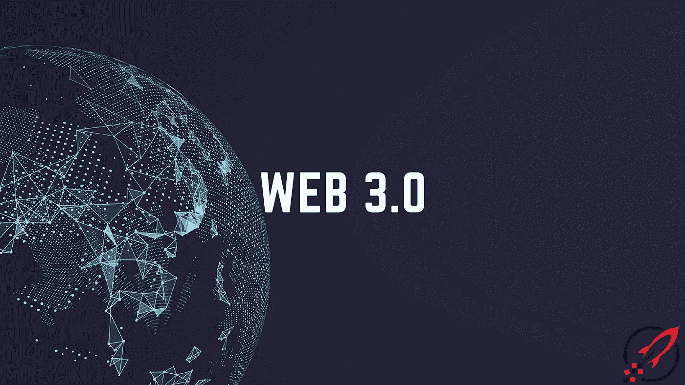

# 什么是 Web 3.0？—下一代互联网的全面指南

> 原文：<https://medium.com/coinmonks/what-is-web-3-0-a-comprehensive-guide-to-the-internets-next-generation-fc204331e327?source=collection_archive---------31----------------------->

Source photo [web 3.0 — Bing images](https://www.bing.com/images/search?view=detailV2&ccid=aNcGXl64&id=88FB8748E4F4D14FDDC67B28CAC10BDEB0B11198&thid=OIP.aNcGXl64HShbN9quIgqqYgHaEK&mediaurl=https%3a%2f%2fwww.thedigitalpioneer.com%2fwp-content%2fuploads%2f2021%2f02%2fDecentralized-Finance-5-1-pdf.jpg&cdnurl=https%3a%2f%2fth.bing.com%2fth%2fid%2fR.68d7065e5eb81d285b37daae220aaa62%3frik%3dmBGxsN4Lwcooew%26pid%3dImgRaw%26r%3d0&exph=1440&expw=2560&q=web+3.0&simid=608000441145435730&FORM=IRPRST&ck=E5D2EC2133345B837B4B1C481B45EDAB&selectedIndex=19&ajaxhist=0&ajaxserp=0)

每个人都知道互联网已经改变了世界的运作方式。互联网使个人能够通过各种技术相互交流。然而，当互联网最初被提出时，大多数人反对它。詹姆斯·布鲁克和伊恩·波尔汇编了一部概述…的缺点的散文和文章集