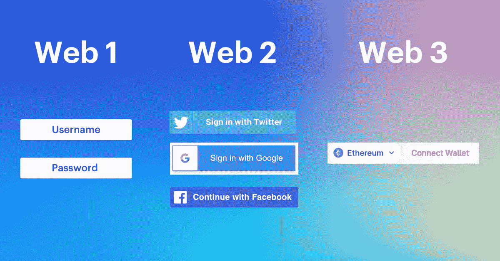

# 什么是 Web 3.0？——“解释得好像我才 5 岁”

> 原文：<https://medium.com/coinmonks/what-is-web-3-0-explained-like-im-5-90e93727fcf1?source=collection_archive---------36----------------------->

在深入 Web 3.0 之前，首先了解 Web 1.0 和 Web 2.0 是很重要的。

Web 1.0 给我们带来了“只读”网页、电子邮件、论坛和聊天。

所有这些都有助于我们更好地与同行进行数字交流。

**Web 2.0** 开始从纯静态网站(Web 1.0)向动态在线体验(如脸书、MySpace)转变。

这些平台允许我们通过发布内容和数字互动来表达我们的创造力。这创造了“读写”运动。

**Web 3.0** 是“读-写-拥有”。

> “酷，但这到底是什么意思？”

Web 3.0 是一个去中心化的互联网(不是由一方控制的)，它给了我们机会**拥有我们的数据**和**拥有互联网的公平份额**。

例如，Tik-Tok 拥有创作者在其平台上发布的所有视频。

Tik-Tok 可以随心所欲地自由发布、货币化和审查内容。

而 Web 3.0 项目邀请我们所有人进入去中心化的治理世界，在那里我们不再是产品。

想象一下这样一个世界，我们会因为发布内容甚至观看广告而获得加密货币形式的奖励。

**Web 3.0 产品的一些示例包括:**

*   一个 Web 3.0 版本的 Twitter 可以允许用户从其他用户那里获得加密“提示”，如果他们发布一些有趣的东西。
*   Web 3.0 SoundCloud 可以让粉丝购买崭露头角的艺术家的“股权”，有效地成为他们的投资者，换取他们赚取的一定比例的版税。
*   网络上的司机可以拥有 Web 3.0 DoorDash。

> *“Web 3.0 还有哪些其他优势？”*

*   无需放弃第三方中介(DeFi)的“提成”
*   互联网未来的货币(比特币和以太网)
*   艺术家、创作者和作者可以真正拥有他们的作品(NFTs)
*   玩赢游戏([点击此处深入了解](https://samfarber.substack.com/p/5-get-paid-to-play-video-games?r=1frabl&s=w&utm_campaign=post&utm_medium=web))
*   链上身份，不需要数百个不同的密码

> *“Web 3.0 的主要缺点是什么？”*

*   难以监管，可能会导致网络犯罪和滥用的增加
*   获得认同，因为一般人可能很难理解
*   高昂的交易费用
*   不太先进的设备将无法访问 Web 3.0
*   对所有权的担忧

所以，如果你没有从快速浏览 Web 3.0 的过程中得到任何东西…

请记住，Web 3.0 是互联网的去中心化版本，由人民所有。

页（page 的缩写）s:如果你喜欢这篇文章，并且想在比特币、NFTs 和其他复杂的 Web 3.0 主题上变得更聪明…

我将每周五的一个 Web 3 主题从$ETH 简化为 L2 的“5 岁术语”——在这里免费订阅！

> 加入 Coinmonks [电报频道](https://t.me/coincodecap)和 [Youtube 频道](https://www.youtube.com/c/coinmonks/videos)了解加密交易和投资

# 另外，阅读

*   [最佳加密交换平台](https://coincodecap.com/best-crypto-swap-platforms) | [最佳加密交易所](https://coincodecap.com/crypto-exchange)
*   [购买比特币印度](/coinmonks/buy-bitcoin-in-india-feb50ddfef94) | [Pionex 评论](/coinmonks/pionex-review-exchange-with-crypto-trading-bot-1e459d0191ea) | [加密交易机器人](/coinmonks/crypto-trading-bot-c2ffce8acb2a)
*   [n ave 零点回顾](/coinmonks/ngrave-zero-review-c465cf8307fc) | [Phemex 回顾](/coinmonks/phemex-review-4cfba0b49e28) | [PrimeXBT 回顾](/coinmonks/primexbt-review-88e0815be858)
*   最佳[区块链分析](https://bitquery.io/blog/best-blockchain-analysis-tools-and-software)工具| [赚比特币](/coinmonks/earn-bitcoin-6e8bd3c592d9)
*   [Cloudbet 赌场评论](https://coincodecap.com/cloudbet-casino-review) | [点火赌场评论](https://coincodecap.com/ignition-casino-review)
*   [加密套利](/coinmonks/crypto-arbitrage-guide-how-to-make-money-as-a-beginner-62bfe5c868f6)指南| [如何做空比特币](/coinmonks/how-to-short-bitcoin-568a2d0b4ae5)