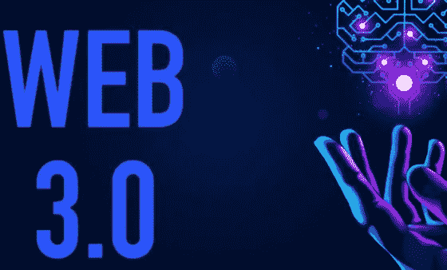
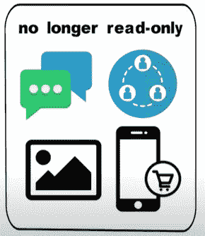
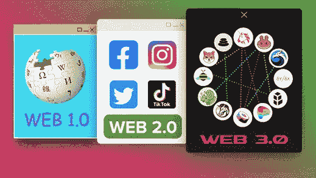
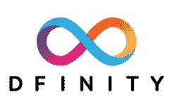

# 什么是 Web 3.0？Web3 都是炒作吗？

> 原文：<https://medium.com/coinmonks/what-is-web-3-0-is-web3-all-hype-ad68a65bbf5d?source=collection_archive---------8----------------------->

## Web 3.0 已经成为一个新的技术术语。这个术语包含了一系列下一代理念，都指向通过去中心化消除大型科技公司在互联网上的主导地位。

这是一个语义网，已经存在了十多年，但是它什么时候才能最终实现呢？web 3.0 到底是什么？它如何影响一个普通的互联网用户？

这有很多问题，要回答这些问题，我们需要先了解什么是 Web 1.0 和 Web 2.0。

**什么是 Web 1.0？**

Web1.0 是第一代万维网，存在于 1990 年初到 2004 年左右。在这个阶段，大多数网站是静态的。这些网站由企业创建，由用户消费。在这种情况下，没有什么是响应性的，这意味着一切都是为桌面开发的。展示风格是基本的。当涉及到安全性时，所有的实践都是有限的。此外，用户和创建的内容之间没有交互。没有追随者。无可奉告。没有喜欢。一切都是只读的。

这里有一些这个时代的网站，

https://fogcam.org/

【http://www.dolekemp96.org/main.htm 

[http://edition.cnn.com/US/OJ/](http://edition.cnn.com/US/OJ/)

**什么是 Web 2.0？**

Web2.0 是目前的第二代万维网。大量内容是用户生成的，例如社交媒体内容、博客、vlogs 等。这些数据大部分被谷歌和 Meta 这样的大公司控制和货币化。在这里，网络终于不再是只读的了。现在，当人们在不同的大洲时，他们可以互相交谈。人们可以每天协作、分享信息、分享照片、买卖产品或服务等等。Web 2.0 已经产生了许多伟大的东西，但它仍然不是完美的。怎么会？嗯，目前的 Web 仍然有一些限制，Web 2.0 的最大问题之一是安全性。随着网络技术的进步，安全漏洞和黑客攻击也在升级。我们都听说过大型跨国公司的数百万美元被盗。

进一步说，Web2.0 的另一个主要局限是失去了一个核心价值，那就是去中心化。互联网现在被谷歌、脸书、亚马逊和其他一些大公司所主宰。最初，互联网旨在为每个人提供平等的数据访问和交流机会。相反，这些大公司现在一直在收集用户数据，并利用这些数据获取金钱利益。

Web2.0 示例，

https://www.facebook.com/脸书

https://twitter.com/推特

**什么是 Web 3.0？**

首先，从 Web2.0 到 Web3.0 的转变对互联网上的日常用户和开发者来说意味着一个巨大的变化，定义为 Web3.0 是万维网的最新一代，它专注于去中心化。Web 3.0 应用和服务将越来越多地由区块链、加密资产(可替代和不可替代)、人工智能、机器学习和元数据驱动。最棒的是，Web3.0 有望提供个性化的内容，并使人们能够控制自己的数据。他们将能够控制谁，如果有人从他们和他们的信息中获利。此外，你可以安全匿名地登录整个互联网，而不会被“互联网身份”跟踪，而不是通过电子邮件和密码去大公司。在这里，互联网身份是您数据的智能合约。它将允许您使用身份锚进行身份验证。身份锚可以是安全密钥或面部识别。通过这种方式登录，黑客很难做到，因为没有一个地方(像公司数据库)存储所有的数据。此外，这意味着对日常互联网用户的更安全和控制。

**Web 3.0 的治理:**

Web3.0 是无权限的，意味着每个人和任何人都可以参与互联网的治理。

DFINITY 是一个为互联网计算机区块链开发技术的非营利组织，它将网络神经系统(或 NNs)作为 web3.0 的治理模式。它将网络神经系统(NNS)描述为“管理互联网计算机区块链的开放算法系统”。DFINITY 进一步描述了如何参与 Web3 的治理，并指出，“任何人都可以通过将 ICP 令牌标记到一个或多个神经元中来参与。这些神经元可以提交建议，并决定采纳或拒绝。此外，NNS 实施液体民主，其中神经元可以以代表投票权的形式跟随其他神经元”。

**为什么 Web3 很重要？**

Web3.0 将影响每一个日常使用互联网的人。这意味着每天用户、开发者、小企业、大公司、政府等。都将受到 Web3.0 的影响。Web3 很重要，因为它将为我们提供，

1.来自黑客的更好的安全性

2.隐私权

3.用户对其数据的控制

4.更快、更高效的运营

5.它更能适应变化

6.新的企业能够也将会从这项新技术中涌现出来

7.最后，由于它将是分散的，并将提供以用户为中心的控制，一两家大公司不会拥有一切。总之，人们可以很容易地宣称 web 3.0 是 web 的下一次渐进发展，并将以我们现在甚至无法想象的方式改变我们与互联网的交互方式。

最后，Web3.0 应用程序的例子有:

苹果的 Siri[https://www.apple.com/in/siri/](https://www.apple.com/in/siri/)

https://www.wolframalpha.com/的沃尔夫拉姆阿尔法[号](https://www.wolframalpha.com/)

它能把大量的信息总结成知识和对人们有用的行动。

至此，我们已经到了博客的结尾。希望这对你有帮助。

> 加入 Coinmonks [电报频道](https://t.me/coincodecap)和 [Youtube 频道](https://www.youtube.com/c/coinmonks/videos)了解加密交易和投资

# 另外，阅读

*   [如何在加拿大购买加密货币？](https://coincodecap.com/how-to-buy-cryptocurrency-in-canada)
*   [无聊猿游艇俱乐部(BAYC)回顾](https://coincodecap.com/bored-ape-yacht-club-bayc-review) | [拜比特 vs 比特币基地](https://coincodecap.com/bybit-vs-coinbase)
*   [5 款最佳加密交易终端](https://coincodecap.com/crypto-trading-terminals) | [最佳 DeFi 应用](https://coincodecap.com/best-defi-apps)
*   [比特币基地 vs 瓦济克斯](https://coincodecap.com/coinbase-vs-wazirx) | [比特鲁点评](https://coincodecap.com/bitrue-review) | [波洛涅克斯 vs 比特鲁](https://coincodecap.com/poloniex-vs-bittrex)
*   [德国最佳加密交易所](https://coincodecap.com/crypto-exchanges-in-germany) | [Arbitrum:第二层解决方案](https://coincodecap.com/arbitrum)
*   [币安交易机器人](/coinmonks/binance-trading-bots-d0d57bb62c4c) | [OKEx 审查](/coinmonks/okex-review-6b369304110f) | [Atani 审查](https://coincodecap.com/atani-review)
*   [最佳加密交易信号电报](/coinmonks/best-crypto-signals-telegram-5785cdbc4b2b) | [MoonXBT 评论](/coinmonks/moonxbt-review-6e4ab26d037)