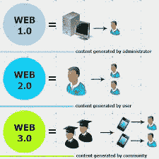

# 什么是 Web 3？骗局，神话，还是即将到来的未来

> 原文：<https://medium.com/coinmonks/what-is-web-3-scam-myth-or-future-around-the-corner-4da872157c76?source=collection_archive---------73----------------------->

互联网的未来被称为 Web 3，它不是像我们今天使用的 Web 那样的单一平台，而是一系列将形成更加开放和分散的互联网的技术。

这个新网络的第一步是区块链的发明，这是比特币等加密货币的基础技术。今天，我们看到了网络发展的下一步，新一代去中心化服务和应用的诞生，为用户提供了对数据前所未有的控制。

行业专业人士对 web 3.0 有不同的看法；一些人认为这是一个骗局，而另一些人则认为这是未来的发展方向。我们将在本文中讨论这两种观点。然而，要理解 web 3 的相关性，首先理解什么是 web 1.0 和 web 2.0 是至关重要的。

另请阅读: [Web 3 和区块链:2022 年概述—区块链 Shiksha](https://blockchainshiksha.com/web-3-and-blockchain-overview-for-2022/)

# 什么是 Web 1.0？

互联网最初是在 20 世纪 80 年代末被介绍给世界的。Web 1.0 仅限于只有少数人能看到的静态只读信息。这在当时是一项重大的技术进步。

与当前的动态 HTML 不同，网站提供静态材料。各组织将数据和内容存储在静态文件系统中，而不是数据库中，这是 web 1.0 的主要特征，它是一个没有交互性的只读 web。

## 什么是 Web 2.0？

在线社交和互动被称为 Web 2.0。这是一个用户友好的互联网，任何不是开发团队成员的人都可以与世界分享他们的观点。它使用户能够建立他们独特的角色。

由于这一剧变，社交媒体平台和电子商务的范围发生了变化，影响了全球的社会结构。级联样式表 3 (CSS3)、超文本标记语言 5 (HTML5)和 JavaScript 是由 web 2.0 开发的突破性 Web 技术的例子。

数据泄露经常发生在 Web 2.0 应用中。用户无法控制自己的数据，也无法控制这些数据是如何存储或被黑客攻击的。得益于中央服务器，政府可以轻松管理、干预或关闭与其宣传相矛盾的应用程序。

在高通胀、波动或政治动荡的情况下，政府可以获得银行账户并限制访问。

现在，全球正在过渡到 web 3.0 的新阶段，它带来了许多独特的好处。

# 什么是 Web 3.0 及其意义？

Web 3.0 结合了以前版本的优势以及物联网、人工智能和区块链的力量。这个版本的互联网专注于机器学习和人工智能等前沿技术，以及提高数据安全性。

自我管理、可验证、无信任、原生内置支付、分布式和健壮的系统、无许可和自我管理系统，这些都是 Web 3.0 相对于以前版本的互联网的特征。

Web 3.0 通过在由许多服务器或节点、区块链或两台服务器组成的分散式网络上部署、构建和实现其应用程序，创建了一个加密经济协议。在 Web 3.0 中，这些程序被称为 Dapps 或分散式应用程序。

Web 3.0 结合了以前版本的优势以及物联网、人工智能和区块链的力量。这个版本的互联网专注于机器学习和人工智能等前沿技术，以及提高数据安全性。

自我管理、可验证、无信任、原生内置支付、分布式和健壮的系统、无许可和自我管理系统，这些都是 Web 3.0 相对于以前版本的互联网的特征。

Web 3.0 通过在由许多服务器或节点、区块链或两台服务器组成的分散式网络上部署、构建和实现其应用程序，创建了一个加密经济协议。在 Web 3.0 中，这些程序被称为 Dapps 或分散式应用程序。

Web 3.0 还为在现有互联网上开发治理层提供了重要支持。这个治理层在交易中的两个身份不明的参与者之间建立了信任，允许他们达成协议。Web 3.0 的区块链技术已经迎来了一场后端革命。

# 为什么一些行业人士认为 web 3.0 是骗局？

一些行业专家认为，尽管有这些优势，web 3.0 可能会导致更多的诈骗和欺诈活动。尽管 web 3.0 有一个由链接系统组成的网络，创造了一个不可信的环境，但仍然有许多代价高昂的缺陷、无能、骗子在短时间内窃取投资者资金的直接骗局等等。

在 web 3.0 中，供求法则仍然适用。与同等资历的富人相比，穷人愿意为更少的钱而工作。Axie Infinity 的例子最好地描述了这一点。它的“玩赚”游戏在菲律宾越来越受欢迎，产生了一批劳动力。因此，它为人们提供了一种新的通过玩来赚钱的方法。因为游戏是基于加密令牌的，所以存在不稳定和灾难性损失的风险，就像去年玩家的情况一样。

在这个问题上，监管者的作用至关重要。加密令牌目前处于全球监管机构的灰色地带，用于大多数 Web 3.0 应用程序。根据证券交易委员会的 Gary Gensler 的说法，发行代币的平台应该遵守类似于向投资者发行股票和债券的公司的限制。

随着互联网在全球范围内的发展，Web 3.0 仍处于早期阶段。技术会发展，新的模式会出现。监测新的进展和推出新的项目将是令人着迷的。如果你想知道更多，请在下面的框中评论。团队区块链 Shiksha 很乐意解决您的疑问。

*原载于 2022 年 4 月 13 日*[*【https://blockchainshiksha.com】*](https://blockchainshiksha.com/what-is-web-3-0-scam-myth-or-future-around-the-corner/)*。*

> 交易新手？尝试[加密交易机器人](/coinmonks/crypto-trading-bot-c2ffce8acb2a)或[复制交易](/coinmonks/top-10-crypto-copy-trading-platforms-for-beginners-d0c37c7d698c)