# 什么是 Web3.0——对 web 3.0 和 Dapps 的深入探讨和初级解释

> 原文：<https://medium.com/coinmonks/what-is-web3-0-a-deep-dive-beginner-level-explanation-of-web3-0-and-dapps-2f372efd69ef?source=collection_archive---------6----------------------->

Web3.0 代表着下一代互联网。

Web2.0 指的是今天我们大多数人都知道的互联网版本。它帮助互联网和技术惠及数十亿人。成功的 Web2.0 应用程序是由提供服务以换取用户个人数据的公司构建的。这些应用程序集中在它们的数据中心，对用户数据拥有完全的控制权。

在一项名为**以太坊**区块链的著名区块链技术背景下，Web3.0 应用程序被称为 **Dapps** 又名**去中心化应用程序**。这些应用正在推动去中心化运动，让用户拥有自己的数据。

让我们用通俗的语言揭开 **Web3.0 & Dapp** 的神秘面纱，并深入探究 **Dapp** 的架构，将其与当前的 Web2.0 应用进行比较。

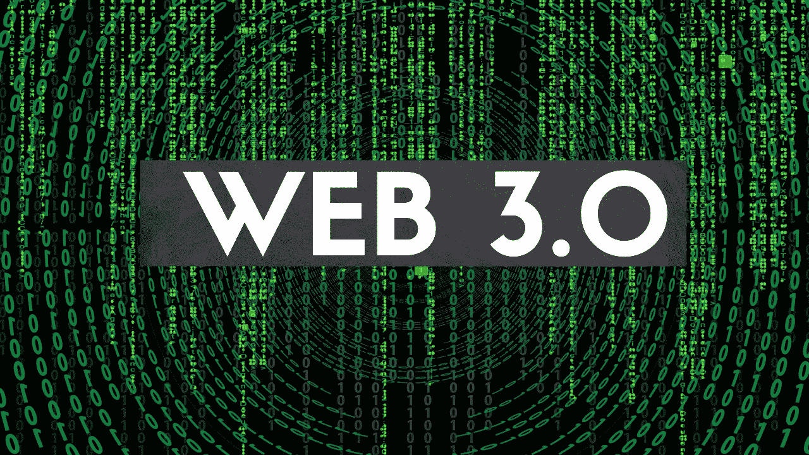

Web3.0 就是互联网的去中心化。听起来像 jargonish。我来简单解释一下。要理解 Web3.0，我们先来讨论 Web1.0 和 Web2.0。

## Web1.0 —静态网站的互联网。

静态网站创建者建立一个网站，并在其中添加内容。像你我这样的消费者只是消费内容，也就是说我们只是阅读。所以它是一个只读的网站。

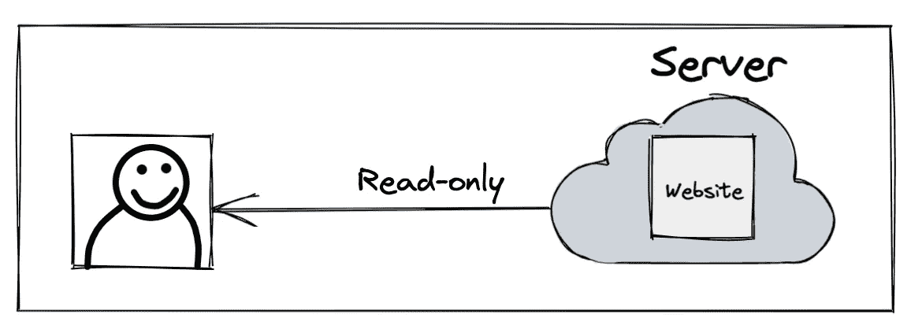

**Web1.0**

## web 2.0——动态网站的互联网

动态网站允许像你我这样的用户生成和消费内容。以脸书为例。所以是一个**读写**的 Web。

在 Web2.0 中，虽然你是内容创建者，但你创建的内容驻留在网站创建者数据库中，拥有网站的人/公司有权删除你的内容、出售你的内容等。没有错，我们都喜欢脸书，推特，媒体等等。属于 Web2.0 的范畴。

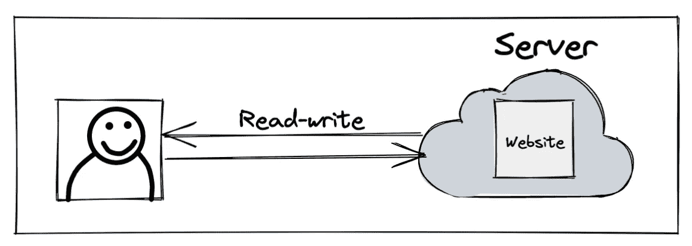

**Web2.0**

## web 3.0——去中心化的互联网

Web3.0 让内容创作者能够完全控制他们制作的内容。在基于 Web3.0 的网站中，网站所有者没有权利删除或出售你的内容。因为您创建的所有内容都保存在公共分类账上，而不是网站创建者数据库中。

公共账本不是由一家公司所有，而是由成千上万的人所有，他们从自己的计算机上提供存储。因此，它是一个公有数据库，也被称为区块链。

内容创建者在公共分类账上被标记为其内容的永久所有者。例如:-如果 Medium 是一个 Web3.0 应用程序，我们创建的博客存储在公共分类账上，因此 Medium 没有任何权利删除我的内容(即使我有冒犯之处:-)，此外，如果 Medium 停业，内容仍然存在于公共分类账上，因此我可以 grep 内容，并使用我的内容创建另一个网站。因此它读-写-拥有网络。

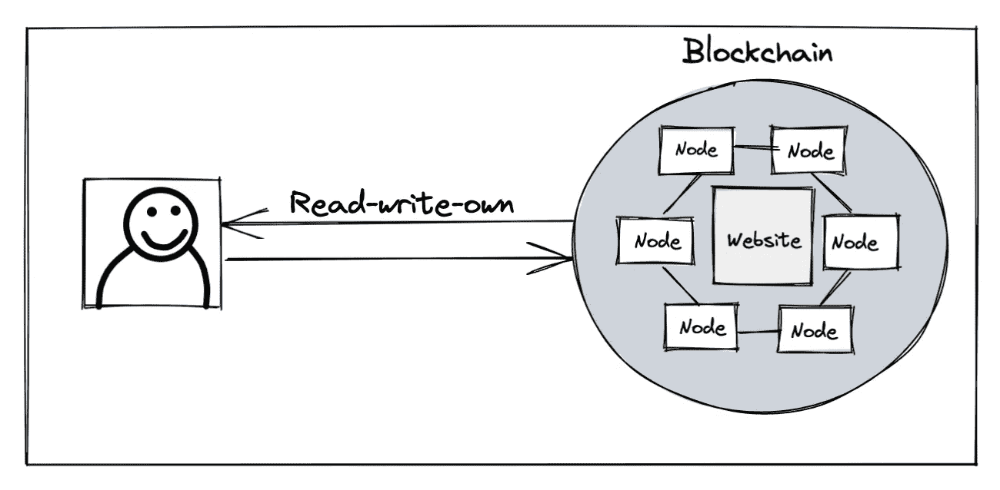

**Web3.0**

因此，任何与区块链协同工作的网络应用都可以被称为 **Web3.0 应用。**

BTW 需要更多区块链的解释？当然可以！

## 区块链

区块链是被称为区块的记录列表。每个块包含两方之间的交易和到前一个块的链接。

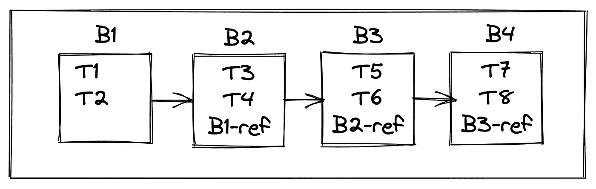

**Blockchain**

这个区块链由互连计算机的对等网络维护，也称为**节点**。这些节点由世界各地的用户拥有和维护。

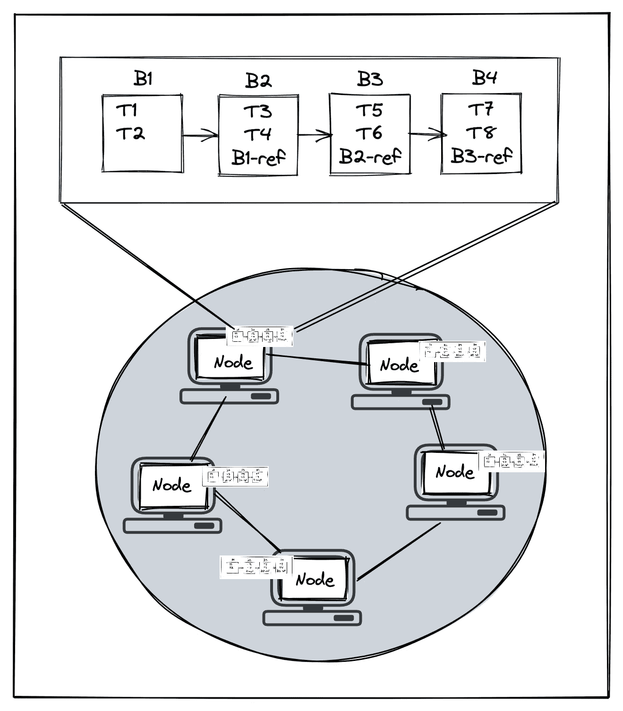

因此，区块链是一个开放的分布式公共分类账，能够以可验证的方式有效地记录交易。该分类账包含迄今为止的所有交易。该分类帐始终保持同步，并且在区块链的所有节点上都可用。

比特币是比特币区块链的去中心化货币应用。在比特币区块链，交易是一个人向另一个人汇款，没有任何像银行这样的中央机构。还有很多其他的区块链在使用。例如:-以太坊区块链，索洛娜区块链等。

## 以太坊区块链

区块链的相同定义适用于以太坊区块链，除了节点运行以太坊软件和存储以太坊公共总账。以太坊区块链被创建来构建任何一种叫做 **Dapps** 又名**去中心化应用**的应用。在以太坊区块链上，交易可以是货币转账(或)购买/出售数字艺术(NFT)(或)创建推文(或)购买/出售游戏中的主题和剑等物品。

这些去中心化的应用程序的后台被编码为智能合同。

## 智能合同

智能合同是一个包含分散应用程序业务逻辑的程序。它是代码(它的功能)和数据(它的状态)的集合，驻留在以太坊区块链上的一个特定地址。当一个动作被执行或者当一个先决条件被满足时，它们被执行。在传统的 Web2.0 应用中，这种业务逻辑类似于 API 层中编码的业务逻辑。

## 我们为什么需要 Web3.0？

如前所述，**web 3.0 dapp**需要对您创建的内容行使所有权，并消除社区对数据的集权和控制。

理解 Web3.0 使用的一个例子——房地产。在大多数国家，政府拥有和维护房地产登记申请，并作为一个中央机构。我们会听到许多诉讼发生，多方声称一个财产。其中一个原因是中央当局操纵数据，从而影响了原始所有权。如果不动产是分散的，中央机构不能改变数据，因为数据现在可在公共分类账上获得，也可在区块链的成百上千的计算机上获得。

> W eb3.0 可以被称为**智能合约互联网或 Dapps 互联网。**

我相信理解 Dapp 的基础架构对于更好地理解 Web3.0 及其应用是必要的。为了更好地理解 Web3.0 Dapp，我觉得将其与当前的 Web2.0 应用程序进行比较是有益的。**顺便说一句，并非所有的 Web2.0 应用都能被 Web3.0 取代。**

*   在传统的 Web 2.0 应用程序中，前端与后端通信，后端随后将数据存储在数据库中。 **Web3.0** **Dapp** 被设计为与区块链通信的接口。

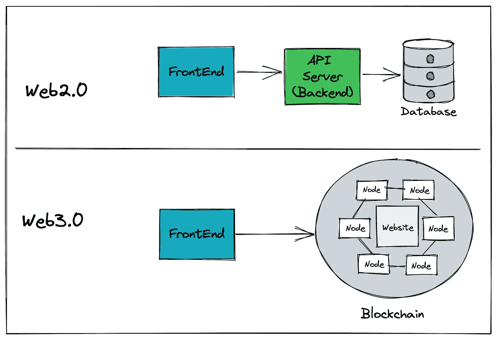

*   在 Web 2.0 应用程序中，实际的业务逻辑(即创建任何资源、更改任何资源、处理事务)由后端处理。Backend 是作为一堆 REST APIs 开发的，您可以选择 Java、Python 或 Golang 等语言。在 **Web 3.0 Dapp** 中，业务逻辑被捆绑为**智能合约。**智能合约以[可靠性](https://docs.soliditylang.org/en/v0.8.14/)、 [Vyper](https://vyper.readthedocs.io/en/stable/) 等编码。

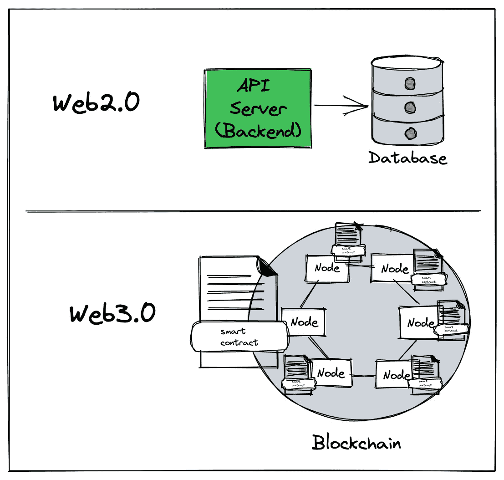

*   Web2.0 应用程序后端部署在本地机器或 AWS EC2 或 Azure VM 上。Web3.0 应用后端即智能合约部署在区块链上。
*   在传统的 Web2.0 应用程序中，后端业务逻辑被打包成一个容器或 jar 文件，运行在 VM 或 AWS EC2 等计算机器上，或者 Openshift 或 Kubernetes 等任何容器平台上。创建的数据存储在像 Postgres、Mysql 或 NoSQL 数据库这样的数据库中。因此，计算和存储运行在不同的机器上。在 **Web3.0 Dapp** 中，业务逻辑即智能合约运行在 EVM(以太坊虚拟机)&上，通过智能合约创建的数据在同一个计算机节点上。
*   传统的 Web2.0 应用程序使用 REST over HTTPS (GET、POST、PUT、DELETE)与后端通信。Web3.0 Dapps 使用 [JSON-RPC](https://www.jsonrpc.org/) 与区块链通信。RPC 代表远程过程调用。智能契约包含保存业务逻辑的功能。每个 RPC 调用实际上是一个智能合约**函数**调用。

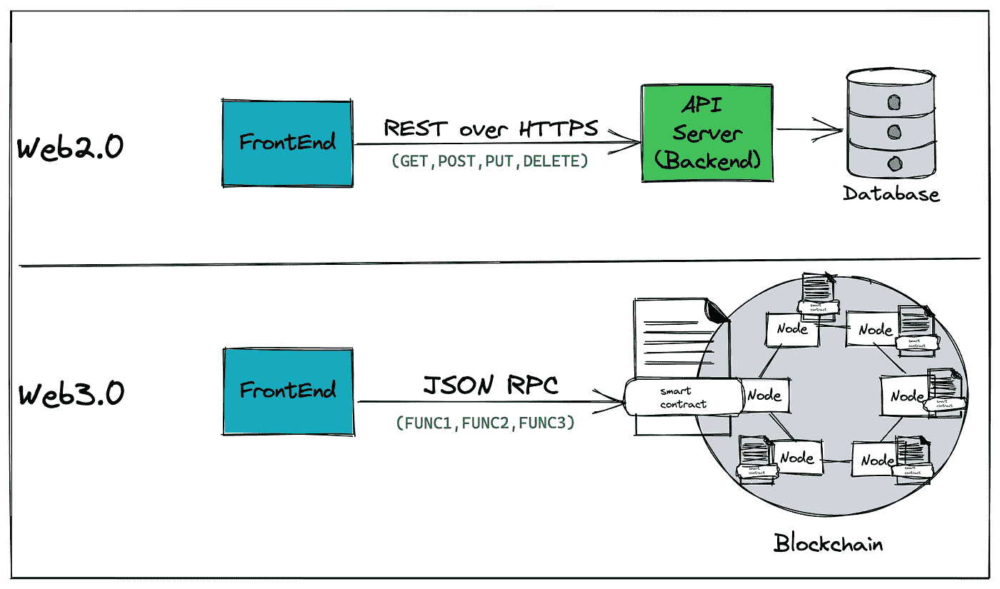

*   Web2.0 应用程序中的任何 API 调用都是通过在有效负载的报头中提供 JWT 令牌来进行身份验证的。JWT 令牌是使用应用程序用户的用户名和密码生成的。在 **Web3.0 Dapp** 中，RPC 调用需要使用使用 Dapp 执行操作的用户的私钥进行签名。用户在 Web3.0 Dapp 中通过他的以太坊地址和私钥被识别。通常，Web3.0 Dapps 没有登录屏幕。Dapp 的每个用户都应该安装一个名为 [MetaMask](https://metamask.io/) 的 chrome 扩展。Metamask 是一个软件钱包，它使用户能够加载他们的以太坊地址和他们的私钥。因此，对区块链的每个调用都由 Metamask 签名，这使得智能合约能够识别发起交易的用户。

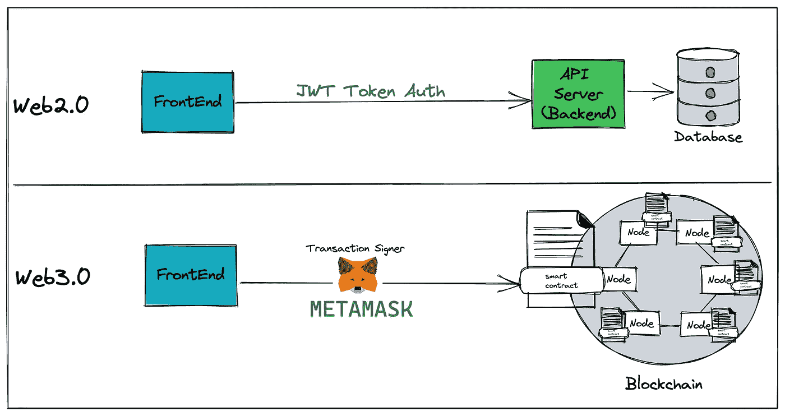

*   在 Web2.0 应用程序中，前端需要知道托管后端(API 服务器)的主机 URL。使用 URL，从前端启动 API 调用来创建/读取/更新/删除数据。在 **Web 3.0 应用**中，前端需要知道智能合约地址，即智能合约在区块链上的部署位置。智能合约部署在地址处的区块链的节点上。在节点上部署智能合同后，它将在所有节点之间同步，并在同一地址的区块链的所有节点上可用。前端使用这个地址通过 JSON-RPC 与智能合约进行通信。

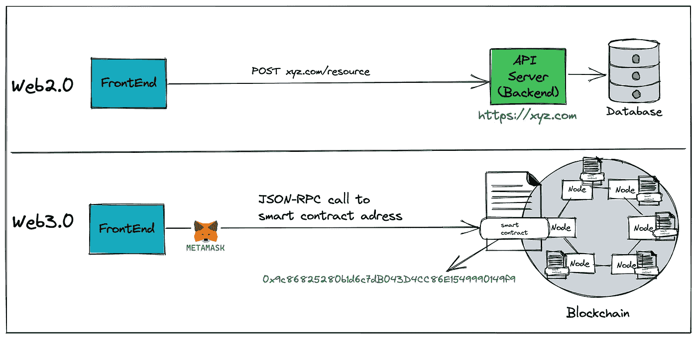

*   在 Web2.0 应用程序中，关于 API 服务器或后端 API 的信息可以通过像 Swagger 这样的 API 规范获得。在 Web3.0 Dapp 中，智能合约中可用的功能通过一个名为 **ABI(应用二进制接口)**的 JSON 文档通知给前端。使用 ABI 和智能合约地址，前端与智能合约进行通信。
*   ***部署*** : Web3.0 Dapp 后端即智能合约需要部署到区块链上。要部署智能合约，智能合约的所有者需要访问区块链上的节点。所有者既可以运行他的节点，也可以从像 [Infura](https://infura.io/) 或 [QuickNode](https://www.quicknode.com/) 这样的节点提供商那里获得节点。一旦他获得访问权，智能合约就可以部署在一个节点上。如前所述，区块链是一个点对点的互连节点链，因此部署的智能合约会在区块链的所有节点上同步。通过 Infura 运行或创建节点类似于获得 AWS EC2 或 Azure VM 机器来在 Web2.0 世界中部署后端。

*   ***部署*** :就成本而言，Web2.0 应用程序可以部署任意次，因为部署本身不需要任何成本。相比之下，在以太坊生态系统中，部署智能合约需要花费被称为 [GAS](https://ethereum.org/en/developers/docs/gas/) 的资金。在区块链世界中，部署智能合约是一种写操作。包括创建内容或部署智能合同在内的所有写入都会消耗汽油。因此，应该在区块链部署经过全面测试的 smart 契约。
*   ***测试*** : Web2.0 应用通常在一个登台环境或者开发环境下进行测试。类似地， **Web3.0 Dapp** 也在之前的区块链测试网络上进行测试，如[赛波利亚](https://ethereum.org/en/developers/docs/networks/#sepolia)、[科万](https://ethereum.org/en/developers/docs/networks/#sepolia)、等。主要生产以太坊的区块链叫做 [Mainnet](https://ethereum.org/en/developers/docs/networks/#ethereum-mainnet)

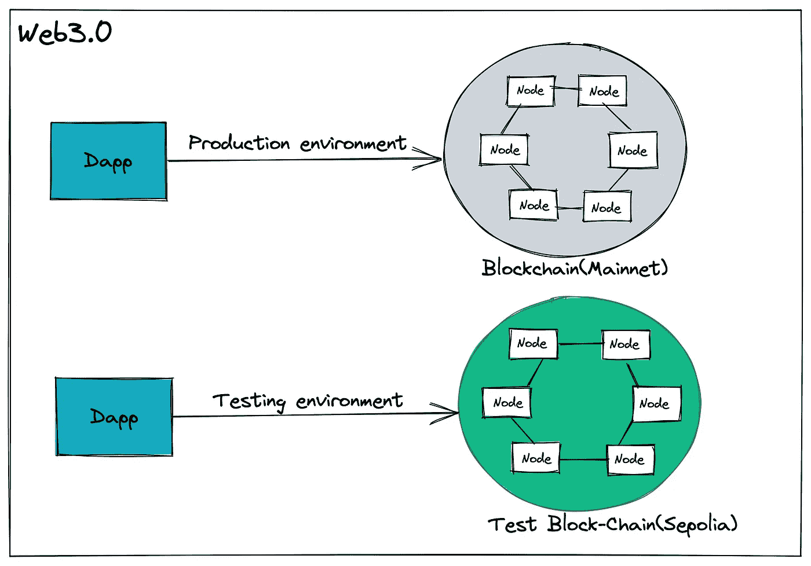

*   Web2.0 应用—前端或后端部署在 AWS 或 Azure 或本地基础设施上，如虚拟机或 Openshift & Kubernetes 等容器平台。Web3.0 Dapp 前端的部署方式与 Web2.0 应用前端相同。Web3.0 Dapp 的后端是去中心化的，前端看起来或多或少类似于 Web2.0 前端，没有去中心化。

Web3.0 Dapp 的整体架构如下图所示，总结了以上所有要点。

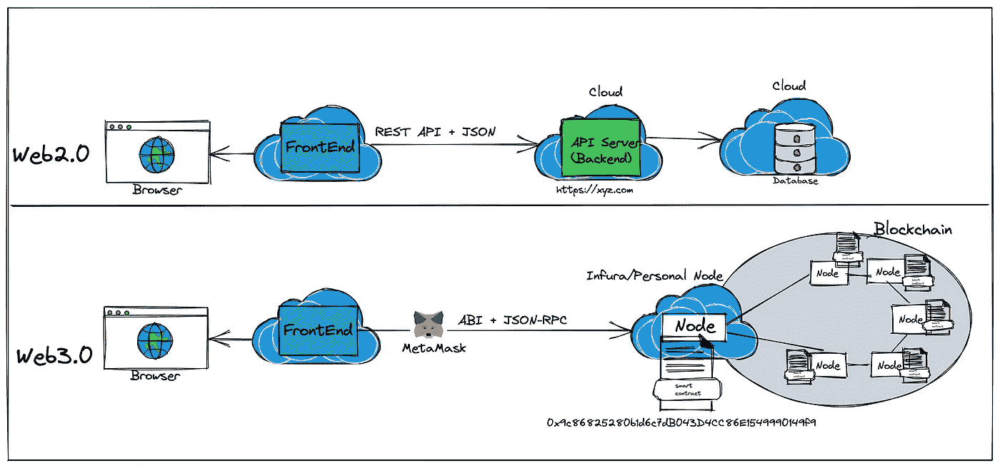

如果你喜欢我的内容，给我一个掌声👏

也可以在 [LinkedIn](https://www.linkedin.com/in/vinay-kanamarlapudi-41112118/) 或者 [Medium](https://vinaykanamarlapudi.medium.com/) 上关注我

> 加入 Coinmonks [电报频道](https://t.me/coincodecap)和 [Youtube 频道](https://www.youtube.com/c/coinmonks/videos)了解加密交易和投资

# 另外，阅读

*   [Bookmap 评论](https://coincodecap.com/bookmap-review-2021-best-trading-software) | [美国 5 大最佳加密交易所](https://coincodecap.com/crypto-exchange-usa)
*   最佳加密[硬件钱包](/coinmonks/hardware-wallets-dfa1211730c6) | [Bitbns 评论](/coinmonks/bitbns-review-38256a07e161)
*   [新加坡十大最佳加密交易所](https://coincodecap.com/crypto-exchange-in-singapore) | [购买 AXS](https://coincodecap.com/buy-axs-token)
*   [红狗赌场评论](https://coincodecap.com/red-dog-casino-review) | [Swyftx 评论](https://coincodecap.com/swyftx-review) | [CoinGate 评论](https://coincodecap.com/coingate-review)
*   [投资印度的最佳密码](https://coincodecap.com/best-crypto-to-invest-in-india-in-2021)|[WazirX P2P](https://coincodecap.com/wazirx-p2p)|[Hi Dollar Review](https://coincodecap.com/hi-dollar-review)